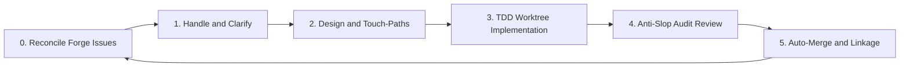

## Release — backlog-campaign vX.Y.Z

<!-- One-paragraph hook: what this release delivers for users -->

---

### 🎯 The goal

<!-- What problem does backlog-campaign solve? Zero open issues, zero manual triage. -->

---

### 🔄 How it works



<!-- Short prose: coordinator → orchestrator → workers -->

---

### 🛠 Five-phase lifecycle

| Phase | What happens |
|-------|--------------|
| **Handle** | Ingest issues, clarify ambiguity, split oversized work |
| **Plan** | Define touch-paths and API/schema baselines |
| **Implement** | Isolated git worktree, TDD, open PR |
| **Review** | V-code audit, security, plan conformance |
| **Loop** | Merge, prune worktrees, pick next issue |

---

### 👥 Specialized agents

| Agent | Role |
|-------|------|
| `backlog-coordinator` | User intake, blocker routing, HITL chat |
| `backlog-orchestrator` | Spawns workers, Pareto queue, git/worktree hygiene |
| `backlog-planner` | Implementation plans (Quick / Standard tracks) |
| `backlog-implementer` | TDD-first changes, scope-boundary enforcement |
| `backlog-reviewer` | PR audit, V-code gating, discovery reporting |

---

### 🛡️ Quality gates

- V-code system — SOLID, DRY, KISS, YAGNI, security, scope
- Worktree isolation — `campaign/issue-N` branches, no direct main commits
- Touch-path enforcement — workers stay within the plan
- PR linkage — every PR must include `Closes #N`

---

### 💬 Human-in-the-loop

- Clarification gates pause the queue when requirements are ambiguous
- Chat feedback becomes new GitHub issues via auto-sync

---

### 🔍 Continuous discovery

- Workers surface UX, performance, and best-practice findings during review
- Pareto scoring: Priority = Gain × (11 − Effort); findings ≥ 30 auto-filed as issues

---

### 🌐 Works on your platform

| Platform | Install | Run |
|----------|---------|-----|
| **Cursor** | git submodule → `.cursor` | Multitask Mode / `@backlog-coordinator` |
| **Claude Code** | plugin marketplace | `/goal run backlog campaign until empty` |
| **skills.sh** | `npx skills add …` | read root `SKILL.md` |

---

### 📦 Installation

```bash
# Cursor (git submodule)
git submodule add https://github.com/CorentinLumineau/backlog-campaign .cursor
```

```bash
# Claude Code (plugin marketplace)
/plugin marketplace add https://github.com/CorentinLumineau/backlog-campaign
/plugin install backlog-campaign@backlog-campaign-marketplace
```

```bash
# skills.sh / generic
npx skills add CorentinLumineau/backlog-campaign
```

See the [README](https://github.com/CorentinLumineau/backlog-campaign#readme) for full setup and usage instructions.

---

### ✨ What's new in vX.Y.Z

<!-- Product-focused highlights for this version only -->
