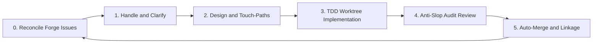

## 🎉 First release — backlog-campaign v0.1.0

**backlog-campaign** is an agent-agnostic skill that autonomously drains your GitHub issue backlog using a coordinated loop of specialized AI agents. Install it once on Cursor, Claude Code, or any skills.sh-compatible agent — then let the campaign run until your forge backlog is empty.

---

### 🎯 The goal

**Zero open issues, zero manual triage.** Backlog Campaign takes every open GitHub issue through a full software development lifecycle: clarify requirements, plan touch-paths, implement in isolation, audit quality, merge — and repeat until the queue is clear.

---

### 🔄 How it works



You talk to the **coordinator** in chat. It bootstraps state, syncs GitHub issues, and spawns a background **orchestrator**. The orchestrator drives the five-phase loop, delegating each issue to specialized **worker** agents in isolated git worktrees. You stay in the loop only when clarification is needed — everything else runs autonomously.

---

### 🛠 Five-phase lifecycle

| Phase | What happens |
|-------|--------------|
| **Bootstrap** | Init `queue.json`, sync forge issues, build the ready queue |
| **Handle** | Ingest new issues, clarify ambiguity, split oversized work |
| **Plan** | Define touch-paths, API/schema baselines, complexity track |
| **Implement** | Isolated worktree (`wt-<issue>`), TDD-first, open a PR |
| **Review** | V-code audit, security checks, plan conformance |
| **Loop** | Merge approved PRs, prune worktrees, pick the next issue |

State lives in `.bc-campaign/` — `queue.json`, `findings-ledger.json`, and per-issue plans under `plans/`.

---

### 👥 Specialized agents

| Agent | Role |
|-------|------|
| `backlog-coordinator` | User intake, blocker routing, HITL chat interface |
| `backlog-orchestrator` | Spawns workers, Pareto priority queue, git/worktree hygiene |
| `backlog-planner` | Implementation plans per issue (Quick / Standard tracks) |
| `backlog-implementer` | TDD-first code changes, incremental modifications, scope enforcement |
| `backlog-reviewer` | Structured PR audit with V-code gating, security, discovery reporting |

---

### 🛡️ Quality gates

- **V-code system** — SOLID, DRY, KISS, YAGNI, security, and integration coherence checks
- **Worktree isolation** — each issue gets `campaign/issue-N` on a dedicated branch; no direct commits to `main`
- **Touch-path enforcement** — workers cannot modify files outside the plan (`V-SCOPE-02`)
- **PR linkage** — every PR must include `Closes #N` before merge (`V-GIT-01`)

---

### 💬 Human-in-the-loop

When requirements are ambiguous, product trade-offs arise, or a destructive operation is needed, the orchestrator sets the issue to `blocked` and the coordinator surfaces an **AskQuestion** gate. Your chat replies unblock execution — or become new GitHub issues ingested on the next sync.

---

### 🔍 Continuous discovery

Workers don't just close tickets — they audit for UX polish, performance, security gaps, and best-practice violations. Each finding gets a Pareto score:

**Priority = Gain × (11 − Effort)**

Findings scoring **≥ 30** are auto-filed as new GitHub issues and enter the campaign queue. Lower-value findings are archived in `findings-ledger.json` to keep noise out of the backlog.

---

### 🌐 Works on your platform

| Platform | Install | Run |
|----------|---------|-----|
| **Cursor** | git submodule → `.cursor` | Multitask Mode — `@backlog-coordinator run the campaign` |
| **Claude Code** | plugin marketplace | `/goal run backlog campaign until empty` |
| **skills.sh / generic** | `npx skills add …` | attach skill, read root `SKILL.md` |

---

### 📦 Installation

```bash
# Cursor (git submodule)
git submodule add https://github.com/CorentinLumineau/backlog-campaign .cursor
```

```bash
# Claude Code (plugin marketplace)
/plugin marketplace add https://github.com/CorentinLumineau/backlog-campaign
/plugin install backlog-campaign@backlog-campaign-marketplace
```

```bash
# skills.sh / generic
npx skills add CorentinLumineau/backlog-campaign
```

See the [README](https://github.com/CorentinLumineau/backlog-campaign#readme) for full setup and usage instructions.
