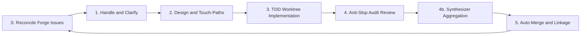

## Release — backlog-campaign v0.2.0

**backlog-campaign** is an agent-agnostic skill that autonomously drains your GitHub issue backlog using a coordinated loop of specialized AI agents. v0.2.0 strengthens the **Review** phase with a dedicated synthesizer agent, structured worker contracts, and built-in protocol conformance checks.

---

### 🎯 The goal

**Zero open issues, zero manual triage.** Every open GitHub issue flows through clarify → plan → implement → review → merge — with stronger quality gates and repeatable agent handoffs.

---

### 🔄 How it works



The **coordinator** handles your chat and spawns a background **orchestrator**. Workers run in isolated git worktrees. In Review, the **reviewer** audits the PR and the new **synthesizer** deduplicates, ranks, and promotes findings before they hit the ledger.

---

### ✨ What's new in v0.2.0

- **`backlog-synthesizer` agent** — post-review aggregation: deduplication, cross-correlation, severity promotion, and Pareto ranking before findings enter the ledger
- **`review-core.md` SSOT** — single source of truth for reviewer → synthesizer → ledger pipeline
- **Structured worker schemas** — typed return contracts for planner, implementer, and reviewer agents
- **Checkpoint / resume protocol** — orchestrator can resume long campaigns without losing wave state
- **Wave scheduling** — queue DAG supports batched review waves for parallel PR audits
- **`campaign-audit` mode** — read-only protocol conformance check from the main skill
- **`bun run verify`** — 8 automated conformance checks (schemas, fixtures, compiled-output drift) with CI gate
- **Lightweight ADRs** — documented decisions for five-phase lifecycle and synthesizer extraction

---

### 🛠 Five-phase lifecycle

| Phase | What happens |
|-------|--------------|
| **Handle** | Ingest issues, clarify ambiguity, split oversized work |
| **Plan** | Define touch-paths and API/schema baselines |
| **Implement** | Isolated git worktree, TDD, open PR |
| **Review** | V-code audit → synthesizer aggregation → ledger |
| **Loop** | Merge, prune worktrees, pick next issue |

---

### 👥 Specialized agents

| Agent | Role |
|-------|------|
| `backlog-coordinator` | User intake, blocker routing, HITL chat interface |
| `backlog-orchestrator` | Spawns workers, Pareto priority queue, git/worktree hygiene |
| `backlog-planner` | Implementation plans per issue (Quick / Standard tracks) |
| `backlog-implementer` | TDD-first code changes, incremental modifications, scope enforcement |
| `backlog-reviewer` | Structured PR audit with V-code gating and discovery reporting |
| `backlog-synthesizer` | Finding dedup, cross-correlation, severity promotion, Pareto ranking |

---

### 🛡️ Quality gates

- **V-code system** — SOLID, DRY, KISS, YAGNI, security, and scope checks
- **Protocol conformance** — `bun run verify` catches schema drift and compiled-output mismatches before release
- **Worktree isolation** — `campaign/issue-N` branches; no direct commits to `main`
- **Touch-path enforcement** — workers stay within the plan (`V-SCOPE-02`)
- **PR linkage** — every PR must include `Closes #N` (`V-GIT-01`)

---

### 💬 Human-in-the-loop

Clarification gates pause the queue when requirements are ambiguous. Chat feedback becomes new GitHub issues via auto-sync.

---

### 🔍 Continuous discovery

Workers surface UX, performance, and best-practice findings. Pareto scoring: **Priority = Gain × (11 − Effort)**. Findings **≥ 30** auto-file as issues; the synthesizer ranks and deduplicates before they enter the ledger.

---

### 🌐 Works on your platform

| Platform | Install | Run |
|----------|---------|-----|
| **Cursor** | git submodule → `.cursor` | Multitask Mode — `@backlog-coordinator run the campaign` |
| **Claude Code** | plugin marketplace | `/goal run backlog campaign until empty` |
| **skills.sh / generic** | `npx skills add …` | attach skill, read root `SKILL.md` |

---

### 📦 Installation

```bash
# Cursor (git submodule)
git submodule add https://github.com/CorentinLumineau/backlog-campaign .cursor
```

```bash
# Claude Code (plugin marketplace)
/plugin marketplace add https://github.com/CorentinLumineau/backlog-campaign
/plugin install backlog-campaign@backlog-campaign-marketplace
```

```bash
# skills.sh / generic
npx skills add CorentinLumineau/backlog-campaign
```

See the [README](https://github.com/CorentinLumineau/backlog-campaign#readme) for full setup and usage instructions.
