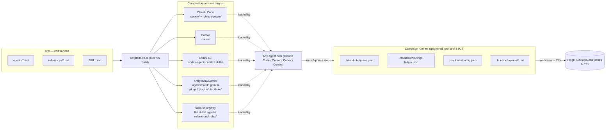

# Architecture: blackhole

<!--
  Living codebase comprehension document. Update as the system evolves.
  Architectural decisions live in documentation/decisions/ — see INDEX.md for the full log.
  Agents update structural sections (Project Structure, Tech Stack, etc.) when the underlying
  state changes. No agent tracking overhead — this is a human-readable reference.
-->

## Overview

Blackhole is an agent-agnostic backlog campaign orchestrator: a single `src/` source tree of
markdown agents/skills/rules is compiled (`bun run build`) into native plugin targets for
Claude Code, Cursor, Codex CLI, and Antigravity/Gemini, so any of those hosts can run the same
five-phase (Handle → Plan → Implement → Review → Loop) loop that drains a forge's issue backlog
using isolated git worktrees and a project-local JSON state ledger.

---

## 1. Project Structure

```
backlog-campaign/
├── src/                  # EDIT SURFACE — only hand-edited source (agents, skills, rules, references)
│   ├── agents/           # coordinator, orchestrator, planner, implementer, reviewer (markdown)
│   ├── references/       # protocol docs: blackhole-protocol, blackhole-state, phase-*, forge-sync, ...
│   └── SKILL.md          # blackhole skill entry (source)
├── scripts/              # Bun/TypeScript build, verify, doctor, release, campaign-status tooling
├── .blackhole/           # GITIGNORED runtime state (protocol SSOT) — queue.json, findings-ledger.json,
│                         #   config.json, plans/, archive/ — never hand-edited by agents outside protocol
├── .agents/              # GITIGNORED ephemeral per-run handoff dirs (orchestrator/, worker_*/, explorer_*/)
│                         #   plus .agents/build/ (Antigravity/Gemini compiled output, --gemini flag)
├── skills/, agents/, references/, rules/   # BUILD OUTPUT — flat skills.sh registry mirror of src/
├── .cursor/               # BUILD OUTPUT — Cursor IDE agent/rules/skills mirror
├── .claude/ + .claude-plugin/   # BUILD OUTPUT — Claude Code plugin + marketplace manifest
├── codex-agents/ + codex-skills/ + .codex-plugin/ + codex-marketplace.json  # BUILD OUTPUT — Codex CLI
├── .gemini-plugin/ + plugins/blackhole/   # BUILD OUTPUT — Antigravity/Gemini targets (--gemini flag)
├── documentation/        # ADRs, audits, reviews, architecture reference (this project's own docs)
├── fixtures/              # Example/test fixtures for config, queue, ledger, plugin manifests
├── templates/             # Hook templates used by the build
├── AGENTS.md              # Quick-start agent roster + trigger index
├── README.md              # Project pitch, HITL model, Pareto gating explanation
└── CLAUDE.md               # Entry point for Claude Code sessions in this repo
```

**Golden rule**: `src/` is the only editable source tree. Every platform directory above it
(`.cursor/`, `.claude/`, `codex-*`, `.gemini-plugin/`, `plugins/`, flat `skills/`/`agents/`/
`references/`/`rules/`) is a compiled artifact of `scripts/build.ts` — hand-edits there are
silently overwritten on the next build and are rejected by CI ("Verify build is in sync").
Full build-pipeline diagram: `documentation/architecture.md`.

---

## 2. System Diagram



---

## 3. Core Components

### 3.1. Source compiler (`scripts/build.ts`)

**Purpose**: Compiles the single `src/` markdown source tree into every agent-host's native
plugin format (Claude Code, Cursor, Codex CLI, Antigravity/Gemini, skills.sh flat registry),
keeping one authored copy of each skill/agent/rule instead of five hand-maintained forks.

**Technologies**: TypeScript, Bun runtime, `bun test` for build/verify test coverage.

**Deployment**: Local dev tool + CI step (`.github/workflows/verify.yml`) — not a running service.

### 3.2. Campaign agent roster (`src/agents/*.md`)

**Purpose**: Five markdown-defined agents implementing the backlog loop — `coordinator` (user
intake/blocker routing), `orchestrator` (five-phase loop + worker scheduling + forge sync),
`planner` (touch-paths + plan artifacts), `implementer` (TDD in isolated worktrees), `reviewer`
(PR quality + plan-conformance audit).

**Technologies**: Markdown agent-definition format, consumed natively by each compiled target
(Claude Code subagents, Cursor custom agents, Codex agent YAML, Gemini/Antigravity agents).

**Deployment**: Runs inside whichever agent host the user invokes (Claude Code, Cursor,
Codex CLI, Antigravity) — no separate hosting; the agent host is the runtime.

### 3.3. Protocol references (`src/references/*.md`)

**Purpose**: The behavioral rulebook the agents follow — `blackhole-protocol.md` (five-phase
lifecycle, clarify gates, branch/worktree hygiene, merge linkage), `blackhole-state.md` (queue/
ledger write protocol, SSOT boundaries), `blackhole-vcodes.md` (violation severity table),
plus per-phase playbooks (`phase-handle.md`, `phase-plan.md`, `phase-implement.md`,
`phase-review.md`, `phase-loop.md`) and cross-cutting docs (`forge-sync.md`, `issue-splitting.md`,
`recovery-protocol.md`, `checkpoint-protocol.md`, `worker-schemas.md`).

**Technologies**: Markdown, compiled verbatim into every platform target's `references/` dir.

**Deployment**: Read by agents at runtime from whichever compiled target the host loads.

### 3.4. Campaign runtime state (`.blackhole/`)

**Purpose**: The single source of truth for in-flight campaign state — `queue.json` (issue
phase/status/DAG), `findings-ledger.json` (V-code findings, dedup + deferral tracking),
`config.json` (campaign configuration), `plans/<issue>.md` (plan artifacts per issue),
`archive/` (rotated ledger snapshots).

**Technologies**: JSON (schema-validated via `scripts/validate-worker-json.ts`), plain markdown
for plans.

**Deployment**: Local, gitignored, per-repo-clone — not shared infrastructure.

### 3.5. Support scripts (`scripts/*.ts`)

**Purpose**: `build.ts` (compiler), `verify.ts` (plugin coherence checks across compiled
targets), `doctor.ts` (environment readiness), `campaign-status.ts` (queue dashboard),
`review-aggregate.ts` (merges reviewer findings into the ledger), `release.ts` (semver release
automation), `install-verify.ts` / `forge-deps.ts` / `forge-scope.ts` (installation and forge
scope validation).

**Technologies**: Bun + TypeScript, each with a co-located `*.test.ts`.

**Deployment**: Invoked via `bun run <script>` locally and in CI.

---

## 4. Data Stores

### 4.1. `.blackhole/queue.json`

**Type**: Flat JSON file (no database).

**Purpose**: Tracks every backlog issue's campaign phase, status (`ready`/`blocked`/`in-flight`/
`done`), and DAG dependencies. Read/written by the orchestrator every turn.

**Key schemas/collections**: See `src/references/queue-dag.md` / `.cursor/skills/blackhole/references/queue-dag.md` for the schema; example at `fixtures/queue.example.json`.

### 4.2. `.blackhole/findings-ledger.json`

**Type**: Flat JSON file (append-only, deduplicated).

**Purpose**: Records every V-code finding raised during implementation/review, with Pareto
scoring (`Priority = Gain * (11 - Effort)`) driving whether a finding is auto-filed as a new
forge issue or archived as noise.

**Key schemas/collections**: See `src/references/findings-ledger.md`; example at
`fixtures/findings-ledger.example.json`.

### 4.3. `.blackhole/config.json` / `.blackhole/plans/*.md`

**Type**: JSON (config) + markdown (plans).

**Purpose**: Per-repo campaign configuration and per-issue implementation plans produced by the
planner agent (touch-paths, acceptance criteria).

---

## 5. External Integrations

| Service | Purpose | Integration method |
|---------|---------|--------------------|
| GitHub / Gitea (forge) | Issue backlog source, PR creation/merge, native sync of new issues into the queue | `gh` CLI (and forge-equivalent) invoked by orchestrator/worker agents |
| Claude Code, Cursor, Codex CLI, Antigravity/Gemini | Agent hosts that load the compiled plugin targets and execute the campaign loop | Each host's native plugin/skill/agent loading mechanism (no shared API) |

---

## 6. Deployment & Infrastructure

**Cloud provider**: None — this is a local developer tool / CLI-driven repo automation, not a
hosted service.

**Key services**: N/A (no cloud infra; the "runtime" is whichever agent host + forge CLI the
developer already has installed).

**CI/CD**: GitHub Actions (`.github/workflows/verify.yml`) — runs `bun run build` and
`bun run verify`, fails the PR if the build drifts from committed compiled targets or if plugin
coherence checks fail.

**Environments**: Single environment — the developer's local clone. No staging/prod split;
`scripts/release.ts` handles semver tagging/publishing of the marketplace plugin.

**Monitoring & logging**: None (no running service) — visibility is via `bun run status`
(`scripts/campaign-status.ts`) showing the queue dashboard, and the findings ledger.

---

## 7. Security

**Authentication**: Delegates entirely to the host agent's and the `gh`/forge CLI's existing
authentication — blackhole itself holds no credentials or auth logic.

**Authorization**: Forge-level permissions (repo write access) gate what the worker/orchestrator
agents can do (branch push, PR create/merge); no additional authorization layer in this repo.

**Data encryption**: N/A — no data store beyond local gitignored JSON/markdown files.

**Key practices**: Branch/worktree hygiene enforced by protocol (V-BRANCH-01/02/03,
V-WORKTREE-01) — no direct commits to `main`, all work isolated in `blackhole/issue-N` branches
inside dedicated worktrees, pruned after merge.

---

## 8. Development & Testing

**Local setup**: `bun install`, then see `AGENTS.md` and `README.md#-installation-paths` for
per-host setup (Cursor submodule, Claude Code plugin marketplace, Codex CLI, skills.sh).

**Run commands**:
```bash
bun install                # install
bun run build               # compile src/ -> all platform targets
bun run build --gemini      # also compile Antigravity/Gemini target
bun run verify               # validate plugin coherence across compiled targets
bun test                     # run all *.test.ts (build, verify, forge-*, review-aggregate, ...)
```

**Testing frameworks**: `bun test` (Bun's built-in test runner) — every `scripts/*.ts` has a
co-located `*.test.ts`.

**Code quality tools**: `scripts/verify.ts` (plugin coherence / structural checks), CI-enforced
"build is in sync" gate (no separate linter/formatter configured in `package.json`).

---

## 9. Future Considerations

- Documentation governance gap: `documentation/decisions/` has 3 ADRs (ADR-001..003) but no
  `documentation/decisions/INDEX.md` yet — flagged as V-ADA-02 during this retrospective.
- The `.agents/build/` and `.gemini-plugin/` targets are only produced with the `--gemini` flag,
  making them easy to forget to regenerate before a release; consider folding `--gemini` into
  the default `bun run build` once the Gemini target stabilizes.

---

## 10. Agent Notes

- **Entry points**: `CLAUDE.md` / `AGENTS.md` at repo root route a session into the blackhole
  skill (`SKILL.md`, `.claude/skills/blackhole/SKILL.md`); the five-phase loop is defined in
  `src/references/blackhole-protocol.md` (compiled to every platform's `references/` dir).
- **Key patterns**: `src/` is the only hand-edited source — every other agent/skill/rule/plugin
  tree is regenerated by `scripts/build.ts`. Campaign runtime state lives exclusively under
  `.blackhole/` (see `src/references/blackhole-state.md`); ephemeral per-run agent handoff dirs
  under `.agents/orchestrator|worker_*|explorer_*` are NOT a substitute for `.blackhole/` state.
- **When working on X**: Any change to an agent/skill/rule/reference must be made in `src/` and
  then compiled via `bun run build` (and `--gemini` if the Gemini target is affected) — never
  hand-edit a compiled target directly, CI will reject the drift.
- **Avoid**: Do not hand-edit `.cursor/`, `.claude/`, `codex-*`, `.gemini-plugin/`,
  `plugins/blackhole/`, or the flat root `skills/`/`agents/`/`references/`/`rules/` — all are
  build output. Do not treat `.agents/*` handoff dirs as campaign state — only `.blackhole/*` is
  protocol SSOT.

---

## 11. Glossary

| Term | Definition |
|------|-----------|
| Blackhole | This project's name for the agent-agnostic backlog campaign orchestrator. |
| Campaign | A full run of the five-phase loop against a repo's forge backlog until it is empty. |
| Touch-Paths | The set of files a plan authorizes a worker to modify; deviating is a V-SCOPE-02 violation. |
| Ledger | `.blackhole/findings-ledger.json` — the append-only record of V-code findings. |
| Pareto gating | Scoring findings by `Priority = Gain * (11 - Effort)` to decide auto-file vs archive. |
| SSOT | Single Source of Truth — for campaign state, exclusively `.blackhole/*`. |
| Compiled target | A platform-specific directory (`.claude/`, `.cursor/`, `codex-*`, etc.) generated from `src/` by `scripts/build.ts`. |

---

## Active Constraints

- `src/` is the only editable source — every platform tree is a build output regenerated by
  `scripts/build.ts`; CI blocks PRs where a compiled target has drifted from `src/`.
- Campaign protocol state lives only under `.blackhole/*` — ephemeral `.agents/orchestrator|
  worker_*|explorer_*` handoff dirs and `.agents/build/` (Gemini build output) are never treated
  as protocol state.
- No direct commits/force-pushes to `main`/`master`/`release/*` (V-BRANCH-01/02) — all worker
  changes go through isolated worktrees on `blackhole/issue-N` branches and a reviewed PR.
- Every PR must link its issue (`Closes #N`) before merge (V-GIT-01).
- Blackhole is agent-agnostic by design — protocol and state must remain readable/writable by
  any agent host, not coupled to Claude Code, Cursor, Codex, or Gemini specifically.

---

## Package Map (Monorepo)

| Package | Path | Responsibility |
|---------|------|-----------------|
| — | — | Single-package repo — not a monorepo. `src/` compiles to multiple *platform targets* (see §1), not multiple independently-versioned packages. |
