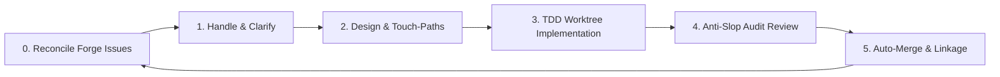

# Backlog Campaign — Native Multi-Agent Backlog Solver

An automated, platform-native agentic loop designed to systematically resolve your repository's entire issue backlog. 

Rather than requiring manual developer triage for every issue, **Backlog Campaign** enables advanced AI coding agents (such as **Claude Code**, **Cursor**, and **Antigravity**) to run autonomously in the background—spinning up parallel worker agents in isolated git worktrees to write tests, implement solutions, audit code reviews, and merge PRs until the backlog is completely empty.

---

## 🎯 Concrete Goal: Zero Open Issues, Zero Manual Triage

The goal of Backlog Campaign is to take an open backlog on your forge (GitHub, GitLab, etc.) and automate the entire software development lifecycle (SDLC) for every issue:



- **Parallel Worker Swarms**: The orchestrator schedules and runs multiple worker subagents concurrently in isolated git worktrees.
- **TDD Enforcement**: Workers must write unit tests first before making changes.
- **Plan-Conformance Gates**: Workers are blocked if they modify files outside their declared Touch-Paths or introduce database/API schema drift.
- **PR & Merge Hygiene**: Pull requests are automatically created, linked with `Closes #N` tags, audited for AI-generated code slop, and merged when green.

---

## 🛠 How It Works (The 5-Phase Loop)

The orchestrator operates over a project-local, gitignored state directory `.backlog-campaign/` containing:
- `queue.json`: Active campaign DAG, issue phases, and worker execution states.
- `findings-ledger.json`: V-code quality findings tracking Open, Fixed, or Deferred issues.
- `plans/<issue>.md`: Touch-paths, schema baselines, and implementation designs.

### The Five Lifecycle Phases
1. **Handle**: Ingests new issues, triages dependencies, splits epics, and moves issues to planning.
2. **Plan**: Spawns `backlog-planner` to create a plan file, defining specific Touch-Paths and API/schema baselines.
3. **Implement**: Spawns `backlog-implementer` inside a git worktree (`wt-<issue>`) to code, run tests, and open a PR.
4. **Review**: Spawns `backlog-reviewer` to audit the PR against the plan touchpaths and check for AI code slop.
5. **Loop**: Merges approved PRs, cleans up worktrees, prunes tracking branches, and proceeds to the next queue item.

---

## 🚀 How to Run Natively on Each Agent

Depending on your preferred development tool, you can leverage native background loops, custom agents, or global commands:

### 1. Claude Code (Anthropic Native)
Claude Code natively supports long-running background sessions via the `/goal` command.
- **How to invoke**:
  Start Claude in your project directory and execute:
  ```bash
  /goal run backlog campaign until empty
  ```
  Claude will automatically load the `backlog-campaign` skill and agents, register the `backlog-coordinator` and `backlog-orchestrator`, and run the execution loop autonomously in the background until all open issues are resolved.

### 2. Cursor (Multitask Mode / Composer)
Cursor natively supports multi-file background operations using **Composer / Multitask Mode**.
- **How to invoke**:
  1. Open the Cursor Composer (Cmd+I) and switch to **Agent** or **Multitask Mode**.
  2. Input the command: `@backlog-coordinator run the campaign` (or simply trigger `/backlog-campaign`).
  3. The `backlog-coordinator` will bootstrap the campaign and spawn the background `backlog-orchestrator` task, freeing up your chat composer for other work.

### 3. Antigravity & Generic Agents
In Antigravity or other agent systems, you can trigger the loop by attaching the skill and running:
```bash
antigravity run /backlog-campaign
```
The agent reads the root-level `SKILL.md` and coordinates the planner, implementer, and reviewer subagents.

---

## 📦 Installation Paths

### Pathway A: Cursor Native (Git Submodule)
The cleanest, symlink-free way to install the plugin in Cursor is to add the repository directly as a git submodule named `.cursor`:
```bash
git submodule add https://github.com/CorentinLumineau/backlog-campaign .cursor
```
Cursor automatically discovers and loads the custom agents (`agents/`), rules (`rules/`), and skills (`skills/`) from the submodule!

### Pathway B: Claude Code Native (Marketplace)
Register the repository as a plugin marketplace catalog and install it:
```bash
# 1. Register the marketplace
/plugin marketplace add https://github.com/CorentinLumineau/backlog-campaign

# 2. Install the plugin
/plugin install backlog-campaign@backlog-campaign-marketplace
```

### Pathway C: Generic / skills.sh Registry
Install using the standard registry:
```bash
npx skills add CorentinLumineau/backlog-campaign
```
Any compatible agent will read the root `SKILL.md` and load the associated rules from the `references/` directory.

---

## 💻 Development & Compilation

To keep all rules, agent prompts, and phase playbooks DRY (Don't Repeat Yourself), all source files are maintained under `src/`. 

We use a Bun-based compiler to build target directories:
```bash
bun run build
```
*Note: A git pre-commit hook is installed automatically in your development environment to run `bun run build` and stage the output files before every commit, ensuring compile-free code changes.*
