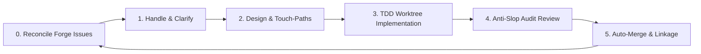

# Backlog Campaign — Agent-Agnostic Backlog Auto-Solver

An automated, **fully agent-agnostic** software development lifecycle (SDLC) loop designed to systematically resolve your repository's entire issue backlog. 

**Backlog Campaign is 100% agent-agnostic**: it operates over a project-local standard state ledger (`queue.json` and `findings-ledger.json`) and markdown instruction manuals. Any agentic system (such as Claude Code, Cursor, Antigravity, or custom shell/API agents) can run the loop. 

To deliver a premium developer experience, the project provides **native, out-of-the-box target structures** for:
- **Cursor Native**: MDC rules, custom agents, and skills integrated directly under the root (accessible via a single `.cursor` submodule).
- **Claude Code Native**: Pre-compiled project rules (`.claude/rules/`), project agents (`.claude/agents/`), and a validated plugin manifest (`.claude-plugin/plugin.json`).
- **Standard Registry**: Direct compatibility with the `skills.sh` registry and general-purpose markdown parsers.

The loop runs autonomously in the background—spinning up parallel worker agents in isolated git worktrees to write tests, implement solutions, audit PR quality, and merge changes until the backlog is completely empty.

---

## 🎯 Concrete Goal: Zero Open Issues, Zero Manual Triage

The goal of Backlog Campaign is to take an open backlog on your forge (GitHub, GitLab, etc.) and automate the entire software development lifecycle (SDLC) for every issue:



- **Parallel Workers**: The orchestrator schedules multiple worker subagents concurrently in isolated git worktrees. Review uses a reviewer → synthesizer pipeline per PR.
- **TDD Enforcement**: Workers must write unit tests first before making changes.
- **Plan-Conformance Gates**: Workers are blocked if they modify files outside their declared Touch-Paths or introduce database/API schema drift.
- **PR & Merge Hygiene**: Pull requests are automatically created, linked with `Closes #N` tags, audited for AI-generated code slop, and merged when green.

---

## 👥 Human-in-the-Loop (HITL) & Feedback Intake

Backlog Campaign integrates the developer seamlessly into the automation loop to resolve ambiguity and intake new directions:

1. **Clarification Gates (Ambiguity Blockers)**: When a worker or planner agent encounters vague requirements, product/UX trade-offs, or destructive operations, the orchestrator sets the issue's queue state to `status: blocked` and `notes: awaiting-user-clarification`. Spawns are suspended, and the coordinator executes `AskQuestion` to solicit human decisions.
2. **Main Chat Feedback Intake**: You can provide real-time corrections, feature requests, or performance feedback directly in the main chat. The coordinator intercepts this feedback:
   - If it is new work or a code smell suggestion, it validates details, triages it, and natively files a GitHub issue (`gh issue create`). The sync loop then automatically registers it in the campaign queue.
   - If it is a response to an active blocker, it updates the queue notes and resumes the orchestrator to unblock execution.

---

## 🔄 Continuous Codebase Optimization Loop & Pareto Gating
 
The campaign does not just implement pre-defined requirements—it continuously discovers, gates, and schedules codebase health improvements:
 
- **Universal Discoveries**: During implementation and review phases, agents audit the codebase for *any* optimization worth doing (including UX/UI polish, performance gains, styling best practices, security improvements, or test coverage gaps).
- **Strict Scope Boundaries**: To prevent scope creep, workers are blocked from implementing these discoveries in the active PR (`V-SCOPE-02`).
- **Pareto Scoring & Gating**: For every discovery finding, agents estimate **Gain (1-10)** and **Effort (1-10)**. The orchestrator computes:
  $$\text{Priority} = \text{Gain} \times (11 - \text{Effort})$$
  *   **High-Value ($\ge 30$)**: Automatically filed as a new GitHub tracking issue (`gh issue create`) to grow the backlog campaign queue.
  *   **Low-Value ($< 30$)**: Logged in `findings-ledger.json` as `status: archived` and filtered out from the active queue to keep the backlog clean and noise-free.
- **ROI Priority Scheduling**: The orchestrator automatically sorts the active ready queue in descending order of their Priority score, ensuring high-ROI issues are implemented first.


---

## 🛠 How It Works (The 5-Phase Loop)

The orchestrator operates over a project-local, gitignored state directory `.bc-campaign/` containing:
- `queue.json`: Active campaign DAG, issue phases, and worker execution states.
- `findings-ledger.json`: V-code quality findings tracking Open, Fixed, or Deferred issues.
- `plans/<issue>.md`: Touch-paths, schema baselines, and implementation designs.

### The Five Lifecycle Phases
1. **Handle**: Ingests new issues, triages dependencies, splits epics, and moves issues to planning.
2. **Plan**: Spawns `bc-planner` to create a plan file, defining specific Touch-Paths and API/schema baselines.
3. **Implement**: Spawns `bc-implementer` inside a git worktree (`wt-<issue>`) to code, run tests, and open a PR.
4. **Review**: Spawns `bc-reviewer` then `bc-synthesizer` to audit the PR and aggregate findings.
5. **Loop**: Merges approved PRs, cleans up worktrees, prunes tracking branches, and proceeds to the next queue item.

---

## 🚀 How to Run Natively on Each Agent

Depending on your preferred development tool, you can leverage native background loops, custom agents, or global commands:

### 1. Claude Code (Anthropic Native)
Claude Code natively supports long-running background sessions via the `/goal` command.
- **How to invoke**:
  Start Claude in your project directory and execute:
  ```bash
  /goal run bc-campaign until empty
  ```
  Claude will automatically load the `bc-campaign` skill and agents, register the `bc-coordinator` and `bc-orchestrator`, and run the execution loop autonomously in the background until all open issues are resolved.

### 2. Cursor (Multitask Mode / Composer)
Cursor natively supports multi-file background operations using **Composer / Multitask Mode**.
- **How to invoke**:
  1. Open the Cursor Composer (Cmd+I) and switch to **Agent** or **Multitask Mode**.
  2. Input the command: `@bc-coordinator run the campaign` (or simply trigger `/bc-campaign`).
  3. The `bc-coordinator` will bootstrap the campaign and spawn the background `bc-orchestrator` task, freeing up your composer for other work.

### 3. Antigravity & Generic Agents
In Antigravity or other agent systems, you can trigger the loop by attaching the skill and running:
```bash
antigravity run /bc-campaign
```
The agent reads the root-level `SKILL.md` and coordinates the planner, implementer, and reviewer subagents.

### Platform quick reference

| Platform | Invoke command |
|----------|----------------|
| **Claude Code** | `/goal run bc-campaign until empty` |
| **Cursor** | `@bc-coordinator run the campaign` or `/bc-campaign` |
| **skills.sh** | `npx skills add CorentinLumineau/backlog-campaign` then attach `bc-campaign` |
| **Antigravity** | `antigravity run /bc-campaign` |

See [AGENTS.md](AGENTS.md) and [CLAUDE.md](CLAUDE.md) for agent roster and Claude-specific triggers.

---

## 📦 Installation Paths

### Pathway A: Cursor Native (Git Submodule)
The cleanest, symlink-free way to install the plugin in Cursor is to add the repository directly as a git submodule named `.cursor`:
```bash
git submodule add https://github.com/CorentinLumineau/backlog-campaign .cursor
```
Cursor automatically discovers and loads the custom agents (`agents/`), rules (`rules/`), and skills (`skills/`) from the submodule!

### Pathway B: Claude Code Native (Marketplace)
Register the repository as a plugin marketplace catalog and install it:
```bash
# 1. Register the marketplace
/plugin marketplace add https://github.com/CorentinLumineau/backlog-campaign

# 2. Install the plugin
/plugin install bc-campaign@bc-campaign-marketplace
```

### Pathway C: Generic / skills.sh Registry
Install using the standard registry:
```bash
npx skills add CorentinLumineau/backlog-campaign
```
Any compatible agent will read the root `SKILL.md` and load the associated rules from the `references/` directory.

---

## 💻 Development & Compilation

To keep all rules, agent prompts, and phase playbooks DRY (Don't Repeat Yourself), all source files are maintained under `src/`. 

We use a Bun-based compiler to build target directories:
```bash
bun run build
bun run verify
```

Optional: install a git pre-commit hook that runs build before commit:

```bash
bash scripts/install-hook.sh
```

---

## Maintainer: Creating a release

Every published tag `vX.Y.Z` must have a matching notes file at `.github/releases/vX.Y.Z.md` before the tag is pushed. CI uses that file as the GitHub release body; if no file exists, it falls back to git-cliff.

```bash
bun run release prepare vX.Y.Z   # scaffold notes + bump package.json
# edit .github/releases/vX.Y.Z.md (product-focused, not internal changelog)
bun run release validate vX.Y.Z
git add -A && git commit -m "docs: add vX.Y.Z release notes" && git push origin main
bun run release tag vX.Y.Z
bun run release push vX.Y.Z
```

Agent workflow: attach the maintainer skill at [`.github/skills/create-release/SKILL.md`](.github/skills/create-release/SKILL.md).
