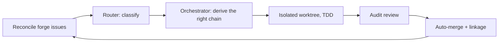

# Blackhole — Agent-Agnostic Backlog Auto-Solver

Blackhole takes an open issue backlog and drives it to zero, autonomously — one PR per issue,
reviewed, merged, looped — without running the same rigid pipeline on every issue regardless of
what it actually needs.

A **router agent** classifies each issue once and the orchestrator derives everything downstream
from that classification: whether it needs a full plan or just a rationale record, whether it
needs a design decision or an investigation first, how strictly Implement re-verifies behavior,
whether a human has to sign off before anything proceeds. A one-line fix and a genuine
architectural decision no longer pay the same cost.

**100% agent-agnostic**: state lives in a project-local `.blackhole/` ledger and markdown
instruction manuals — any agentic system can run the loop. Native, pre-compiled targets ship for
Claude Code, Cursor, Antigravity, Codex CLI, and the `skills.sh` registry.

---

## Start here

| I want to... | Go to |
|---|---|
| Run the campaign right now | [Quickstart](#quickstart) below |
| Understand how routing decisions get made, and what workflows are covered | [Adaptive Routing](documentation/architecture/adaptive-routing.md) |
| See the repo layout, build pipeline, source-vs-generated boundary | [Architecture map](documentation/architecture.md) |
| Read the design rationale for the routing system | [ADR-004](documentation/decisions/ADR-004-adaptive-phase-routing.md) |
| Install on a specific platform | [Installation Paths](#-installation-paths) below |
| Contribute or run the build locally | [Development & Compilation](#-development--compilation) below |

---

## Quickstart

```bash
# Claude Code / Codex CLI
/goal run blackhole until empty

# Cursor / Antigravity (Multitask Mode)
@coordinator run the campaign
```

That's it. The coordinator bootstraps `.blackhole/` state, syncs your forge's open issues, spawns
a background orchestrator, and the loop runs until the backlog is empty — surfacing a chat gate
only when something is genuinely ambiguous or architecturally significant.

Full platform-specific setup: [Installation Paths](#-installation-paths).

---

## What it actually does



- **Adaptive, not fixed.** The router decides per-issue whether a design step, an investigation,
  external research, or none of those is needed — see [Adaptive Routing](documentation/architecture/adaptive-routing.md)
  for the full mechanics and the complete workflow-coverage table.
- **Parallel workers.** Non-overlapping issues run concurrently in isolated git worktrees.
- **TDD enforced** for the default execution mode; refactor and docs-only issues get their own
  matched discipline (zero-regression test-suite invariant, staleness/drift checks).
- **Plan-conformance gates.** Workers are blocked from editing outside their declared Touch-Paths
  or introducing undeclared schema drift.
- **PR hygiene.** Every PR carries `Closes #N`, is audited for AI-slop and security findings, and
  merges only when green.

---

## Human-in-the-loop, briefly

Two kinds of gate, by design: most routing flags act autonomously above a confidence threshold
and fall back to a cautious default below it — no round-trip needed for the common case.
Architectural decisions and genuine ambiguity always block on an async `AskQuestion`, resolved
whenever you next engage — never a live synchronous wait. You can also drop new requests or
corrections directly in chat at any time; they get triaged and filed as issues automatically.

Full detail: [Adaptive Routing § Human-in-the-loop](documentation/architecture/adaptive-routing.md#human-in-the-loop).

---

## 🚀 How to Run Natively on Each Agent

| Platform | Invoke command |
|----------|----------------|
| **Claude Code** | `/goal run blackhole until empty` |
| **Cursor** | `@coordinator run the campaign` or `/blackhole` |
| **Antigravity** | `@coordinator run the campaign` or `antigravity run /blackhole` |
| **Codex CLI** | `/goal run blackhole until empty` or `@blackhole status` |
| **skills.sh** | `npx skills add CorentinLumineau/blackhole --skill blackhole -y`, then attach `blackhole` |

See [AGENTS.md](AGENTS.md) and [CLAUDE.md](CLAUDE.md) for the agent roster and Claude-specific
triggers.

---

## 📦 Installation Paths

### Cursor (git submodule)
```bash
git submodule add https://github.com/CorentinLumineau/blackhole .cursor
```
Cursor auto-discovers `agents/`, `rules/`, `skills/` from the submodule.

### Claude Code (marketplace)
```bash
/plugin marketplace add https://github.com/CorentinLumineau/blackhole
/plugin install blackhole@blackhole-marketplace
```

### skills.sh registry
```bash
npx skills add CorentinLumineau/blackhole --skill blackhole -y
```
Project-scoped by default; add `-g`/`--global` for a user-level install. The repo slug and skill
id are both `blackhole` — always pass `--skill blackhole` explicitly. Version pinning via
`@X.Y.Z` on the repo slug is not supported by the current CLI; check out a release tag instead.

### Antigravity / Gemini
```bash
bun run build
```
Compiles `.agents/build/` (workspace customization — 8 agent prompts, rules, skills — see
[AGENTS.md](AGENTS.md) for the roster) and `plugins/blackhole/` (redistributable plugin bundle,
no `agents/` per the Antigravity plugin schema) as part of the default, flagless build — every
git-tracked target is regenerated by plain `bun run build` (tracked ⇒ built by default); `--gemini`
is a deprecated no-op alias kept for one release. For a global install:
```bash
ln -s /path/to/blackhole/plugins/blackhole ~/.gemini/config/plugins/blackhole
```

### Codex CLI
Codex outputs are committed in-repo — no local build needed to install:
```bash
codex plugin marketplace add https://github.com/CorentinLumineau/blackhole
codex plugin add blackhole@blackhole-codex
```
Maintainers: after editing `src/`, run `bun run build` (Codex included by default; `--no-codex`
to skip while iterating on other targets) and commit the changed outputs.

---

## 💻 Development & Compilation

All source lives under `src/` — every platform tree below it is a `bun run build` output, never
hand-edited.

`bun run build` also emits `plugins/blackhole-claude/` — the isolated Claude Code marketplace
bundle (ADR-009): a co-located `.claude-plugin/plugin.json` + `agents/` + `skills/` + `rules/` +
`templates/`, compiled the same way as the Antigravity `plugins/blackhole/` bundle above but
shipping `agents/` (Claude marketplace plugins ship the 8 campaign agents; Gemini's AC4
no-agents rule is platform-schema-scoped only). `.claude-plugin/marketplace.json`'s `source`
points at this bundle, not the repo root, so repo-root `.claude/` is now free for
maintainer-only, auto-discovered content that never reaches consumers.

```bash
bun run build            # regenerates every git-tracked target: Cursor, Claude, skills.sh,
                          # Codex, Antigravity/Gemini — tracked ⇒ built by default; --gemini/
                          # --all/--no-codex are deprecated no-op aliases kept for one release
bun test
bun run verify           # structural + V-code checks across all built targets
bun run doctor            # campaign bootstrap preflight
bun run install:verify   # read-only workstation install audit (Cursor/Claude/Gemini/Codex/skills.sh)
```

| Layer | Path(s) | Role |
|-------|---------|------|
| Source | `src/` | Edit here — the only edit surface |
| Build outputs | `.cursor/`, `.claude/`, `skills/`, `codex-*`, `.agents/build/`, `plugins/` | Generated — `bun run build`, never hand-edit |
| Claude marketplace bundle | `plugins/blackhole-claude/` | Isolated, redistributable Claude Code plugin — ships `agents/` unlike the Gemini bundle (ADR-009); `marketplace.json` `source` points here |
| Maintainer-only Claude content | `.claude/` (repo root) | Auto-discovered locally, never redistributed — freed up by the bundle split (ADR-009, issue #262) |
| Campaign runtime | `.blackhole/` (`queue.json`, `findings-ledger.json`, `config.json`, `plans/`) | Live state, gitignored, sole protocol SSOT |
| Ephemeral handoff | `.agents/orchestrator/`, `.agents/worker_*/` | Per-session, gitignored, not protocol state |

Full repository map and build-pipeline diagram: [documentation/architecture.md](documentation/architecture.md).

Optional pre-commit build hook: `bash scripts/install-hook.sh`

---

## Maintainer: Creating a release

**Must** use the release skill for every published tag — see
[`.github/skills/create-release/SKILL.md`](.github/skills/create-release/SKILL.md). The CLI is
[`scripts/release.ts`](scripts/release.ts) (`bun run release …`); every tag needs a matching
`.github/releases/vX.Y.Z.md` committed on `main` first.

```bash
bun run release prepare vX.Y.Z
# edit .github/releases/vX.Y.Z.md
bun run release validate vX.Y.Z
git add -A && git commit -m "docs: add vX.Y.Z release notes" && git push origin main
bun run release tag vX.Y.Z
bun run release push vX.Y.Z
```

Blocked: manual `gh release create` without committed notes, tagging without `release validate`,
retagging/force-pushing without explicit approval.
