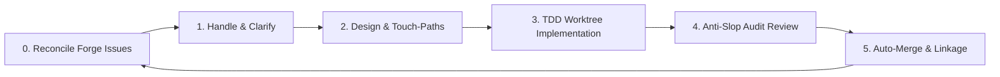

# Backlog Campaign — Agent-Agnostic Backlog Auto-Solver

An automated, **fully agent-agnostic** software development lifecycle (SDLC) loop designed to systematically resolve your repository's entire issue backlog. 

**Backlog Campaign is 100% agent-agnostic**: it operates over a project-local standard state ledger (`queue.json` and `findings-ledger.json`) and markdown instruction manuals. Any agentic system (such as Claude Code, Cursor, Antigravity, or custom shell/API agents) can run the loop. 

To deliver a premium developer experience, the project provides **native, out-of-the-box target structures** for:
- **Cursor Native**: MDC rules, custom agents, and skills integrated directly under the root (accessible via a single `.cursor` submodule).
- **Claude Code Native**: Pre-compiled project rules (`.claude/rules/`), project agents (`.claude/agents/`), and a validated plugin manifest (`.claude-plugin/plugin.json`).
- **Standard Registry**: Direct compatibility with the `skills.sh` registry and general-purpose markdown parsers.

The loop runs autonomously in the background—spinning up parallel worker agents in isolated git worktrees to write tests, implement solutions, audit PR quality, and merge changes until the backlog is completely empty.

---

## 🎯 Concrete Goal: Zero Open Issues, Zero Manual Triage

The goal of Backlog Campaign is to take an open backlog on your forge (GitHub, GitLab, etc.) and automate the entire software development lifecycle (SDLC) for every issue:



- **Parallel Workers**: The orchestrator schedules multiple worker subagents concurrently in isolated git worktrees. Review uses a reviewer → `review-aggregate.ts` pipeline per PR.
- **TDD Enforcement**: Workers must write unit tests first before making changes.
- **Plan-Conformance Gates**: Workers are blocked if they modify files outside their declared Touch-Paths or introduce database/API schema drift.
- **PR & Merge Hygiene**: Pull requests are automatically created, linked with `Closes #N` tags, audited for AI-generated code slop, and merged when green.

---

## 👥 Human-in-the-Loop (HITL) & Feedback Intake

Backlog Campaign integrates the developer seamlessly into the automation loop to resolve ambiguity and intake new directions:

1. **Clarification Gates (Ambiguity Blockers)**: When a worker or planner agent encounters vague requirements, product/UX trade-offs, or destructive operations, the orchestrator sets the issue's queue state to `status: blocked` and `notes: awaiting-user-clarification`. Spawns are suspended, and the coordinator executes `AskQuestion` to solicit human decisions.
2. **Main Chat Feedback Intake**: You can provide real-time corrections, feature requests, or performance feedback directly in the main chat. The coordinator intercepts this feedback:
   - If it is new work or a code smell suggestion, it validates details, triages it, and natively files a GitHub issue (`gh issue create`). The sync loop then automatically registers it in the campaign queue.
   - If it is a response to an active blocker, it updates the queue notes and resumes the orchestrator to unblock execution.

---

## 🔄 Continuous Codebase Optimization Loop & Pareto Gating
 
The campaign does not just implement pre-defined requirements—it continuously discovers, gates, and schedules codebase health improvements:
 
- **Universal Discoveries**: During implementation and review phases, agents audit the codebase for *any* optimization worth doing (including UX/UI polish, performance gains, styling best practices, security improvements, or test coverage gaps).
- **Strict Scope Boundaries**: To prevent scope creep, workers are blocked from implementing these discoveries in the active PR (`V-SCOPE-02`).
- **Pareto Scoring & Gating**: For every discovery finding, agents estimate **Gain (1-10)** and **Effort (1-10)**. The orchestrator computes:
  $$\text{Priority} = \text{Gain} \times (11 - \text{Effort})$$
  *   **High-Value ($\ge 30$)**: Automatically filed as a new GitHub tracking issue (`gh issue create`) to grow the backlog campaign queue.
  *   **Low-Value ($< 30$)**: Logged in `findings-ledger.json` as `status: archived` and filtered out from the active queue to keep the backlog clean and noise-free.
- **ROI Priority Scheduling**: The orchestrator automatically sorts the active ready queue in descending order of their Priority score, ensuring high-ROI issues are implemented first.


---

## 🛠 How It Works (The 5-Phase Loop)

The orchestrator operates over a project-local, gitignored state directory `.bc-campaign/` containing:
- `queue.json`: Active campaign DAG, issue phases, and worker execution states.
- `findings-ledger.json`: V-code quality findings tracking Open, Fixed, or Deferred issues.
- `plans/<issue>.md`: Touch-paths, schema baselines, and implementation designs.

### The Five Lifecycle Phases
1. **Handle**: Ingests new issues, triages dependencies, splits epics, and moves issues to planning.
2. **Plan**: Spawns `bc-planner` to create a plan file, defining specific Touch-Paths and API/schema baselines.
3. **Implement**: Spawns `bc-implementer` inside a git worktree (`wt-<issue>`) to code, run tests, and open a PR.
4. **Review**: Spawns `bc-reviewer` to audit the PR, then runs `scripts/review-aggregate.ts` to deduplicate and rank findings.
5. **Loop**: Merges approved PRs, cleans up worktrees, prunes tracking branches, and proceeds to the next queue item.

---

## 🚀 How to Run Natively on Each Agent

Depending on your preferred development tool, you can leverage native background loops, custom agents, or global commands:

### 1. Claude Code (Anthropic Native)
Claude Code natively supports long-running background sessions via the `/goal` command.
- **How to invoke**:
  Start Claude in your project directory and execute:
  ```bash
  /goal run bc-campaign until empty
  ```
  Claude will automatically load the `bc-campaign` skill and agents, register the `bc-coordinator` and `bc-orchestrator`, and run the execution loop autonomously in the background until all open issues are resolved.

### 2. Cursor (Multitask Mode / Composer)
Cursor natively supports multi-file background operations using **Composer / Multitask Mode**.
- **How to invoke**:
  1. Open the Cursor Composer (Cmd+I) and switch to **Agent** or **Multitask Mode**.
  2. Run `bun run doctor` to preflight install health, config, and built artifacts.
  3. Input the command: `@bc-coordinator run the campaign` (or simply trigger `/bc-campaign`).
  4. The `bc-coordinator` will bootstrap the campaign and spawn the background `bc-orchestrator` task, freeing up your composer for other work.

### 3. Antigravity (Gemini) — Multitask Mode
Antigravity has no native `/goal` command. Use the **coordinator** as the entry point:
- **How to invoke**: `@bc-coordinator run the campaign` (or attach the skill and start Multitask Mode with the coordinator agent).
- The `bc-coordinator` bootstraps the campaign and spawns the background `bc-orchestrator`.

You can also run the compiled skill directly:
```bash
antigravity run /bc-campaign
```

### 4. Codex CLI (OpenAI Native)
Codex supports long-running background sessions via the `/goal` command (same pattern as Claude Code).
- **How to invoke**:
  ```bash
  /goal run bc-campaign until empty
  ```
  Or use Multitask Mode: `@bc-coordinator run the campaign` when you prefer coordinator-driven intake.

### Platform quick reference

| Platform | Invoke command |
|----------|----------------|
| **Claude Code** | `/goal run bc-campaign until empty` |
| **Cursor** | `@bc-coordinator run the campaign` or `/bc-campaign` |
| **skills.sh** | `npx skills add CorentinLumineau/backlog-campaign` then attach `bc-campaign` |
| **Antigravity** | `@bc-coordinator run the campaign` or `antigravity run /bc-campaign` |
| **Codex CLI** | `/goal run bc-campaign until empty` or `@bc-campaign status` |

See [AGENTS.md](AGENTS.md) and [CLAUDE.md](CLAUDE.md) for agent roster and Claude-specific triggers.

---

## 📦 Installation Paths

### Pathway A: Cursor Native (Git Submodule)
The cleanest, symlink-free way to install the plugin in Cursor is to add the repository directly as a git submodule named `.cursor`:
```bash
git submodule add https://github.com/CorentinLumineau/backlog-campaign .cursor
```
Cursor automatically discovers and loads the custom agents (`agents/`), rules (`rules/`), and skills (`skills/`) from the submodule!

### Pathway B: Claude Code Native (Marketplace)
Register the repository as a plugin marketplace catalog and install it:
```bash
# 1. Register the marketplace
/plugin marketplace add https://github.com/CorentinLumineau/backlog-campaign

# 2. Install the plugin
/plugin install bc-campaign@bc-campaign-marketplace
```
The marketplace URL uses the GitHub repo slug `backlog-campaign`; the installed plugin id is `bc-campaign`.

### Pathway C: Generic / skills.sh Registry

Install the skill from the skills.sh registry (repo slug + explicit skill id):

```bash
npx skills add CorentinLumineau/backlog-campaign --skill bc-campaign -y
```

After install, attach or invoke **`bc-campaign`** in your agent UI. Compatible agents read the root `SKILL.md` and load rules from the `references/` directory.

**Naming:** The GitHub repository is `backlog-campaign`; the installable skill id is **`bc-campaign`**. Always pass `--skill bc-campaign` — the repo slug alone does not select the skill when the repo exposes multiple skills or a non-default skill name.

**Version pinning:** `CorentinLumineau/backlog-campaign@v0.4.0` or `@0.4.0` on the repo slug is **not supported** by the current `skills` CLI (v1.5.x). The CLI treats `@…` as a skill name, not a git ref or semver tag. To pin a release, check out a release tag in a fork/submodule or re-run `skills add` after upstream publishes; do not use `@version` syntax on the repo slug.

**Install scope:**

| Scope | Flag | Installs to | When to use |
|-------|------|-------------|-------------|
| Project (default) | _(none)_ | Current repo / agent project dirs | Team-pinned install per codebase; reproducible with lockfile |
| Global | `-g` / `--global` | User-level skill store | Personal workstation default across many repos |

Examples:

```bash
# Project (default)
npx skills add CorentinLumineau/backlog-campaign --skill bc-campaign -y

# Global
npx skills add CorentinLumineau/backlog-campaign --skill bc-campaign -g -y
```

### Pathway D: Antigravity / Gemini Native

The distribution `plugin.json` `name` is **`bc-campaign`** (same plugin id as Claude and Codex). The build output directory `plugins/backlog-campaign/` uses the repo slug for path layout — that folder name is not the plugin id.

`bun run build --gemini` emits **two** Gemini trees:

| Tree | Purpose | Contents |
|------|---------|----------|
| `.agents/build/` | Workspace customization (this repo or submodule) | `agents/` (6 bc-* prompts), `rules/`, `skills/bc-campaign/` |
| `plugins/backlog-campaign/` | Redistributable Antigravity plugin bundle (build output dir; plugin id `bc-campaign`) | `plugin.json`, `rules/`, `skills/bc-campaign/` (no `agents/`) |

Ephemeral session handoff dirs (`.agents/orchestrator/`, `.agents/worker_*/`, etc.) share the `.agents/` parent but are gitignored and separate from the tracked `build/` compile tree.

**Workspace customization (agent prompts + skills):**
```bash
bun run build --gemini
```
Compiles `.agents/build/agents/`, `.agents/build/rules/`, and `.agents/build/skills/bc-campaign/`. The `agents/` directory holds compiled bc-* agent prompts for `@bc-coordinator` / Multitask Mode invocation; Antigravity does not require `agents/` in the official distribution bundle schema.

**Global / redistributable install (Antigravity plugin schema):**
```bash
bun run build --gemini
ln -s /path/to/backlog-campaign/plugins/backlog-campaign ~/.gemini/config/plugins/bc-campaign
```
Or copy `plugins/backlog-campaign/` to `~/.gemini/config/plugins/bc-campaign/`. The global path uses the plugin id (`bc-campaign`); the source folder keeps the repo-slug name. This tree is co-located per [Antigravity plugin docs](https://antigravity.google): `plugin.json` beside `skills/` and `rules/`.

**Breaking change (v0.4+):** If you previously symlinked to `~/.gemini/config/plugins/backlog-campaign`, remove that stale path and reinstall under `~/.gemini/config/plugins/bc-campaign` after upgrading.

**Workspace plugin (other consumer repos):**
```bash
# After build, symlink or copy the distribution bundle:
ln -s /path/to/backlog-campaign/plugins/backlog-campaign .agents/plugins/backlog-campaign
```

For local development in this repo, prefer the full `.agents/build/` workspace tree (includes agent prompts). Use `plugins/backlog-campaign/` when packaging or installing globally. `.gemini-plugin/plugin.json` mirrors the distribution manifest for marketplace metadata only.

#### Identifiers: repo slug vs plugin id

| Harness | Stays `backlog-campaign` | Reason |
|---------|--------------------------|--------|
| GitHub repository | `CorentinLumineau/backlog-campaign` | Marketplace URLs, `gh`, CI, submodule remotes |
| skills.sh / Pathway C | `npx skills add CorentinLumineau/backlog-campaign` | Registry tied to repo name |
| Build output directory | `plugins/backlog-campaign/` | `{{AGENT_DIR}}` paths compiled into distribution SKILL.md and rules |
| Codex/Gemini `homepage` / `repository` / `websiteURL` | `…/backlog-campaign` | Points at actual repo URL |
| Legacy global installs | `~/.gemini/config/plugins/backlog-campaign`, `~/.agents/skills/backlog-campaign` | Existing symlinks; `bun run doctor` may WARN (#35) |

The **plugin id** (`bc-campaign`) is consistent across Claude, Codex, and Gemini manifests. The **repo slug** (`backlog-campaign`) remains for URLs and the distribution folder name until a dedicated path-migration issue.

### Pathway E: Codex CLI Native

Codex build outputs (`.codex-plugin/`, `codex-skills/`, `codex-agents/`, `codex-marketplace.json`) are **committed in-repo** — no local build step is required for marketplace install.

```bash
# 1. Register the marketplace (works on a clean git checkout)
codex plugin marketplace add https://github.com/CorentinLumineau/backlog-campaign

# 2. Install the plugin
codex plugin add bc-campaign@bc-campaign-codex
```

The marketplace URL uses the GitHub repo slug `backlog-campaign`; the installed plugin id is `bc-campaign`.

**Maintainers:** after editing `src/`, run `bun run build` (Codex is included by default) and commit any changed Codex outputs. Use `bun run build --no-codex` to skip Codex when iterating on other targets only.

---

## 💻 Development & Compilation

To keep all rules, agent prompts, and phase playbooks DRY (Don't Repeat Yourself), all source files are maintained under `src/`. 

We use a Bun-based compiler to build target directories:
```bash
bun run build          # Cursor, Claude, skills.sh, Codex (default CI)
bun run build --gemini # Antigravity: .agents/build/ + plugins/backlog-campaign/ + .gemini-plugin/
bun run build --no-codex  # Skip Codex targets when iterating on other platforms
bun run build --all    # All targets including Gemini
bun test
bun run verify         # Includes V-CODEX-* checks
bun run doctor         # Campaign bootstrap preflight (before coordinator)
bun run install:verify # Workstation install health matrix (Cursor/Claude/Gemini/Codex/skills.sh)
```

### Repository layout

See **[documentation/architecture.md](documentation/architecture.md)** for the full build-flow diagram, target-tree table, and runtime vs compile-artifact distinction.

| Layer | Path(s) | Role | How to change |
|-------|---------|------|---------------|
| **Source (authoring)** | `src/` | DRY source for agents, rules, references, playbooks | Edit `src/` directly |
| **Build outputs** | `.cursor/`, `.claude/`, `skills/`, `codex-*`, `.agents/build/`, `plugins/backlog-campaign/`, etc. | Platform-specific compiled artifacts | `bun run build` — never hand-edit |
| **Campaign runtime (protocol SSOT)** | `.bc-campaign/` (`queue.json`, `findings-ledger.json`, `config.json`, `plans/`) | Live campaign state; sole protocol SSOT | Mutate only per `bc-campaign-state.md` write protocol |
| **Ephemeral handoff** | `.agents/orchestrator/`, `.agents/worker_*/`, `.agents/explorer_*/` | Per-session agent handoff; gitignored | Not protocol state — do not use for queue/ledger |

Ephemeral handoff dirs share the `.agents/` parent with Gemini `build/` output (see [Pathway D: Antigravity / Gemini Native](#pathway-d-antigravity--gemini-native)) but are separate namespaces.

Optional: install a git pre-commit hook that runs build before commit:

```bash
bash scripts/install-hook.sh
```

---

## Maintainer: Creating a release

**MUST** use the create-release skill workflow for every published tag `vX.Y.Z`. The CLI is implemented by [`scripts/release.ts`](scripts/release.ts) (`bun run release …`). Do not cut releases ad hoc.

Every published tag must have a matching notes file at `.github/releases/vX.Y.Z.md` committed on `main` before the tag is pushed (major/minor; patch may omit per skill). CI uses that file as the GitHub release body.

```bash
bun run release prepare vX.Y.Z   # scaffold notes + bump package.json
# edit .github/releases/vX.Y.Z.md (product-focused, not internal changelog)
bun run release validate vX.Y.Z
git add -A && git commit -m "docs: add vX.Y.Z release notes" && git push origin main
bun run release tag vX.Y.Z
bun run release push vX.Y.Z
```

Agent workflow: attach the maintainer skill at [`.github/skills/create-release/SKILL.md`](.github/skills/create-release/SKILL.md). Milestone closure: [`.cursor/rules/release-milestone-governance.mdc`](.cursor/rules/release-milestone-governance.mdc).

**Anti-patterns (blocked):**

- Manual `gh release create` without a committed `.github/releases/vX.Y.Z.md`
- Tagging or pushing a release without `bun run release validate vX.Y.Z`
- Retagging or force-pushing tags without explicit approval
