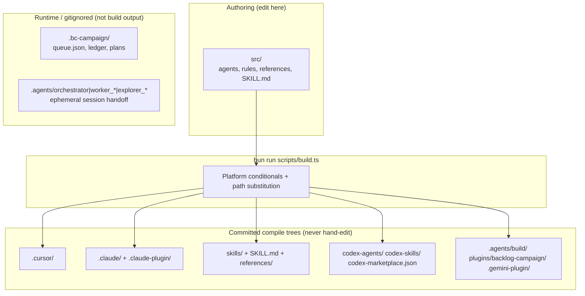

# Repository Architecture

Contributor map of **where to edit**, **what gets compiled**, and **what is runtime-only** in the backlog-campaign repo.

> **Protocol SSOT vs build artifacts:** Campaign queue/ledger state lives only in gitignored `.bc-campaign/` — see [bc-campaign-state.md](../src/references/bc-campaign-state.md) and issue #23. This document covers the **repository layout and build pipeline**, not live campaign mutations.

## Build flow

`bun run build --gemini` additionally emits the Antigravity distribution bundle under `plugins/backlog-campaign/` (folder name = repo slug; plugin id = `bc-campaign`).

## Target trees

| Output path | Consumer | Edit via |
|-------------|----------|----------|
| `skills/`, root `SKILL.md`, `references/` | skills.sh / Pathway C | `src/` only |
| `.cursor/agents/`, `.cursor/skills/`, `.cursor/rules/` | Cursor submodule / native | `src/` only |
| `.claude/agents/`, `.claude/skills/`, `.claude/rules/`, `.claude-plugin/` | Claude Code marketplace | `src/` only |
| `codex-agents/`, `codex-skills/`, `codex-marketplace.json`, `.codex-plugin/` | Codex CLI plugin | `src/` only |
| `.agents/build/` | Gemini local dev workspace | `src/` + `bun run build --gemini` |
| `plugins/backlog-campaign/` | Gemini global plugin install | `src/` + `bun run build --gemini` |
| `.gemini-plugin/plugin.json` | Gemini marketplace metadata | `src/` + build |

## Runtime vs ephemeral

| Path | Role | Git |
|------|------|-----|
| `.bc-campaign/` | Campaign protocol SSOT (`queue.json`, `findings-ledger.json`, `plans/`, `config.json`) | gitignored |
| `.agents/orchestrator/`, `.agents/worker_*/`, `.agents/explorer_*/` | Per-session agent handoff | gitignored |
| All rows in **Target trees** above | Compiled distribution artifacts | committed |

Do **not** treat handoff dirs or build outputs as substitutes for `.bc-campaign/` queue/ledger mutations.

## Verification

- `bun run build` — regenerate all default targets from `src/`
- `bun run verify` — protocol conformance (`V-BUILD-01` fails if build dirties committed trees)
- CI (`.github/workflows/verify.yml`) — runs verify, build, then `git status` must be clean

See [README.md](../README.md#repository-layout) for the quick contributor table and [ground-truth.md](../src/references/ground-truth.md) for machine-verified counts.

## Related

- [#23](https://github.com/CorentinLumineau/backlog-campaign/issues/23) — `.bc-campaign/*` as protocol SSOT across harnesses
- `documentation/decisions/ADR-001-five-phase-lifecycle.md` — five-phase lifecycle
