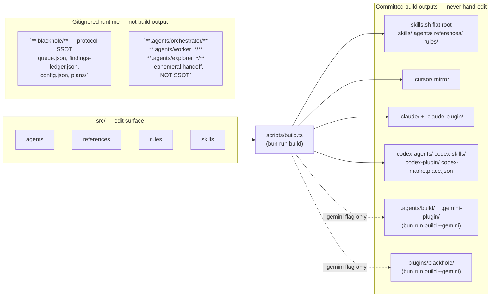

# Architecture — Repository Map

Contributor-facing map of this repo: what you edit, what gets compiled, and what is
runtime state. If you only remember one rule from this page: **`src/` is the only
editable source; every platform tree below it is a build output.**

## Build pipeline



`RUNTIME` is intentionally drawn apart from `OUT`: nothing under `.blackhole/` or the
ephemeral `.agents/orchestrator|worker_*|explorer_*` handoff dirs is produced by
`scripts/build.ts`, and neither is a build artifact you regenerate — they are live
campaign state, gitignored, and governed by their own write protocol (see
[Complementary docs](#complementary-docs) below).

## Committed target trees

Every row below is generated by `scripts/build.ts` from `src/`. None of these paths
should be hand-edited directly — changes made there are overwritten on the next build.

| Path(s) | Platform | Consumer | Edit via `src/` only? |
|---------|----------|----------|------------------------|
| `skills/`, root `agents/`, `references/`, `rules/` | skills.sh (flat registry) | skills.sh marketplace | Edit via `src/` only — never hand-edit. |
| `.cursor/` | Cursor | Cursor IDE agent/rules/skills loader | Edit via `src/` only — never hand-edit. |
| `.claude/` + `.claude-plugin/` (`plugin.json`, `marketplace.json`) | Claude Code | Claude Code plugin + marketplace manifest | Edit via `src/` only — never hand-edit. |
| `codex-agents/` + `codex-skills/` + `.codex-plugin/` + `codex-marketplace.json` | Codex CLI | Codex plugin + marketplace manifest | Edit via `src/` only — never hand-edit. |
| `.agents/build/` + `.gemini-plugin/` | Antigravity / Gemini (workspace) | Workspace customization (`@coordinator` / Multitask Mode); `.gemini-plugin/plugin.json` mirrors marketplace metadata | Edit via `src/` only — never hand-edit. |
| `plugins/blackhole/` | Antigravity / Gemini (distribution) | Redistributable plugin bundle — co-located `plugin.json` + `skills/` + `rules/`, no `agents/` (AC4: not part of the plugin schema) | Edit via `src/` only — never hand-edit. |

## Build & verify

```bash
bun run build            # compiles src/ -> Cursor, Claude, skills.sh, Codex targets
bun run build --gemini   # also compiles the Antigravity/Gemini target
bun run verify           # validates plugin coherence across all compiled targets
```

CI enforces build-in-sync via `.github/workflows/verify.yml`'s "Verify build is in
sync" step: it runs the build and fails if `git status --porcelain` is non-empty
afterward — any drift between `src/` and a committed target tree blocks the PR.

## Complementary docs

This page maps the repo's files and build pipeline. It does not describe how the
`.blackhole/` campaign runtime state is read or written — that is owned by
[`src/references/blackhole-state.md`](../src/references/blackhole-state.md) (compiled
to each platform's `references/blackhole-state.md`), and the agent roster/triggers
live in [`AGENTS.md`](../AGENTS.md). These three docs are complementary, not
duplicates: this one is the map, `blackhole-state.md` is the runtime write protocol,
and `AGENTS.md` is the quick-start index.
