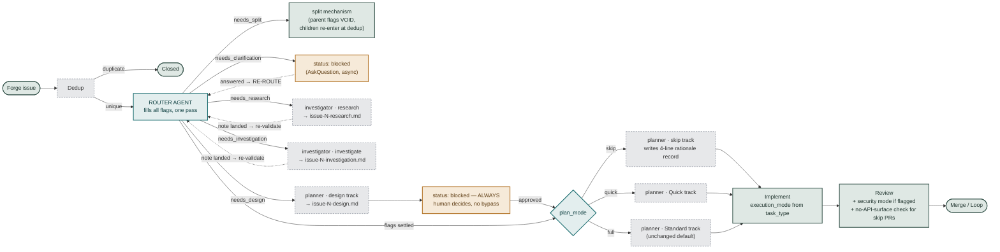

# ADR-004: Router-Agent Adaptive Phase Routing

## Context

[ADR-001](ADR-001-five-phase-lifecycle.md) fixed blackhole's orchestrator to one pipeline for
every campaign issue — Handle → Plan → Implement → Review → Loop — with Plan enforced as a hard
automated gate (`V-PLAN-01`) regardless of issue size or clarity. A comparative analysis against
mercure's `x-auto` router (`documentation/audits/analysis-blackhole-adaptive-phase-routing.md`)
established that this rigidity costs a full planner spawn on every issue, and offers no path to
insert design, investigation, or research steps when an issue needs them.

A verified sweep of all 23 mercure `x-*` skills (5 parallel classification agents reading each
SKILL.md, plus 2 adversarial design critics) grounded the redesign: 6 skills map to router
flags, 3 to existing phases, 2 to execution modes, 5 are campaign-level (blackhole itself plays
that role), and 7 are honestly not-applicable (interactive/meta/multi-session tooling with no
per-issue analog). The full mapping table is in this ADR's appendix.

## Decision

Replace Handle's implicit, scattered decision points with an explicit **router agent** — a new
6th agent whose sole job is classification. The per-issue flow becomes:

1. **Dedup** (mechanical, unchanged).
2. **Router agent** fills the complete flag set for the issue in one evaluation, written to
   `queue.json` as the issue's routing contract.
3. **Orchestrator derives the execution chain from the flags** — through optional
   research/investigation/design steps, one of three plan tracks, implement with a
   flag-selected execution mode, review (security mode when flagged), and merge.

Routing is **active from day 1** — no canary window, no size-label restriction. The
`adaptive_routing` config key survives only as an emergency kill switch (default `true`); every
routing decision is appended to `findings-ledger.json` for human spot-audit.

### The route contract (`queue.json` per-issue `route` object)

```json
"route": {
  "needs_split": false,
  "needs_clarification": false,
  "needs_research": false,
  "needs_investigation": true,
  "needs_design": false,
  "task_type": "bugfix",
  "plan_mode": "quick",
  "security_review_required": false,
  "confidence": { "split": 95, "design": 80, "plan_mode": 70, "security": 90 },
  "body_hash": "<sha of issue title+body at classification time>",
  "computed_at_phase": "handle",
  "revision": 1
}
```

Contract rules, each closing a verified failure mode:

- **`task_type` is computed from issue content, never from forge labels.** When a
  human-authored label (e.g. `security`) *conflicts* with the content-derived classification,
  the router takes the more cautious of the two — mirroring `x-auto`'s own "ambiguous → default
  to the more cautious workflow" rule. Labels are a tie-break input, not an authority.
- **Per-flag confidence, not one scalar.** A wrong `needs_split` is an annoyance; a wrong
  `security_review_required: false` on an autonomously-merging pipeline is an incident. Each
  chain decision gates on its own flag's confidence; low confidence on any flag resolves to
  that flag's cautious default (`plan_mode` → `full`, `security_review_required` → `true`,
  `needs_design` → `true`).
- **`body_hash` + `revision` are the staleness markers.** Any consumer (orchestrator dispatch,
  recovery pass) that finds the current issue body hashing differently from `route.body_hash`
  must trigger re-routing before acting.
- **Split discards everything else.** When `needs_split: true`, all other parent flags are
  void — children re-enter the flow at dedup and receive their own independent route. This is a
  hard rule, not an implied ordering.

### Re-route checkpoints (single-pass, revalidated)

The router runs **once per evidence state**, not once forever. The initial pass fills all
flags; a cheap re-invocation re-validates only downstream flags at exactly three checkpoints:

| Checkpoint | Re-validated flags | Why |
|------------|--------------------|-----|
| Clarify resolved (human answered) | all | The answer may change everything — same as a new issue body |
| Research note landed | `needs_investigation`, `needs_design`, `plan_mode`, `security_review_required` | External docs may reveal a breaking change or CVE |
| Investigation note landed | `needs_design`, `plan_mode`, `security_review_required` | Root cause may be architectural |

Each re-route bumps `revision` and re-hashes. Flags already *acted on* (an artifact exists) are
never retroactively changed — re-routing only affects not-yet-executed chain steps.
This is the adaptation `x-auto` never needed: it classifies inside one synchronous user turn,
while blackhole's queue is asynchronous across orchestrator turns and can sit blocked for days.

### Flag-derived execution chain



## Components

### `router` agent (new — 6th agent)
- **Responsibility**: classification only. Reads issue title/body/labels + any artifacts from
  prior checkpoints (research/investigation notes); writes the `route` object. Never spawns
  workers, never writes artifacts other than the queue mutation.
- **Model**: cheapest capable (haiku-tier) — classification is keyword/heuristic + short
  reasoning, not deep analysis. Escalate to sonnet-tier only when per-flag confidence gating
  repeatedly forces cautious defaults (signal the cheap model is out of depth).
- **Interface**: `route{}` contract above; worker-JSON handoff consistent with
  `worker-schemas.md` conventions.

### `investigator` agent (new — 7th agent)
- **Responsibility**: evidence-gathering only — `research` (external docs/changelog/migration
  lookup) and `investigate` (root-cause hunting) sub-modes. Produces notes that feed re-route
  checkpoints; never plans, never implements.

### `planner` agent (extended)
- Gains **two** tracks alongside Quick/Standard: **`design`** (ADR-lite note:
  Context/Options/Chosen/Rejected, 1 page) and **`skip`** (deterministically writes the fixed
  4-line rationale record — Objective / Touch-Paths / Why-no-plan / Rollback — and returns the
  existing `{status: ready, plan_path, track: "skip"}` contract).
- **Why planner writes the rationale record**: the orchestrator's tool policy
  (`disallowedTools: [Write, Edit, Delete]`, `src/agents/orchestrator.md:5`) makes
  orchestrator-side artifact writing impossible — confirmed fatal in adversarial review of the
  previous draft. A `skip`-track planner spawn is near-instant (template fill, no analysis),
  preserves the coordinate-only sandbox, and keeps the existing Planner gate ("artifact on
  disk" + "status: ready") working entirely unmodified. The efficiency win over today remains:
  a template fill instead of full plan production.

### `implementer` contract (extended)
- `worker-schemas.md` gains an **`execution_mode`** field (`standard` | `refactor-strict` |
  `docs-only`), mirroring planner's existing `track` field, derived from `task_type`:
  - `standard` (feature/bugfix): unchanged TDD mandate — failing tests first.
  - `refactor-strict`: the pre-existing test suite must pass **unmodified** (no new/deleted
    test files) — zero-regression discipline, `x-refactor`'s core guarantee.
  - `docs-only`: failing-test-first mandate suppressed; touch-paths restricted to doc paths.
- The orchestrator's 5-field-contract TDD prose and `phase-implement.md`'s worker-prompt
  template gain the matching `execution_mode` branches — without this plumbing the flag would
  never reach Implement (gap caught in adversarial review).

### Review phase (minimally extended — compensating controls only)
- `security_review_required: true` → reviewer runs in security mode (OWASP/V-SEC focus).
- **Skip-PR compensating control**: plan-conformance auditing (V-API-01, V-SCOPE-02) is scoped
  to `plan_mode ∈ {quick, full}`; for `skip` PRs the reviewer instead independently verifies
  the diff touched **no public API/schema surface** — because a 4-line rationale record has no
  contract section to diff against, and the fastest path must not silently lose its control.
- Iteration budget, LGTM mechanics, merge/linkage gates (V-GIT-01, V-BRANCH-*): all unchanged
  (verified unaffected).

### Recovery protocol (extended)
- A rationale record satisfies the plan-existence check identically to a full plan (else every
  skip-routed issue silently reverts to full plan on the first crash/recovery pass).
- New rule: on resume, if the issue body's hash ≠ `route.body_hash`, or a
  research/investigation artifact exists that postdates `route.revision`, force a re-route
  before dispatching — never trust flags older than the evidence.
- New interrupted state: investigation/research in progress + no artifact on disk → respawn
  `investigator` (mirrors the existing "implement with no plan → respawn planner" pattern).

## Trade-offs

| Decision | Alternative considered | Choice + why |
|----------|------------------------|--------------|
| Single router agent filling all flags | Sequential per-axis evaluation (previous draft) | **Single-pass + re-route checkpoints** — one evaluation is cheaper and matches the user's model; checkpoints repair its one real weakness (staleness) without reverting to N sequential calls |
| Who writes the skip rationale record | Orchestrator writes it directly | **planner `skip` track** — orchestrator cannot Write (tool policy); widening its permissions would erode the coordinate-only sandbox for one artifact |
| Evidence-gathering home | 5 sub-modes in `planner` | **New `investigator` agent** — deciding (plan/design) vs discovering (research/investigate) is a real SRP boundary; 5 sub-modes crossed this repo's own accretion threshold |
| Day-1 activation | Canary window, `size:xs` only, flag default off | **Day 1 active** (user decision, informed of the blast-radius counter-case: a systematic classifier bias hits every wave before a human notices). Mitigations kept: emergency kill switch + per-decision ledger logging + per-flag cautious defaults |
| `task_type` source | Forge labels | **Content-derived, labels as cautious tie-break only** — labels are unreliable and unauthenticated input, but discarding a human "security" label entirely would remove signal; conflict resolves cautious |
| Router model tier | Session-tier for everything | **Haiku-tier classification, escalation on repeated low confidence** — matches the "cheapest capable model" delegation discipline the router itself embodies |

## Risk Assessment

| Risk | Impact | Mitigation |
|------|--------|------------|
| Classifier systematically misroutes with day-1 full activation | High | Per-flag cautious defaults (worst case = today's behavior: full plan + security review); kill switch; every decision ledger-logged for spot audit |
| Stale flags acted on after evidence lands | High | `body_hash` + `revision` + three defined re-route checkpoints; recovery-side hash check |
| Parent flags leak into split children | Medium | Hard rule: split voids all sibling flags; children re-enter at dedup |
| Router re-runs are non-deterministic (different flags on retry) | Medium | Re-route only at defined checkpoints (never as crash-retry); executed steps are never retroactively changed; `revision` makes every change auditable |
| `planner`/`investigator` accretion resumes | Medium | Standing rule: any new sub-mode/track proposal re-triggers the split evaluation this ADR performed |
| Skip-path PRs lose plan-conformance scrutiny | Medium | Reviewer's compensating no-API-surface check; `plan_mode` cautious default is `full` |

## Key Assumptions

| Assumption | Marker | Note |
|------------|--------|------|
| Content-based classification is good enough for day-1 full activation | ◐ Blind spot | Explicit user decision with the counter-case presented; ledger logging is the detection mechanism |
| Per-flag confidence thresholds (starting at 70) are reasonable | ~ Contestable | Borrowed from `x-auto`, zero blackhole calibration data; tunable via config, not asserted correct |
| Async clarify gate suffices for the design hard-block | ✓ Validated | Existing production mechanism; only the trigger is new |
| Rationale record preserves `V-PLAN-01`'s guarantee | ✓ Validated | `checkPlanArtifacts` is existence-only (confirmed by code read); guarantee preserved exactly as strict as today |
| Review's existing checks retain meaning for skip PRs | ◐ Blind spot | Honest downgrade from the previous draft's "✓ Validated" — V-API-01 has nothing to diff against on skip PRs; the compensating control exists precisely because this is a blind spot |
| Handle spawning workers (router, investigator, planner-design) is architecturally safe | ◐ Blind spot | Structurally novel — Handle has never spawned workers; first campaign runs should watch this closely |

## Implementation Order

1. **Schema + config**: `queue-dag.md` `route{}` contract, `body_hash`/`revision` semantics,
   `adaptive_routing` kill switch + per-flag threshold keys in `config-template.md`.
2. **Recovery protocol**: rationale-record recognition + hash-based staleness check +
   investigator interrupted state — lands **before** any skip path exists.
3. **Orchestrator dispatch**: flag-derived chain derivation; Planner-gate prose gains the
   explicit `skip`-track branch (same PR as #2 — the intermediate state where `skip` exists but
   the gate prose says "MUST NOT skip" unconditionally is self-contradictory).
4. **`planner` tracks**: `skip` (deterministic template) and `design` (ADR-lite + hard gate).
5. **`router` agent** + ledger logging of decisions + re-route checkpoints.
6. **`investigator` agent** (research + investigate) + the two evidence checkpoints.
7. **Implementer plumbing**: `execution_mode` in `worker-schemas.md`, TDD-mandate branches in
   orchestrator prose + `phase-implement.md` template.
8. **Review extensions**: security mode trigger + skip-PR no-API-surface compensating check.

Each step registers new agents in `build.ts` (`AGENT_NAMES` etc.) and propagates across all 5
build targets; `src/` is the sole edit surface.

## Appendix: full mercure `x-*` coverage map (verified against each SKILL.md)

| Skill | Category | Blackhole mapping |
|-------|----------|-------------------|
| x-design | route-flag | `needs_design` → planner design track, human-gated |
| x-troubleshoot | route-flag | `needs_investigation` → investigator |
| x-research | route-flag | `needs_research` → investigator |
| x-security-audit | route-flag | `security_review_required` → security-mode review |
| x-refactor | route-flag | `task_type: refactor` → `execution_mode: refactor-strict` |
| x-docs | route-flag | `task_type: docs` → `execution_mode: docs-only` |
| x-fix | route-flag | `task_type: bugfix` + `plan_mode: quick` (**not** `skip` — see Amendment; `skip` is a distinct "no code change needed" bypass, not x-fix's diagnose-fix loop) |
| x-plan | existing-phase | Plan — `plan_mode` selects planner track |
| x-implement | existing-phase | Implement — substrate for all execution modes |
| x-review | existing-phase | Review |
| x-review-loop | execution-mode | Review's existing iteration budget (review-core.md) matches x-review-loop's **cadence** (1-3 auto, 4+ escalate, ceiling 5) but **not** its Pareto-gated per-finding 1-10 scoring model — see Amendment |
| x-analyze | campaign-level | Full skill is pre-campaign codebase auditing; the router's low-confidence local scan is its scoped per-issue descendant |
| x-brainstorm | campaign-level | Pre-issue ideation feeding backlog composition |
| x-improve-hunt | campaign-level | Hunts/files issues INTO blackhole's queue |
| x-rearchitect | campaign-level | Whole-system health retrospective above per-issue scope |
| x-setup | campaign-level | One-time project bootstrap, pre-campaign |
| x-auto | — | The router agent **is** blackhole's adapted x-auto (flags instead of skill entry points) |
| x-archive | not-applicable | Multi-session initiative closure — no per-issue analog |
| x-ask | not-applicable | Interactive human Q&A |
| x-create | not-applicable | Plugin/ecosystem component CRUD |
| x-help | not-applicable | Human CLI navigation |
| x-initiative | not-applicable | Multi-session tracking above campaign scope |
| x-prompt | not-applicable | Prompt-engineering utility, orthogonal layer |

## Amendment: Skill-Portage Fidelity Audit (2026-07-08)

A 7-agent parallel audit — each comparing this ADR's spec (and, where already built, the merged
code) against the **full** source `x-*` SKILL.md, not just its name — found that most
route-flag mappings preserved a skill's *label* but not its *mechanism*. Two issues (#94
planner skip/design tracks, #97 execution_mode) had already merged the thin versions before
this audit ran; corrective rework issues are filed. Three issues (#95 router, #96 investigator,
#98 review extensions) had not yet been built; their issue bodies are corrected below and
updated on the forge before implementation starts.

### Consolidated verdict

| Flag / mechanism | Source skill(s) | Verdict |
|---|---|---|
| `needs_design` (design track) | x-design | Thin — no adversarial eval, principles validation, refactoring-impact analysis, or assumption audit |
| `plan_mode: skip` | x-fix | **Mismatched** — skip is a "no code change" bypass; real x-fix analog is `task_type: bugfix` + `plan_mode: quick`, which itself lacks root-cause verification, scout check, escalation triggers |
| `execution_mode: refactor-strict` | x-refactor | Thin — outcome contract (tests unmodified) kept; process discipline (Decision Record gate, per-step commit/rollback, in-scope Scout Check) dropped |
| `execution_mode: docs-only` | x-docs | Thin — "skip tests, restrict to `*.md`" only; zero staleness detection, drift analysis, example verification |
| `investigator.investigate` | x-troubleshoot | Severely under-specified — no hypothesis loop, no evidence structure, no note schema, no model tier, no tool policy |
| `investigator.research` | x-research | Severely under-specified — narrower source coverage than x-research, no citation/verification discipline, no note schema |
| "local-analyze" confidence boost | x-analyze | Under-specified + **safety-relevant** — no security-path bypass on the flag that most needs one (`security_review_required`), no verification pass against stale/mis-cited matches |
| `security_review_required` | x-security-audit | Under-specified — mode-name only, no exploitability gate (V-SEC-06), no adversarial re-verification (V-SEC-07), no diff-scope statement |
| Review iteration budget | x-review-loop | Overstated — cadence matches, Pareto-gated scoring does not (appendix corrected above) |
| `plan_mode: full/quick` default path | x-plan | **Confirmed clean** — genuinely additive, no drift |
| `execution_mode: standard` default path | x-implement | **Confirmed clean** — genuinely additive, no drift |

### Corrected spec: `task_type: bugfix` + `plan_mode: quick` (x-fix parity)

`plan_mode: skip` stays a distinct, legitimate bypass for issues needing **zero code change**
(already resolved, invalid, duplicate, out of scope) — that mapping was never x-fix's job. The
real x-fix analog, the Quick track for a `bugfix`-classified issue, gains:

- **Root-Cause Verification gate (unconditional)**: before any fix, `planner`'s Quick track (or
  `implementer`, if diagnosis happens at implementation time) must produce a short Decision
  Record — root cause identified, alternatives considered, why this fix — mirroring x-fix's
  V-FIX-01 gate. No code path may skip this, matching the "no confidence bypass" pattern already
  used for `needs_design`.
- **Escalation triggers**: 2 failed fix attempts → re-route through `investigator.investigate`
  (sets `needs_investigation: true` retroactively, re-routes via the existing checkpoint
  mechanism); if the fix touches more than the issue's declared Touch-Paths scope (3+ files) →
  escalate `plan_mode` to `full`.
- **Scout Check**: after the fix, one in-scope improvement to the touched code, recorded as an
  Improvement Record in the PR description — reusing the exact mechanism `implementer.md`
  already needs for refactor-strict (see below), not a new concept.

### Corrected spec: `execution_mode: refactor-strict` (x-refactor parity)

Add, before the existing "tests unmodified" outcome check:

- **Refactoring Verification gate (unconditional)**: a short Decision Record — deep vs. shallow
  restructuring choice, coupling-impact assessment — before the first edit. Same "no bypass"
  shape as the Root-Cause Verification gate above; both reuse one Decision-Record mechanism.
- **Per-step commit/rollback**: each incremental change is tested and committed before the next;
  a failing step reverts to the last known-good commit, not just "stop and diagnose."
- **Scout Check restored as in-scope**: `implementer.md`'s current "Continuous Discovery" step
  explicitly tells the worker *not* to fix what it notices, only log it for later — inverted
  from x-refactor's actual "leave it better than you found it" discipline. For
  `refactor-strict` specifically, one in-scope improvement to already-touched code is expected
  and recorded, not deferred.

### Corrected spec: `execution_mode: docs-only` (x-docs parity)

Add, before the implementer starts editing:

- **Staleness/drift check**: compare doc claims (signatures, examples, described behavior)
  against current code before editing — a lightweight version of x-docs' drift-detection table
  (API signature changed / new feature undocumented / behavior changed / file moved → required
  action), not full doc-maintenance tooling.
- **Example verification**: any code block being written or touched must be syntactically valid
  against the current API — cheap to check, catches the most common doc-rot failure mode.
- **Reviewer awareness**: `reviewer.md` currently has no `execution_mode` branch at all; add one
  so a `docs-only` PR is checked against these two additions, not just "did it touch only `.md`
  files."

### Corrected spec: `investigator` agent (x-troubleshoot + x-research parity)

The current spec (four sentences) is replaced by:

- **Model tier**: sonnet — unlike the router's cheap classification, evidence-gathering requires
  real reasoning. State this explicitly; it was silently absent before.
- **Tool policy**: `disallowedTools: [Write, Edit, Delete]` except for its own note file (mirrors
  both source skills, which are read-only investigation tools).
- **`investigate` sub-mode**: minimum 2-3 ranked hypotheses with evidence-for/against per
  hypothesis; cheapest test first; loop until confirmed or exhausted (re-examine assumptions on
  full refutation, don't dead-end). Delegates test execution rather than asserting outcomes
  itself.
- **`research` sub-mode**: multi-source (codebase search + external docs/changelog, not docs
  lookup alone); every claim cites its source and is cross-referenced against actual code;
  uncertainty is stated explicitly, not smoothed over.
- **Note schema (both sub-modes)**: fixed frontmatter (`issue`, `sub_mode`, `confidence`,
  `computed_at_revision`) + required sections (investigate: Symptoms/Hypotheses/Root
  Cause/Resolution; research: Executive Summary/Findings/Sources). This is the artifact the
  re-route checkpoints actually read — its shape was previously unspecified, which is a gap in
  the checkpoint mechanism itself, not just a documentation nicety.

### Corrected spec: "local-analyze" confidence boost (x-analyze parity)

Promoted from a single appendix-table cell to a real mechanism, scoped deliberately narrower
than x-analyze's full 5-domain swarm — but with its one non-negotiable safeguard carried over:

- **Trigger**: Axis 6 (plan-strategy) confidence below threshold, before falling back to the
  cautious default.
- **Mechanism**: direct grep/glob scan by the router step itself — no agent spawn — scoped to
  the issue's declared Touch-Paths only.
- **Flags it may influence**: `plan_mode` and `security_review_required` only. Never
  `needs_split`, `needs_design`, or `task_type` — those aren't confidence-boostable by a cheap
  scan.
- **Security-path bypass, mirrored from x-analyze verbatim**: if the scan (or the issue's
  Touch-Paths) matches a security-adjacent pattern (`auth/`, `security/`, `crypto/`,
  `*secret*`, `*cred*`, `*token*`, `*passwd*`, `migrations/`), the scan is **never** usable to
  lower `security_review_required` — only to raise it. This is the one safeguard x-analyze
  treats as non-negotiable and this ADR must too, given a wrong `security_review_required:
  false` is explicitly called out elsewhere in this document as an incident, not an annoyance.
- **One-line verification step**: before trusting a match, re-read the matched line to confirm
  it isn't a comment, fixture, or string literal — cheap, no agent spawn, closes the
  false-positive path x-analyze's own Phase 2.5 exists to prevent.
- **Ledger requirement**: every scan's match/non-match is recorded in the routing decision's
  ledger entry (this ADR already mandates ledger logging generally) — the evidence, not just the
  resulting confidence number, must be auditable.

### Corrected spec: `security_review_required` (x-security-audit parity)

Replaces "reviewer runs in security mode (OWASP/V-SEC focus)":

- **Mechanism, named explicitly**: `security_review_required: true` invokes a diff-scoped
  exploitability audit (adapted from x-security-audit), scoped to the PR's changed lines — not a
  generic toggle on the ordinary reviewer's checklist.
- **Exploitability gate (V-SEC-06)**: every finding must carry a concrete attack scenario
  (who/what/result), not a theoretical OWASP-category match. Findings without one are downgraded
  to INFO, never BLOCK. This is already a BLOCK-severity rule in
  `.claude/rules/blackhole-vcodes.md` — this ADR's security section must cross-reference it
  directly so the two documents can't drift.
- **Adversarial re-verification (V-SEC-07)**: a second, independent pass attempts to disprove
  each finding before it can block merge — default to rejected if the exploit path isn't
  demonstrable.
- **Merge-gate validator**: a findings-artifact must pass a structural validator before the PR
  can merge, mirroring the existing `V-GIT-01` (mandatory issue linkage) treatment elsewhere in
  this protocol — a named, checkable gate, not an implicit expectation.
