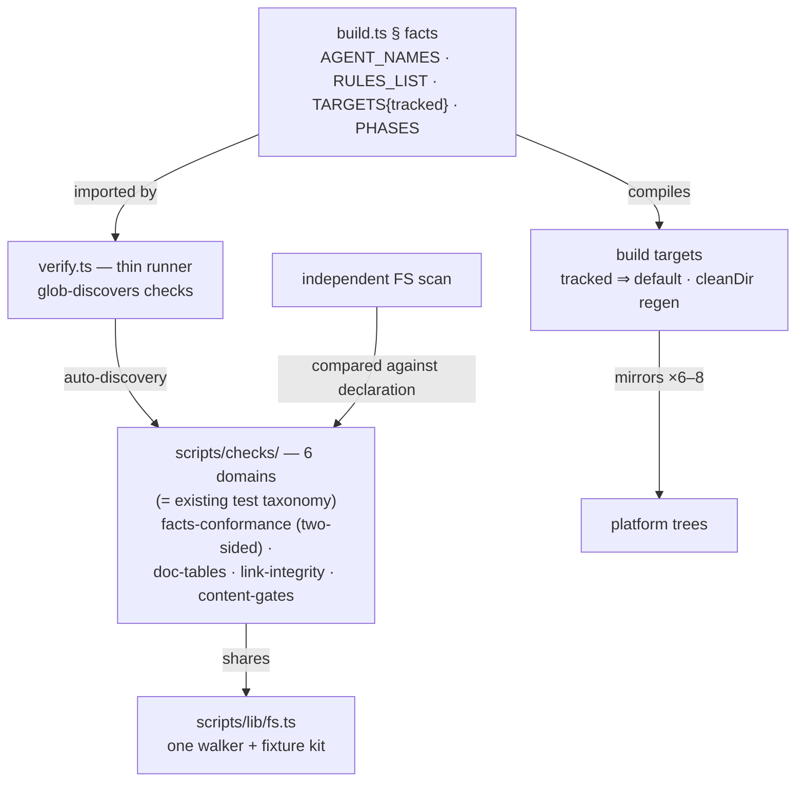

# ADR-007: Drift-Proof Toolchain Re-Seating (Blueprint v2)

Decision approved at x-design gates 1–3 on 2026-07-11 (requirements, approach, components);
flips to Accepted when implemented, per this repo's ADR lifecycle convention.

## Context

The post-campaign retrospective (2026-07-11, `documentation/architecture/retrospective-blackhole.md`)
found the architecture's load-bearing assumptions all hold — but ~80% of measured defect effort
traces to two accidental patterns:

1. **Facts restated at consumption sites.** The agent roster lives on 4 surfaces (2 unguarded —
   drifted commit b643d6f and re-drifted within 24h); tracked counts lived in `ground-truth.md`
   (drifted twice in one day); the 8th agent tripped 7 sites (3 hardcoded `!== 7` literals, a dead
   `'5 agent'` filter, counter, 2 doc rows).
2. **Accretion surfaces without extension seams.** `verify.ts`: 979 LOC, 24 heterogeneous checks,
   the repo's most-fixed file (6 fixes) and top hotspot (33% of recent hand-edits, SOLID score 30).
   Adjacent cluster: three independently hand-rolled tree-walkers all crashed on the first-ever
   `src/references/` subdirectory (#216, #226, #228); default vs full build target sets caused
   3 dirty-tree confusions in one session; dead cross-reference links exist undetected.

A three-critic adversarial panel (structural, coupling/DIP, scalability lenses) stress-tested the
initial redesign and **rejected its fragmenting half** with repo-grounded evidence — those
rejections are binding constraints on this decision (§ Rejected Alternatives).

## Decision

Adopt **blueprint v2 — detection over generation, governance over fragmentation**:

| # | Decision | Mechanism |
|---|---|---|
| R6 | **Shared FS library — lands first** | `scripts/lib/fs.ts`: the only tree-walker + temp-fixture helpers; `build.ts`, `verify` checks, `tree-shape.ts`, and tests migrate to it. Explicit sequencing: before any future `src/references/` subdirectory |
| R5′ | **Tracked ⇒ built-by-default** | Any build output tracked by git is produced by plain `bun run build`. Opt-in flags remain only for genuinely untracked targets. `cleanDir` full-regeneration invariant untouched — **no build cache** |
| R1′ | **Facts declared once, verified two-sidedly** | Roster/phases/rules/targets declared only in `build.ts` § facts (formalizing the existing `AGENT_NAMES` SSOT). Verify performs an **independent filesystem scan** and compares scan vs declaration (two separately-fallible derivations preserved). `ground-truth.md`'s counter role is retired. README/AGENTS.md stay fully hand-authored; **checks** diff their roster tables against the declaration and fail CI naming the exact fix |
| R7 | **Link-integrity check** | Cross-references among `src/**.md` and ADR links verified; makes every index/pointer pattern safe |
| R2′ | **Verify decomposition along the existing test taxonomy** | `verify.ts` → ~50-LOC runner; checks move to `scripts/checks/{domain}.check.ts` where domains = the taxonomy the test suite already uses (core, build, checkpoint, design-track, companion-docs, single-writer). **Glob auto-discovery — no central registry file.** Uniform check contract: exported pure function + thin wrapper |
| R3′ | **Section-budget governance for `orchestrator.md`** | New modal concerns must land as thin pointer sections (the pattern its newest sections already follow); a content-gate check enforces a max section size. No file split |

### Rejected alternatives (critic evidence — binding)

| Alternative | Rejected because (evidence) |
|---|---|
| Generation-in-place (`<!-- roster -->` markers in README/AGENTS; generated `ground-truth.md`) | Introduces a third hybrid provenance pattern (every file today is wholly generated or wholly authored); silently clobbers manual edits to the hand-edited front door; a generated file inside `src/references/` erodes the "location ⇒ editability" boundary |
| Single-source derivation for both sides of the drift check | Collapses V-GROUND-01's two independently-fallible sources onto one derivation path — a counting bug would propagate everywhere with nothing left to disagree |
| Central check-registry file | Touched on every new invariant — recreates the `ground-truth.md` failure shape (high-Ce hub) at a new address |
| `orchestrator.md` split into modal files | Its incident/hunt/CI-wait sections are consulted **every turn** and are already thin pointers (lines 314–399); splitting = ×3–4 context fetches per turn for finite-context agents; the hunt/ precedent's winning condition (exclusive per-spawn consumption) does not hold |
| `worker-schemas.md` per-role split | 22 consumers include every phase file and the orchestrator (validates ALL roles); content interleaves cross-cutting hook/validation sections; split = ~80 mirrored files (×6–8 fan-out). Watch item: revisit at >700 LOC or any role contract >80 LOC |
| mtime build cache | Breaks the `cleanDir` full-regeneration invariant that makes V-BUILD-01's dirty-diff check trustworthy |

## Components

| Component | Responsibility | Fate |
|---|---|---|
| `build.ts` § facts | Single authored declaration of roster/phases/rules/targets | extended |
| `scripts/lib/fs.ts` | Only tree-walker + fixture helpers | new (first) |
| `scripts/checks/*.check.ts` | One domain per file, matching test taxonomy; uniform pure-fn contract | moved from verify.ts |
| `verify.ts` | Discover, run, report (~50 LOC) | shrunk |
| facts-conformance + doc-table + link checks | Two-sided drift detection; CI names the exact fix | new checks |
| `ground-truth.md` | Counter role retired; prose pointer remains | slimmed |
| `orchestrator.md` | Content unchanged; section budget enforced by content-gate | governed |

## Design Principles Validation

| Principle | Verdict | Evidence |
|---|---|---|
| SRP | ✅ | One domain per check file; runner only runs; walker only walks |
| OCP | ✅ | New invariant = new auto-discovered file; fact changes = 1 declaration edit, 0 check edits |
| LSP | ✅ | One build behavior (tracked⇒default); uniform check contract (content → string[] violations) |
| ISP | ⚠️ | `worker-schemas.md` interface breadth deliberately deferred (watch thresholds documented) |
| DIP | ✅ | Checks depend on the declaration + lib abstraction, not scattered concrete layouts; the hand-maintained mirror middleman is removed |
| DRY | ✅ | Facts 1 site; walker 1 implementation; remaining doc copies are *checked* duplication (explicit, guarded exception) |
| KISS | ✅ | No cache, no generation machinery, no registry — plain checks; simplest mechanism that kills the defect class |
| YAGNI | ✅ | Splits rejected where consumption doesn't support them; watch thresholds instead of speculative structure |
| Separation of Concerns | ✅ | declaration / compilation / verification / governance cleanly separated |
| Composition over Inheritance | N/A | No type hierarchies; checks compose via discovery |
| Law of Demeter | ✅ | Checks reach only facts + lib |
| Fail Fast | ✅ | All drift detected at CI boundary with exact-fix messages; fail-closed precedent (V-HARNESS-01) reused |
| Design Patterns | Facade (runner over check modules); Strategy-shaped uniform check contract; Creational N/A — no construction complexity | minimal, not forced |

## Trade-offs

- **Accepted:** checked duplication persists (README/AGENTS tables) — detection beats deletion
  for human-readable surfaces. Concentration persists where consumers are finite-context agents.
- **Cost:** ~1 week toolchain work; 6 test files update import paths; one new hub (`lib/fs.ts`)
  accepted because three independent walkers all failed in one day — a tiny, heavily-tested hub
  is the correct trade.
- **Foregone:** v1's structural impossibility-of-drift (generation) traded for detection —
  because generation's failure modes (clobber, hybrid provenance, one-sided derivation) were
  worse than drift-detected-at-CI.

## Refactoring Impact

| Consumer | Impact | Migration |
|---|---|---|
| `verify.ts::checkGroundTruth` | **BREAKING** (internal) | Rewritten as two-sided facts-conformance check |
| 6 × `verify.*.test.ts` | **BREAKING** (mechanical) | Import paths follow checks into `scripts/checks/`; taxonomy already matches 1:1 |
| `src/SKILL.md` campaign-audit (F-DRIFT-01) | DEPRECATION | Wording updated: audits declaration-conformance instead of ground-truth counts |
| `release.ts` (`--all`), `blackhole-protocol.md` (flag prose) | DEPRECATION | `--all`/`--gemini` become no-op aliases for one release, then removed; docs updated |
| CI workflows (`bun run verify`) | TRANSPARENT | Entry points unchanged |
| `ground-truth.md` outward mentions (22) | TRANSPARENT | They cite other files; only its own counter tables retire |

7 consumers: 2 BREAKING (both internal/mechanical), 3 DEPRECATION, 2 TRANSPARENT — below the
phased-migration threshold; single-campaign delivery is safe.

## Risk Assessment

| Risk | Mitigation |
|---|---|
| `lib/fs.ts` hub bug affects build+verify+tests at once | Lands first, alone, with its own suite incl. nested/symlink/hidden cases; every migration PR keeps green suite |
| Doc-table check too strict (prose flexibility) | Check parses the table row-set only; tolerant of surrounding prose; failure message prints the expected rows |
| Check migration churn masks regressions | Move checks 1 domain per PR along the existing test taxonomy; check count is asserted before/after each move |
| Residual untracked gemini output contradicts tracked⇒default | Implementation step 0 verifies current tracking state of every target (if any output is untracked, the flag survives for exactly that target) |

## Key Assumptions

- ✓ `AGENT_NAMES` is already the single code declaration (audit: occurs exactly once, build.ts:225).
- ✓ The 6-file verify test taxonomy exists and maps to check domains (critic-verified via Glob).
- ✓ `cleanDir` full regeneration is load-bearing for V-BUILD-01 trust (audit F5 + critic 2).
- ~ Doc-table check strictness needs a tolerant row-set parser — alternative (require exact table block) noted; resolved at implementation with the printing-expected-rows failure mode.
- ~ Check-domain boundaries may shift slightly as checks migrate — acceptable; the test taxonomy stays authoritative.
- ◐→✓ Resolved during design: `--gemini` was a policy gate (#13) — its outputs are now git-tracked, so tracked⇒default subsumes the policy; step-0 verification guards the residual case.

## Implementation Order

1. **R6** `scripts/lib/fs.ts` (walker + fixture kit) + migrate the three walker sites — *unblocks everything; ends the P1 class*
2. **R5′** tracked⇒default build policy (+ flag deprecation aliases)
3. **R1′** facts declaration formalization + two-sided facts-conformance + doc-table checks; retire `ground-truth.md` counters
4. **R7** link-integrity check
5. **R2′** verify decomposition, one domain per PR, along the test taxonomy
6. **R3′** orchestrator section-budget content-gate

## References

- `documentation/architecture/retrospective-blackhole.md` — Phases 1–8, critic findings verbatim
- ADR-003 — deterministic scripts over LLM agents (pattern this ADR extends to drift detection)
- ADR-006 — kaizen hunt (hunt/ precedent correctly scoped to exclusive consumption)
- Campaign telemetry 2026-07-10/11 — issues #216/#226/#228 (walkers), #199/#234 (count literals), #219/#224/#245 (counter drift), PR #225 (formula drift)
