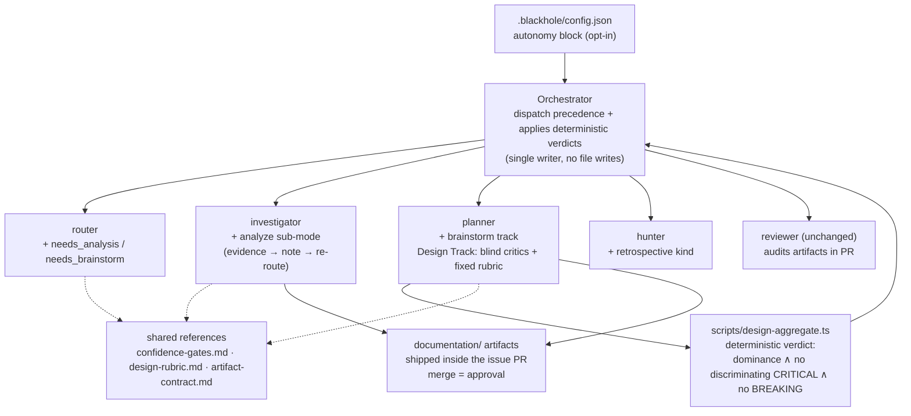

# ADR-010 — Autonomous Thinking Routes: full mercure workflow parity with confidence-gated escalation

## Status

Proposed — 2026-07-15

## Context

The gap analysis (`documentation/audits/autonomous-workflow-parity.md`) established from four
evidence sources (skill source, mercure v9.6 skills, two campaigns' state, ~14 session
transcripts) that blackhole is **at parity with mercure on every "doing" workflow**
(fix, refactor, docs, hunt, implement, review, commit — 26/30 and 55/55 campaign merge rates)
while **every gap is on the "thinking" side**:

- No per-issue analyze phase exists (G1); the Cashflow v3 epic passed every gate and was
  rejected by the user at the product level — the missing phase is upstream of plan.
- The Design Track always hard-blocks on a human with no confidence tier (G2), even though
  the invest consumer repo once produced a full 228-line decision record autonomously
  (issue #1036) — capability exists, policy forbids it.
- Design/diagnosis artifacts die in gitignored `.blackhole/plans/` and never become
  `documentation/` ADRs/audits (G3), despite the reviewer auditing V-ADA-02 against an ADR
  index blackhole never feeds.
- Escalation is categorical (clarify-gates checklist), not confidence-based (G4); the user
  requirement is "human-in-the-loop only when the model is not confident enough to proceed."
- No brainstorm route (G11) and no cross-issue retrospective (G5).

The user's directive: port mercure's workflow catalog into blackhole (no runtime dependency),
so blackhole processes whole backlogs with mercure-quality workflows, autonomously.

## Decision

**Approach A-hardened: additive route extension.** Extend the existing five-phase lifecycle
(ADR-001) and route contract (ADR-004) in place — no new agents, no new phase enum — with
four thinking routes, one deterministic design-autonomy rule, one confidence kernel, and one
durable-artifact contract. All behavior is gated by a new opt-in `autonomy` config block
(kill-switch pattern identical to `kaizen`): absent block = today's behavior, exactly.

### D1 — Route flags: `needs_analysis`, `needs_brainstorm`

Additive `route{}` fields (ADR-004 extension protocol: confidence keys `analysis`,
`brainstorm`; entries in `router_confidence_thresholds`; cautious defaults on low confidence —
`needs_analysis → true` for `size:l`+ or `needs_design: true` issues, `needs_brainstorm →
true` when the body lacks testable AC *and* lacks a concrete mechanism). Absent flags = no
change for existing queues.

### D2 — Analyze route: investigator third sub-mode `analyze`

**Accretion-Guard split evaluation (owed per planner.md § Accretion Guard, performed here):**
`analyze` gathers evidence about the issue's blast radius — conventions catalog at
integration touchpoints, architecture-coherence check, performance baselines where
measurable. That is the same identity as `research`/`investigate`: read-only
evidence-gathering, note-file artifact (`plans/issue-N-analysis.md` → promoted per D5),
note-landing triggers a router re-route checkpoint (`analysis-landed`), never mutates queue
or ledger. Same caller (Handle spawn on route flag), same schema family
(`worker-schemas.md`), same binding rules. A new agent identity was evaluated and rejected —
see Alternatives (Approach B) and ADR-003's precedent. **Verdict: sub-mode, not new agent.**
The plan consumes the analysis note the way mercure x-plan consumes x-analyze's Convention
Catalog and Performance Baselines sections.

### D3 — Brainstorm route: planner `track: brainstorm`

**Split evaluation:** brainstorm is *generative* (expand a vague idea into requirements +
2-3 options with a provisional recommendation) — planner-shaped, not evidence-gathering, so
it lives as a planner track, not an investigator sub-mode. Reuses Design Track subsections
1-2 machinery at reduced depth. **Terminal semantics (from Approach C's steelman): a
brainstorm issue never produces a mergeable PR.** The track returns the brainstorm artifact
plus proposed child issues; the orchestrator files children through the existing discovery
path (Pareto ≥ 30 gate, dedup) and the brainstorm issue closes as satisfied-by-children.
The final product choice escalates via D6 when confidence stays below threshold.

### D4 — Autonomous design tier: blind critics + deterministic `design-aggregate.ts`

The Design Track's §4.8 unconditional `status: blocked` is replaced (only when
`autonomy.enabled`) by a three-part hardened rule answering the "self-graded homework"
CRITICAL finding:

1. **Fixed rubric**: trade-off matrix columns *and weights* per decision type live in a
   reference file (`design-rubric.md`) — the planner never chooses its own scoring axes.
2. **Blind critics**: the 2 critique-only planner sub-invocations (existing multiplicity
   mechanism, cap unchanged) receive the Options WITHOUT the primary's provisional Chosen —
   each independently returns structured JSON: per-option scores against the fixed rubric +
   findings tagged discriminating/domain-inherent with severity.
3. **Deterministic verdict**: a new `scripts/design-aggregate.ts` (pattern proven by
   `review-aggregate.ts`, ADR-003) computes the verdict from primary + critic JSON:
   - weighted dominance of one option > `autonomy.design_dominance_delta` (default 30%)
     across ALL three scorers' matrices, AND
   - no discriminating CRITICAL finding on the winner, AND
   - Refactoring Impact contains no BREAKING consumer
   → `status: ready`, ADR promoted per D5. Any condition fails → `status: blocked`
   (today's behavior). The planner cannot self-certify; the orchestrator applies the
   script's verdict.

### D5 — Durable artifact contract: ship artifacts inside the issue's PR

Per-route durable artifacts in the consumer repo (gated by
`docs_governance.write_governance`, honoring search-before-write and repo-convention
precedence):

| Route | Artifact |
|-------|----------|
| analyze | `documentation/audits/analysis-issue-N.md` |
| brainstorm | `documentation/brainstorms/{concern-slug}.md` |
| design (auto-approved or human-approved) | `documentation/decisions/ADR-{NNN}-{slug}.md` + INDEX.md row |
| investigate | `documentation/investigations/{concern-slug}.md` |

**Delivery mechanism — the finding-B answer to "who writes, who approves":** the
write-capable worker (investigator/planner for notes at thinking time; the implementer
carries them into the PR branch) commits the artifact **in the issue's PR**. The reviewer
audits it like code (V-DOC-GOV-01..04, V-ADA-02). **Merge = approval**: no draft→final flip
machinery, no orchestrator file writes, no post-merge mutation. The gitignored
`.blackhole/plans/` copy remains the working state; the `documentation/` copy is the durable
record.

### D6 — Confidence kernel: `confidence-gates.md` supersedes the categorical mechanism

Port mercure's interview confidence model as the single escalation contract consumed by
router, planner, and orchestrator gates: 5 weighted dimensions (Problem, Context, Technical,
Scope, Risk) with per-route weight profiles and a composite threshold
(`autonomy.confidence_threshold`, default 80).

**Async two-band mapping (answers the middle-band NOTABLE finding):**
- composite ≥ threshold → proceed; the reformulated understanding is posted as an **issue
  comment** (audit trail + asynchronous veto surface — the user can intervene via chat,
  `merge_hold`, or closing the PR; the orchestrator does not wait).
- composite < threshold → at most 2 `[NEEDS CLARIFICATION]` markers if the ambiguity is
  deferrable (issue proceeds to plan, blocks before implement — existing planner marker
  convention); otherwise `status: blocked` + AskQuestion (today's behavior).

clarify-gates.md's categorical triggers are NOT deleted — they become dimension inputs
(e.g., "missing AC" caps the Problem dimension; "multiple valid approaches" caps Technical).
**Never-bypassable regardless of confidence**: destructive/irreversible operations,
credentials/KYC/account actions, epic go/no-go, and anything matching the existing
security-adjacent cautious defaults. These always block.

### D7 — Retrospective: hunter kind `retrospective`

New kaizen kind whose territory is the campaign itself: findings-ledger rows + merged-PR
history, cross-correlated into systemic redesign candidates (recurring V-codes, repeated
touch-path hotspots, review-iteration outliers). Files through the existing V-HUNT gates
(CONFIRMED verification, Pareto floor, per-wave caps, dedup). Candidates that need
architecture work arrive as issues with `needs_design: true` — closing the loop into D4.

### D8 — Config: `autonomy` block

```json
"autonomy": {
  "enabled": false,
  "confidence_threshold": 80,
  "design_dominance_delta": 30,
  "design_autonomy": true,
  "analyze_routing": true,
  "brainstorm_routing": true,
  "never_bypass": ["destructive", "credentials", "epic-go-no-go"]
}
```

Default `enabled: false` — identical contract to `kaizen`: absent block or `false` preserves
current behavior exactly, including the Design Track's unconditional block. Sub-flags allow
enabling routes independently. Model pinning per `worker_model_policy` tier matrix — every
new spawn declares an explicit model (issue #209 rule).

## Architecture



## Alternatives Considered

### Approach B — Dedicated `architect` agent + confidence kernel (rejected)

New 4-mode read-only agent mirroring mercure's x-architect/x-designer separation.
**Rejected with critic evidence**: (CRITICAL) spec'd read-only yet owns durable artifacts in
3 of 4 modes — no write path, the same contradiction planner.md:79-81 documents for the
orchestrator; (HIGH) a new agent identity routes around the Accretion Guard and repeats the
ADR-002 → ADR-003 synthesizer add-then-revert ("extra subagent latency and cost with no
demonstrated marginal benefit"); (MEDIUM) 4 modes with 4 different callers and inconsistent
V-code binding needs in one prompt. ADR-003's revisit condition (parallel multi-reviewer
swarms) still does not hold.

### Approach C — Full workflow-chain port: named per-issue workflows (rejected)

Router assigns `apex|oneshot|debug|brainstorm`; variable phase chains replace the frozen
five-phase enum. **Rejected with critic evidence**: (CRITICAL) one coarse workflow
classification destroys per-flag confidence — a security bugfix misrouted to `oneshot` has
no independent `security_review_required` left to catch it, the incident class ADR-004
exists to prevent; (CRITICAL) the frozen phase enum has five live consumers (verify
V-PLAN-01, `mergeEligible()`, wave scheduling, recovery, checkpoint) plus two campaigns of
live queue state, with no migration path; (NOTABLE) re-architects the implement side the
audit marks at parity. **Steelman absorbed**: brainstorm must terminate in child issues,
not a PR (→ D3); route-flag accretion is a real long-term risk (→ Accretion Guard
re-affirmed below).

## Design Principles Validation

| Principle | Verdict | Note |
|-----------|---------|------|
| SRP | ✓ | Deciding (orchestrator + scripts) vs evidence (investigator/hunter) vs generation (planner) preserved; verdict extraction to script *removes* a planner responsibility |
| OCP | ✓ | Additive flags, tracks, kinds, config blocks — no consumer rewrites when off |
| LSP | N/A | No inheritance hierarchies in agent markdown |
| ISP | ~ | Planner reaches 5 tracks — at the guard boundary; Accretion Guard re-affirmed: any 6th track/4th sub-mode re-triggers split evaluation, now **fleet-wide** (covers hunter kinds and any future agent's mode count — closes critic B's per-agent-guard gap) |
| DIP | ✓ | Agents depend on shared references (confidence-gates, design-rubric, artifact-contract), not on each other |
| DRY | ✓ | One confidence kernel replaces scattered categorical gates; rubric defined once |
| KISS | ✓ | No new agents, no new state files, no wait/flip machinery (merge = approval); the one new script is justified by a CRITICAL finding |
| YAGNI | ✓ | Every component maps to an evidenced audit gap; no speculative modes |
| Separation of Concerns | ✓ | Working state (`.blackhole/`) vs durable record (`documentation/`) explicitly split |
| Law of Demeter | ✓ | Workers return JSON/notes; orchestrator mediates all state |
| Fail Fast | ✓ | Confidence gate at handle/plan boundaries; kill-switches at block and sub-flag level; never-bypass list checked before any confidence math |
| Design Patterns | ✓ | Strategy (planner tracks — existing), Pipeline (dispatch precedence — existing); Creational N/A; no forced patterns |

## Refactoring Impact

| Consumer | Classification | Note |
|----------|---------------|------|
| `queue-dag.md` route schema | TRANSPARENT | Additive fields; absent = current behavior |
| `router.md` | TRANSPARENT | New flags additive; existing flags untouched |
| `orchestrator.md` dispatch | TRANSPARENT | New precedence rows only fire on new flags |
| `planner.md` Design Track §4.8 | **DEPRECATION** (config-gated) | Return contract changes ONLY when `autonomy.enabled ∧ design_autonomy`; off = verbatim current behavior. Consumers `phase-plan.md` approval table + orchestrator dispatch gain one branch |
| `clarify-gates.md` | **DEPRECATION** | Superseded as mechanism by `confidence-gates.md`; triggers preserved as dimension inputs; file kept with `supersedes` pointer (V-DOC-GOV-04) |
| `phase-handle.md` | TRANSPARENT | Investigator spawn condition gains `needs_analysis` |
| `phase-loop.md` | TRANSPARENT | Retrospective wave joins existing kaizen dispatch |
| `hunter.md` | TRANSPARENT | New kind follows existing kind contract |
| `config-template.md` | TRANSPARENT | New optional block |
| `blackhole-vcodes.md` | TRANSPARENT | Additive: V-AUTO-01 (BLOCK — autonomous design proceed without a design-aggregate verdict artifact), V-AUTO-02 (WARN — thinking-route artifact missing from PR when route fired) |

No BREAKING consumer. Migration: none required — live queues keep current behavior until a
repo opts in.

## Key Assumptions

| Assumption | Marker | Note |
|------------|--------|------|
| Deterministic aggregation prevents self-grading | ✓ Validated | `review-aggregate.ts` has done exactly this in production since ADR-003 |
| Opt-in config blocks preserve behavior | ✓ Validated | `kaizen`, `docs_governance`, `incident_mode` precedents |
| 30% dominance delta is the right autonomy bar | ~ Contestable | Borrowed from mercure's adversarial-evaluation skip rule; configurable, tune from campaign data |
| Blind planner-multiplicity critics are independent enough | ~ Contestable | Same agent identity; if campaign data shows rubber-stamping, escalate critics to a distinct model tier before reaching for a new agent |
| Proceed-immediately with issue-comment audit trail is safe for the middle band | ✓ Resolved | Veto surfaces already exist (chat, `merge_hold`, PR close); never-bypass list covers the irreversible class; was ◐, resolved by D5/D6 design |
| Per-issue analysis artifacts won't pollute `documentation/audits/` | ~ Contestable | Mitigated: analyze route fires only for `size:l`+ or design-flagged issues by default |

## Risks

| Risk | Mitigation |
|------|------------|
| Autonomous design picks a defensible-but-wrong approach | Deterministic rule requires triple-scorer dominance + zero discriminating CRITICALs + zero BREAKING; ADR ships in the PR for review; `merge_hold`/leave-open modes give human veto points |
| Confidence model port drifts from mercure semantics | Port weights/thresholds verbatim into `confidence-gates.md` with source attribution; V-AUTO-01 blocks proceed-without-verdict |
| Route-flag accretion (Approach C's steelman) | Accretion Guard extended fleet-wide: every new flag/track/sub-mode/kind re-triggers split evaluation |
| Reviewer load grows (artifacts audited in PR) | Artifacts are markdown; V-DOC-GOV checks are cheap; docs-only diffs already have a lighter execution mode |

## Rollout

Phased delivery (each phase independently shippable, config-gated):

1. **P1 — Kernel + contract**: `confidence-gates.md`, `artifact-contract.md`, `autonomy`
   config block, V-AUTO codes (no behavior change while `enabled: false`).
2. **P2 — Design autonomy**: `design-rubric.md`, blind-critic change, `design-aggregate.ts`,
   §4.8 gated rewrite, ADR promotion into PR.
3. **P3 — Analyze route**: investigator `analyze` sub-mode + `needs_analysis` + re-route
   checkpoint + plan consumption.
4. **P4 — Brainstorm route**: planner `brainstorm` track + `needs_brainstorm` +
   child-issue terminal semantics.
5. **P5 — Retrospective**: hunter kind + loop-phase dispatch.
