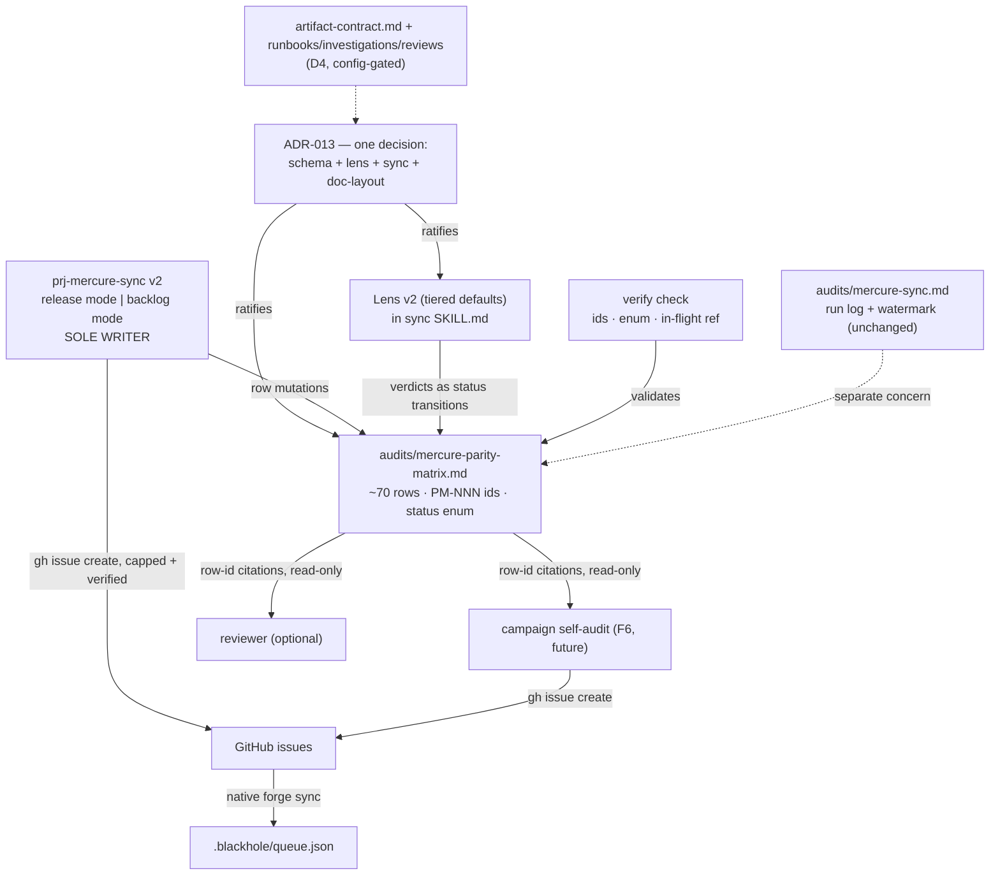

# ADR-013 — Mercure Parity Program: matrix contract, Adoption Lens v2, sync v2

## Status

Proposed

Single decision record ratifying four coupled clusters atomically (adversarial evaluation
showed a two-ADR split creates an acceptance-order hazard — see Trade-offs). Consumes, never
duplicates, in-flight ADR-011/ADR-012 scope.

## Overview

Blackhole's goal is **mercure-level output quality, autonomously** — same code quality, same
durable companion-doc memory, HITL only on genuine ambiguity — while staying fully standalone
(vendored knowledge, zero runtime mercure dependency). The evidence base
(`documentation/audits/mercure-parity-surface.md`) quantifies mercure's enforcement surface at
96 V-codes / 28 families, 21 audit checklists, ~18 implement-time gates, 13 plan sections,
a 3-wave review pipeline, a 13-folder artifact taxonomy, and an 11-agent fleet. Blackhole
covers or adapts the majority; ADR-011/012 close the implement-accretion and artifact-substrate
grounds. What is missing is the **program layer**: a living, verifiable parity instrument; a
sync process whose throughput matches the surface (~65 mercure domains never swept in 3 runs);
a lens whose default posture matches the parity goal; and a measurable end-state.

## Context — why now

1. Parity evidence is scattered across three one-shot audits, one partially retracted
   (`autonomous-workflow-parity.md` §2b, corrected by ADR-011 D3). Nothing continuously answers
   "which mercure enforcement points does blackhole cover, at what fidelity?"
2. `prj-mercure-sync`'s Adoption Lens is REJECT-biased while the observed bottleneck is **sweep
   throughput**, not over-adoption: every swept domain produced shipped adoptions
   (companion files 10/10, Iron Law, V-UX); 4 domains swept vs ~65 unswept.
3. Ten confirmed gaps have no covering ADR (headline: no V-THREAT/V-PERF machinery at all —
   GAP-1 HIGH; spec-drift-at-merge GAP-2; delivery-boundary GAP-3; ledger durability GAP-4).
4. Parity is asserted, not measured — no artifact lets a campaign self-audit or a reviewer
   verify coverage claims.

## Decision

Four decision clusters, ratified together. All new machinery is config-gated
(`mercure_sync` block; absent block = current behavior), agent-agnostic, and async-HITL-only.

### D1 — Parity matrix contract

A canonical living doc **`documentation/audits/mercure-parity-matrix.md`** — maintainer-facing
(this repo only, never shipped to consumer repos) — holding one row per mercure **enforcement
mechanism** (~70 rows: 21 checklists, ~18 implement gates, 13 plan sections, 13 artifact
types, 5 behavioral protocols, fleet capabilities). Deliberately **not** per-V-code (96 rows,
drift burden; codes are only meaningful as checklist units) and not per-domain (unverifiable).

Row schema (binding):

| Field | Content |
|---|---|
| `id` | Stable row id `PM-NNN` — consumers cite rows by id, never by table position |
| `kind` | `checklist \| gate \| plan-section \| artifact \| protocol \| fleet` |
| `mechanism` | Mercure mechanism name + `file:line` citation (plugin cache version-pinned) |
| `blackhole` | Equivalent + `src/` citation, or `—` |
| `status` | `covered \| adapted \| in-flight(ref) \| gap \| N/A(reason)` |
| `priority` | `V-PARETO-02` score (Gain × (11 − Effort)) — for `gap` rows only |
| `verified` | Last-verified date + mercure version |

Status lifecycle: `gap → in-flight(issue/ADR ref) → adapted|covered`; `N/A(reason)` is
terminal but re-openable by a lens change; **regression transitions (`covered → gap`) are
legal and mandatory** when a re-check finds a previously covered mechanism broken (answers
the invisible-regression critique of matrix-less alternatives). `in-flight` rows MUST carry a
ref; a bare `in-flight` fails validation.

**Single-writer rule** (mirrors the orchestrator single-writer invariant, issue #224):
`prj-mercure-sync` is the sole writer of the matrix. Consumers — the future campaign
self-audit (F6), the reviewer, humans — file issues citing row ids or propose PRs; sync
applies row mutations. Lens verdicts MUST land as row-status transitions, never prose-only
(prevents "asserted, not measured" recurring inside the fix).

**Validation**: an additive verify check enforces row-id uniqueness, status-enum validity,
`in-flight`-requires-ref, and `gap`-requires-priority. This is the staleness mitigation that
absorbs the strongest argument for matrix-less alternatives.

The matrix is a **separate artifact from `mercure-sync.md`**, which keeps its narrative
run-log + release-watermark role unchanged — a status table needing random-access row edits
and an append-only run narrative are different concerns (1 file per concern,
`doc-governance.md`). The run log's existing coverage table is deprecated in favor of matrix
rows on first sync-v2 run (supersede noted in the run log, not deleted).

### D2 — Adoption Lens v2 (tiered, parity-first)

Replaces the REJECT-biased lens in `prj-mercure-sync`'s SKILL.md. Classification by mechanism
kind, with per-kind default posture and burden of proof:

| Tier | Default | Burden of proof |
|---|---|---|
| Enforcement/quality mechanisms (V-codes, checklists, gates, verification protocols) | **ADOPT** | Rejecting requires showing it structurally cannot work autonomously |
| Workflow/interaction mechanisms (approval gates, chaining, interview) | **ADAPT** — translate to async seams (`status: blocked`, confidence gates, deterministic verdicts) | Adopting verbatim requires showing no sync-HITL dependency |
| Domain/runtime-ops mechanisms (SRE, incident response, deployment) | **N/A** | Adopting requires showing backlog-orchestration relevance |

Only two **hard rejections** survive from the old lens: (1) synchronous mid-loop HITL as a
primitive — blackhole's answer remains async `AskQuestion` + `status: blocked`; (2)
non-agent-agnostic campaign-runtime mechanisms — state stays harness-portable under
`.blackhole/` + `documentation/`. The old lens's "almost never a new skill" and "domain"
filters become the tier-2/tier-3 defaults (rebuttable), not rejections. `V-PARETO-02` remains
the **only** prioritizer and filing gate — Pareto orders work; it never overrides a tier
classification.

Existing extension-seam discipline is retained: an adoption lands as a mode, route flag,
V-code row, hunt kind, reference file, or verify check whenever one fits (`V-INT-02`); a new
agent or campaign subsystem requires the matrix to show no existing seam can host the
mechanism (F8 gating from the brainstorm).

### D3 — prj-mercure-sync v2: dual-mode, matrix-driven

The skill keeps its identity (maintainer-only project skill, `disable-model-invocation`,
never campaign runtime) and gains two entry modes replacing changelog-skimming:

- **Release mode** (trigger: new mercure release above the watermark): read release notes +
  plugin cache delta; map each change to touched matrix rows; re-verify only those rows
  (impact analysis: "what changed → which rows → what/how blackhole adapts"); where mapping
  is ambiguous or the change is cross-cutting (rules/), widen to the affected `kind` tier.
  Update rows, file gated adoption issues, bump watermark, append run-log entry.
- **Backlog mode** (trigger: maintainer invocation, no new release needed): take the top-N
  `gap`/unswept rows by `priority`, deep-compare against the pinned plugin cache, classify
  via Lens v2, update rows, file gated issues.

Unchanged disciplines: `V-HUNT-01` verify-before-file; per-run filing cap and
`min_priority` floor from the `mercure_sync` config block (`V-HUNT-02` analog); dedup against
open issues + matrix `in-flight` refs; never writes `queue.json`/`findings-ledger.json`
(issues surface via native forge sync). The skill remains maintainer-invoked; no automatic
scheduling (accepted limitation — see Risks).

### D4 — Consumer-repo doc-layout extension (thin)

Extends `artifact-contract.md` (ADR-010 D5), gated by `docs_governance.write_governance`:
campaigns MAY emit the remaining mercure durable-doc taxonomy on consumer repos where a route
produces one — `documentation/runbooks/` (operational/incident-shaped issues),
`documentation/investigations/` (research/investigation routes, where the artifact contract
currently targets audits/), `documentation/reviews/` (review artifacts on `size:l+` or
`security_review_required` issues). Repo-convention precedence (ADR-012 E1) and frontmatter
governance apply unchanged. Decisions/reference placement is already settled by ADR-012
E1/E4 — this ADR adds no new schema there.

## Architecture

## Design Principles Validation

| Principle | Verdict | Note |
|---|---|---|
| SRP | PASS | Matrix = data; sync = process; lens = policy; run log = narrative — each split enforced by D1 |
| OCP | PASS | New rows/kinds/tiers additive; status enum extension is an ADR amendment (documented path) |
| LSP | N/A | No subtype hierarchies |
| ISP | PASS | Consumers depend only on the row schema, never on sync internals |
| DIP | PASS | Consumers cite row-ids (abstraction), not writer implementation |
| DRY | PASS | One Pareto formula, one status store; run-log coverage table deprecated on first v2 run — no dual bookkeeping |
| KISS | PASS | Plain markdown table + one verify check; no generators, no sidecar DB |
| YAGNI | PASS | F6 self-audit and F8 new agents NOT built here — only the row contract they will consume; D4 limited to routes that already produce artifacts |
| SoC | PASS | Maintainer tooling (sync/matrix) fully separated from campaign runtime |
| Law of Demeter | PASS | Row-id citation; no consumer parses sync's run log |
| Fail Fast | PASS | Verify check catches schema drift at commit time, not at consumption time |
| Design Patterns | PASS | Registry (matrix) + established single-writer pattern; Creational/Behavioral N/A — no forcing |
| Progressive Disclosure | N/A | No UI surface |

## Trade-offs — approaches evaluated

| Approach | Weighted score | Outcome |
|---|---|---|
| **S — one ADR, standalone matrix contract (chosen)** | ~4.5 | Synthesis of A+B built from adversarial findings |
| A — two ADRs (matrix contract + lens/sync) | 4.4 | Rejected: acceptance-order hazard — matrix could be seeded under the old lens then invalidated (CRITICAL); split ownership of one conceptual contract across two ADRs with no inter-ADR supersede protocol; writer governance ratified before throughput model exists |
| B — one ADR, matrix inside mercure-sync.md | 3.4 | Rejected: no citable contract for self-audit/reviewer → duplicate `V-HUNT-02` filings (CRITICAL); run-log narrative + random-access status table conflated in one file → unreviewable per-run diffs; prose verdicts without forced status transitions reproduce "asserted, not measured" |
| C — no standing matrix, per-run generated reports | 2.8 | Rejected: no persisted status → cross-run duplicate filings; full-surface re-diff on every release (the cost of the entire evidence-base inventory, paid per release); regressions invisible (no baseline). Its genuine steelman — a fresh report can never be stale — is absorbed via the verify check + regression-legal status lifecycle |

Adversarial evaluation: three parallel critics (one per approach) ran per the
within-30%-score protocol; every CRITICAL finding against A attacked the two-ADR packaging
and every CRITICAL against B attacked the missing contract — the chosen S is the composite
that survives both sets. Domain-inherent (all approaches, disclosed): a standing knowledge
structure requires upkeep and a named owner.

## Refactoring Impact

| Consumer | Impact | Migration |
|---|---|---|
| `.claude/skills/prj-mercure-sync/SKILL.md` | **BREAKING** (self-contained maintainer skill) | Rewritten: Lens v2 + dual-mode workflow; old lens section removed |
| `documentation/audits/mercure-sync.md` | **DEPRECATION** (of its coverage-table role only) | Coverage rows folded into matrix seed on first v2 run; run-log + watermark role unchanged |
| `src/references/artifact-contract.md` | TRANSPARENT (additive D4 rows, config-gated) | None |
| verify machinery (`scripts/`) | TRANSPARENT (one additive check) | None |
| `src/agents/reviewer.md` | TRANSPARENT (optional row-citation convention) | None |
| Prior audit docs citing the old lens | TRANSPARENT | Historical documents; no edits |

Scope: 2 real migrations, both maintainer-side. No campaign-runtime interface changes; no
phased strategy needed.

## Key Assumptions

| Assumption | Marker | Note |
|---|---|---|
| Sweep throughput, not lens bias, is the parity bottleneck | ✓ Validated | Sync history: every swept domain shipped adoptions; 4 swept vs ~65 unswept |
| Single-writer + issue-filing consumers prevents lost updates | ✓ Validated | Established orchestrator pattern (issue #224) |
| Mechanism-cluster granularity (~70 rows) is the right unit | ~ Contestable | Per-V-code (96) maximizes traceability at higher drift cost; revisit if rows prove too coarse to verify — schema change is an ADR amendment |
| Matrix home `documentation/audits/` (beside the run log) | ~ Contestable | `reference/` arguable for a living lookup; audits/ chosen for cohesion with the sync artifact family |
| Release deltas map to bounded row sets | ⚡ Oversimplified | Cross-cutting mercure rule changes can touch many rows — release mode therefore widens to the affected tier on ambiguity, accepting occasional broad re-checks |
| Maintainer will invoke sync at useful cadence | ◐ → resolved as documented limitation | Skill stays maintainer-invoked by design (campaign runtime must not depend on maintainer tooling); risk logged below |

## Risks

| Risk | Severity | Mitigation |
|---|---|---|
| Matrix staleness between runs | MEDIUM | Verify check (structural), `verified` field per row, regression-legal lifecycle; release mode re-verifies touched rows |
| Seed sweep mis-classifies under time pressure (~70 rows) | MEDIUM | Seed from the already-verified `mercure-parity-surface.md`; `V-HUNT-01` re-verification before any `gap` row files an issue |
| Sync never invoked → parity decays silently | LOW-MEDIUM | Accepted limitation (maintainer-owned cadence); watermark drift is visible in the run log; revisit scheduling only if observed |
| Lens v2 over-adopts, bloating blackhole | LOW | Tier burdens of proof + retained extension-seam discipline + Pareto floor; Accretion Guard (planner) unaffected |
| Collision with in-flight ADR-011/012 milestones | LOW | Their ground enters the matrix as `in-flight(ref)` rows; this ADR builds none of it |

## Migration Plan

1. Accept this ADR → INDEX row (this PR).
2. Rewrite `prj-mercure-sync/SKILL.md` (Lens v2 + dual-mode) and add the verify check —
   one PR, since lens posture must be live before any row is seeded (the acceptance-order
   hazard, now internal sequencing).
3. Seed the matrix from `mercure-parity-surface.md` (~70 rows; ADR-011/012 ground as
   `in-flight`); deprecate the run-log coverage table in the same PR.
4. File gated issues for verified HIGH-priority `gap` rows (GAP-1 first).
5. Subsequent work (self-audit F6 hunt kind, GAP-2/3/4 closures, backlog sweeps) proceeds as
   scored issues / initiative milestones — outside this ADR.

## References

- Evidence base: `documentation/audits/mercure-parity-surface.md`
- Requirements: `documentation/brainstorms/mercure-parity-program.md`
- ADR-006 (Pareto scoring + verify-before-file, reused unchanged)
- ADR-011 / ADR-012 (in-flight parity ground, consumed as `in-flight` rows)
- ADR-012 E1/E4 (decisions/reference layout — untouched by D4)
