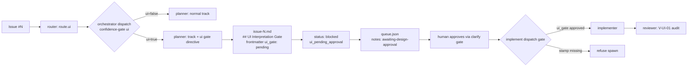

# ADR-017: Plan-Time UI Gate for UI-Flagged Issues

Adopted for issue #418 ("protocol: mandatory design gate for ui-flagged issues").

> **Owner approval recorded** (ADR-012 E2.3, `resume_context: design_approved`): the script
> verdict below (`status: blocked`, reasons `malformed-input` + `breaking-consumer`) is the
> honest automated result — the two blind-critic sub-invocations could not run in this
> environment, and the Refactoring Impact Analysis's BREAKING rows are inherent to every option
> (all three keep `route.ui`). The owner reviewed this note out-of-band and approved **Option B**
> directly, superseding the automated `blocked` verdict per the orchestrator's explicit
> `resume_context: design_approved` directive. The executable implementation plan was
> `.blackhole/plans/issue-418.md`. The `## Gate` section below is left unedited — it is the
> historical script output, not retroactively rewritten. See `## Status` at the end of this file
> for the durable acceptance record.

## Requirements Framing

Derived from the issue body plus route context (`route.task_type: feature`,
`route.docs_impact: true`, `route.security_review_required: false`). No `needs_clarification`
resolution preceded this dispatch, so framing is issue-body-driven.

**Problem statement (as filed).** UI-affecting issues traverse handle → plan → implement
identically to backend fixes. `awaiting-design-approval` exists in the protocol vocabulary
(`scripts/lib/build/facts.ts:47`, `src/references/queue-dag.md:39`) but nothing routes UI work
into it. Consequence: a worker's *interpretation* of a compressed owner sketch becomes merged
UI without the owner seeing a rendering of that interpretation.

**Evidence cited in the issue (owner-verbatim).** Owner wrote *"'configuration' should be
splitted to 3 columns about source, target mode…"*; the orchestrator read "columns" as "live
edit controls in columns" and shipped a 4-button ToggleGroup inside every table `<td>`
(PR #2001/#2004). Owner's reaction: *"you had added a button toggle on 'target mode' in asset
table, WTFF"*. Cost: two merged PRs plus a spec rewrite, versus one rejected mockup.

**Requirements extracted.**

| # | Requirement | Source | Verifiable as |
|---|-------------|--------|---------------|
| R1 | Router flags UI-affecting issues | Proposal bullet 1 + acceptance sketch line 1 | `route{}` schema gains a `ui` flag; validator + fixtures updated |
| R2 | Plan phase for a `ui`-flagged issue above trivial size MUST produce a mockup (ASCII or HTML) | Proposal bullet 2(a) | A named section exists in the plan artifact; `verify` check asserts the section heading |
| R3 | Plan MUST produce an "Owner said / I interpreted / open ambiguities" block quoting the owner verbatim | Proposal bullet 2(b) | Same section, three required sub-labels |
| R4 | Issue parks in `awaiting-design-approval` until the owner approves via the clarify gate | Proposal bullet 2(c) | Planner returns `status: blocked`; orchestrator sets the existing `notes` token |
| R5 | Implement never spawns for a `ui: true` issue that skipped the gate, checked orchestrator-side (workers are headless) | Proposal bullet 3 + acceptance sketch line 2 | Orchestrator dispatch condition; reviewer-auditable V-code |

**Explicit non-requirements** (scope fence, `V-YAGNI-01`): no mockup *rendering* tooling, no
image generation, no screenshot diffing, no DESIGN.md token enforcement (that is V-ADA-03/04,
already owned by `reviewer.md:133`).

**Framing constraint the issue itself imposes on this note.** #418's whole thesis is that a
worker silently reinterpreting a compressed owner sketch is the defect. The acceptance sketch
names a specific mechanism (`route{}` gains a `ui` flag). Substituting a different mechanism
without the owner's sign-off would reproduce the exact failure mode being fixed. All three
options below therefore keep `route.ui` and vary only **where the gate lives**.

---

## Options + Trade-off Matrix

Decision type: `architecture-choice` (new structural boundary in dispatch/gate machinery).
Fixed columns and weights per `design-rubric.md` § `architecture-choice`: Risk 30,
Maintainability 25, Complexity 20, Reversibility 15, Consistency-with-existing-pattern 10.

### Option A — Force the existing Design Track

`route.ui: true` (above trivial size) makes orchestrator dispatch resolve `needs_design := true`
regardless of the computed value. `planner` Design Track gains two mandatory subsections
(`## Mockup`, `## Owner Interpretation`) when the spawn carries `ui: true`. §4.8's autonomy
branch gains a carve-out: a `ui`-flagged issue never takes the `design-aggregate.ts` `ready`
path, so the human gate is unconditional.

- **Reuse**: maximal — existing design artifact, existing `awaiting-design-approval` mapping
  (`phase-plan.md:21`), existing Design-Approval Resume Dispatch (`orchestrator-dispatch.md:105`).
- **Structural mismatch (load-bearing)**: `design-aggregate.ts:129` rejects a matrix with fewer
  than 2 options (`trade-off matrix has fewer than 2 options`). "What should this table look
  like" has one artifact, not competing architectures. The planner would have to fabricate
  alternatives purely to satisfy the aggregate — or the carve-out must bypass the aggregate
  entirely, at which point the Design Track machinery is being paid for and not used.
- **Cost**: forces two blind-critic sub-invocations plus ADR promotion onto a button-layout
  question (`V-PARETO-01`, `V-KISS-01`).

### Option B — Plan-time UI gate inside the existing Quick/Standard tracks

`route.ui: true` (route-first; content-fallback scan of Touch-Paths against the V-ADA-04 keyword
set when `route` is absent). `planner` emits one new section, `## UI Interpretation Gate`, into
the ordinary `issue-N.md`: an ASCII/HTML mockup plus the three-part `Owner said` /
`I interpreted` / `Open ambiguities` block, then returns `status: blocked` with a new
`failing_checks` value `ui_pending_approval`. The **existing** Planner gate
(`orchestrator-delegation.md:89-93`, "do not spawn `implementer` until … `status: ready`")
refuses implement dispatch with zero new orchestrator code. A second, independent
orchestrator-side assertion — `route.ui: true` requires the plan's frontmatter to carry
`ui_gate: approved` before implement dispatch — covers the case where the planner under-runs
the screen. `reviewer` audits the stamp as `V-UI-01` (BLOCK), mirroring `V-THREAT-01` verbatim.

- **Shape precedent**: this is `V-THREAT-01`'s pattern reused, not invented —
  `planner.md`'s Quick Track "Threat escalation check" already does route-first classification,
  a plan-time screen, a frontmatter stamp (`threat_screen_passed: true`), and a reviewer-audited
  BLOCK code. `route.ui` mirrors `docs_impact`'s flag shape exactly.
- **Cost**: touches 8 source files plus 4 fixtures; adds one V-code row (facts bump).

### Option C — Dedicated UI-approval subsystem

`planner` gains a 6th track (`track: ui-design`) with its own artifact `issue-N-ui.md`, a new
queue notes token `awaiting-ui-approval`, a new orchestrator gate section, and V-UI-01/02/03.

- **Cost**: a 6th planner track re-triggers the ADR-004 Accretion Guard split evaluation
  (`planner.md` § Accretion Guard, standing rule). New closed-vocabulary token requires a
  `QUEUE_NOTES` + `VCODE_TABLE_ROW_COUNT` bump. Creates a *second* parallel human-approval path
  alongside the design gate — `V-INT-03` (third variant of a solved concern).
- **Only genuine advantage**: complete isolation; no risk of perturbing design-track behavior.

### Matrix (primary scorer, 1-5 anchors per `design-rubric.md`)

| Option | Risk (30) | Maintainability (25) | Complexity (20) | Reversibility (15) | Consistency (10) | Weighted total |
|--------|:---------:|:--------------------:|:---------------:|:------------------:|:----------------:|:--------------:|
| A — Force Design Track | 2 | 3 | 3 | 4 | 3 | **2.85** |
| B — Plan-time UI gate | 4 | 4 | 4 | 4 | 5 | **4.10** |
| C — Dedicated subsystem | 2 | 2 | 2 | 2 | 2 | **2.00** |

Primary ranking: B (4.10) > A (2.85) > C (2.00). Primary dominance margin of B over the
runner-up: `(4.10 − 2.85) / 4.10 = 30.5%` — barely above the default
`autonomy.design_dominance_delta` of 30, i.e. **not** a comfortable dominance.

Provisional recommendation (primary only, not a verdict): **Option B**.

---

## Adversarial Evaluation

**The two blind-critic sub-invocations required by `planner.md` §4.3 did not run.** This
planner invocation had no `Agent`/`Task` spawn capability — `ToolSearch` for
`select:Agent,Task` returned no matching tool, and two further capability searches surfaced no
subagent-spawn primitive. The Design Track's adversarial evaluation is therefore **absent, not
negative**.

This is recorded here rather than papered over because §4.3/§4.8 are explicit that the primary
"never self-certifies this path" and that the verdict is "only ever reachable through the
script's own verdict". Synthesising prose that *reads* like two independent critiques, or
handing `design-aggregate.ts` two critic objects authored by the primary, would launder
self-certification through the script — the precise defect the blind-critic design exists to
prevent, and structurally the same defect #418 itself is about (an agent's own interpretation
standing in for an absent reviewer).

Consequence, per `design-aggregate.ts:141` (`expected exactly 2 critic scores, got 0`):
aggregation input is malformed → fail-safe → `status: blocked`. See § Gate.

**Self-critique recorded for the human reviewer** (display-only; explicitly *not* a substitute
for the missing critics, and not fed to the script):

- Against B: `ui_pending_approval` blocks a plan that is otherwise complete, so *every*
  UI-touching issue costs one human round-trip. If the router's `ui` heuristic over-fires, the
  campaign's autonomy drops sharply. The "above trivial size" qualifier in the issue body is
  the intended relief valve but was undefined at design time — resolved by owner ruling to
  `size:xs` exclusively, see § Status.
- Against B: reusing `awaiting-design-approval` for a non-design-track block relies on
  `orchestrator-dispatch.md:105-108` scoping its resume dispatch to "a `track: design` issue".
  That scoping is correct today but is prose, not a machine check.
- For A: A gets the resume path and the artifact contract for free. If the "≥2 options"
  mismatch could be resolved (e.g. a mockup design *is* 2-3 layout alternatives), A's reuse
  argument strengthens materially and the B-over-A margin collapses below 30%.
- For C: isolation genuinely eliminates the risk of destabilising the design gate — which
  guards a security-relevant path (`security_review_required` → Standard track → Threat Model).

---

## Component Decomposition

Multi-component: the change crosses router → orchestrator dispatch → planner → reviewer →
verify, four of which are independently-versioned source files with their own content-gate
budgets.

| Component | Responsibility under Option B | File |
|-----------|-------------------------------|------|
| `router` | Classify `route.ui` + `route.confidence.ui` from issue content (V-ADA-04 keyword signals) | `src/agents/router.md` |
| Route schema | Freeze `ui` field name, type, cautious default (`true`) | `src/references/queue-dag.md` |
| Route validator | Require `ui` (boolean) and `confidence.ui` (0-100) | `scripts/lib/worker-json/validators/router.ts` |
| Orchestrator dispatch | Confidence-gate `ui`; enrich the `planner` spawn; refuse `implementer` dispatch when `route.ui: true` and the plan lacks `ui_gate: approved` | `src/references/orchestrator-delegation.md` |
| `planner` | Emit `## UI Interpretation Gate`; return `blocked` + `ui_pending_approval`; stamp `ui_gate: pending` | `src/agents/planner.md`, `src/references/plan-template.md` |
| `reviewer` | Audit the stamp — `V-UI-01` BLOCK when a `ui`-flagged diff merged without an approved gate | `src/agents/reviewer.md` |
| Ground truth | `VCODE_TABLE_ROW_COUNT` bump for the new V-code row | `scripts/lib/build/facts.ts` |



---

## Design Principles Validation

Scored with the `✓ / ~ / ◐ / ✗` vocabulary shared with the Assumption Audit below.

| Axis | Score | Justification |
|------|-------|---------------|
| SRP | ✓ | Each component keeps its existing single responsibility; the router classifies, the planner writes, the orchestrator gates, the reviewer audits — no component absorbs a second role. |
| DIP | ~ | The orchestrator's second gate depends on a plan-file frontmatter field (a concrete artifact detail) rather than on the planner's JSON contract; a `ui_gate` field in the worker JSON would invert that dependency but widens the schema. |
| DRY | ✓ | `awaiting-design-approval`, the Planner gate, and the confidence-gate machinery are reused, not restated; the V-ADA-04 keyword set is cited as SSOT (`reviewer.md:133`), never re-inlined. |
| KISS | ~ | Option B adds one route field, one section, one failing-check value and one V-code — minimal for the requirement set, but "minimal" here is still 8 source files plus 4 fixtures. |
| YAGNI | ✓ | Mockup rendering, screenshot diffing and DESIGN.md token enforcement are explicitly excluded as non-requirements. |
| Pattern (route-first / content-fallback) | ✓ | Reuses the exact shape of Quick Track's Bugfix classification and Standard Track's Threat Model trigger; introduces no new heuristic shape (`V-INT-03`). |

---

## Refactoring Impact Analysis

Consumers of the two interfaces Option B changes: the `route{}` object (adds required `ui` and
`confidence.ui`) and the V-code table row count. Scanned by direct grep, no agent spawn.

| Consumer (file:line) | Classification | Note |
|----------------------|----------------|------|
| `scripts/lib/worker-json/validators/router.ts:39` | **BREAKING** | `requireField` list — a router return without `ui` fails validation until the field is added here. |
| `scripts/lib/worker-json/validators/router.ts:46` | **BREAKING** | Confidence-key loop is a closed literal array; `ui` must be added or `confidence.ui` is silently unvalidated. |
| `fixtures/worker-json/router-routed.json:1` | **BREAKING** | Valid-case fixture fails `validateRoute` until `ui` + `confidence.ui` are added. |
| `fixtures/worker-json/router-routed-needs-analysis.json:1` | **BREAKING** | Same. |
| `fixtures/worker-json/router-routed-invalid-confidence-range.json:1` | **BREAKING** | Negative fixture must still fail for its *intended* reason, not for a missing `ui`. |
| `fixtures/worker-json/router-routed-invalid-task-type.json:1` | **BREAKING** | Same. |
| `scripts/lib/build/facts.ts:28` (`VCODE_TABLE_ROW_COUNT`) | **BREAKING** | V-GROUND-01 fails on the added `V-UI-01` row until the count is bumped. |
| `src/agents/router.md:192-208` (return example) | DEPRECATION | Doc example omits `ui`; stays parseable but drifts from the frozen schema. |
| `src/references/worker-schemas.md` § Router | DEPRECATION | Same example-drift class. |
| `src/references/config-template.md:21,46` | DEPRECATION | `router_confidence_thresholds` gains a `ui` key; absent key already defaults to 70, so today's configs keep working. |
| `src/references/queue-dag.md:67,74-90` | DEPRECATION | Schema table + example need the new row; documentation-only. |
| `.blackhole/queue.json` live `route{}` objects | TRANSPARENT | Dispatch reads resolve absent `ui` through the confidence gate's cautious default; the next re-route repopulates. |
| `scripts/checks/content-gates.check.ts` budgets (`planner.md` 472/712, `worker-schemas.md` 765/918) | TRANSPARENT | Headroom exists for the added prose at current sizes. |

**Seven BREAKING consumers.** Independently of the missing critics, `design-aggregate.ts:238`
(`hasBreakingConsumer → reasons.push('breaking-consumer')`) blocks any `ready` verdict while a
single BREAKING row is present. These rows are common to all three options — every option keeps
`route.ui` per the Requirements Framing constraint — so this is domain-inherent, not
discriminating between A/B/C.

---

## Assumption Audit

Assumptions underpinning the provisional recommendation (Option B).

| # | Assumption | Mark | Note |
|---|------------|------|------|
| A1 | The existing Planner gate structurally prevents implement dispatch on `status: blocked` | ✓ | Verified: `orchestrator-delegation.md:89-93` — both conditions must hold, `blocked` fails condition 2. |
| A2 | `awaiting-design-approval` can be reused for a non-design-track block without colliding with the design resume path | ✓ | Verified: `orchestrator-dispatch.md:107-108` scopes the resume trigger to "a `track: design` issue"; and the token is already in `QUEUE_NOTES` (`facts.ts:47`), so no vocabulary bump. |
| A3 | `failing_checks` accepts a new value without a validator change | ✓ | Verified: `validators/planner.ts` checks `isStringArray` only — no enum. |
| A4 | "Above trivial size" has a defined meaning | ✗ → resolved | Was **incorrect as stated** at design time — no threshold was named. Resolved by owner ruling (see § Status): `size:xs` is the sole exemption; every other size, or an unset/null size, is gated. |
| A5 | The router can classify `ui` from issue *content* as reliably as it classifies `docs_impact` | ◐ | Blind spot. `detect-frontend.sh` is a *project-level* detector ("is this repo a frontend project"), not a per-issue one, and blackhole's own repo emits `frontend=no`. The V-ADA-04 keyword SSOT is a *diff-path* heuristic — but at routing time there is no diff, only `touch_paths` globs, which are frequently absent or coarse on a freshly-filed issue. |
| A6 | One human round-trip per UI issue is an acceptable autonomy cost | ~ | Contestable. That is the issue's explicit trade (one rejection vs. merged PRs + spec rewrite), but it was argued from one incident. No measured base rate of UI issues per campaign is available. |
| A7 | The `design_autonomy` bypass would defeat the gate if Option A were chosen, requiring a carve-out | ✓ | Verified: `design_autonomy` defaults `true` (`config-template.md:25,68`), and §4.8's `ready` branch skips the AskQuestion gate (`phase-plan.md:43`). |
| A8 | An ASCII mockup is sufficient fidelity to prevent the cited failure | ~ | Contestable. It would plainly have caught "toggle buttons inside every `<td>`". It would not catch spacing, colour, or affordance defects. The issue only claims the former. |
| A9 | The `planner.md` content-gate budget accommodates the new prose | ✓ | Verified: 472 of 712 LOC file budget, largest section under the 350-LOC section budget. |

---

## Gate

status: blocked

**Verdict source**: `scripts/design-aggregate.ts`, run on the honest aggregation input at
`.blackhole/plans/issue-418-aggregate-input.json`. The planner did not compute this status and
does not substitute its own judgment for it.

```json
{
  "status": "blocked",
  "winner": null,
  "reasons": ["malformed-input"],
  "scorer_results": [],
  "detail": "expected exactly 2 critic scores, got 0"
}
```

**Two independent block reasons.**

1. **`malformed-input`** (the returned verdict): the two blind-critic sub-invocations required
   by §4.3 could not run — no subagent-spawn tool was available to this planner invocation. The
   script's fail-safe default ("any aggregation-input anomaly → blocked") is doing exactly its
   job. Supplying primary-authored critic objects to clear this would be self-certification.
2. **`breaking-consumer`** (would fire even with two genuine critics): the Refactoring Impact
   Analysis records seven BREAKING consumers — the route validator's two closed literal lists,
   four router fixtures, and `VCODE_TABLE_ROW_COUNT`. `design-aggregate.ts:238` blocks on any
   BREAKING row.

A third condition is also unmet on the primary's own numbers: the B-over-A dominance margin is
30.5%, which clears the default `design_dominance_delta` of 30 by half a point — nowhere near a
"clearly dominant option" (`allDominant` requires *every* scorer above the delta, and only one
scorer exists).

**Returned worker JSON**: `status: blocked`, `track: design`,
`failing_checks: ["design_pending_approval"]`. No ADR was promoted and no
`documentation/decisions/INDEX.md` row was written at design time — both are reachable only from
the `ready` branch. This limitation was superseded by explicit owner approval; see § Status.

---

## Status

Accepted — owner-approved Option B, `resume_context: design_approved` per ADR-012 E2.3; the
design-track script verdict above was `blocked` on `malformed-input`/`breaking-consumer`,
superseded by explicit human approval. The owner additionally resolved Assumption A4 ("above
trivial size") during executable-plan review (2026-07-29): `size:xs` is the sole exemption to
the UI Interpretation Gate — a `ui: true` issue with `size:xs` skips the gate; every other size
(`s`/`m`/`l`/`xl`), or an unset/null size, is gated (cautious default). This narrow carve-out is
scoped only to the UI gate; `clarify-gates.md:25`'s standing rule ("size label does not waive
clarification") is otherwise unchanged. Implemented in `.blackhole/plans/issue-418.md` /
issue #418.
