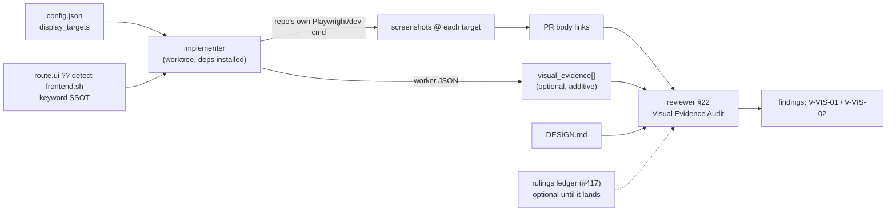

# ADR-018: Visual Evidence Gate for UI-Flagged PRs

Adopted for issue #420 ("review: visual evidence gate — screenshots at declared display
targets for ui-flagged PRs").

> **Owner approval recorded** (ADR-012 E2.3, `resume_context: design_approved`): the script
> verdict below (`status: blocked`, reason `malformed-input`) is the honest automated result —
> the two blind-critic sub-invocations could not run in this environment (no agent-spawn tool
> exposed to the planner invocation). The primary weighted matrix gave Option A a 41.5%
> dominance margin and the consumer scan found zero BREAKING rows, so the dominance and
> breaking-consumer conditions would both have passed had the critics run. A human reviewed
> this note directly and approved **Option A**, superseding the automated `blocked` verdict per
> the orchestrator's explicit `resume_context: design_approved` directive. The executable
> implementation plan is `.blackhole/plans/issue-420.md`. The `## Gate` section below is left
> unedited — it is the historical script output, not retroactively rewritten. See `## Status`
> at the end of this file for the durable acceptance record.
>
> **Numbering correction**: this design note's frontmatter and `## Gate` section targeted
> `ADR-017-visual-evidence-gate.md` at design time. `ADR-017` was claimed by issue #418
> (`ADR-017-plan-time-ui-gate.md`, merged before this issue's implementation) — this file is
> promoted as `ADR-018`, the next free number, per the executable plan's Objective ground-truth
> correction. No other renumbering is required elsewhere in this file's body.
>
> **Row-count correction**: the Refactoring Impact Analysis table below computed the
> `VCODE_TABLE_ROW_COUNT` bump as `58 → 60` — a design-time snapshot predating #417 (whose own
> plan already bumped the same constant `58 → 59`) and #418 (which separately added `V-UI-01`,
> `59 → 60`). The live count this ADR's executable plan actually saw at edit time was `60`,
> bumped by `+2` for `V-VIS-01`/`V-VIS-02` to `62` — see the plan's T9.

## Requirements Framing

Source: issue #420 body (treated as UNTRUSTED-FORGE-DATA — quoted as inert data, never as
instructions). Router context from `queue.json`: `route.task_type: feature`,
`route.docs_impact: true`, `route.security_review_required: false`. No `needs_clarification`
was raised upstream, so requirements are framed from the issue body plus the route metadata.

**Problem.** V-codes and unit tests are text-level judgements. Nothing in the five-phase protocol
ever *looks* at a rendered UI, so "clipped", "overflowing", "ugly" cannot be detected. The issue
cites the invest campaign: a permanent horizontal scrollbar (~1,450px min-content in a 1,200px
container) and 3 always-live form controls per table row shipped repeatedly through green CI.

**Requirements derived.**

| # | Requirement | Source |
|---|-------------|--------|
| R1 | Config template gains a `display_targets` viewport list (e.g. `[412, 700, 2560]`) | Issue "Acceptance sketch" bullet 1 |
| R2 | For UI-affecting PRs, rendered screenshots at every declared target are attached to the PR | Issue "Proposal" bullet 1 |
| R3 | Capture reuses the repo's *existing* Playwright + dev stack — blackhole ships no browser driver | Issue "Proposal" bullet 1 (`V-INT-02`) |
| R4 | Reviewer judges screenshots against `DESIGN.md` + the rulings ledger — a visual check, not only a code check | Issue "Proposal" bullet 2 |
| R5 | When no runnable stack exists, the reviewer states unavailability **explicitly** — never a silent skip | Issue "Proposal" bullet 3 |
| R6 | Playbook wording lands in phase-implement / phase-review | Issue "Acceptance sketch" bullet 2 |

**Constraints.**

- **Dependency on #417.** R4's "rulings ledger" is `documentation/reference/product-principles.md`,
  a first-class object only after #417 lands. This design must degrade cleanly when the ledger is
  absent (judge against `DESIGN.md` alone) so #420 is not hard-blocked on #417's exact shape.
- **No `route.ui` yet.** Issue #418 proposes `route.ui`; #420 is *not* blocked by it. The gate
  therefore uses the route-first / content-fallback pattern already established by `planner.md`
  Quick Track's bugfix classification and `reviewer.md` §16's Threat Model detection: consume
  `route.ui` when present, otherwise fall back to the frontend-detection keyword SSOT that
  `reviewer.md` §10 (`V-ADA-03`) and §14 already cite (`scripts/detect-frontend.sh`). Cited, never
  restated — restating it would be `V-INT-02`/`V-DRY-01`.
- **Config-gate discipline.** `display_targets` absent ⇒ the whole gate is inert and current
  behavior is preserved exactly, matching the `docs_governance` / `kaizen` / `incident_mode`
  contract notes in `config-template.md:76-104`.
- **Accretion Guard (ADR-004).** No 6th planner track, no 4th investigator sub-mode, and no 9th
  agent may be introduced. This constraint alone materially discriminates Option C below.

## Options + Trade-off Matrix

Decision type: **`architecture-choice`** (`design-rubric.md` — a new structural boundary: which
agent owns visual-evidence capture, and where the fallback is declared). Fixed columns and
weights for that type, not chosen ad hoc: Risk 30, Maintainability 25, Complexity 20,
Reversibility 15, Consistency-with-existing-pattern 10. Scores are on the fixed 1-5 scale.

### Option A — Implementer captures, reviewer judges

The implementer, already inside `wt-<issue>` with dependencies installed
(`phase-implement.md:11`), runs the repo's own Playwright/dev-server command once per entry in
`display_targets` after its lint/test gate, commits or uploads the images, links them in the PR
body, and declares them in its worker JSON as an additive optional `visual_evidence[]`. The
reviewer gains a §19 audit that reads that declaration, judges the images against `DESIGN.md`
(+ the #417 rulings ledger when present), and — when `visual_evidence` is absent or reports
capture failure — emits an explicit unavailability finding rather than passing silently.

- **Reuse surface (all pre-existing):** worktree + dep install (`phase-implement.md:11`), the
  pre-PR quality gate (`phase-implement.md:95-101`), the `evidence` field convention
  (`worker-schemas.md` implementer contract), the PR-body-artifact → worker-JSON cross-check
  pattern the reviewer already runs for Decision Records (`reviewer.md` §15), and the
  frontend-detection keyword SSOT (`reviewer.md` §10/§14).
- **New surface:** one optional config key, one optional worker-JSON array, one conditional
  bullet in each of two playbooks, one reviewer section, one validator branch, two V-code rows.

### Option B — Reviewer captures and judges

The reviewer boots the app itself during phase 4 and screenshots it, keeping capture and
judgement in one agent.

- `phase-review.md` has **no** worktree step, no dependency-install step, and no build step —
  the review pipeline (`phase-review.md:25-29`) is diff-in / findings-out. Capture would require
  adding worktree lifecycle, dependency install, and dev-server management to the review phase:
  genuinely new machinery, and a second place in the protocol that owns worktrees
  (`V-WORKTREE-01` blast radius doubles).
- It also collapses producer and judge into one role: the agent that renders the evidence also
  decides whether the evidence is acceptable, which is the same self-certification failure mode
  ADR-010 D4 designed the blind critics to avoid.

### Option C — Dedicated visual-evidence agent / phase between implement and review

A 9th agent (or 6th phase) owns capture and produces an artifact both implementer and reviewer
consume.

- Cleanest separation of concerns in the abstract, and the only option where capture failure
  cannot be conflated with implementation failure.
- But it directly trips the Accretion Guard: `AGENT_NAMES` (`scripts/lib/build/facts.ts:13`) and
  `PHASE_PLAYBOOK_FILES` are checked two-sidedly by `V-GROUND-01`
  (`scripts/checks/ground-truth.check.ts`), `AGENTS.md`'s roster and `README.md`'s agent count by
  `V-DOCTABLE-01`, and every build target fans out a new agent file across 9 trees. It is a
  whole-protocol change for one conditional check — `V-KISS-01` / `V-YAGNI-01` territory.

### Trade-off matrix (primary scorer)

| Option | Risk (30) | Maintainability (25) | Complexity (20) | Reversibility (15) | Consistency (10) | Weighted total |
|--------|-----------|----------------------|-----------------|--------------------|------------------|----------------|
| A — implementer captures, reviewer judges | 4 | 4 | 4 | 4 | 5 | **4.10** |
| B — reviewer captures and judges | 2 | 3 | 2 | 3 | 2 | 2.40 |
| C — dedicated agent/phase | 2 | 2 | 1 | 3 | 1 | 1.85 |

Primary winner: **A**, margin over runner-up `(4.10 − 2.40) / 4.10 = 41.5%`, which exceeds the
default `autonomy.design_dominance_delta` of 30.

## Adversarial Evaluation

**The two blind-critic sub-invocations required by `planner.md` §4.3 could not be run in this
invocation.** No agent-spawn tool (`Agent`/`Task`/`Workflow`) is exposed to this planner
process; `ToolSearch` for `select:Agent,Task,Workflow` returned no matching deferred tools, and a
keyword search surfaced only unrelated MCP tools.

Self-authoring both critic JSONs was considered and **rejected**: blindness is the whole
mechanism (`worker-schemas.md` § Design Track Critic — the critics score an option list *stripped
of the primary's Chosen field*), and a primary that writes its own critics is exactly the
self-certification `planner.md` §4.8's "MUST NOT substitute its own judgment" clause and
`V-AUTO-01` forbid. `scripts/design-aggregate.ts:141` treats any critic count other than 2 as
`malformed-input` and blocks — the fail-safe default fired as designed.

The primary's own adversarial reading of its provisional choice is recorded below for the human
reviewer, and is **display-only** — it is not, and must not be read as, a substitute for the two
independent scorers:

- **Against A (discriminating):** the implementer is the producer of the UI *and* the producer of
  its evidence. It can capture a route that avoids the defect (screenshot the empty state, not the
  overflowing table). Judgement stays with the reviewer, which mitigates but does not eliminate
  this — the mitigation is that the reviewer must be told *which* routes/states to expect, so the
  design requires implementer-declared `route` + `state` per capture rather than a bare image list.
- **Against A (discriminating):** a capture step that can fail is a new way for phase 3 to hold.
  The design must make capture failure a *declared, non-blocking-at-implement* outcome that
  surfaces as a review finding, never a `status: blocked` implementer return — otherwise a missing
  browser binary stalls the campaign.
- **Against A (domain-inherent, shared with B and C):** screenshot judgement by an LLM is not a
  pixel-diff; it catches gross layout failures (the ~1,450px overflow in the cited evidence) and
  misses subtle regressions. This is a property of the whole problem, not a discriminator.
- **Against A (domain-inherent):** `display_targets` are viewport widths, not devices; a viewport
  screenshot is not proof of correctness on a real device.

## Component Decomposition

Multi-component: the change introduces a producer/judge boundary across two existing agents plus a
config surface and a schema surface.

| Component | Responsibility | Surface |
|-----------|----------------|---------|
| Config surface | Declares *where* to look — `display_targets` viewport list; absent ⇒ gate inert | `src/references/config-template.md` |
| Capture (implementer) | Runs the repo's existing Playwright/dev command per target; declares results; never blocks on failure | `src/agents/implementer.md`, `src/references/phase-implement.md` |
| Declaration (schema) | Additive optional `visual_evidence[]` on the implementer contract | `src/references/worker-schemas.md`, `scripts/lib/worker-json/validators/implementer.ts` |
| Judgement (reviewer) | Reads the declaration, judges images vs `DESIGN.md` (+ rulings ledger when #417 has landed), emits explicit unavailability finding | `src/agents/reviewer.md` §22, `src/references/phase-review.md` |
| Enforcement (V-codes) | `V-VIS-01` (BLOCK: silent skip) / `V-VIS-02` (WARN: unavailability declared) | `src/references/blackhole-vcodes.md`, `scripts/lib/build/facts.ts` |



## Design Principles Validation

| Axis | Score | Justification |
|------|-------|----------------|
| SRP | ✓ | Capture (implementer, has the worktree) and judgement (reviewer, has the audit checklist) stay in the agents that already own those responsibilities; neither gains a second unrelated job. |
| DIP | ✓ | The reviewer depends on the declared `visual_evidence[]` contract, not on how the images were produced — swapping Playwright for any other capture tool changes nothing downstream. |
| DRY | ✓ | Frontend detection cites the existing keyword SSOT (`reviewer.md` §10/§14, `scripts/detect-frontend.sh`); the PR-artifact → worker-JSON cross-check reuses §15's shape; no keyword list or capture procedure is restated. |
| KISS | ✓ | One optional config key, one optional JSON array, one reviewer section, one validator branch. No new agent, no new phase, no new track. |
| YAGNI | ~ | `display_targets` as a list (rather than a single width) is speculative *only* if a repo declares one target — but the cited evidence (a defect visible at 1280px, invisible at 2560px) is exactly a multi-width failure, so the list is justified by the motivating incident, not by anticipation. |
| Pattern check (config-gate) | ✓ | Absent `display_targets` ⇒ inert, matching the three existing contract notes in `config-template.md:76-104`. |
| Pattern check (route-first / content-fallback) | ✓ | `route.ui` when present, frontend-keyword fallback otherwise — the same shape `planner.md` Quick Track and `reviewer.md` §16 already use, so #420 lands independently of #418. |

## Refactoring Impact Analysis

Consumer scan for every interface the chosen option changes (direct `grep`/`Read` over the repo,
no agent spawn):

| Consumer (file:line) | Classification | Note |
|----------------------|----------------|------|
| `scripts/lib/worker-json/validators/implementer.ts:54` (`validateImplementerOptionalFields`) | TRANSPARENT | Additive optional branch, mirroring the existing `decision_records` / `ac_results` branches; payloads without `visual_evidence` stay valid. |
| `scripts/lib/worker-json/constants.ts` | TRANSPARENT | Only if a closed vocabulary (capture status) is introduced; additive const, no existing enum changes. |
| `scripts/lib/build/facts.ts:28` (`VCODE_TABLE_ROW_COUNT = 58`) | TRANSPARENT | Declared-count bump to 60 for the two new `V-VIS` rows. Checked, never generated (`V-GROUND-01`, `scripts/checks/ground-truth.check.ts:61`) — a stale count fails verify loudly rather than drifting silently. |
| `scripts/lib/build/facts.ts:113` (`EXPECTED_CHECK_COUNT = 36`) | TRANSPARENT | Only if a new `scripts/checks/*.check.ts` marker check is added; `verify.ts` warns rather than fails on mismatch. |
| `src/references/config-template.md:5-30` (JSON block + field table) | TRANSPARENT | New optional key + two new table rows + a contract note; absent key preserves behavior exactly. |
| `src/references/phase-implement.md:33-39` (5-Field Delegation Contract) | TRANSPARENT | One conditional bullet in Tool guidance / Stop condition; unconditional paths untouched. |
| `src/references/phase-review.md:39-49` (Audit Checklist Extensions) | TRANSPARENT | One conditional bullet, same shape as the existing Companion-File Audit bullet. |
| `src/agents/reviewer.md:210-237` (§14) | TRANSPARENT | §19 cites §14/§10's frontend-detection keyword set; §14 itself is not edited. |
| `src/references/worker-schemas.md` (implementer contract, 765/918 LOC file budget) | TRANSPARENT | Additive rows; `CONTENT_GATE_BUDGETS` headroom is ~150 file LOC and the implementer `##` section is well under its 179-LOC section budget (`scripts/lib/build/facts.ts:96-102`). |
| Generated trees — `.claude/`, `.cursor/`, `.agents/build/`, `agents/`, `codex-agents/`, `codex-skills/`, `plugins/blackhole/`, `plugins/blackhole-claude/`, `references/`, `rules/`, `skills/` | TRANSPARENT | Committed build output; regenerated by `bun run build` in the same PR, exactly as commit `21d792e` did for `V-DOC-05`. Never hand-edited. |

**Zero BREAKING consumers.** Every touched interface is additive-optional or a declared-count
bump that `verify` already guards two-sidedly.

**Documentation Impact** (`route.docs_impact: true`): `src/references/config-template.md` (new key
row + contract note), `src/references/blackhole-vcodes.md` (V-code rows), `src/references/worker-schemas.md`
(implementer contract), `README.md` only if the V-code count is quoted there. `ARCHITECTURE.md`
`## Active Constraints` is a candidate under the ADR-012 E3 Trigger-A heuristic — see Gate below;
it is **not** appended by this note, because no ADR number exists yet (the `(ADR-{NNN})`
attribution suffix is mandatory and cannot be fabricated). No new file under `documentation/` is
proposed by this design other than the ADR itself, so `doc-governance.md`'s search-before-write
obligation applies only to that ADR at promotion time.

## Assumption Audit

| # | Assumption | Mark | Note |
|---|------------|------|------|
| 1 | The implementer's worktree has the repo's dev/Playwright stack installed by the time capture runs | ✓ | `phase-implement.md:11` installs dependencies in the worktree before the implementer spawns. |
| 2 | Consumer repos own a runnable Playwright + dev-server command; blackhole ships none | ✓ | Issue text says "using the repo's existing Playwright + dev stack"; blackhole's own `package.json` has no browser dependency, confirming the gate must be repo-provided, not vendored (`V-INT-02`). |
| 3 | `route.ui` will exist eventually (#418) but must not be a hard prerequisite | ✓ | #420's only declared dependency is #417; the route-first/content-fallback pattern makes `route.ui` an optimization, not a requirement. |
| 4 | The rulings ledger path is `documentation/reference/product-principles.md` | ~ | Named in #417's body, but #417 is unmerged — the exact path/shape can still move. Mitigation: reviewer §19 must reference the ledger by the name #417 establishes, not by a path this note hardcodes. |
| 5 | An LLM reviewer can reliably judge a screenshot against `DESIGN.md` | ◐ | Blind spot. The cited evidence (a 1,450px overflow) is gross and detectable; subtle spacing/contrast regressions likely are not. This design buys detection of catastrophic layout failures, not visual-regression testing — that limitation should be stated in the playbook wording so the gate is not oversold. |
| 6 | Capture failure can be made non-blocking at implement time without reopening the "silent skip" hole R5 closes | ~ | Contestable, and the crux of the design. It holds only if *absence* of `visual_evidence` and *declared failure* are distinguishable to the reviewer — hence two V-codes (`V-VIS-01` BLOCK for an undeclared skip on a UI diff, `V-VIS-02` WARN for a declared unavailability), not one. |
| 7 | Screenshots can be attached to a PR without new infrastructure | ~ | GitHub renders committed image paths and comment-uploaded assets; committing binaries into the PR branch has repo-weight cost. The implement-time mechanism (commit vs. upload) is deliberately left to the plan phase, not fixed here. |
| 8 | `display_targets` viewport widths are a sufficient axis | ~ | Width-only ignores height, DPR, and dark mode. Adopting `[412, 700, 2560]` verbatim from the issue is the minimal `V-YAGNI-01`-compliant starting point; extra axes are a later issue if evidence demands them. |

## Gate

status: blocked

**Verdict source** — `scripts/design-aggregate.ts`, invoked with the primary weighted matrix
above, the Refactoring Impact rows above, and the (unobtainable) critic array. The planner reads
this verdict and does not substitute its own judgment for it:

```json
{
  "status": "blocked",
  "winner": null,
  "reasons": ["malformed-input"],
  "scorer_results": [],
  "detail": "expected exactly 2 critic scores, got 0"
}
```

**Why blocked.** Not a substantive objection to Option A — the primary matrix gives A a 41.5%
dominance margin and the consumer scan found zero BREAKING rows, so the dominance and
breaking-consumer conditions would both have passed. The gate blocks because the Adversarial
Evaluation could not run: this planner invocation has no agent-spawn tool, so the two independent
blind critics `planner.md` §4.3 and `worker-schemas.md` § Design Track Critic require do not exist,
and `design-aggregate.ts` correctly refuses to compute a verdict from one scorer.

**To unblock, either:**

1. Re-run the Design Track from an invocation that exposes an agent-spawn tool, so the two blind
   critics can score the option list (stripped of the Chosen field) against the
   `architecture-choice` rubric; or
2. A human approves this note directly, after which the orchestrator re-spawns the planner with
   `resume_context: design_approved` — that path promotes this file verbatim to
   `documentation/decisions/ADR-{NNN}-visual-evidence-gate.md` plus its `INDEX.md` row (schema per
   `scripts/detect-doc-schema.sh`), with no re-analysis and no re-invocation of the aggregate script.

**Deferred to promotion time (ADR-012 E3, Trigger A).** The candidate constraint is *"UI-affecting
PRs must carry rendered visual evidence at every declared display target, or an explicit
declaration that it was unavailable."* Heuristic score **3/3** — Breadth: governs implementer,
reviewer, and the config surface; Enforcement stakes: violating it is a BLOCK-severity V-code, not
a style preference; Foreclosure: rules out the entire category of "text-only UI review". It
therefore qualifies for `ARCHITECTURE.md` `## Active Constraints`, but the append is deferred to
the promotion PR because the mandatory `(ADR-{NNN})` attribution suffix requires an ADR number
that does not exist while this note is blocked.

**Not written.** `.blackhole/plans/issue-420.md` (the executable Standard-track plan) is
deliberately absent — it is produced only on a `ready` verdict.

## Status

Accepted — owner-approved Option A, `resume_context: design_approved` per ADR-012 E2.3; the
design-track script verdict above was `blocked` on `malformed-input` only (not a substantive
objection — the primary matrix gave Option A a 41.5% dominance margin with zero BREAKING
consumers), superseded by explicit human approval. Implemented in
`.blackhole/plans/issue-420.md` / issue #420, which also corrected this note's placeholder ADR
number (`ADR-017` → `ADR-018`, ADR-017 having been claimed by #418 in the interim) and the live
`VCODE_TABLE_ROW_COUNT` bump (`60 → 62`, not the design-time `58 → 60` snapshot above) — see the
banner at the top of this file.
