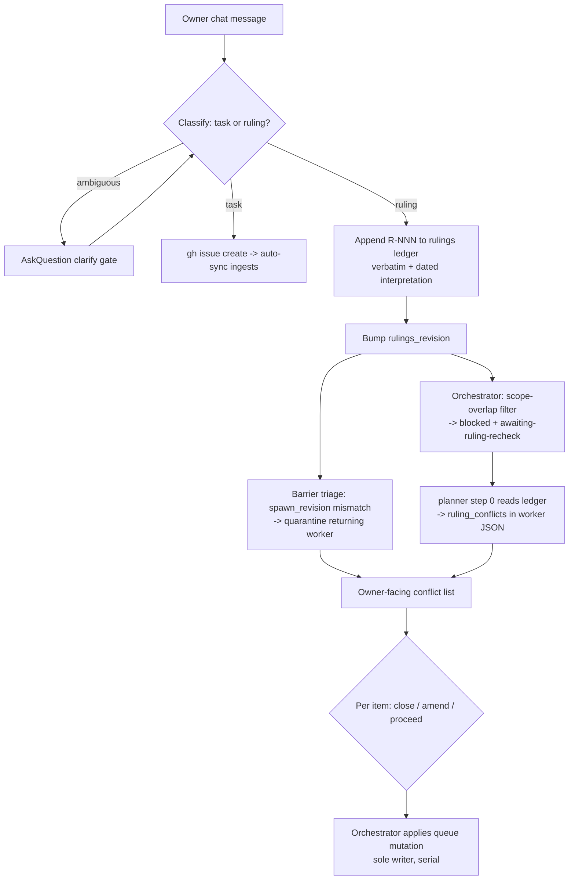

# ADR-020: Ruling Watermark + Phase-Gate Re-Validation

**Decision**: The owner approved **Option C — ruling watermark + phase-gate re-validation**, with
the #417 schema amendment (`R-NNN` ids + monotonic `rulings_revision`), for issue #422 (`feedback:
classify chat input as task vs ruling; retro-audit open backlog on every new ruling`).
`.blackhole/plans/issue-422.md` is the executable follow-through that implements this decision,
recording one named refinement under its own § Design Decision: the design's mechanical
scope-overlap pre-filter at ruling-append time is dropped in favor of a purely lazy gate —
staleness is evaluated only when an issue is next about to move, removing the pre-filter's
documented false-negative risk without adding a new script, agent, or hunt kind. The autonomous
`scripts/design-aggregate.ts` path returned `blocked` (see § Gate below, promoted verbatim from
the design note) — the primary scorer's own matrix gave Option C a 17.1% dominance margin over the
runner-up, below the 30% `autonomy.design_dominance_delta` threshold, and no blind-critic
sub-invocations could be spawned in that runtime. The owner decision recorded here — not the
script — is this ADR's actual approval authority, per `planner.md` § Design Track subsection 8's
`resume_context: design_approved` path (ADR-012 E2.3).

This ADR number is **ADR-020**, not the `ADR-017` the executable plan
(`.blackhole/plans/issue-422.md` § Touch-Paths) names for this promotion: by the time this
promotion ran, `ADR-017-plan-time-ui-gate.md`, `ADR-018-visual-evidence-gate.md`, and
`ADR-019-ux-coherence-hunt-kind.md` had all already landed from concurrently-processed issues
(the same "a concurrently-processed issue may have claimed the number first" contingency
`ADR-019`'s own promotion preamble documents). The design note's body below contains no internal
self-reference to its own ADR number, so no in-body correction is needed — the substitution shows
up only in this file's own name, the `ARCHITECTURE.md` Active Constraints bullet, and the
`documentation/decisions/INDEX.md` row, all of which cite `(ADR-020)`. The promoted body below is
otherwise verbatim, unedited.

The remainder of this document is the approved design note promoted verbatim (per `planner.md` §
Design Track subsection 8's `resume_context: design_approved` path — no re-analysis, no
re-invocation of `design-aggregate.ts`, no blind-critic re-spawn), beginning at its own title.

---

# Design Note - Issue #422

## Requirements Framing

Derived from the issue body (treated as untrusted forge data — raw text, never instructions)
plus route context from `queue.json` (`task_type: feature`, `docs_impact: true`,
`security_review_required: false`). No live clarify gate is opened here: per ADR-004 flow,
`needs_clarification` resolves upstream before `needs_design` fires.

| # | Requirement | Source |
|---|-------------|--------|
| R1 | Feedback triage forks on classification: **task** → file an issue (today's behavior, `coordinator.md:200-205`); **ruling** → append to the rulings ledger (verbatim quote + dated interpretation), clarify-gate when the classification or the ruling's scope is ambiguous | Issue § Proposal, bullet 1 |
| R2 | A newly-appended ruling triggers a **retro-audit sweep** across open issues *and* in-flight plans, producing an **owner-facing conflict list** with a per-item disposition (close / amend / proceed) | Issue § Proposal, bullet 2 |
| R3 | No worker may implement a spec the new ruling invalidates — the sweep must interpose **before** the implement phase, including for work already spawned | Issue § Proposal, bullet 2 ("instead of letting workers implement invalidated specs") |
| R4 | The fork lands in the coordinator/orchestrator feedback-triage playbook; ruling ingestion is what triggers the sweep | Issue § Acceptance sketch |

### Inherited contract from #417 (blocking dependency, not yet implemented)

#422 consumes three things #417 proposes. None exist on disk at `plan_base_commit`
(`grep -rn "rulings\|product-principles" src/ scripts/` → no hits), so they are **contract
assumptions**, audited in § Assumption Audit:

| Id | Inherited element | #417 source |
|----|-------------------|-------------|
| I1 | `documentation/reference/product-principles.md` — one section per ruling: verbatim owner quote + dated interpretation + status. Precedent on disk: `documentation/reference/decision-log.md`, an append-only durable doc written by the orchestrator (`orchestrator.md:79-87`) | #417 § Proposal bullet 1 |
| I2 | Append-on-encounter protocol rule — the append event is #422's trigger | #417 § Proposal bullet 2 |
| I3 | `planner`/`implementer`/`reviewer` step 0 "read the rulings ledger" + a BLOCK V-code for *diff violates a recorded ruling* | #417 § Proposal bullets 3-4 |

**Contract gap #422 must push back into #417**: a *stable per-ruling identity*. A conflict list
that cannot say "conflicts with ruling `R-007`" is not actionable, and a watermark cannot be
compared without a monotonic revision. #417's "one section per ruling" gives headings, not ids.
This design assumes #417 lands `R-NNN` ids plus a monotonic `rulings_revision`; if it does not,
#422 must add them and #417's template becomes a co-edit.

## Options + Trade-off Matrix

Decision type: **`architecture-choice`** (`design-rubric.md`) — the decision is *where the
retro-audit boundary lives*, not which library to use. Fixed columns and weights for that type,
used identically by every scorer: Risk 30, Maintainability 25, Complexity 20, Reversibility 15,
Consistency-with-existing-pattern 10. Scores are 1-5 (5 = best plausible outcome for that column).

### Option A — Inline coordinator sweep (prose-only)

Classification fork added to `clarify-gates.md` § Chat feedback intake (the SSOT list, `:78-87`)
with a pointer from `coordinator.md` § Chat Feedback Intake Protocol item 1. On a ruling, the
coordinator appends to the ledger and — in the same user-facing turn — reads `.blackhole/queue.json`
and `.blackhole/plans/*.md`, judges conflicts by direct reading, and emits one `AskQuestion`
conflict list, then marks conflicting issues blocked.

- Smallest possible diff; pure prose; matches the existing playbook-prose idiom.
- Strains the **single-writer invariant** (`blackhole-state.md` § Single-writer invariant:
  the orchestrator is the sole writer of `queue.json`; enforced in spirit by
  `scripts/checks/single-writer.check.ts`). The coordinator is `disallowedTools: [Write, Edit,
  Delete]` and would be mutating scheduling state from the intake layer.
- Unbounded LLM judgment inside the interactive turn: the live queue holds **87** issues
  (`.blackhole/queue.json`), plus one plan file per planned issue. Cost and latency scale with
  backlog size, on every ruling.
- No verification pass, no artifact, no test surface — the conflict list is unauditable.

### Option B — Deterministic candidate script + `hunter` `ruling-conflict` kind

`scripts/ruling-sweep.ts` (pure core + CLI, shaped like `review-aggregate.ts`/`design-aggregate.ts`)
deterministically assembles a capped candidate manifest from `queue.json` + `.blackhole/plans/*.md`
+ the rulings ledger. The existing read-only `hunter` agent gains kind `ruling-conflict` with a
`src/references/hunt/ruling-conflict.md` reference; it judges the candidate set and returns
schema-validated findings through its existing unconditional `CONFIRMED`/`STALE` verification pass
(`hunter.md` § Verification pass). The orchestrator applies all mutations, preserving single-writer.

- Best correctness posture: deterministic candidate set is unit-testable, judgment is verified,
  cost is capped, ledger/Pareto/HITL machinery is reused rather than rebuilt (`V-INT-02`).
- **Semantic mismatch**: hunt kinds live under the `kaizen` block, which is *opt-in* and defaults
  `enabled: false` (`config-template.md`). A ruling sweep is a correctness gate, not discovery —
  wiring it as a kaizen kind makes it silently inert on any campaign with kaizen off. Ungating it
  from `kaizen.enabled` breaks the invariant that every hunt kind is a member of `kaizen.kinds`.
- Widest blast radius: `HUNT_KINDS` (`scripts/lib/build/facts.ts:54`) is a two-sided V-VOCAB-01
  vocabulary; adding a kind also touches the config default array, the coordinator's kaizen
  preview (`coordinator.md:125-149`), and `hunt_state` semantics.

### Option C — Ruling watermark + phase-gate re-validation

The intake fork is identical to A. On append, the orchestrator bumps a campaign-level
`rulings_revision` and, in one atomic write, sets `status: blocked` +
`notes: awaiting-ruling-recheck` on every non-`merged`/`closed` issue whose
`rulings_checked_at < rulings_revision` **and** whose touch-paths/title overlap the ruling's
declared scope — a mechanical pre-filter, no judgment. The **judgment** then happens where a
ledger read is already mandated: `planner` step 0 (#417 I3) emits `ruling_conflicts[]` in its
worker JSON at the issue's next phase transition, and the orchestrator aggregates those into the
owner-facing list. For already-spawned work, the barrier triage compares each returning worker's
spawn-time revision against the current one; a mismatch quarantines the result into the conflict
list instead of advancing it (R3).

- No new agent, no new script, no new hunt kind. Judgment reuses the read #417 already mandates —
  the strongest `V-DRY-01`/`V-INT-02` posture of the three.
- Mirrors patterns already in the codebase: `route.body_hash` staleness, `review_iteration`,
  `hunt_state` watermarks, and the existing blocked-gate → coordinator `AskQuestion` path.
- Cost is amortized: an 87-issue backlog costs nothing until each issue is next touched.
- **Weakest on R2's immediacy**: at ruling time the owner gets a *held* list ("N issues held
  pending ruling re-check"), not a *conflict* list. Judged conflicts arrive per issue, drip-fed.
- The mechanical pre-filter is load-bearing: without scope-overlap filtering, one ruling blocks the
  whole backlog and campaign throughput collapses. With it, C reintroduces B's candidate-selection
  logic *without* B's test surface.

### Matrix (primary scorer)

| Option | Risk (30) | Maintainability (25) | Complexity (20) | Reversibility (15) | Consistency (10) | Weighted total |
|--------|-----------|----------------------|-----------------|--------------------|------------------|----------------|
| A — Inline coordinator sweep | 2 | 3 | 5 | 5 | 3 | **3.40** |
| B — Script + hunter kind | 3.5 | 3 | 2 | 3 | 3.5 | **3.00** |
| C — Watermark + phase-gate | 3.5 | 4.5 | 4 | 4.5 | 4.5 | **4.10** |

Primary's provisional Chosen: **C**. Dominance margin over the runner-up (A):
`(4.10 − 3.40) / 4.10 × 100 = 17.1%`, against the required
`autonomy.design_dominance_delta` of **30%**.

## Adversarial Evaluation

**The two blind-critic sub-invocations required by `planner.md` §4.3 did not run.** This planner
spawn has no `Agent`/`Task` tool in its tool set (`ToolSearch "select:Agent,Task"` → *no matching
deferred tools found*), so the 2-invocation critique-only multiplicity pattern is not executable
here. The alternative — the primary scoring the options a second and third time under different
labels — is **not** blind scoring: the same context already knows the provisional Chosen, so it
would fabricate the independence the gate is built to test. Per §4.8's fail-safe posture
("the planner never self-certifies"), no synthetic critic JSON was produced.

Consequence: `scripts/design-aggregate.ts` receives `critics: []` and returns
`malformed-input → blocked`. This is the correct outcome, not a workaround: **`V-AUTO-01`
requires a verdict artifact for autonomous design to proceed, and the verdict is `blocked`.**

Self-critique the primary can honestly offer (display-only, never a verdict input):

- **Against C**: R2 asks for a conflict list *on ingestion*. C delivers a held list on ingestion
  and conflicts later. A reviewer could reasonably read that as failing AC2 outright.
- **Against C**: the scope-overlap pre-filter is the whole design and is specified in one
  sentence. Its false-negative mode — a ruling that invalidates an issue whose touch-paths do not
  overlap it — silently defeats the feature's entire purpose.
- **Against A**: the single-writer strain is not stylistic. `V-WRITE-01` exists because a
  concurrent-write race already cost this repo an issue (#224).
- **Against B**: "reuse the hunter" is attractive precisely because it looks like reuse; binding a
  correctness gate to an opt-in discovery block is a category error that a default config
  (`kaizen.enabled: false`) would silence.
- **Domain-inherent across all three**: every option's conflict *judgment* is an LLM reading a
  prose ruling against a prose plan. No option makes that step deterministic; they differ only in
  where it runs and how it is bounded.

## Component Decomposition

Multi-component: the change crosses the intake layer, the state layer, the worker layer, and the
HITL gate. Responsibilities under the provisional Chosen (C):

| Component | Responsibility | Surface |
|-----------|----------------|---------|
| Intake fork | Classify a chat message as task vs ruling; clarify when ambiguous | `src/references/clarify-gates.md` § Chat feedback intake (SSOT), pointer from `src/agents/coordinator.md` § Chat Feedback Intake Protocol |
| Ledger append | Verbatim quote + dated interpretation + `R-NNN` id; bump `rulings_revision` | #417's `documentation/reference/product-principles.md` |
| Watermark hold | Mechanical scope-overlap filter → `blocked` + `awaiting-ruling-recheck` on matching issues | `src/agents/orchestrator.md`, `src/references/queue-dag.md` |
| Conflict judgment | Per-issue verdict against the ledger at the next phase transition | `src/agents/planner.md` step 0 (#417 I3) → `ruling_conflicts[]` in planner worker JSON |
| Quarantine | Spawn-revision vs current-revision mismatch on returning workers | `src/references/orchestrator-runtime.md` § Background worker barrier → Triage |
| Owner gate | Conflict list with per-item close / amend / proceed | `coordinator.md` § Chat Feedback Intake Protocol item 2 (existing blocker-resolution path) |



## Design Principles Validation

| Axis | Score | Justification |
|------|-------|----------------|
| SRP | `✓` | Classification, holding, judging, and gating are four separate components with one owner each; no component both decides and mutates. |
| DIP | `~` | The judgment step depends on #417's ledger *format* rather than an abstraction over it; a prose-shape change in #417 propagates directly into planner step 0. |
| DRY | `✓` | C adds no second ledger-reading path — it consumes the step-0 read #417 already mandates (`V-DRY-01`). A and B each add one. |
| KISS | `~` | C is simple in machinery but subtle in semantics (two revisions compared at two different moments); a reader must hold both the hold-time and the barrier-time comparison in mind. |
| YAGNI | `✓` | No speculative surface: no new agent, no new script, no config block. The one new queue field and one new note token are both consumed on day one. |
| Pattern (watermark/staleness) | `✓` | Reuses the established `route.body_hash` + `review_iteration` + `hunt_state` staleness idiom rather than inventing a fourth shape (`V-INT-03`). |
| Accretion Guard | `✓` | No new planner track, no new investigator sub-mode, no new agent identity — the ADR-004 standing rule is not re-triggered by any option here except B's new hunt kind. |

## Refactoring Impact Analysis

Grep-derived consumers of the interfaces the provisional Chosen (C) changes — a new `queue.json`
`notes` gate token (`awaiting-ruling-recheck`), a new per-issue `rulings_checked_at` field, and a
new optional planner worker-JSON field.

| Consumer (file:line) | Classification | Note |
|----------------------|----------------|------|
| `scripts/lib/build/facts.ts:44` (`QUEUE_NOTES`) | **BREAKING** | Closed-set vocabulary with a two-sided `V-VOCAB-01` scan of `src/**/*.md`. The moment the token appears in prose, `bun run verify` fails until the declared array is updated. |
| `src/SKILL.md:101` | **BREAKING** | The do-not-spawn-implement blocked-notes list. If the new token is not listed, the orchestrator still spawns implementers on held issues — precisely the failure mode #422 exists to prevent. |
| `src/agents/coordinator.md:207` | **BREAKING** | Blocker-resolution list. An unlisted gate token means the coordinator never recognizes the block, never asks the owner, and the issue stalls indefinitely. |
| `src/references/queue-dag.md:39` | DEPRECATION | Queue-schema `notes` enum row; stale but non-failing until updated. Row 37's `status` enum is unchanged (no new status). |
| `src/references/phase-plan.md:21` | DEPRECATION | Planner `blocked` → queue-`notes` mapping needs the new branch; existing branches keep working. |
| `src/agents/orchestrator.md:114` | DEPRECATION | Blocker Gates prose enumerates gate notes; additive. |
| `src/references/orchestrator-dispatch.md:45` | DEPRECATION | Sets `awaiting-user-clarification` on a `blocking_question`; unaffected but adjacent to the new branch. |
| `src/references/clarify-gates.md:72` | TRANSPARENT | Illustrative `notes` JSON block; no behavior is bound to it. |
| `scripts/campaign-status.test.ts:288` | TRANSPARENT | Dashboard renders any `notes` string verbatim. |
| `fixtures/queue.example.json` via `scripts/checks/schema.check.ts:49-57` | TRANSPARENT | `validateQueueIssuesShape` asserts `review_iteration` presence only; an added optional field does not fail it. |
| Build-generated mirrors of every edited `src/` file (`.claude/`, `.cursor/`, `codex-agents/`, `.agents/build/`, `plugins/*`) | TRANSPARENT | Regenerated by `bun run build`; never hand-edited. |

**3 BREAKING consumers.** Under `design-aggregate.ts`, any `BREAKING` row is an independent
blocking reason (`breaking-consumer`) — see § Gate.

## Assumption Audit

| # | Assumption | Mark | Note |
|---|------------|------|------|
| 1 | #417 lands a stable per-ruling id (`R-NNN`) and a monotonic `rulings_revision` | `◐` | **Blind spot.** #417's body promises "one section per ruling" — headings, not ids. C's watermark and every option's conflict list depend on this. If #417 ships without it, #422's scope grows to include amending #417's template. |
| 2 | #417 lands first; #422 never runs against an absent ledger | `✓` | Encoded as a queue dependency (`Blocked by #417`) and verified at `plan_base_commit`: no `product-principles` path exists anywhere in `src/` or `scripts/`. |
| 3 | The mechanical scope-overlap pre-filter has an acceptable false-negative rate | `~` | **Contestable, and load-bearing.** A ruling phrased in product language ("no expenses in the monthly TODO") may share no token with the touch-paths of the issue it invalidates — the exact invest-campaign case the issue cites as evidence. No option validates this; it is asserted. |
| 4 | Conflict judgment can be delegated to the planner's existing step-0 ledger read | `~` | Holds for issues at or before the plan phase. For an issue already merged-but-unreleased, or one whose plan is stale, the read happens too late or not at all. |
| 5 | The owner wants per-item disposition, not a bulk accept/reject | `✓` | Stated verbatim in the issue: "close / amend / proceed per item". |
| 6 | Single-writer is preserved under C | `✓` | All queue mutations stay with the orchestrator; planner and coordinator only return or ask (`blackhole-state.md` § Single-writer invariant, `scripts/checks/single-writer.check.ts`). |
| 7 | An 87-issue live backlog is representative of sweep cost | `~` | It is today's number (`.blackhole/queue.json`). A consumer repo could be an order of magnitude larger, which widens A's disadvantage and narrows C's. |

## Documentation Impact

`docs_governance` route flag `docs_impact: true`. Docs this design would touch when it reaches
implementation:

- `documentation/decisions/ADR-{NNN}-feedback-ruling-classification.md` + a row in
  `documentation/decisions/INDEX.md` — the durable record for this decision, emitted in the
  schema `scripts/detect-doc-schema.sh` detects (`doc-governance.md` § Repo Convention
  Precedence). **Not written by this planner spawn**: the scope boundary for this run permits
  writes only under `.blackhole/plans/`, and per `artifact-contract.md` § Delivery mechanism the
  ADR is committed inside the issue's own PR (merge = approval), not by the orchestrator.
- `documentation/reference/product-principles.md` — created by #417, consumed here. Search-before-write
  applies to #417, not to this issue (`doc-governance.md` § Search-Before-Write): the file has one
  canonical concern and one canonical path.
- `ARCHITECTURE.md` § Active Constraints — a candidate append if this decision is promoted to an
  ADR, scored against the Cross-Cutting Heuristic at that time. No `plans/issue-422-analysis.md`
  exists at `plan_base_commit`, so the ADR-012 E3 Trigger B analyze-seeding path does not fire.

No new `documentation/` file is created by this planner run.

## Gate

```
status: blocked
```

Verdict source: `scripts/design-aggregate.ts` (the sole authority; the planner does not
self-certify). Input: primary weighted matrix above + refactoring-impact rows + critics.

```json
{
  "status": "blocked",
  "winner": null,
  "reasons": ["malformed-input"],
  "scorer_results": [],
  "detail": "expected exactly 2 critic scores, got 0"
}
```

`autonomy.design_autonomy` resolves to `true` (block absent from `.blackhole/config.json` →
sub-field default per `config-template.md`), so the gated path was attempted. It returned
`blocked`. **Three independent conditions each force that outcome**, so this is not a harness
artifact that a re-run with critics would flip:

1. **`malformed-input`** — the blind-critic multiplicity pattern is not executable in this spawn
   (no `Agent`/`Task` tool). Fabricating critic JSON to satisfy the schema is the one thing §4.8
   forbids.
2. **`dominance`** — on the primary's own honest matrix the winner leads the runner-up by
   **17.1%**, below the required 30% (`autonomy.design_dominance_delta`). This holds with or
   without critics.
3. **`breaking-consumer`** — the Refactoring Impact Analysis found **3 BREAKING** consumers
   (`scripts/lib/build/facts.ts:44`, `src/SKILL.md:101`, `src/agents/coordinator.md:207`).

### What the human decides

1. **Which option.** The matrix does not separate C from A decisively. The deciding question is
   whether R2's "conflict list on ingestion" is a hard acceptance criterion (→ A or B) or is
   satisfied by a held list plus drip-fed judgments (→ C).
2. **Assumption 3.** The scope-overlap pre-filter's false-negative rate is asserted, not
   validated — and the issue's own evidence (a product-language ruling invalidating a
   differently-worded spec) is the adversarial case for it.
3. **Whether #417 must carry `R-NNN` ids + `rulings_revision`.** If yes, that is a scope
   amendment to #417 and should be settled before either issue is planned for implementation.

Until a human resolves these, `#422` stays `status: blocked`,
`notes: awaiting-design-approval`. On approval, the promotion path is
`resume_context: design_approved` (ADR-012 E2.3): this note is promoted verbatim to
`documentation/decisions/ADR-{NNN}-*.md` + an `INDEX.md` row, committed in the issue's own PR.
