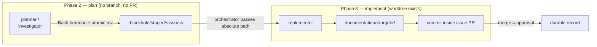

# ADR-021 — Durable Artifact Staging

## Status

Accepted — 2026-08-06.

## Context

ADR-010 D5 established a durable-artifact contract: four routes (analyze, brainstorm, design,
investigate) each declare a target under the consumer repo's `documentation/` tree, delivered by
committing the artifact **inside the issue's own PR**, with merge as approval
(`artifact-contract.md:11-30`).

An alignment audit (`documentation/audits/documentation-framework-alignment.md`) found the
contract does not execute, for one structural reason.

### The root cause

The contract assumes a PR branch exists at thinking time. It does not.

| Evidence | Fact |
|---|---|
| `phase-plan.md:17` | Phase 2's asserted artifact location is `{repo_root}/.blackhole/plans/issue-N.md` — repo root |
| `phase-plan.md` (whole file) | No `git worktree add`, no branch creation, no PR creation |
| `phase-implement.md:10` | `git worktree add <scratchpad>/wt-<issue> -b blackhole/issue-<issue>` is a **Phase 3** item |
| `phase-implement.md:26-28` | States explicitly that the plan file is **not** in the worktree working directory |

The planner and investigator run in Phase 2. `planner.md:288-291` instructs the planner to
"commit the ADR inside the issue's own PR" — an instruction that cannot be followed, because at
that moment there is no branch and no PR. A Phase-2 agent writing to `documentation/` writes into
the repo root's working tree, on the target branch.

`artifact-contract.md:18-26` names the intended bridge — "the implementer carries the note into
the PR branch when the route reaches implement" — but `phase-implement.md:33-40`'s 5-field
delegation contract has no field carrying it, and its Stop condition (`:39`) enumerates
PR-opened, lint/test-green, branch-pushed, companion-docs, and visual-evidence, with no mention
of artifacts. `investigator.md:77-79` concedes the point: "the promotion mechanism itself is not
re-defined here"; missing promotion is `V-AUTO-02`, a **WARN**.

The audit initially credited the design route with parity on the reasoning that the planner
writes the ADR directly. That was wrong: design shares the identical gap. **All four declared
routes have one root cause, so the fix is singular rather than four-fold.**

### Secondary context

- No route declares a **plan** or **review** artifact at all (`artifact-contract.md:11-16`), yet
  this repo's `documentation/plans/` holds 7 human-authored `type: plan` docs from the very
  `/git-implement-issue` path blackhole targets parity with.
- Three V-code IDs collide with mercure's for different rules; mercure's doc-tree
  structural-staleness rule has no blackhole code.
- INDEX.md maintenance and the doc-tree health signal have no blackhole owner. That absence has
  already produced an observable defect: `mercure-parity-matrix.md` marks 7 rows `in-flight`
  whose issues (#306, #308–#311, #345, #346) are all closed.

## Decision

Adopt **track-scaled promotion via a staging area**.

### D1 — Staging area (resolves the root cause)

Thinking-time agents write artifacts to `.blackhole/staged/<issue>/` instead of attempting a
`documentation/` write they cannot commit. The implementer — which owns the worktree — copies
staged artifacts into their `documentation/` targets and commits them inside the PR.

The orchestrator passes the staging directory as an **absolute repo-root path**, reusing the
existing convention `phase-implement.md:26-31` already mandates for the plan file. No new
transport, no orchestrator file write — the single-writer invariant is untouched.

### D2 — Carry-step location

The obligation extends the **existing Stop condition** (5th field), which already carries five
obligations. It does **not** become a 6th field. `mercure-parity-matrix.md` PM-074 records the
5-field contract as "structurally baked into every spawn prompt"; widening the arity would touch
every spawn site for no functional gain.

### D3 — Unconditional artifact set

> **Amended 2026-08-06** by owner ruling **R-001**
> (`documentation/reference/product-principles.md`). The original D3 scaled promotion by track
> — plan on Standard/Design only, review on deferred-BLOCK only — on proportionality grounds.
> R-001 establishes mercure's `documentation/` integration as a **floor, not a target**, which
> makes a cost argument insufficient grounds to persist less. Disposition: **amend**.

| Route / artifact | Promotes when | Mercure equivalent |
|---|---|---|
| analyze, brainstorm, investigate, design | Always (route fired) | x-analyze, x-brainstorm, x-troubleshoot, x-design |
| **plan** | **Always** | `x-plan` writes `documentation/plans/` unconditionally |
| **review** | **Always** — `documentation/reviews/` artifact, plus a PR comment | `x-review` writes `documentation/reviews/` unconditionally |

The floor is per-class parity with the equivalent mercure workflow. Per R-001's second clause,
blackhole may **exceed** mercure's taxonomy where autonomous operation needs a category mercure
lacks; it may not fall below it.

**The cost this incurs, and where it is handled.** This repo has closed 205 issues; an
unconditional rule adds roughly 410 files to a 54-file `documentation/` tree, crossing mercure's
500-file advisory. R-001 does not make that cost disappear — it relocates responsibility for it.
Volume is managed by the doc-tree health machinery of D6 (tiered indexes, thresholds, archival),
**not** by suppressing artifacts at write time. Growth is therefore a governance problem to be
solved, not a reason to persist less.

This makes D6 a hard prerequisite rather than a parallel improvement: shipping D3 without
doc-health enforcement would produce exactly the untiered, unindexed tree the audit already
found (no root `INDEX.md`, 6 files over the line ceiling). Sequencing is stated in
§ Consequences.

### D4 — `V-AUTO-02` severity

WARN → **BLOCK**, scoped to "a route declared an artifact and no artifact reached the PR". A
route that declared nothing is unaffected. Enforcement point: the reviewer, which sees both the
staged manifest and the diff — a genuine producer/auditor separation.

### D5 — V-code collisions, split by cost

Renumbering is not uniformly cheap. Measured citation counts under `src/`:

| Code | Sites | Decision |
|---|---|---|
| `V-DOC-02/04` | 6 | **Renumber.** Frees `V-DOC-04` for mercure's doc-tree structural-staleness rule |
| `V-DOC-05` | 4 | **Renumber.** Frees `V-DOC-05` for mercure's duplicated-rationale rule |
| `V-PARETO-02` | **40**, incl. 9 files carrying a `## Scoring — V-PARETO-02 SSOT` heading | **Keep.** Renumbering a declared SSOT across 9 hunt-kind files is disproportionate |

For `V-PARETO-02` the divergence is instead **documented explicitly** in `blackhole-vcodes.md`:
blackhole's meaning is the Pareto gating formula; mercure's gold-plating rule, if adopted later,
takes a fresh unused code. A silent collision becomes a recorded one.

### D6 — Doc-governance ownership

> **Amended 2026-08-06** post-acceptance, on adversarial review. The original D6 assigned
> mechanical enforcement to `scripts/checks/doc-health.check.ts`. That does not work: it governs
> the wrong repository. See § Post-acceptance amendments, A1.

No new agent — the fleet stays at 8 (`AGENTS.md`). Split by **scope first**, then decidability:

**Scope 1 — blackhole's own `documentation/` tree** → `scripts/checks/doc-health.check.ts`,
glob-discovered by `scripts/verify.ts`, following the `adr-status.check.ts` precedent:
frontmatter presence, canonical filenames, INDEX row ↔ file resolution, line/row thresholds.
Absent-file SKIP binding per `parity-matrix.check.ts`. This is real value — the audit found 8
ADRs missing `type:`, no root `INDEX.md`, and 6 files over the ceiling — but it governs **only
this repo**.

**Scope 2 — the consumer repo being campaigned against** → this is where D3's artifacts actually
land, and no `scripts/checks/` check can reach it (`check-utils.ts:6` resolves `root` from
`import.meta.dirname`; `verify` runs once, here). Ownership splits:

- **Per-diff, judgment** → `reviewer.md` gains a doc-governance audit: frontmatter on
  added/modified docs, canonical filenames, supersession-chain coherence, INDEX row for anything
  the diff added. Diff-scoped, so it fits the reviewer's existing per-PR contract.
- **Tree-wide, periodic** → the `docs` kaizen hunt kind (or an extension of an existing kind)
  evaluates the consumer tree against the thresholds and **files an issue** when they are
  crossed. Tree-wide staleness is not diff-scoped and cannot be caught by a per-PR reviewer —
  mercure reaches the same conclusion, assigning V-DOC-04 to agent judgment for exactly this
  reason.

**Threshold crossing must trigger restructuring, not just reporting.** Detection alone leaves the
tree over-threshold indefinitely. Crossing the root-INDEX row ceiling files a tiering issue
(per-folder indexes); crossing the tree-size advisory files a restructure issue. mercure's
equivalent is `x-docs restructure`; blackhole's is a filed issue the campaign then implements.

## Components

| Component | Responsibility | Change |
|---|---|---|
| `artifact-contract.md` | Route→artifact table; staging-area delivery mechanism | Modified — adds plan + review rows, rewrites § Delivery mechanism |
| `.blackhole/staged/<issue>/` | Thinking-time artifact landing zone | New |
| `planner.md`, `investigator.md` | Write to staging, not `documentation/` | Modified |
| `phase-implement.md` Stop condition | Commit staged artifacts for the issue | Modified |
| `implementer.md` | Copy-and-commit step | Modified |
| `blackhole-vcodes.md` | `V-AUTO-02` → BLOCK; 2 renumbers; 1 documented divergence | Modified |
| `reviewer.md` | `V-AUTO-02` audit; doc-governance judgment audit | Modified |
| `doc-health.check.ts` | Mechanical doc-tree enforcement | New |

## Design principles validation

| Principle | Verdict | Note |
|---|---|---|
| SRP | Pass | Staging separates *producing* an artifact from *committing* it — the two now sit with the agents that can actually do each |
| OCP | Pass | New routes add a table row; no mechanism change |
| LSP | N/A | No type hierarchy |
| ISP | Pass | Stop-condition extension, not a wider contract for all callers |
| DIP | Pass | Agents depend on a staging path passed in, not on worktree layout |
| DRY | Pass | Reuses the absolute-path convention (`phase-implement.md:26-31`) and the Bash-heredoc write pattern (`investigator.md:30-35`) |
| KISS | Pass | D3's amendment removed its conditionals — promotion is now a flat rule. D5's split-by-cost remains the sole conditional, and it is a one-time migration decision rather than per-issue runtime logic |
| YAGNI | Pass | Every component serves a current, evidenced need; no speculative extension points |
| Separation of Concerns | Pass | Mechanical vs judgment enforcement split along the decidability line |
| Composition over inheritance | N/A | Prose contracts, not classes |
| Law of Demeter | Pass | Implementer reads a passed path; it does not reach into campaign state |
| Fail Fast | Pass | D4's BLOCK fires at review, the first point where both manifest and diff are visible |
| Progressive disclosure | N/A | No UI surface |

**Design patterns**: Creational — N/A. Structural — the staging area is an Adapter between a
branchless phase and a branch-bound one. Behavioral — N/A; no strategy or observer is warranted,
and introducing one would be `V-YAGNI-03`.

## Refactoring impact

| Consumer | Impact | Migration |
|---|---|---|
| `planner.md` | **BREAKING** | Redirect the ADR write from `documentation/` to staging |
| `investigator.md` | **BREAKING** | Redirect note write; delete the "promotion mechanism not re-defined here" disclaimer |
| `hunt/parity.md` | TRANSPARENT | Cites the contract, does not write artifacts |
| `phase-implement.md`, `implementer.md` | **BREAKING** | New Stop-condition obligation and copy-commit step |
| `reviewer.md` | DEPRECATION | `V-AUTO-02` audit tightens WARN→BLOCK; existing checks unaffected |
| 6 × `V-DOC-02/04` sites | **BREAKING** | Mechanical renumber |
| 4 × `V-DOC-05` sites | **BREAKING** | Mechanical renumber |
| 40 × `V-PARETO-02` sites | TRANSPARENT | Explicitly unchanged per D5 |

Total: 3 consumers of `artifact-contract.md`, 10 renumber sites, 4 agent/reference files with
behavioral change. Below the >5-consumer cross-cutting threshold — no phased migration needed.
All targets are prose contracts in `src/`, rebuilt by `bun run build`; no runtime code changes.

## Key assumptions

| Marker | Assumption |
|---|---|
| ✓ Validated | No worktree/branch/PR exists at Phase 2 — `phase-plan.md` has no creation step; `phase-implement.md:10,26-28` |
| ✓ Validated | The implementer can write and commit — it is the only agent with unrestricted tools |
| ✓ Validated | Read-only agents can still write via Bash — documented at `investigator.md:30-35` |
| ✓ Validated | Renumbering cost is asymmetric — measured 6 / 4 / 40 |
| ~ Contestable | A deferred BLOCK is the right trigger for a review artifact. If it fires rarely, `documentation/reviews/` becomes near-dead scaffolding. Revisit after one campaign |
| ~ Contestable | Track is the right axis for plan promotion. It presumes the router classifies correctly |
| ◐ Blind spot | **Unresolved** — whether a Phase-2 agent has *ever* written into `documentation/` on a live campaign. The working tree was clean at audit time and no stray artifacts were observed, but absence of evidence is not proof the path never fired |

## Risks

| Risk | Severity | Mitigation |
|---|---|---|
| **Doc-tree volume** — ~2 artifacts/issue against a 205-issue precedent crosses mercure's 500-file advisory | **HIGH** | D6's health machinery, sequenced **before** D3 (see Consequences). If D3 ships first the tree degrades exactly as the audit already documented. This is the amendment's principal cost and it is not eliminated, only relocated |
| ~~Review artifact stale by construction once rework waves change the diff~~ | ~~MEDIUM~~ | **Superseded by amendment A2.** The original mitigation was wrong — Recheck-Mode emits a `recheck` array, never a full rewritten report, so no "final iteration artifact" exists to be authoritative. Resolved structurally: the artifact is generated from the ledger at merge-readiness, so it reflects final state by construction |
| Reviewer authoring its own audit artifact would make `disallowedTools` cosmetic | **HIGH** | Resolved by A2 — the reviewer keeps returning JSON; the write-capable path generates the artifact |
| Consumer-repo doc trees are unreachable by `scripts/checks/*` | **HIGH** | Resolved by A1 — D6 split by scope; consumer trees governed by reviewer judgment + a hunt-kind sweep |
| Track misclassification | LOW *(was HIGH)* | Eliminated as a persistence risk by the amendment — promotion no longer keys off track, so a misroute can no longer silently skip a plan artifact |
| `.blackhole/staged/` is gitignored — an artifact staged but never carried is lost silently | MEDIUM | Exactly what D4's BLOCK detects |
| Renumbering churns ledger rows citing old IDs | LOW | Ledger is gitignored and rotates at 200 rows (`findings-ledger.md:109-111`) |
| Staging adds a phase-crossing dependency | LOW | Mirrors the existing plan-file hand-off, same absolute-path convention |

## Consequences

**Positive** — one fix closes all four declared routes plus the two new ones. Post-amendment,
promotion is a flat unconditional rule with no track-dependent branch to misapply or misroute.
The 5-field contract and single-writer invariant survive unchanged. Every mechanism reused is
already in the codebase. Two V-code IDs return to mercure's meaning, and the third divergence
stops being silent. Per-class parity with the equivalent mercure workflow is met, satisfying
R-001.

**Negative** — doc-tree volume grows by roughly 2 artifacts per issue. On the 205-issue
precedent that is ~410 files onto a 54-file tree. The amendment accepts this deliberately and
assigns it to D6 rather than to write-time suppression.

**Neutral** — `.blackhole/staged/` extends gitignored campaign state; the working-copy /
durable-record split of `artifact-contract.md:32-37` is preserved, not weakened.

### Sequencing (binding)

D6 is a **prerequisite** for D3, not a parallel track:

1. **D6 first** — `doc-health.check.ts`, root `INDEX.md`, thresholds, reviewer judgment audit
   (issue #442). The tree must be able to absorb growth before growth is authorised.
2. **D1/D2/D4 next** — staging area, carry-step, `V-AUTO-02` → BLOCK. Repairs the four already
   declared routes at no volume cost.
3. **D3 last** — plan and review rows switched on, once 1 and 2 hold.
4. **D5 independently** — V-code renumbering (issue #441), no ordering dependency.

Shipping D3 ahead of D6 reproduces the untiered, unindexed tree the source audit documented.

## Alternatives considered

**Approach A — "The PR is the record"** (weighted 5.95). Promote nothing new; review findings
become a PR comment. *Strongest case*: zero diff-noise, and it honours the deliberate
working-copy/durable-record split. *Rejected*: this repo's `documentation/plans/` already holds
7 human-authored `type: plan` docs from the path blackhole targets parity with — A would leave
that folder permanently split, human plans present and autonomous plans absent. Adversarial
review also found no PR-comment-as-artifact precedent anywhere in `src/references/`, and no
supersession rule for the up-to-5 comments a `review_iteration` loop emits.

**Approach B — "Full artifact parity"** (weighted 6.65). Plan and review promoted for every
issue; carry-step as a 6th delegation field. *Strongest case*: one flat rule, total parity, and
flat rules survive contact with autonomous workers better than conditionals. *Originally
rejected on measured cost* (~410 files onto a 54-file tree) and on contract inflation.

**Partially adopted after the R-001 amendment.** B's *promotion rule* is now the decision (D3):
plan and review promote unconditionally. B's *delivery mechanism* remains rejected — the
carry-step extends the existing Stop condition rather than becoming a 6th field (D2), so the
contract-inflation objection never applied to the promotion question and was correctly separable
from it. The trade-off matrix scored the two as a bundle; the amendment showed they decompose.
The residual volume objection stands and is answered by the D6-first sequencing above rather
than by rejecting B's rule.

**Mechanism 2 — Early worktree** (considered under the chosen approach). Create the worktree at
Phase 2 so thinking-time agents commit directly, making `planner.md:288-291` literally true with
no carry-step. *Rejected*: it holds a branch lock across the plan→implement boundary and orphans
a worktree whenever a plan blocks — a live failure mode under the existing worktree-hygiene
rules, traded for the removal of one copy step.

## Post-acceptance amendments

Adversarial critiques of the rejected approaches returned after acceptance. Four findings
survived against the **final** (post-R-001) design rather than the drafts they targeted. Two
changed decisions.

### A1 — D6's mechanical owner governed the wrong repository (CRITICAL, decision changed)

`scripts/checks/*` operate on blackhole's own tree: `check-utils.ts:6` resolves `root` from
`import.meta.dirname`, and every check follows it (`links.check.ts:10` → `root/src`;
`adr-status.check.ts:20` → `root/documentation/decisions`). `verify` runs once, against this
repo. But D3's artifacts land in the **consumer repo** being campaigned against, which no such
check can reach.

D6 as originally written would have shipped a governance mechanism that never sees the trees it
governs — while being a hard prerequisite for D3. **D6 rewritten** to split by scope first: a
script for blackhole's own tree, reviewer judgment per-diff plus a hunt-kind sweep for consumer
trees, with threshold crossings filing restructuring issues rather than only reporting.

### A2 — The reviewer must not author the review artifact (HIGH, decision changed)

Post-amendment, review promotes unconditionally, which under the original framing meant the
reviewer writing its own audit output via the `investigator.md:30-35` Bash escape hatch. That
would make `reviewer.md:5`'s `disallowedTools: [Write, Edit, Delete]` cosmetic — and PM-074
cites exactly that declaration as the load-bearing parity claim with mercure's read-only agent
class, with `V-TOOLS-01` enforcing it. An audit artifact's evidentiary value depends on the
auditor not also producing it.

Compounding this, the artifact would be stale: `reviewer.md` §13 Recheck-Mode re-scopes to fix
commits and emits a `recheck` array, **never a full rewritten report**. A report written at first
pass does not describe the merged diff.

**Resolved by one change**: the review artifact is **generated from the ledger at merge-readiness
by the write-capable path** (implementer/orchestrator seam), not authored by the reviewer at
review time. This:

- preserves the reviewer's read-only guarantee — it keeps returning JSON, as today;
- reflects **final** post-recheck state, dissolving the staleness problem rather than
  documenting around it;
- reuses D1's staging mechanism instead of inventing a second delivery path.

The earlier Risks-table mitigation ("the final iteration's artifact is authoritative") was
wrong — Recheck-Mode produces no full final report to be authoritative. That row is superseded
by this amendment.

### A3 — Stop-condition density (MEDIUM, accepted)

`phase-implement.md:39` already carries 3 base obligations plus 2 conditional branches. Adding
artifact-carry approaches mercure's own V-EXT-02 threshold ("4+ distinct conceptual gate
patterns" in one step). The R-001 amendment mitigates this — the carry obligation is now
unconditional, adding a clause rather than a third conditional axis — but the field is dense and
a future addition should split it rather than extend it again. Blackhole's Accretion Guard
(`planner.md:386-396`) does **not** catch this: it is scoped to new planner tracks and
investigator sub-modes, not to growth inside a worker-contract field. Recorded as a known gap in
the guard's coverage.

### A4 — Findings that the R-001 amendment had already dissolved

Two critique findings targeted the pre-amendment D3 and no longer apply. Both independently
support the amendment:

- **Deferred-BLOCK was a structurally dead branch.** BLOCK findings are never deferred in normal
  operation — they increment `review_iteration` and loop back to implement (`phase-review.md:19`);
  only the rare `review_iteration >= 4` exhaustion path could produce one. The original D3's
  review trigger would have fired almost never, making `documentation/reviews/` the empty
  scaffolding `V-KISS-03` names. Unconditional promotion removes the branch entirely.
- **Track misclassification silently dropping the plan record.** `planner.md:19-20` self-assesses
  Quick vs Standard from a soft heuristic with no cross-check, and no detector existed for a
  misroute. Promotion no longer keys off track, so the failure mode is gone rather than mitigated.

**Process note.** These critiques were commissioned before Gate 2 and arrived after acceptance.
Had they arrived on time, A1 and A2 would have been design inputs rather than amendments. The
findings are recorded here rather than folded silently into the decision text, so the ADR shows
what was known when.

## References

- `documentation/audits/documentation-framework-alignment.md` — source audit, §3.1 root cause
- ADR-010 D5 — the durable-artifact contract this ADR repairs
- ADR-012 — shared artifact substrate
- ADR-013 — mercure parity program; `documentation/audits/mercure-parity-matrix.md`
- `src/references/artifact-contract.md:11-37`
- `src/references/phase-plan.md:17`; `src/references/phase-implement.md:10,26-40`
- `src/agents/planner.md:288-291`; `src/agents/investigator.md:30-35,77-79`
