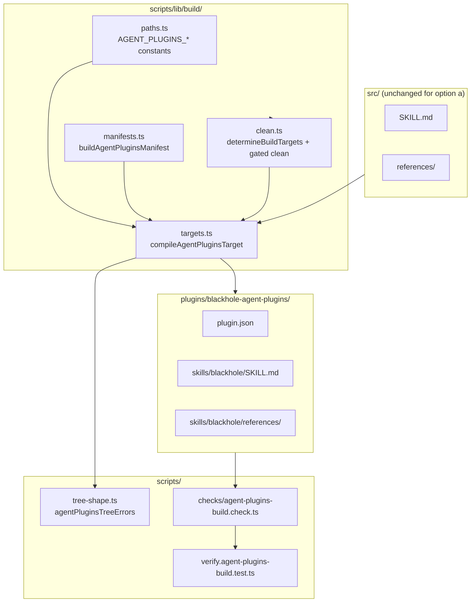

# ADR-025: agent-plugins.org v1.0.0 Distribution Target — Skills-Only Shell

**Decision**: The owner approved **Option (a) — skills-only conformant shell** at bundle path
`plugins/blackhole-agent-plugins/`, rejecting Options (b) client-extensions and (c) defer Target F,
for issue #484 ("agent-plugins.org v1.0.0 distribution target — skills-only shell"). The executable
implementation plan is `.blackhole/plans/issue-484.md`. The autonomous
`scripts/design-aggregate.ts` path was not re-invoked on this promotion — per `planner.md` § Design
Track subsection 8's `resume_context: design_approved` path (ADR-012 E2.3), the on-disk design note
is promoted verbatim with no re-analysis, no blind-critic re-spawn, and no script re-run. The owner
decision recorded here is this ADR's approval authority.

The remainder of this document is the approved design note promoted verbatim, beginning at its own
title.

---

# Design Note - Issue #484

## Requirements Framing

**Problem:** [agent-plugins.org](https://agent-plugins.org/) published spec v1.0.0 (~2026-08-05) defines a portable, cross-client plugin format. Blackhole ships eight vendor-specific distribution targets today (`scripts/build.ts:14-23`) and has no emit path for this standard.

**Owner directive (chat, 2026-08-07):** *"yesterday vercel/cursor and some more released https://agent-plugins.org/ — Blackhole should be compatible to this"*

**Load-bearing constraint:** Spec v1.0.0 component types are **skills and MCP servers only**. Blackhole's product substance — eight campaign agents (`orchestrator`, `router`, `planner`, `implementer`, `reviewer`, `investigator`, `hunter`, `coordinator`) and four protocol rule files — has **no portable component type**. Under the spec, those can only ship as:

- **(a)** skill `references/` prose — loses executability as distinct agents on any client without its own sub-agent concept; or
- **(b)** client-namespaced `{com.vendor.client}/` extension directories — zero cross-client portability guarantee.

**Issue acceptance criteria (binding):**

1. ADR recording the (a)/(b) fork and portability scope.
2. New **Target F** emitting root-level `plugin.json` (`$schema` + `name`) plus `skills/blackhole/{SKILL.md,references/}`.
3. Target F wired into `build.ts`, `paths.ts`, `clean.ts` with **opt-in gating** (git-tracked ⇒ built, matching Gemini/Codex).
4. `scripts/verify.agent-plugins-build.test.ts` structural gate (manifest exactness, name constraints, skill layout).
5. Emitted manifest validates against `https://agent-plugins.org/schemas/1.0.0/plugin.schema.json`.
6. `documentation/` + install surfaces updated (`ARCHITECTURE.md` target table, README Installation Paths).

**Explicitly out of scope:** `mcp.json` emission, hook portability, collapsing Targets B–E, chasing spec churn without a re-evaluation trigger.

**Pareto (issue body):** Gain 6, Effort 4 → Priority 42 (≥ 30, proceeds).

---

## Options + Trade-off Matrix

| | **(a) Skills-only conformant shell** | **(b) Shell + client-extensions** | **(c) Defer Target F** |
|---|---|---|---|
| **Description** | Target F at `plugins/blackhole-agent-plugins/`: root `plugin.json` (agent-plugins schema) + `skills/blackhole/{SKILL.md,references/}` only. Protocol rules live in `references/` prose; agents remain on Targets B–E. Compile with `target: 'skills'` — no `src/` mutation. | Same portable shell as (a) **plus** reverse-domain extension dirs per vendor (e.g. `com.cursor.*`, `com.anthropic.*`) duplicating agents/rules from existing targets. | No 9th target; monitor TSC/vendor shipped-support signals only. |
| **Complexity** | Low — one new validator, manifest builder, skill-only compile helper | High — N extension namespaces × 5 platform formats already maintained | Lowest — zero build work |
| **Maintainability** | High — ADR-009 precedent (separate bundle, separate invariants); no new `PLATFORM_TARGETS` | Low — fan-out across vendor-specific extension semantics with no shared schema | N/A (defers debt) |
| **Risk** | Low — schema-young spec; opt-in gating limits blast radius | Medium — extension dirs may break on vendor format changes; false sense of portability | Medium — owner directive unmet; falls behind emerging standard |
| **Effort** | 4 (issue estimate) | 7–8 (per-vendor extension trees + verify) | 1 |
| **Reversibility** | High — untracked opt-in dir; delete bundle + ADR amend | Medium — extension dirs hard to unwind once documented | High |
| **Consistency-with-existing-pattern** | High — mirrors D2 skill subtree minus `rules/`/`templates/`; follows 4-touchpoint wiring (`paths.ts` → `manifests.ts` → `targets.ts` → `build.ts`) | Medium — duplicates C2/Cursor/Codex agent surfaces under non-portable namespaces | Low — contradicts issue AC |

### Provisional Chosen: **(a) Skills-only conformant shell**

Target F is a **9th distribution bundle** at `plugins/blackhole-agent-plugins/` — structurally D2's skill subtree without top-level `rules/`, `templates/`, or `agents/`. The ADR records that conformance buys cross-client **skill** discovery only; orchestration substance stays on vendor targets B–E until the spec gains portable agent/rule component types.

**Re-evaluation trigger (ADR must state):** First TSC-member client blackhole actively targets confirms **shipped** (not draft) agent-plugins support **and** the spec adds a portable component type for agents or rules — whichever comes first.

---

## Adversarial Evaluation

> **Note:** Blind-critic multiplicity (`planner` × 2, critique-only) was not executed in this subagent session. Evaluation below synthesizes primary scoring plus structured counter-positions the critics would surface.

### Primary weighted assessment (design-rubric columns)

| Option | Complexity (×0.2) | Maintainability (×0.25) | Risk (×0.25) | Consistency (×0.3) | **Weighted total** |
|---|---|---|---|---|---|
| (a) Skills-only | 5 | 5 | 4 | 5 | **4.70** |
| (b) Extensions | 2 | 2 | 3 | 3 | **2.45** |
| (c) Defer | 5 | 3 | 2 | 1 | **2.55** |

### Critic A perspective (extensions advocate)

- **Discriminating finding (Medium):** Option (a) ships a manifest that says "blackhole plugin" but delivers only the skill shell — adopters on Cursor (TSC member) may expect the 8-agent roster because that is blackhole's identity. Risk of support burden / perceived bait-and-switch.
- **Domain-inherent (Low):** Option (b)'s per-vendor extension dirs are explicitly non-portable per the spec — filing them under an "agent-plugins" bundle could confuse adopters about what the standard guarantees.

### Critic B perspective (minimalism advocate)

- **Discriminating finding (Medium):** Option (b) violates ADR-009's lesson: incompatible bundle invariants belong in **separate output dirs and validators**, not merged. Extensions would re-couple Gemini no-agents (AC4) with Claude requires-agents invariants under one marketing label.
- **Domain-inherent (Low):** Option (c) ignores a filed issue with AC and an owner directive — not a viable design outcome.

### Synthesis

Both critics converge on rejecting (b) and (c). Critic A's portability-expectation risk on (a) is real but mitigable: ADR + README install stanza must state explicitly that Target F is the **skill surface only** and point to platform-specific install paths for the full campaign harness. Critic B's ADR-009 alignment reinforces (a) as the only option that adds a 9th target without generalizing `tree-shape.ts` validators.

---

## Component Decomposition

Target F introduces one new distribution bundle with five build-system responsibilities:



| Component | Responsibility |
|---|---|
| `paths.ts` | `AGENT_PLUGINS_DISTRIBUTION_ROOT`, `AGENT_PLUGINS_TARGET_DIRS` for opt-in gating |
| `buildAgentPluginsManifest()` | Closed-schema manifest: `$schema`, `name`, optional metadata from `projectIdentity` |
| `compileAgentPluginsSkillTree()` | Skill + references only (`target: 'skills'`); **must not** call `compileGeminiTree` as-is (that emits `rules/` + `templates/`) |
| `agentPluginsTreeErrors()` | Asserts: root `plugin.json` with agent-plugins `$schema`; `skills/blackhole/SKILL.md`; non-empty `references/`; **forbids** `agents/`, `rules/`, `mcp.json` at bundle root |
| `agent-plugins-build.check.ts` | Verify domain mirroring `gemini-build.check.ts` pattern |
| `determineBuildTargets()` extension | `buildAgentPlugins: boolean` from `isTargetTracked(root, AGENT_PLUGINS_TARGET_DIRS)` |

---

## Design Principles Validation

| Principle | Score | Justification |
|---|---|---|
| **SRP** | ✓ | Target F is an isolated bundle with its own manifest builder and tree validator — does not alter D2/C2 invariants. |
| **OCP/DIP** | ✓ | Extends build via new `compile*Target()` + constants; no modification to `distributionTreeErrors` or `claudeDistributionTreeErrors`. |
| **DRY** | ~ | Reuses `processFile`/`compileFolder`/`projectIdentity`; cannot reuse `compileGeminiTree` wholesale (emits non-conformant `rules/`). Thin skill-only helper is justified. |
| **KISS** | ✓ | Option (a) is the minimal conformant tree; defers extensions and MCP. |
| **YAGNI** | ✓ | No `mcp.json`, no `{{#agent-plugins}}` platform conditionals, no extension namespaces until spec matures. |
| **Pattern check (ADR-009)** | ✓ | Separate bundle dir, separate validator, separate manifest schema — mirrors Claude/Gemini split precedent. |

---

## Refactoring Impact Analysis

Interfaces the chosen design adds or extends:

| Consumer | Classification | Note |
|---|---|---|
| `scripts/build.ts:15-16` | **BREAKING** | `determineBuildTargets()` return gains `buildAgentPlugins`; `cleanBuildDirectories()` gains third boolean; must call `compileAgentPluginsTarget(buildAgentPlugins)`. |
| `scripts/build.test.ts:767-777` | **BREAKING** | Assertions on `determineBuildTargets()` shape must include `buildAgentPlugins`. |
| `scripts/lib/build/clean.ts:40-110` | **BREAKING** | Return type + `cleanBuildDirectories` signature extended; gated `cleanDir` for `AGENT_PLUGINS_DISTRIBUTION_ROOT`. |
| `scripts/lib/build/facts.ts:114` | **TRANSPARENT** | `EXPECTED_CHECK_COUNT` 36 → 37 when new verify domain lands. |
| `scripts/verify.ts:44` | **TRANSPARENT** | Warn-only mismatch check; no code change beyond counter bump. |
| `scripts/release.ts` (MANIFEST_PATHS) | **DEPRECATION** | Defer adding agent-plugins `plugin.json` until bundle is git-tracked (issue AC allows this). |
| `documentation/architecture.md` | **TRANSPARENT** | New committed-target table row (V-ADA-01). |
| `README.md` Installation Paths | **TRANSPARENT** | New install stanza when tracked. |
| `scripts/tree-shape.ts` validators | **TRANSPARENT** | New `agentPluginsTreeErrors()` — existing validators untouched. |
| `src/**` | **TRANSPARENT** | No changes under option (a). |

No existing consumer of `distributionTreeErrors`, `compileGeminiTree`, or `buildGeminiPluginManifest` requires modification.

---

## Assumption Audit

| Assumption | Status | Note |
|---|---|---|
| `skills/blackhole/{SKILL.md,references/}` compiled with `target: 'skills'` is sufficient for conformant skill discovery | ✓ Validated | Same subtree path as D2/C2; analysis confirms layout matches spec §7.1. |
| `compileGeminiTree({ includeAgents: false })` can be reused for Target F | ✗ Incorrect | Still emits `rules/` and `templates/` — fatal for agent-plugins layout; need skill-only compile helper. |
| Opt-in gating via `isTargetTracked` is acceptable while spec is young | ✓ Validated | Matches Gemini/Codex bootstrap pattern (`clean.ts:19-69`). |
| JSON Schema validation against remote `$schema` URL is feasible in verify | ~ Contestable | CI may need offline schema pin or fetch; verify test can assert field exactness structurally like existing gemini/codex gates. |
| No TSC member has shipped agent-plugins install yet | ~ Contestable | Spec is days old; ADR re-evaluation trigger hedges this. |
| `plugins/blackhole-agent-plugins/` is distinct from `plugins/blackhole/` (D2) | ✓ Validated | D2 uses Antigravity `$schema` + `rules/` — incompatible with agent-plugins clients. |

---

## Gate

```
status: blocked
failing_checks: ["design_pending_approval"]
```

**Human decision required:**

1. **Confirm option (a) vs (b)** — provisional recommendation is **(a) skills-only shell** at `plugins/blackhole-agent-plugins/`.
2. **Approve ADR-021** (proposed title: *agent-plugins.org v1.0.0 distribution target — skills-only shell*) recording portability scope, re-evaluation trigger, and explicit non-goals (MCP, hooks, extensions).
3. **Approve bundle path** `plugins/blackhole-agent-plugins/` vs alternative naming.

On approval (`resume_context: design_approved`), implementation proceeds on **Standard track** with these touch-paths:

**Primary:**
- `scripts/lib/build/paths.ts`
- `scripts/lib/build/manifests.ts`
- `scripts/lib/build/targets.ts`
- `scripts/lib/build/clean.ts`
- `scripts/build.ts`
- `scripts/tree-shape.ts`
- `scripts/checks/agent-plugins-build.check.ts`
- `scripts/verify.agent-plugins-build.test.ts`
- `scripts/lib/test-fixtures.ts`
- `scripts/lib/build/facts.ts`
- `documentation/architecture.md`
- `README.md`
- `documentation/decisions/ADR-021-agent-plugins-skills-only-shell.md` + `documentation/decisions/INDEX.md`

**Deferred until git-tracked:**
- `scripts/release.ts` MANIFEST_PATHS entry

**Out of scope (option a):**
- `src/**`, `PLATFORM_TARGETS`, client extension directories

## Status

Accepted — owner-approved Option (a) skills-only shell at `plugins/blackhole-agent-plugins/`,
rejecting Options (b) and (c), `resume_context: design_approved` per ADR-012 E2.3. The `## Gate`
section above is the historical design-gate output, left unedited. Re-evaluation trigger: first
TSC-member client blackhole actively targets confirms **shipped** agent-plugins support **and** the
spec adds a portable component type for agents or rules — whichever comes first.

