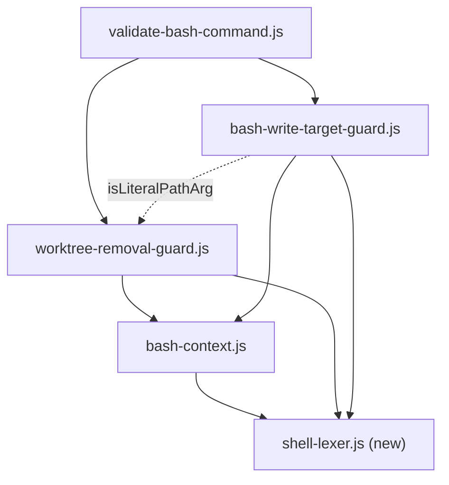

# ADR-040: Shared shell-lexer primitives, and why the three clause splitters stay divergent

## Status

Accepted — 2026-09-06 (issue #863; owner ruling at the design gate, Option A over both blind
critics' Option D).

## Requirements Framing

Three PreToolUse safety-guard modules under `templates/hooks/pretooluse/utils/` each reimplement
shell-scanning primitives independently:

| File | Lines | Role |
|---|---|---|
| `bash-context.js` | 469 | `computeMaskedSpans` — "described vs executed" masking. Already the shared upstream primitive both other guards `require()` |
| `bash-write-target-guard.js` | 348 | ADR-029 — Bash write-target containment against `BLACKHOLE_ASSIGNED_WORKTREE` |
| `worktree-removal-guard.js` | 1212 | `git worktree remove` and `rm -rf <worktree>` safety gate, hardened across four review rounds on PR #880 |

Issue #863 framed the choice as **(a)** extract only byte-identical primitives versus **(b)**
retrofit everything to the newest guard's level of sophistication. That framing is wrong on its
most important axis, and this record exists mainly to say why.

Requirements, in priority order:

- **R1 (security, non-negotiable)** — no guard's externally observable deny/warn/allow decision may
  become more permissive on any input. All 210 black-box cases in
  `scripts/hooks-validate-bash.test.ts` keep passing, unmodified.
- **R2 (falsifiability)** — the currently-untested quote-policy invariants become explicitly
  test-pinned, each demonstrated red-before-green (`V-UNFALSIFIABLE-01`).
- **R3 (DRY)** — reduce the duplication the issue names without inventing surface no current call
  site uses (`V-KISS-01`, `V-YAGNI-03`).
- **R4 (rollout)** — a diff touching `templates/hooks/**` bumps `package.json`'s `version` in the
  same diff (`V-PLUGIN-01` BLOCK, ADR-030).

## Decision

**Extract the primitives that are genuinely uniform. Do not unify the clause splitters.**

New `templates/hooks/pretooluse/utils/shell-lexer.js` — pure, stateless, no I/O — exporting:

| Export | Contract | Call sites migrated |
|---|---|---|
| `skipQuotedSpan(text, start, endBound)` | Given `text[start]` is `'` or `"`, returns the index just past the matching close quote, or `endBound` when unterminated. Backslash consumes the next character **only** inside a double-quoted span. Must return strictly greater than `start` in every branch | 5 |
| `isRedirectAmpersand(text, i)` | True when the `&` at `i` belongs to a redirect operator (`&>`, `&>>`, `>&`, `N>&`) rather than being a clause separator | 3 |
| `SEPARATORS` | Frozen character vocabulary. Each splitter selects its own subset; the constant does **not** imply any splitter handles all of them | 3 (read-only) |

The whitespace-bounded brace-group `{`/`}` predicate is de-duplicated as a **file-private** helper
inside `worktree-removal-guard.js`, not exported — all three copies live in that one file, so a
cross-file export would be a single-consumer abstraction (`V-YAGNI-03`).

The three clause splitters keep their own implementations, and each gains an explicit
`QUOTE POLICY:` docstring line naming the test that pins it.

### The constraint this record exists to preserve

**A shell-clause splitter's quote policy is a per-guard security decision, not a correctness
detail. The two guards need opposite policies, and each one is fail-closed for its own detection
semantics.** Anyone who reads "three files duplicate a clause splitter" and proposes unifying them
is proposing a security regression in one direction or the other.

**`worktree-removal-guard.js` requires quote-UNawareness.** `bash-context.js` deliberately does not
mask `eval`'s quoted argument, so the `&&` inside `eval "cd <parent> && rm -rf <basename>"` is a
*visible* character to `findClauseStartIndices`. Only because that splitter is quote-unaware does
it split there, reach the removal invocation inside the quotes, and deny. This is pinned by a
**passing** test: `scripts/hooks-validate-bash.test.ts:2367` —
`deny: eval "cd <parent> && rm -rf <basename>" is checked against the real target (F-00065)`.
Making the splitter quote-aware walks the entire eval argument as one opaque span, hides the `&&`,
and reopens the exact bypass PR #880 took four review rounds to close. The splitter's own docstring
(`worktree-removal-guard.js` ~L213-216) has always documented the quote-unawareness as an accepted
limitation; what was not documented, until this record, is that it is **load-bearing**.

**`bash-write-target-guard.js` requires quote-AWAREness.** A `sed` script routinely contains a
separator character: `sed -i 's/a;b/c/' <main-clone-path>`. Quote-aware, this is one clause and the
sed target is the real file — deny. Quote-unaware, it splits into `sed -i 's/a` and
`b/c/' <main-clone-path>`; clause 1's sed target becomes the fragment `'s/a`, which resolves
*inside* cwd and passes containment, and clause 2's leading word `b/c/'` matches none of
`tee`/`sed`/`cp`/`mv`/`UNRESOLVABLE_WRITE_COMMANDS`, so no target is extracted at all. Net effect:
**deny → allow**, a worker writing over the user's main clone — the F-00034 incident class. This
case was **untested** when this decision was taken; the closest existing test
(`scripts/hooks-validate-bash.test.ts:2711`) uses `'s/a/b/'` with no embedded separator. Closing
that gap is part of this decision, not a follow-up.

## Options + Trade-off Matrix

Duplication catalogue, verified against the tree at `6f889a51`:

| # | Duplicated thing | Copies | Where |
|---|---|---|---|
| 1 | Quote-skip loop | 5 | `bash-write-target-guard.js` `tokenize`, `splitClauses` (byte-identical modulo one identifier); `bash-context.js` `consumeBalanced`, `collectHeredocOperatorsOnLine` (near-identical), `computeMaskedSpans` (same algorithm, two per-quote-character loops) |
| 2 | Redirect-aware `&` disambiguation | 3 | `bash-write-target-guard.js` `splitClauses`; `worktree-removal-guard.js` `findClauseStartIndices` **and** `clauseTailFrom` — two of the three inside one file |
| 3 | Whitespace-bounded brace-group `{`/`}` predicate | 3 | all inside `worktree-removal-guard.js` |
| 4 | Clause splitting | 3 functions, **not** 3 copies | three I/O contracts, two opposite quote policies — see § Decision |

Decision type `refactor-strategy`; columns and weights from `src/references/design-rubric.md`
verbatim (Effort 25, Complexity 20, Risk 20, Reversibility 20, Consistency 15), 1-5 scale.

| Option | Effort | Complexity | Risk | Reversibility | Consistency | Primary weighted |
|---|---|---|---|---|---|---|
| **A — uniform primitives, preserved splitter divergence** (chosen) | 4 | 4 | 4.5 | 4.5 | 5 | **435.0** |
| B — union splitter (quote-aware AND `(`/`{`/`}`/`\|\|`), all three replaced by adapters | 1.5 | 1.5 | 1 | 2 | 1.5 | 150.0 |
| C — one parameterized splitter, per-caller `quoteAware` / separator-set / output-shape flags | 2 | 2 | 3 | 3 | 2.5 | 247.5 |
| D — minimal: extract `skipQuotedSpan` only (catalogue item 1); leave items 2, 3, 4 | 4.5 | 4.5 | 3.5 | 5 | 3 | 417.5 |

## Alternatives Considered

**Option B — union splitter. Rejected on evidence, not preference.** This is the option issue #863
itself proposed, and the one the Phase-1 analysis concluded was "strictly better than either
current implementation". It is not. A single splitter cannot hold both policies on the same input:
quote-awareness (needed by the write-target guard) hides the `&&` inside `eval "…"` and regresses
the passing F-00065 test; quote-unawareness (needed by the removal guard) fragment-splits a `sed`
script and flips a main-clone write from deny to allow. B carried the evaluation's **only two
CRITICAL findings**, filed independently by both blind critics. Critic B: *"One splitter cannot
satisfy both without a mode flag — which is Option C, not B."* Critic A additionally found that the
three splitters differ in **operating model**, not only quote policy — `splitClauses` consumes a
pre-blanked `visible` string and returns clause strings, while `findClauseStartIndices` /
`clauseTailFrom` consume the original string plus a parallel `masked[]` array and must return index
positions into that original, which `findRemovalInvocations` depends on for cwd-candidate tracking.
"One splitter, adapters over it" has to reconcile incompatible I/O contracts, which B's framing
hides.

**Option C — parameterized splitter. Rejected as speculative generality.** The flag matrix
(`quoteAware` × active-separator-set × output-shape) admits combinations no current call site
exercises — there are exactly three known, closed consumers. Both critics flagged this
independently (`V-YAGNI-01` / `V-KISS-01`): each unexercised combination is untested dead surface,
and a future fourth caller could pass a pairing no guard uses today and get silently wrong
behaviour with no covering test.

**Option D — minimal extraction. Ranked first by both blind critics; rejected by the owner.** See
§ Consequences for the full counter-case; the ruling is recorded there rather than here because
D's rejection is a judgement call the scoring did not settle.

## Adversarial Evaluation

Two blind critique-only `planner` sub-invocations scored all four options against the same fixed
rubric with the primary's Chosen field stripped before spawn. Both read the tree independently and
both reproduced the F-00065 finding without being told the conclusion.

| Scorer | Winner | Weighted (winner) | Runner-up | Margin |
|---|---|---|---|---|
| primary | Option A | 435.0 | Option D (417.5) | 4.02% |
| critic_a | Option D | 472.5 | Option A (415.0) | 12.17% |
| critic_b | Option D | 475.0 | Option A (445.0) | 6.32% |

Critic findings accepted against the chosen option and folded into it:

- *(critic A, discriminating, MINOR)* The brace-group predicate's 3 copies all live inside
  `worktree-removal-guard.js`, so exporting it cross-file is `V-YAGNI-03`-flavoured. **Accepted** —
  it is a file-private helper, not a `shell-lexer.js` export.
- *(critic B, domain-inherent, MINOR)* The 5 quote-skip copies are near-identical, not
  byte-identical; extraction needs per-site behavioural-equivalence verification. **Accepted** —
  each of the 5 migrations carries its own acceptance criterion.
- *(both, domain-inherent, NOTABLE)* Coverage tooling cannot instrument these files (they execute
  only inside the subprocess `runPreToolUseHook` spawns), so any option's correctness is verified
  only indirectly. **Accepted, unmitigated** — this is why the two policy-pin tests exist and why
  `V-TEST-09` is declared `unmeasurable` for this diff.

## Component Decomposition

Deliberately **not** in `shell-lexer.js`:

- Any clause splitter — quote policy is a per-guard security decision (§ Decision).
- `findRemovalInvocations`'s CERTAIN/UNCERTAIN wrapper walk and `cwdCandidates` set
  (`worktree-removal-guard.js:579-663`) — `git worktree remove`-specific business logic, not
  lexing. Extracting it would misclassify policy as a primitive.
- The brace-group predicate — single-consumer-file (critic A, accepted).

## Design Principles Validation

| Axis | Score | Justification |
|---|---|---|
| SRP | ✓ | `shell-lexer.js` holds character-level scanning only; every policy decision stays with its guard |
| DIP | ✓ | Guards depend on a primitive abstraction rather than on each other; the pre-existing `bash-write-target-guard.js:39` → `worktree-removal-guard.js` edge is the only remaining guard-to-guard dependency |
| DRY | ✓ | Catalogue items 1-3 collapse 11 call sites onto 2 shared primitives + 1 private helper. Item 4 is not duplication (three contracts, two policies) and stays divergent by decision |
| KISS | ✓ | No flags, no modes, no configuration — two exported functions and one constant |
| YAGNI | ~ | Contestable: `SEPARATORS` has three readers but each reads a different subset, closer to documentation than shared logic. Kept as the natural home for "which characters are separators at all", which the three splitters answer differently |
| Pattern | ✓ | Exactly the shape `bash-context.js` already is for masking — one file, pure functions, `require()`d by both guards. No new pattern variant (`V-INT-03`) |

## Refactoring Impact Analysis

Grep-verified at `6f889a51`. `shell-lexer.js` is additive; no existing `module.exports` changes, so
nothing is BREAKING.

| Consumer | Classification | Note |
|---|---|---|
| `templates/hooks/pretooluse/validate-bash-command.js:1` | TRANSPARENT | Calls `evaluateWorktreeRemoval` / `evaluateBashWriteTargets` only; neither export changes |
| `templates/hooks/pretooluse/utils/bash-write-target-guard.js:39` | TRANSPARENT | Existing cross-require of `isLiteralPathArg` untouched |
| `templates/hooks/pretooluse/utils/bash-context.js:469` | TRANSPARENT | `module.exports` unchanged; 3 internal quote-skip sites rewired |
| `templates/hooks/pretooluse/utils/worktree-removal-guard.js:1197-1204` | TRANSPARENT | Export list and splitter signatures unchanged |
| `scripts/hooks-validate-bash.test.ts:1` | TRANSPARENT | 210 black-box cases; zero imports of lexer internals, so none is orphaned |
| `scripts/lib/build/trees.ts:29` (`copyHooksDir`) | TRANSPARENT | Recursive `fs.cpSync` over the whole `pretooluse/` directory picks up a new file with no build-script change — verified, not assumed |

## Assumption Audit

| # | Assumption | Mark | Note |
|---|---|---|---|
| A1 | The two splitters' quote policies are opposite by design, each load-bearing | ✓ | Verified two ways: the passing F-00065 test (needs quote-unawareness) and the `sed` deny→allow trace (needs quote-awareness). Both blind critics reproduced it independently |
| A2 | The 5 quote-skip copies can share one primitive | ✓ | Two are byte-identical modulo an identifier; the other three differ only in end-bound naming and loop shape. Still requires per-site equivalence verification (critic B) |
| A3 | No existing test is orphaned | ✓ | `scripts/hooks-validate-bash.test.ts` contains zero imports of the three guards' internals |
| A4 | The build picks up a new file in `pretooluse/utils/` automatically | ✓ | `scripts/lib/build/trees.ts:29` is a recursive `fs.cpSync` of the whole directory |
| A5 | `V-TEST-09` is `unmeasurable` for this diff | ✓ | These modules execute only inside the spawned subprocess; `bun test --coverage` never sees them. The reviewable signal is the 210→211 behavioural case count, not a percentage |
| A6 | The `sed -i 's/a;b/c/' <main-clone-path>` trace flips deny→allow | ~ | Contestable: traced by reading `evaluateBashWriteTargets`, `findSedTargets` and `isResolvableLiteralTarget` — not executed at design time. If `isResolvableLiteralTarget` rejects the `'s/a` fragment on its quote character, the outcome is deny→**warn** instead. Either way the test falsifies; the implementer records which, from the actual red run |
| A7 | Option A closes issue #863 as filed | ◐ | It closes catalogue items 1-3 (11 call sites) and converts item 4 from accidental divergence into a documented, tested invariant — but it does not produce "one shell lexer" in the literal sense the issue title implies. #863 is closed as resolved-differently-than-framed, and this record is the explanation |
| A8 | The rubric could discriminate A from D | ✗ | Incorrect. `refactor-strategy`'s five columns contain no completeness axis, so a deliberately-minimal option scores well on four of five by construction. Both critics filed the completeness objection against D as a *finding* precisely because they could not express it as a *score* |
| A9 | The Phase-1 analysis note's "130 tests" figure | ✗ | Incorrect, corrected during the design pass. Measured at `6f889a51`: `bun test scripts/hooks-validate-bash.test.ts` → **210 pass, 0 fail, 777 expect() calls**. Every count in this record uses the measured 210 |

## Gate

`scripts/design-aggregate.ts` returned **`status: "blocked"`**, `winner: null`, reasons
`["dominance", "disagreement"]` — no scorer's margin cleared the 30% `design_dominance_delta`
(largest was 12.17%), and the primary's winner (A) disagreed with both critics' (D). Verdict
artifact: `.blackhole/plans/issue-863-design-verdict.json`. Scorer results are tabulated in
§ Adversarial Evaluation above.

**Owner ruling, 2026-09-06 — Option A approved**, over both critics' Option D. The planner did not
self-certify: the script computed `blocked`, and this record is promoted through the design-approval
gate, not through a `ready` verdict.

## Consequences

**Positive.**

- Eleven duplicated call sites collapse onto two shared primitives plus one file-private helper,
  in the same module shape `bash-context.js` already established.
- The two opposite quote policies stop being accidents. Each splitter carries a `QUOTE POLICY:`
  docstring naming the test that pins it, so the next reader who sees "three files duplicate a
  clause splitter" meets the reason before the temptation.
- A live, previously-untested gap closes: the `sed`-with-quoted-separator case is in the same
  failure class as the F-00034 incident (a worker writing over the user's main clone).

**Negative / accepted.**

- **Elevated blast radius.** The #506, #616, #774 and #803 precedents each changed detection logic
  in one guard. This changes a primitive underneath all three pre-execution safety gates at once. A
  regression degrades every guard consuming the changed primitive, in the same release — and
  because the installed plugin cache is version-keyed rather than content-addressed (ADR-030), it
  stays live in every existing installation until the next version bump *plus* a reinstall.
  Mitigated by running the full suite against all three guards' real call sites rather than against
  `shell-lexer.js` in isolation, and by the `V-PLUGIN-01` version bump in the same diff.
- **`V-TEST-09` is `unmeasurable` here.** Coverage tooling cannot instrument
  `templates/hooks/pretooluse/utils/*.js`. The substitute signal is the behavioural case count,
  210 → 211.
- **The vote was not unanimous, and that is recorded rather than smoothed over.** Both blind
  critics ranked Option D first. Their case: D closes catalogue item 1 for a fraction of the edit
  surface, and A touches a safety-critical primitive at 11 sites for a duplication that has caused
  no incident yet. The ruling went the other way on an asymmetry the scoring could not express:
  D still swaps the quote-skip primitive underneath all three guards — including
  `computeMaskedSpans`, the masking SSOT the other two depend on — so it carries essentially A's
  full blast radius and the identical version-bump/reinstall rollout latency, while closing 1 of 4
  catalogue items and adding neither policy-pin test. Same risk, less benefit. D also leaves the
  two redirect-`&` copies inside a single file, which critic A independently called the most
  maintenance-hazardous instance in the catalogue. If a future reader concludes the critics were
  right, the honest revisit condition is a measurement this record does not have: whether the
  11-site migration ever produced a regression the 5-site one would not have.
