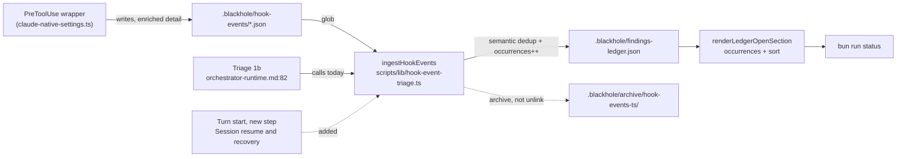

# ADR-042: Hook-event ledger finding identity is per-class-with-count, not per-event

## Status

Accepted — 2026-09-06 (owner ruling, campaign design-approval gate; issue #893). The
deterministic `scripts/design-aggregate.ts` verdict was `blocked` (three independent scorers,
three different winners, no margin cleared the 30-point dominance bar); see § Gate for the
verdict and the terms on which the ruling resolved it.

## Requirements Framing

A PreToolUse validator that exits nonzero *before producing a decision* is a fail-open —
`V-HOOK-03`, declared `BLOCK` — and the Bash/Write call it was meant to gate proceeds with no
safety check at all. Issue #893 reports this failure mode as invisible in-session: the wrapper
(`scripts/lib/build/claude-native-settings.ts`'s generated `.claude/settings.json` command)
writes a `.blackhole/hook-events/hook-exec-error-<ts>.json` record, but nothing surfaces it
short of a human reading the directory by hand.

The issue's four acceptance criteria split into two legs — diagnosis (AC1) and visibility
(AC2/AC3/AC4). The prerequisite investigation
(`documentation/investigations/hook-event-fail-open-visibility.md`, staged alongside this ADR's
plan) settled both causes:

- **Invisibility (confirmed).** `ingestHookEvents` (`scripts/lib/hook-event-triage.ts:80`) is
  real, wired, and tested, but is invoked from exactly one place —
  `src/references/orchestrator-runtime.md:82`, inside the background-worker-batch Triage step
  1b. The turn-start list (§ Session resume & recovery, steps 1-5) never calls it. An
  under-scoped trigger, not a missing mechanism.
- **Root cause of the exit-1s (not determinable from the record).** `detail` on every `error`-tier
  event is the literal string `"process exit code 1"` — deliberately content-free for redaction
  safety (`scripts/lib/build/claude-native-settings.ts:56-58`'s own docstring), not an oversight.
  226 of 227 `hook-exec-failure` events cluster in a single hour on 2026-08-12 correlated with a
  9-PR-in-24-seconds merge burst; resource contention against the wrapper's `timeout: 5` is the
  best available reconstruction, medium confidence, unconfirmable from the artifact as it stands.

### The collision this ADR resolves

Two binding obligations point in opposite directions:

- **Never drop a finding** (`blackhole-protocol.md`): every V-code reaches the ledger; deferral
  requires a filed issue.
- **A visibility fix must not become a denial-of-service on the queue.** The live backlog was
  **392 event files** (growing during the session) — 227 `error` / 115 `block` / 50 `warn`,
  i.e. **342 BLOCK-severity rows** against a ledger holding **97 findings, 4 of them open**.

### The question the design-approval gate escalated

Whether identity is **per class** (one V-HOOK-03 finding for "`validate-bash-command`
exited 1 in the main clone", carrying a count) or **per event** (219 separate findings for 219
recurrences) is a protocol-cardinality question `blackhole-protocol.md` § Never drop findings
does not answer, and `documentation/reference/product-principles.md`
(`rulings_revision: 5`) carried no ruling on it. That gap, not a scoring defect, is why
`design-aggregate.ts` could not resolve this design on its own — see § Gate.

## Options + Trade-off Matrix

Decision type `architecture-choice` (`design-rubric.md`). Fixed columns/weights: Risk 30,
Maintainability 25, Complexity 20, Reversibility 15, Consistency-with-existing-pattern 10.

| Option | Summary |
|---|---|
| **A** | Semantic finding identity (`(vcode, pattern_id, worktree)`) + occurrence counting + turn-start ingest. 392 events → ~13 classes. |
| **B** | One-time archival sweep of the 392-file backlog to `.blackhole/archive/`, filed as an issue; bounded ongoing per-turn ingest thereafter. |
| **C** | Trigger-scope fix only — add `ingestHookEvents` to the turn-start list, nothing else. 342 BLOCK rows land on the next turn unmodified. |
| **D** | Advisory read-only signal file at turn start (mirrors `plugin-drift-signal.ts`), `ingestHookEvents` left at Triage 1b untouched. |

Three independent scorers, blind to each other and to the primary's provisional Chosen, against
the same fixed rubric:

| Scorer | A | B | C | D | Winner | Margin |
|---|---|---|---|---|---|---|
| Primary | 4.25 | 2.55 | 2.50 | 3.80 | A | 10.6% |
| Critic A (blind) | 2.83 | 2.83 | 3.33 | 2.55 | C | 15.0% |
| Critic B (blind) | 2.55 | 2.80 | 2.60 | 3.50 | D | 20.0% |

Every margin is under the 30-point dominance bar, and the three scorers picked three different
winners — a genuinely contested decision (see § Gate).

## Adversarial Evaluation

Both blind critics, independently, returned the same two CRITICAL findings against Option A as
originally framed:

**(i) `occurrences` would be written and never read — reproducing #893's own failure shape.**
`renderLedgerOpenSection` (`scripts/lib/campaign-status/dashboard.ts:106-117`) emits only `id`,
`vcode`, `severity`, `summary`, `issue_ref`. No consumer — not `countLedgerByStatus`
(`campaign-status/queue.ts`), not `mergeEligible()`, not `review-core.md`'s LGTM check, not
`findLedgerSchemaDrift` — reads a count field. Incrementing a collapsed row's counter would
change nothing on `bun run status`: 219 recurrences render identically to 1. Critic A: *"the very
mechanism that prevents the flood mutes the new event."*

**(ii) The `deferred` swallow makes the muting permanent.** `isDedupCandidate`
(`hook-event-triage.ts:49`) admits `status === 'open' || status === 'deferred'`, but
`renderLedgerOpenSection` filters `status === 'open'` only. Never-drop's own prescribed deferral
path — file an issue, set `deferred_to_issue` — turns a collapsed class row into a permanent
silent sink the moment it is deferred: every later recurrence of that class increments an
invisible counter on a row no section renders and no gate reads. Not hypothetical — the live
ledger already holds `F-00034` and `F-00079` as `deferred` V-HOOK rows.

**Critic A's correction, in Option C's favour and adopted here as the accurate framing.** The
"denial-of-service on the queue" framing this design was handed is overstated on blast radius.
No gate reads BLOCK-severity ledger rows in aggregate: `clarify-gates.md` § Auto-proceed
condition 5 and `review-core.md`'s LGTM path are both scoped *per issue/PR*, and ~391 of 392
hook-event rows carry `issue_ref: null`. **The flood's damage is readability and bookkeeping
noise, not a merge blockade.** This is recorded because it corrects the premise the design was
scoped against, and it does not change the resolving decision below — a dashboard nobody can
read is still the failure #893 exists to end, independent of whether it can also block a merge.

Both critics converged on the same two mitigations (open-only dedup, render+sort the count) and
both, independently, found that no option as scored makes the exit-1 root cause diagnosable
(`detail` is content-free for every `error`-tier record) — this is AC1, and it required a fifth
addition beyond the four scored options. Full per-option critic findings (including the
CRITICALs that eliminate B, C, and D on their own terms) are recorded in
`documentation/investigations/hook-event-fail-open-visibility.md` and
`.blackhole/plans/issue-893-design.md`; not restated here to keep this ADR to its resolving
decision (`V-DRY-01`).

## Component Decomposition

Multi-component: an ingest module, a render module, a state-file schema, a protocol-prose
trigger list, and (for the AC1 leg) the wrapper-generation code that produces `error`-tier
records.



## Design Principles Validation

| Axis | Score | Justification |
|---|---|---|
| SRP | `~` | `ingestHookEvents` gains "retire the source artifact" (archive) alongside classify/dedup/append — contestable, not wrong; mirrors the existing turn-start signal scripts' shape. |
| OCP | `◐` | `renderLedgerOpenSection` must be edited to surface a new field; the render is not open for extension — a blind spot both critics exposed and this ADR's Decision closes by editing it in the same change rather than deferring it. |
| DIP | `✓` | `ingestHookEvents` already takes `repoRoot`/`queueIssues`/`ledger` as injected inputs and returns a value; unchanged. |
| DRY | `✓` | Reuses `findingDedupKey` unchanged (only its `file` input becomes semantic), reuses `resolveWorktreePath` (already used for `issue_ref` resolution) to derive the worktree component of identity, reuses the turn-start cadence/existence-gating idiom from `doc-health-signal.ts`/`plugin-drift-signal.ts`, reuses `.blackhole/archive/` rather than minting a second archive convention. |
| KISS | `~` | Five coupled changes, not one — justified because the critics showed any subset ships a silent failure (occurrence counting without rendering is `V-YAGNI-01`; semantic identity without open-only dedup reintroduces a permanent sink). |
| YAGNI | `✗ → ~` | `occurrences`/`last_seen_at` as originally scored **were** speculative (schema with no reader). The Decision below fixes this by wiring the renderer in the same change; without that wiring these fields must not ship. |

## Refactoring Impact Analysis

`ingestHookEvents` has exactly one code consumer besides itself: its own test file. Everything
else is ledger-row-shape or prose.

| Consumer | Classification | Note |
|---|---|---|
| `scripts/lib/hook-event-triage.test.ts` (all three existing tests) | **BREAKING** | Every test's assertions are built on filename-as-identity (`file: '.blackhole/hook-events/error-event.json'`) and on `unlinkSync` deletion; the dedup test's fixture stops exercising dedup once identity becomes semantic. Rewritten, not merely extended — see § Gate's red-before-green requirement below. |
| `scripts/lib/campaign-status/dashboard.ts` `renderLedgerOpenSection` | **BREAKING** | Must render `occurrences`/`last_seen_at` and sort; unless updated it renders an incremented counter identically to a first occurrence (both critics, CRITICAL). |
| `scripts/lib/hook-event-triage.ts` `isDedupCandidate` | **BREAKING** | Must narrow from `open \|\| deferred` to `open` for hook rows; unmodified, a deferred collapsed row becomes a permanent silent sink for the exact class #893 reports. |
| `scripts/checks/ledger-schema.check.ts` | TRANSPARENT | Validates only *present* known keys; never rejects the new `occurrences`/`last_seen_at` fields. |
| `scripts/lib/campaign-status/queue.ts` (`countLedgerByStatus`) | TRANSPARENT | Counts rows by status/severity; row-count semantics unchanged — this ADR changes what a row *represents*, not how rows are counted. |
| `scripts/triage-deferred-findings.ts`, `scripts/checks/deferred-reconciliation.check.ts` | TRANSPARENT | Operate on `status`/`deferred_to_issue`/`reconciled_at`, unaffected by identity or count fields. |
| `src/references/orchestrator-runtime.md:82` (Triage 1b prose, ×7 build trees) | DEPRECATION | Still describes a per-event append; behavior no longer holds once identity is semantic. Updated in the same diff. |
| `src/references/hook-schemas.md` § Orchestrator consumption / § schema table (×7 build trees) | DEPRECATION | Gains `occurrences`/`last_seen_at` in the row shape it documents; the `detail` field gains an `error`-tier enrichment note (AC1 leg). |
| `src/references/findings-ledger.md` field table | DEPRECATION | Gains `occurrences`/`last_seen_at` rows, scoped to hook-originated findings. |
| `.blackhole/findings-ledger.json` `F-00034`, `F-00079` | DEPRECATION | Legacy filename-keyed rows will not dedup against the new semantic key; they survive beside newly-collapsed rows rather than merging with them — accepted, not a regression (never-drop is satisfied either way). |

Four-or-more BREAKING consumers is independently sufficient for `design-aggregate.ts` to block
on `breaking-consumer`, regardless of the scoring outcome (see § Gate).

## Assumption Audit

| # | Assumption | Mark | Note |
|---|---|---|---|
| 1 | Today's dedup key cannot collapse repeats | `✓` | Verified at `hook-event-triage.ts:44-47`/`:127`: `file` is the generated filename, `line` is hardcoded `0`. |
| 2 | A flood would drown the dashboard | `✓` | `dashboard.ts:106` `slice(0, 10)`, raw append order, no sort; 4 open findings today, never exercised at scale. |
| 3 | A flood would block merges | `✗` | **Incorrect as originally framed.** Both ledger gates are per-issue/PR scoped and ~391/392 rows carry `issue_ref: null`. The cost is readability, not enforcement (critic A's correction, adopted above). |
| 4 | `occurrences` alone would make a recurrence visible | `✗` | **Incorrect** — no renderer or gate reads it unless the renderer is also changed. Both critics, independently. |
| 5 | Never-drop is about the V-code class, not per-event cardinality | `◐` → **resolved by owner ruling** | Protocol was silent; no prior ruling existed. Resolved below: per-class, with a count. |
| 6 | The exit-1 root cause is reachable from the existing record | `✗` | Not from the artifact as it stands — `detail` is content-free by design for `error` tier. Satisfied only by enriching the *writer* (the AC1 leg below), which no scored option covered. |
| 7 | ADR-042 is the next free number | `✓` | Verified against `origin/main`'s `documentation/decisions/` (highest = ADR-041) and every `.blackhole/staged/*/manifest.json` staged this session (040/#863, 039/#882, 041/#889 all already merged or staged under their own numbers). Re-checked immediately before staging. |

## Gate

### Verdict — `design-aggregate.ts`, not self-certified

`.blackhole/config.json` has `autonomy.design_autonomy: true`. Invoked with the primary's
weighted matrix, both critics' raw JSON, and the Refactoring Impact rows, it returned:

```json
{ "status": "blocked", "winner": null,
  "reasons": ["dominance", "disagreement", "breaking-consumer"],
  "scorer_results": [
    { "scorer": "primary",  "winner": "A", "margin": 10.59 },
    { "scorer": "critic_a", "winner": "C", "margin": 15.04 },
    { "scorer": "critic_b", "winner": "D", "margin": 20.00 } ] }
```

Three scorers, three different winners, no margin over 30%. No re-scoring was performed after
critic output was read — self-certifying past this verdict is exactly what `V-AUTO-01`
forbids.

### Resolved by owner ruling, 2026-09-06

The owner was shown the exact cardinality question both scoring passes could not settle: is a
PreToolUse guard failing open 219 times in one hour **one** `V-HOOK-03` finding with a count, or
**219** findings? **Ruling: A′ — per-class identity, with a count**, the three fixes both blind
critics independently identified named explicitly as part of the choice. This ADR records the
ruling as the resolving decision, not as a finding that the aggregate script erred — the
dissenting scorers' concerns (C's and D's critic-identified CRITICALs, both documented in the
design note) are not overruled as wrong; they are superseded by A hardened with the mitigations
below, which neither scored variant evaluated.

### Decision — A′: Option A, hardened by both critics' mitigations plus the AC1 leg

1. **Semantic finding identity + turn-start ingest.** `ingestHookEvents` sets each hook-event
   candidate's `file` to `.blackhole/hook-events/<pattern_id>/<worktree-key>` (`worktree-key` =
   `resolveWorktreePath(event.worktree)` — the same resolver already used for `issue_ref`
   matching — or the literal `no-worktree` when absent/empty), instead of the per-event
   filename. `line` stays `0`; the shared `findingDedupKey` composition (`vcode`, `file`,
   `line`, `issue_ref`) is untouched. `pattern_id` is `"hook-exec-failure"` for every `error`-tier
   event regardless of which of the two hooks produced it — a deliberate consequence of the
   owner-specified `(vcode, pattern_id, worktree)` key, accepted because `summary` still names
   the originating `hook` for a human reader even though it is not part of the dedup key.
   `ingestHookEvents` is wired into the turn-start list (`orchestrator-runtime.md` § Session
   resume & recovery) as a new step, alongside the untouched Triage 1b call site — this is the
   non-negotiable core of the issue, not an optional leg.
2. **Dedup hook rows against `status === 'open'` only.** `isDedupCandidate`, as used inside
   `ingestHookEvents`, admits only `'open'` — never `'deferred'`. Closes the permanent-silent-sink
   CRITICAL both critics found independently.
3. **Render `occurrences` and `last_seen_at`, sorted by severity then recency.**
   `renderLedgerOpenSection` gains both fields in its row text and sorts the open section
   (`BLOCK` before `WARN` before `NOTE`, then `last_seen_at`/`created_at` descending within a
   tier) before slicing to 10. Closes the "written but never read" CRITICAL — without this,
   items 1-2 must not ship and `occurrences`/`last_seen_at` must be dropped (`V-YAGNI-01`).
4. **Archive-then-delete.** `ingestHookEvents` moves each consumed event file to
   `.blackhole/archive/hook-events-<turn-timestamp>/<original-filename>` instead of
   `fs.unlinkSync`. Never-drop is satisfied more strictly than today: today every consumed event
   is deleted outright; this preserves every one of them, recoverable, alongside the collapsed
   ledger row that represents it.
5. **Carry `event.detail` into the ledger row, and enrich the wrapper's `error`-tier `detail`.**
   `ingestHookEvents` copies `event.detail` into the candidate's `summary` (or a new field, at
   implementation discretion, so long as it is rendered) instead of discarding it. Separately,
   `scripts/lib/build/claude-native-settings.ts`'s generated wrapper command captures the
   validator subprocess's combined output (`output=$(bun run ... 2>&1); code=$?`) and includes a
   truncated tail of `$output` in `detail` in place of the literal `"process exit code $code"`,
   subject to the same ≤300-char/secret-redaction discipline `hook-schemas.md` already documents
   for `block`/`warn`-tier `detail`. This is the only item that touches **AC1**; without it the
   visibility fix delivers an alert with no actionable payload, reproducing the domain-inherent
   gap both critics flagged as shared by every scored option.

### How this resolves the collision

It dissolves the never-drop-vs-flood tension rather than trading it off. Today `ingestHookEvents`
deletes every consumed event outright. A′ archives all of them and represents every one in the
ledger as a collapsed row carrying an `occurrences` count — nothing is dropped, nothing is
archived-and-forgotten, and the dashboard stays readable. The flood was a mis-specified finding
identity, not a genuine conflict with never-drop; establishing the correct identity was the
owner's call, not a planner's, which is why this ADR exists rather than the design proceeding
on a scored verdict.

### Cross-Cutting Heuristic (ADR-012 E3, Trigger A)

1/3 — **Breadth** `~` (the identity rule is scoped to hook-event ingestion, one function; it
does not yet govern how any other high-cardinality event stream is deduped, though it is the
first instance of the pattern in this codebase). **Enforcement stakes** `✓` (a wrong dedup key
either reintroduces the flood or reintroduces a permanent silent sink — both are `V-HOOK-0N`
BLOCK-adjacent failures). **Foreclosure** `✗` (does not rule out a category of future approaches
for other streams; it establishes one precedent, not a constraint on alternatives). Net score
below the 2/3 promotion threshold — **no `ARCHITECTURE.md` § Active Constraints entry is staged
for this ADR.**

### Deployment note — `V-PLUGIN-01` does not apply

`templates/hooks/pretooluse/hooks.json` (the shipped plugin's actual wrapper, verified on
`origin/main`) carries **no** fail-open capture logic at all — it is a bare
`bun run ${CLAUDE_PLUGIN_ROOT}/hooks/validate-bash-command.js` with no wrapping. The exit-code
fallback wrapper this ADR's item 5 modifies exists only in
`scripts/lib/build/claude-native-settings.ts`, which generates the repo-root `.claude/settings.json`
used when blackhole self-hosts its own campaign — neither file is under `templates/hooks/**`.
Every touch-path in this ADR's implementation (`hook-event-triage.ts`, `dashboard.ts`,
`claude-native-settings.ts`, `.claude/settings.json`, the three `src/references/*.md` docs) falls
outside `templates/hooks/**`, so `V-PLUGIN-01`'s package.json-version-bump gate (ADR-030) is
**inert** for this plan — no version bump is required by this change. (The pre-existing,
unrelated cache drift — installed `0.20.0` vs repo `0.21.7` on `origin/main` — is unaffected by
and unrelated to this decision.)

## Consequences

**Positive**: the next fail-open of a class already seen this campaign becomes visible within
one turn on `bun run status`, without a 392-row flood; every consumed event remains recoverable
in `.blackhole/archive/` rather than deleted; the ledger gains an actionable `detail` for the
`error` tier going forward.

**Negative / accepted**: legacy filename-keyed rows (`F-00034`, `F-00079`) will not merge with
newly-collapsed rows of the same underlying class — two representations of overlapping history
persist side by side. `pattern_id` collapsing `"hook-exec-failure"` across both hooks means the
rendered summary, not the dedup key, is what distinguishes `validate-bash-command` fail-opens
from `validate-file-changes` fail-opens sharing a worktree. Reducing the *probability* of the
next fail-open (adapting the wrapper's `timeout: 5`, retry-on-exec-failure) remains out of
scope, to be filed separately — this ADR is detection-and-visibility only.

## Post-acceptance amendments

- **2026-09-06 (issue #893, PR #908, fix round 1)** — Item 5's decision text describes capturing
  the validator subprocess's *combined* output (`output=$(bun run ... 2>&1); code=$?`). The
  shipped implementation (`scripts/lib/build/claude-native-settings.ts`) diverges deliberately:
  it captures **stderr only**, to a temp file (`2>"$stderr_tmp"`), leaving stdout to pass through
  untouched. A combined `2>&1` capture would also swallow the validator's *stdout* — the
  `hookSpecificOutput` JSON the 0/2 (allow/deny) exit paths must still emit for Claude Code to
  read — silently breaking the allow/deny contract on every invocation, not only on the
  fail-open path this ADR addresses. This divergence is correct and is not reverted; a reader
  implementing from the ADR body alone should follow the code, not the literal decision text.
- **2026-09-06 (issue #893, PR #908, fix round 1)** — The wrapper's elapsed-time computation
  (`start_s`/`end_s`, used for the timeout-vs-crash discriminator in `detail`) uses `date +%s`
  (whole seconds), not `date +%s%N` (nanoseconds). BSD/macOS `date` has no `%N` conversion; using
  it inside the arithmetic expansion `end_s - start_s` would leave a literal `N` in the value and
  abort the script. Whole-second granularity is coarse but sufficient to discriminate a
  near-the-5s-hook-timeout kill from an instant crash. (The unrelated, pre-existing
  `hook-exec-error-$(date +%s%N).json` output *filename* still uses `%s%N` for uniqueness; on
  BSD/macOS this degrades to a literal trailing `N` rather than nanosecond precision, which is
  harmless for a filename and out of scope for this amendment.)
