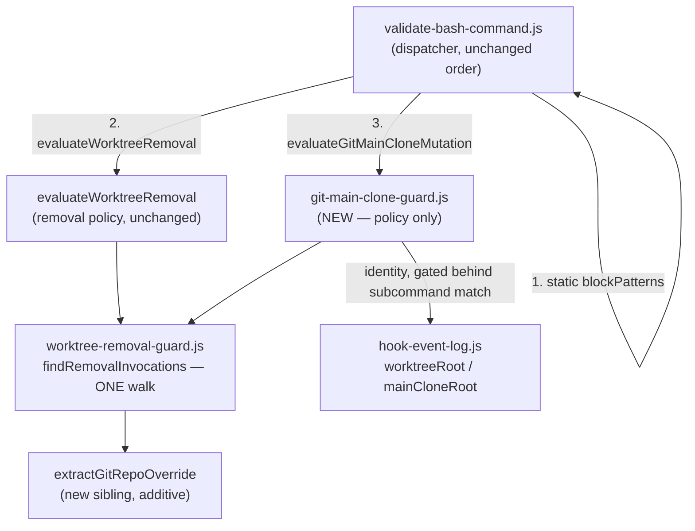

# ADR-043: Main-clone git working-tree-mutation guard

## Status

Accepted — 2026-09-06, by owner ruling on Option A. `design-aggregate.ts` returned `blocked` with
a unanimous 3/3 winner; the block was procedural (`dominance` — margins 22.6/11.0/16.0 under a
30% threshold — plus `breaking-consumer`, the mandatory `package.json` bump), not substantive
disagreement. Promoted through the design-approval gate (`resume_context: design_approved`,
ADR-012 E2.3). `supersedes_adr: null` — see § Gate.

## Context

`templates/hooks/pretooluse/utils/bash-write-target-guard.js` contains **zero** `git` references
(verified on `origin/main` @ `3e463c82`). Its two vocabularies are resolvable file-write targets
(`>`/`>>`/`&>`, `tee`, `sed -i`, `cp`, `mv` — lines 215-253) and `UNRESOLVABLE_WRITE_COMMANDS`
(`python3 -c`, `python -c`, `perl -i`, `awk`, `dd`, `rsync` — lines 46-52). A working-tree-mutating
`git` command therefore reaches the filesystem unexamined.

Origin is finding **F-00034**: a reviewer ran `git checkout <PR-branch> -- .` in the main clone and
staged ~60 files over the user's uncommitted working state. `disallowedTools: [Write, Edit, Delete]`
does not bound an agent's Bash surface, so the only thing standing between a worker and the user's
checkout is prose — repeated verbatim in roughly twenty worker dispatches per session precisely
because nothing enforces it.

Two structural facts shape every option below.

**Severity must track recoverability, not "writes to disk."** The set is not uniform:

| Command | Recoverable? | Why |
|---|---|---|
| `git clean -fd` | **Never** | Untracked files; no git object was ever created. Worst in the set. |
| `git checkout <ref> -- <path>`, `git restore` | **No** | Prior uncommitted state is never captured as an object. F-00034's exact shape. |
| `git reset --hard` / `--merge` | **Partial** | Commits survive via reflog; uncommitted and staged changes do not. |
| `git apply`, `git am` | **No** (in general) | Arbitrary patch applied with no snapshot first. |
| `git checkout <branch>` **forced** | **No** when forced | Git's own refusal already covers the unforced path. |
| `git stash` | **Yes** | Persists in `refs/stash`; retrievable via `fsck --unreachable` even after `drop`. |
| `git merge` / `rebase` / `cherry-pick` | **Yes** | Commits recoverable via reflog; git's dirty-tree refusal covers the precursor state. |
| `git add` | **Yes** | Content enters the object store. Explicit non-goal — see § Consequences. |

**`BLACKHOLE_ASSIGNED_WORKTREE` is a trap and no option keys on it.** It is documented as a shell
`export` (`src/references/orchestrator-dispatch.md:216`), which does not propagate into a Claude
Code Agent-tool spawn. It is unset for every Pattern C worker, so `readAssignedWorktreeRoot`
returns `null` and `evaluateBashWriteTargets` returns `null` before parsing anything — the existing
Bash write guard is entirely inert in the configuration that actually runs. `pattern_id:
outside-assigned-worktree` has never appeared across the whole event corpus. A git guard keyed the
same way would inherit that degradation and block nothing.

## Requirements Framing

Derived from the issue body plus `router-897`'s classification (`needs_design: true`,
`needs_analysis: true`, `plan_mode: full`, `security_review_required: true`, `docs_impact: true`).
No live clarify gate: `needs_clarification` resolved upstream before `needs_design` could fire.

R1. A working-tree-mutating `git` command whose **effective repository is the main clone** is
refused, with a severity graded by the recoverability table above.

R2. The identical command targeting a **linked worktree** is allowed, unchanged. The campaign's own
protocols mandate several of these commands in a worktree — `git reset --hard` per failing step
under `refactor-strict` (`src/references/gates/06-execution-mode.md:21`), `git rebase`/`cherry-pick`
(`src/references/merge-conflict-protocol.md`), `git stash push` (`src/references/recovery-protocol.md:59,108`).
An option that cannot separate these two cases is not a fix.

R3. Detection keys on **repo identity**, never on `BLACKHOLE_ASSIGNED_WORKTREE`.

R4. Every existing black-box case in `scripts/hooks-validate-bash.test.ts` (3307 LOC) keeps passing
**unmodified** — the standing bar ADR-040 § Requirements R1 set for this tree.

R5. The guard must be demonstrable **denying** a real command and **allowing** its worktree twin
(`V-UNFALSIFIABLE-01`, BLOCK).

### The orchestrator exception set is empty — verified, not assumed

`router-897` warned that a main-clone-identity design "inherits #907's unresolved
orchestrator-vs-worker judgment call." That concern does not transfer. #907 concerns `Write`/`Edit`
to *any path*, where the orchestrator genuinely does write `.blackhole/` state from the main clone
every turn. This issue is scoped to working-tree-mutating **git subcommands**, and the set of
legitimate main-clone uses was searched rather than assumed.

Searches run (all against `origin/main`, build-output trees excluded):

```
git grep -nE 'git (checkout|restore|reset|clean|stash|apply|am|rebase|cherry-pick)' \
  origin/main -- src scripts documentation templates
git grep -nE 'git .{0,40}(checkout|switch |restore|reset|clean |stash|apply|cherry-pick|rebase)' \
  origin/main -- src templates
git grep -nE 'git pull|git merge [^-b]|git switch' \
  origin/main -- src templates scripts documentation/runbooks
git grep -lE 'git .{0,30}(checkout|restore|reset --|clean -|stash|apply |cherry-pick|rebase)' origin/main
```

Every hit, classified:

| Hit | Verdict |
|---|---|
| `src/references/gates/06-execution-mode.md:21` — `refactor-strict` per-step `git reset --hard` | Worktree (implementer's own `wt-<issue>`) |
| `src/references/merge-conflict-protocol.md:116-163` — `rebase`, `cherry-pick` | Worktree — §3 Scope boundaries states verbatim: "git/build/lint/test commands only in the existing `wt-<issue>` worktree" |
| `src/references/recovery-protocol.md:26,59,108` — `git stash push` | Worktree — spelled `git -C <scratchpad>/wt-<issue>` |
| `src/references/merge-gate.md:355-395` — `git rebase --onto` | Delegated to `scripts/stack-repair.ts`, invoked `--cwd <abs child worktree> --repo-root <abs child worktree>` |
| `scripts/stack-repair.ts:157` | Inside a `.ts` script, reached as `bun run …` — invisible to a command-string hook by construction |
| `scripts/*.test.ts` (`decision-log-append`, `stack-repair`, `merge-base-guard`, `hooks-validate-bash`) | Temp fixture repos, inside the test process |
| `documentation/**` | Historical prose — ADRs, plans, decision log |

`git pull`, `git merge <branch>`, and `git switch` appear **nowhere** in `src/`, `templates/`,
`scripts/`, or `documentation/runbooks/`. The orchestrator's own main-clone git vocabulary is
`fetch`, `worktree prune`, `worktree remove`, `show`, `merge-base`, `rev-parse`, `log`, `grep`,
`clone --shared`, `diff`, `ls-remote` — **no member of the recoverability table**. Corroborating
observation: this clone's checked-out working tree is 12+ commits behind `origin/main` at design
time, which is only possible because nothing in the campaign ever updates it.

**Verdict: the exception set is empty, verified by the searches above rather than assumed.** No
identity-carve-out mechanism is designed, and #907's judgment call is not inherited. The residual
cost is a human-initiated request ("discard my changes") in an interactive session, addressed in
§ Consequences.

## Decision

Adopt **Option A**. Three parts:

**1. Detection — extend the existing walk, do not re-derive it.** `findRemovalInvocations`
(`worktree-removal-guard.js:629`) already *is* a general engine: it walks clauses
(`findClauseStartIndices`), simulates `cd` including `||`-guarded and UNCERTAIN-wrapper unions,
normalizes executable spellings (`normalizeShellWord`), and dispatches on git subcommand at exactly
the point `skipGitGlobalOptions` returns. A second subcommand match is added at that same point,
emitting `{ kind: 'git-mutation', subcommand, argTokens, repoOverride, resolutionCwds }`. This
inherits every hardening the module has accumulated — F-00043 (chained `cd`), F-00058 (subshell
`)` boundary), F-00059 (`||`-ambiguous cwd union), F-00064/F-00065 (wrapper walk
CERTAIN/UNCERTAIN asymmetry), #774 (path-qualified invocation), #788 (executable spelling), #803
(`rm` shape). Re-implementing that walk in an isolated module would be `V-INT-02` (reimplementing
an existing utility), `V-DRY-01` (>10 lines duplicated), and strictly less safe.

**2. Policy — a new sibling module** `templates/hooks/pretooluse/utils/git-main-clone-guard.js`,
owning only: the subcommand → tier table, effective-repo resolution, and refusal prose. The
1263-LOC removal guard does not gain a second policy (`V-PAT-01`, `V-SOLID-01`).

**3. Effective-repo resolution.** The check is **not-a-linked-worktree** ⇔
`worktreeRoot(dir) === mainCloneRoot(dir)`, both already exported from `hook-event-log.js` — no new
resolution mechanism (`V-INT-02`). **Correction, discovered at implementation time (see
§ Consequences)**: this equality is not "is this literally the campaign's one designated main
clone" — `--git-common-dir` and `--show-toplevel` both resolve to `dir` itself for ANY standalone,
non-linked-worktree checkout, so a bare temp repo with no relationship to the campaign satisfies it
exactly as the real main clone does. The guard therefore blocks a destructive git subcommand in
**any checkout that is not a linked worktree**, not only "the one main clone" — broader than this
ADR originally stated, and accepted as such (§ Consequences (7)) rather than narrowed, because it
errs toward refusing destructive commands in exactly the places a worker has no business running
them. `dir` is the invocation's **effective** directory: a `-C <path>` / `--git-dir=<path>` /
`--work-tree=<path>` value when present, else the `cd`-simulated candidate cwd. Because
`skipGitGlobalOptions` returns only an index and discards those values, a **sibling**
`extractGitRepoOverride(tokens, start)` reads the same option run additively; `skipGitGlobalOptions`
itself is not modified (`V-SOLID-02` — extend, do not modify), so the removal path stays
byte-identical.

Tier assignment, straight off the recoverability table:

| Subcommand shape | Tier | `pattern_id` |
|---|---|---|
| `git clean` with a force flag | block | `main-clone-clean` |
| `git checkout <ref> -- <path>` / `git checkout -- <path>` | block | `main-clone-checkout-path` |
| `git restore` (without `--staged` alone) | block | `main-clone-restore` |
| `git reset --hard` / `--merge` | block | `main-clone-reset-destructive` |
| `git apply` / `git am` | block | `main-clone-apply` |
| `git checkout`/`switch` `<branch>` with `-f`/`--force`/`--discard-changes` | block | `main-clone-checkout-force` |
| `git stash` (any form) | warn | `main-clone-stash` |
| effective repo unresolvable **and** subcommand matched | warn | `main-clone-target-unresolvable` |

Every block carries an explicit `Remedy:` clause, matching `evaluateResolvedWorktree`'s existing
convention — an unattended worker with no human to ask must be told what to do instead (re-run
inside `wt-<issue>`, or spell `git -C <worktree-abs-path>`).

**Not in scope, deliberately**: `git add`, `git commit`, `git merge`/`rebase`/`cherry-pick`,
`git stash` at block tier — all recoverable per the table. `git add` in particular is the second
half of F-00034's damage and stays open by design, not by omission.

## Options + Trade-off Matrix

Decision type `architecture-choice` (`design-rubric.md`): Risk 30, Maintainability 25,
Complexity 20, Reversibility 15, Consistency-with-existing-pattern 10.

- **A — Extend the existing walk in place; new sibling policy module.** As decided above.
- **B — Extract the walk into a third module.** Pull `findRemovalInvocations`' clause-walk /
  `cd`-simulation / executable-normalization core into `git-invocation-scanner.js` parameterized by
  a subcommand matcher, consumed by both guards. Cleanest long-term structure; requires surgery on
  the core of the most safety-critical, most-regression-pinned module in the tree.
- **C — Static patterns only.** Add `bash-patterns.json` rows for `checkout -- `, `restore`,
  `stash`, `apply`, `am`, and escalate the existing `git-reset-hard` / `git-clean-force` rows from
  `warn` to `block`. Zero new JS.

Primary's weighted matrix (1-5 anchors per `design-rubric.md`):

| Option | Risk | Maint. | Complexity | Revers. | Consistency | **Weighted** |
|---|---:|---:|---:|---:|---:|---:|
| A | 3.5 | 4.0 | 4.0 | 4.5 | 4.5 | **3.98** |
| B | 2.0 | 4.5 | 2.0 | 2.5 | 2.5 | **2.75** |
| C | 2.0 | 2.0 | 5.0 | 4.5 | 3.0 | **3.08** |

### ADR citation check (issue #775)

Every ADR cited as decisive evidence was checked for a `## Post-acceptance amendments` section
before the citation was used. **None of ADR-029, ADR-030, or ADR-040 carries one** on `origin/main`
— so each citation stands on its accepted text, with `amendment_acknowledged: false` recorded on
the basis of an *absent* section, not an unread one. Both blind critics performed and reported the
same check independently.

- **ADR-029** → A. Establishes the precedent A follows exactly: a new sibling guard module plus a
  dispatch entry in `validate-bash-command.js`, with a two-tier block/warn vocabulary.
- **ADR-030** → A. `V-PLUGIN-01` and the version-keyed plugin cache; the source of A's one
  BREAKING consumer.
- **ADR-040** → B. Its § Component Decomposition lists, under "Deliberately NOT in
  `shell-lexer.js`": "`findRemovalInvocations`'s CERTAIN/UNCERTAIN wrapper walk and `cwdCandidates`
  set — `git worktree remove`-specific business logic, not lexing. Extracting it would misclassify
  policy as a primitive." Critic A correctly noted this is an exclusion from the *lexing-primitives
  module*, not a blanket prohibition, and scored B on its own merits; the reasoning nonetheless
  transfers and B carries no evidence rebutting it. ADR-040 also rejected its own Option D
  (minimal shared-primitive swap) as "same-risk-less-benefit."

## Adversarial Evaluation

Two blind `planner` critics scored all three options against the fixed rubric with the primary's
provisional Chosen stripped. Both independently ranked **A first, C second, B last** — the same
ordering the primary reached. Synthesis below is display-only; the verdict source is
`design-aggregate.ts` (§ Gate).

**Discriminating against C (both critics, CRITICAL).** C cannot answer the question the issue asks.
A regex over the command string has no access to `worktreeRoot`/`mainCloneRoot`, so it substitutes a
global refusal for a targeted one — trading under-detection for over-detection. It makes
`refactor-strict`'s mandated per-step `git reset --hard` unexecutable with no per-directory
carve-out expressible. **Correction (discovered at implementation, not at design time — see
§ Consequences (7))**: this paragraph originally claimed C was "the only option that must edit
passing regression pins" (`hooks-validate-bash.test.ts:1689-1690`, asserting tier `warn`), implying
A touches none. That is false — A's own block-tier check fires against the same two rows, because
their `withTempGitRepo` fixture is identity-indistinguishable from the main clone (§ Decision
part 3). The real, narrower discriminator: C must change what those two static patterns **mean**
everywhere, in every context including a linked worktree, with no way to add a location-based
exception at all — permanently breaking `refactor-strict`'s mandated in-worktree `git reset --hard`.
A only requires **relocating** the two rows' fixture into a linked worktree so they keep asserting
the identical thing (`tier: 'warn'`, exit 0) in a location the identity check can actually tell
apart from the main clone — the assertion is unchanged, only where it is exercised, done under
explicit owner ruling rather than silently. Critic A added that C is
blind to `git -C` in both directions: `git -C <scratchpad>/wt-N reset --hard` issued from the main
clone is legitimate worktree work that C blocks. The removal guard's own opening docstring already
records the tree's rule for this class: safety that "depends on the pushed/unpushed state … no regex
over the command text can see. That is why this lives in its own module rather than as another
`bash-patterns.json` entry."

**Discriminating against B (both critics, CRITICAL).** The six hardening cases are not localized
logic that survives a mechanical extraction — they live in the interaction of
`certainCursor`/`isUncertain` state, `cwdCandidates` union-vs-replace semantics, per-`kind` `break`
semantics, and `clauseTailFrom`'s `)`/`}` boundary handling. Critic A supplied the decisive
verification point: ADR-040 § Assumption Audit A5 records that `templates/hooks/pretooluse/utils/*.js`
execute only inside the subprocess `runPreToolUseHook` spawns, so `bun test --coverage` never
instruments them — the extraction would have **black-box-only verification**. Critic B added that
B's failure mode is *silent under-detection* in the only guard standing between an agent and
irrecoverable worktree loss, and the version-keyed cache keeps such a regression live in every
installation until bump plus reinstall. Critic A separately filed the divergent-output-shape
objection (removal needs `{argTokens, resolutionCwds}`; mutation needs `{subcommand, repo override}`
and never reads `resolutionCwds`), which is ADR-040's own speculative-generality objection with only
two consumers to amortize it (`V-YAGNI-01`/`V-KISS-01`).

**Against A — accepted and mitigated, not dismissed.** Four findings changed the design:

1. *`skipGitGlobalOptions` discards `-C`/`--git-dir` values* (critic A, NOTABLE). Identity from
   `cwd` alone is wrong for every `-C`-retargeted invocation, and `git -C <path>` is the form the
   campaign now always uses. **Mitigation**: the additive `extractGitRepoOverride` sibling in
   § Decision part 3, plus a dedicated falsifiability case (F5/F6 below).
2. *UNCERTAIN wrapper walk plus heredoc-only masking* (critic A, NOTABLE). `findRemovalInvocations`
   passes only `heredocMasked` to `clauseTailFrom`, never `computeMaskedSpans`' print-only-sink
   mask, and the F-00064/F-00065 walk evaluates a `git` found after skipping unrecognized leading
   tokens — so `gh pr comment --body "... git checkout -- ."` yields an UNCERTAIN `git` plus a
   matching subcommand. The existing over-tightening residual is bounded by how rarely the token
   pair `worktree remove` appears in prose; `checkout`/`reset`/`restore` appear in issue bodies and
   PR comments constantly. **Mitigation**: the `git-mutation` match is admitted **only from the
   CERTAIN executable position** (`cursor === certainCursor`). An UNCERTAIN `git` continues the
   scan exactly as today and emits no mutation invocation. This deliberately accepts under-detection
   of `nohup git checkout -- .` in exchange for not attaching a refusal to every PR comment quoting
   a git command — pinned by negative controls F7/F8.
3. *`mainCloneRoot` rethrows on anomalous git failure* (critic B, NOTABLE). An uncaught throw
   reaches `validate-bash-command.js`'s top-level catch → `failClosed()` → deny, so a transient
   broken-git-dir condition would convert an ordinary `git log` into a deny for every subsequent
   call. **Mitigation**: the identity read is wrapped; a throw resolves to "not identified as main
   clone" (warn-tier `main-clone-target-unresolvable`, never block), pinned by F9a. This
   wrap is not a new exception to ADR-041: its Decision point 2 already establishes exactly this
   pattern — `recordEvent` "wraps its `mainCloneRoot(cwd)` call in a local `try/catch` and never
   propagates a throw," while point 1 keeps `mainCloneRoot`'s rethrow itself intact. The new guard
   is a second caller applying point 2's discipline at its own call site; `mainCloneRoot`'s
   contract, the `CLAUDE_PROJECT_DIR` fallback sink, and the unconditional stderr amendment are
   all untouched.
4. *`break`/`continue` asymmetry at the match point* (critic B, NOTABLE). A CERTAIN non-matching
   `git` breaks; an UNCERTAIN one must `cursor += 1; continue` so `sudo -u git rm -rf <worktree>`
   still finds the real `rm`. Picking `break` on the UNCERTAIN branch silently reopens
   F-00064/F-00065. **Mitigation**: mitigation 2 removes the UNCERTAIN branch from this change
   entirely; F-00064/F-00065's existing pins are re-run unmodified as the regression proof.

**Domain-inherent (both critics, shared by all three options).** (a) No option closes the
subprocess channel — a `.ts` script's internal `execFileSync('git', …)` passes unseen; this is
ADR-029's own accepted residual and is recorded as such, not left implicit. (b) `V-PLUGIN-01`:
merge does not equal protection until the version bump plus a marketplace update and reinstall
(ADR-030; issue #800 measured three merged hook fixes sitting inert). (c) `git add` is excluded on
recoverability grounds, so F-00034's staging leg stays open — an explicit non-goal.

**Findings resolved as not applicable.** Critic A's MINOR content-gate concern
(`worktree-removal-guard.js` at 1263 LOC): checked against `CONTENT_GATE_BUDGETS`
(`scripts/lib/build/facts.ts:189-195`) — the declared glob classes are `src/agents/*.md`,
`src/references/*.md`, `src/references/hunt/*.md`, `scripts/checks/*.check.ts`,
`scripts/lib/build/*.ts`. No class matches `templates/hooks/**/*.js`, so `V-CONTENTGATE-01` does
not measure this file and A's growth there is unbudgeted. Recorded rather than silently dropped.
Both critics' MINOR note that A's cross-sibling coupling is smaller than framed is accepted:
`bash-write-target-guard.js:40` already requires `worktree-removal-guard.js`, an edge ADR-040
§ Refactoring Impact Analysis classifies TRANSPARENT — A adds a second edge of an established
shape, not a new pattern variant (`V-INT-03`).

## Component Decomposition

Multi-component: the change introduces a boundary between detection (shared walk) and policy (new
module).



Responsibilities: `findRemovalInvocations` gains one emission (`kind: 'git-mutation'`) and owns no
new policy. `extractGitRepoOverride` reads `-C`/`--git-dir`/`--work-tree` values from the option run
`skipGitGlobalOptions` already traverses, without altering it. `git-main-clone-guard.js` owns the
subcommand→tier table, effective-repo identity, and refusal prose. `validate-bash-command.js` gains
one dispatch block after the removal check, before the write-target check.

## Design Principles Validation

| Axis | Score | Justification |
|---|:--:|---|
| SRP | `✓` | Detection (walk) and policy (tiers, identity, prose) sit in separate modules; the removal guard gains no second policy. |
| OCP | `✓` | `skipGitGlobalOptions` is extended by a sibling reader, not modified; the removal verdict path is untouched. |
| DIP | `~` | `git-main-clone-guard.js` depends on a concrete sibling module rather than an abstraction — matching the tree's existing, ADR-040-sanctioned guard-to-guard require rather than introducing an indirection layer for two consumers. |
| DRY | `✓` | One clause walk, one `cd` simulation, one identity resolver (`worktreeRoot`/`mainCloneRoot`), all pre-existing. |
| KISS | `✓` | ~5-line walk emission + one focused policy module; no scanner framework, no config surface. |
| YAGNI | `✓` | Only the subcommands the recoverability table names; `git add`/`commit`/`merge` excluded rather than "covered just in case". |
| Pattern (guard-module + dispatch entry) | `✓` | Identical to ADR-029's shipped shape for `bash-write-target-guard.js`. |

## Refactoring Impact Analysis

Grep over `origin/main` for every symbol whose contract this change touches
(`skipGitGlobalOptions`, `findRemovalInvocations`, `evaluateWorktreeRemoval`, `isLiteralPathArg`,
`normalizeShellWord`), across `templates/` and `scripts/`:

| Consumer | Classification | Note |
|---|---|---|
| `templates/hooks/pretooluse/validate-bash-command.js:15` | TRANSPARENT | Existing `require` of `evaluateWorktreeRemoval` unchanged; a sibling `require` is added alongside. |
| `templates/hooks/pretooluse/validate-bash-command.js:66` | TRANSPARENT | `evaluateWorktreeRemoval(command, cwd)` signature and semantics unchanged; the new dispatch block is appended after it. |
| `templates/hooks/pretooluse/utils/bash-write-target-guard.js:40` | TRANSPARENT | `isLiteralPathArg` import unchanged. ADR-040 already classified this guard-to-guard edge TRANSPARENT. |
| `templates/hooks/pretooluse/utils/worktree-removal-guard.js:692` | TRANSPARENT | `skipGitGlobalOptions` is **not** modified — `extractGitRepoOverride` reads the same option run additively. |
| `templates/hooks/pretooluse/utils/worktree-removal-guard.js:1231` | TRANSPARENT | `evaluateWorktreeRemoval` ignores any invocation `kind` it does not own; the removal verdict path is unchanged. |
| `scripts/hooks-validate-bash.test.ts` (3307 LOC) | TRANSPARENT | Black-box only — every case drives `runPreToolUseHook`; no test imports these symbols. Verified: zero `require`/`import` of `worktree-removal-guard` in the suite. |
| `src/references/hook-schemas.md:169-173` | DEPRECATION | `pattern_id` catalogue gains new rows; existing rows keep their documented meaning. |
| `package.json` `version` (currently `0.21.9`) | **BREAKING** | `V-PLUGIN-01` (BLOCK): any `templates/hooks/**` diff must bump `version` in the same diff, and installed caches stay stale until reinstall (ADR-030). |
| Compiled hook trees: `.claude/hooks/utils/`, `.agents/build/hooks/utils/`, `plugins/blackhole-claude/hooks/utils/`, `plugins/blackhole/hooks/utils/` | TRANSPARENT | Regenerated by `bun run build` per `scripts/lib/build/targets.ts`; never hand-edited. |

## Assumption Audit

| # | Assumption | Mark | Note |
|---|---|:--:|---|
| A1 | The orchestrator exception set is empty | `✓` | Four `git grep` sweeps recorded verbatim in § Requirements Framing; every hit classified as worktree-scoped, in-script, in-test, or historical prose. |
| A2 | Not-a-linked-worktree ⇔ `worktreeRoot(dir) === mainCloneRoot(dir)` | `~` | Corrected at implementation time — originally stated as "Main clone ⇔ ..." and marked `✓`. `--git-common-dir` points at the shared `.git` from a linked worktree, so the two differ THERE (`hook-event-log.js:69-92`) — but they coincide for the real main clone AND for any bare standalone repo alike, not "only in the main clone" as first written. Verified against two pre-existing regression pins (`hooks-validate-bash.test.ts:1689-1690`) that use exactly such a bare-repo fixture. See § Consequences (7). |
| A3 | `BLACKHOLE_ASSIGNED_WORKTREE` is unset under Pattern C | `✓` | Documented as a shell `export` (`orchestrator-dispatch.md:216`); `pattern_id: outside-assigned-worktree` absent from the whole event corpus. |
| A4 | Restricting the match to the CERTAIN executable position is the right trade | `~` | Contestable by construction: it accepts under-detection of a wrapper-hidden mutation to avoid refusing PR comments that quote git commands. Both critics raised the over-tightening side; neither argued for the under-detection side. Revisit if a real wrapper-hidden main-clone mutation is ever observed. |
| A5 | The subprocess channel stays open and that is acceptable | `✓` | ADR-029's own accepted residual; mitigated because campaign scripts pass `--repo-root <abs worktree>` explicitly. |
| A6 | `git stash` at warn is sufficient | `~` | Recoverable via `refs/stash` and `fsck --unreachable`, but recovery requires a human who knows to look. Warn-with-record is the two-tier vocabulary's designed answer for "risky but sometimes legitimate". |
| A7 | An interactive user asking Claude to discard main-clone changes is rare enough to accept a refusal | `◐` | Blind spot: no telemetry distinguishes an agent-initiated from a user-initiated request inside a hook. The refusal is recoverable (the user runs the command in their own terminal) and the remedy prose says so. |
| A8 | No hidden main-clone flow exists outside the searched trees | `~` | The searches cover `src/`, `scripts/`, `templates/`, `documentation/`. A flow existing only in an unwritten habit would not appear. Mitigated by the warn tier's durable event record, which would surface one. |

## Falsifiability specification

`V-UNFALSIFIABLE-01` is BLOCK: a guard that cannot be demonstrated refusing is indistinguishable
from one that does nothing. Every case below drives the **real hook** through
`runPreToolUseHook(SCRIPT, bashPayload(cmd), cwd)` and uses the existing
`withLinkedWorktree(prefix, (mainRepo, worktree) => …)` fixture, which already creates a real main
clone and a real registered linked worktree sharing one `.git`. Each must be shown **red on
`plan_base_commit` first**, with the failure output quoted, then green.

| # | Command | cwd | Expected | Proves |
|---|---|---|---|---|
| F1 | `git checkout throwaway -- .` | `mainRepo` | **deny**, `main-clone-checkout-path` | F-00034's exact shape is refused |
| F2 | `git checkout throwaway -- .` | `worktree` | **allow**, no event | R2 — the identical command in a worktree is untouched |
| F3 | `git clean -fd` | `mainRepo` | **deny**, `main-clone-clean` | The never-recoverable case blocks |
| F4 | `git reset --hard HEAD~1` | `worktree` | **allow** at block tier (existing `git-reset-hard` **warn** still fires) | `refactor-strict` (`06-execution-mode.md:21`) stays executable; the pre-existing `git-reset-hard`/`git-clean-force` pins (originally `test.ts:1689-1690`, `withTempGitRepo`-fixtured) are *relocated* into a linked-worktree fixture per owner ruling — see § Consequences (7) — not left in place unmodified as first specified |
| F5 | `git -C <worktree-abs> reset --hard` | `mainRepo` | **allow** | `-C` retarget resolves to the worktree, not the caller's cwd |
| F6 | `git -C <mainRepo-abs> clean -fd` | `worktree` | **deny**, `main-clone-clean` | `-C` retarget resolves *into* the main clone from outside it |
| F7 | `gh pr comment 1 --body "run git checkout -- . to reset"` | `mainRepo` | **allow**, no event | Negative control for the UNCERTAIN-position over-tightening (critic A) |
| F8 | `echo "git clean -fd"` and a heredoc containing the same text | `mainRepo` | **allow**, no event | Print-only-sink / heredoc masking negative control |
| F9a | `git clean -fd` in a repo whose `.git` exists but is unreadable (corrupt `GIT_DIR`) | `mainRepo` | **warn** + durable event, exit 0 — never deny | The wrap actually runs: a **matched destructive** subcommand hits `mainCloneRoot`'s anomalous rethrow and resolves to warn, not `failClosed` (critic B) |
| F9b | `git log --oneline` in the same broken repo | `mainRepo` | **allow**, no event | Control: a non-matching subcommand never reaches the identity read at all (latency gate, critic A) |
| F10 | `git stash push -m x` | `mainRepo` | **warn** + durable event, exit 0 | Recoverability grading is real, not uniform |
| F11 | Full existing suite | — | **all pass unmodified** | R4 / ADR-040 R1; F-00064/F-00065 pins are the regression proof for mitigation 4 |

The orchestrator's own vocabulary (`fetch`, `worktree prune`, `worktree remove`, `show`,
`merge-base`, `rev-parse`, `log`, `grep`, `clone --shared`, `diff`, `ls-remote`) is covered as a
single table-driven allow case in `mainRepo`, asserting exit 0 and zero events for each.

## Alternatives Considered

| Option | Weighted (primary / critic A / critic B) | Why not |
|---|---|---|
| B — extract the walk into a shared scanner | 2.75 / 2.73 / 2.63 | Both critics filed CRITICAL findings: the hardening is interaction state, not localized logic, and `templates/hooks/**/*.js` is never instrumented by `bun test --coverage` (ADR-040 A5), so the extraction has black-box-only verification. Landing it the week ADR-040's extraction merged compounds two blast radii in one un-bisectable release. |
| C — static `bash-patterns.json` rows only | 3.08 / 3.43 / 3.28 | Both critics filed CRITICAL findings: a regex cannot read repo identity, so C trades under-detection for over-detection; it makes `refactor-strict`'s mandated `git reset --hard` unexecutable in every worktree, permanently, with no location-based exception possible — unlike A, which only relocates two rows' test fixture without changing what they assert (§ Consequences (7); this row previously claimed C was "the only option that must edit passing regression pins," which was found false at implementation and is corrected there). |
| Dirty-gated block (`git status --porcelain` non-empty ⇒ deny, clean ⇒ allow) | not scored | Considered and folded out: it narrows false positives but allows a class of unwanted-but-recoverable main-clone mutation, and it adds a third `execFileSync` on a hot path where the PreToolUse wrapper fails **open** on its 5s timeout. Recorded here so it is not re-litigated as an omission. |
| Key on `BLACKHOLE_ASSIGNED_WORKTREE` | not scored | Disqualified by A3: unset for every Pattern C worker, so the guard would block nothing in the configuration that runs. |

## Consequences

**Positive.** The prohibition repeated in ~20 dispatches per session becomes mechanical. F-00034's
exact command shape is refused at the point of use, with a remedy the worker can act on. Worker
behavior in `wt-<issue>` is unchanged, so no campaign protocol is disturbed. Detection stays
single-sourced, so the next hardening case benefits both guards.

**Negative / accepted.** (1) A new refusal class lands on the most-invoked executable in the
campaign; a false block halts an unattended worker, which is why every refusal carries `Remedy:`
prose and why the match is confined to the CERTAIN executable position. (2) An interactive user
asking Claude to discard main-clone changes is refused and must run it themselves — assumption A7.
(3) `git add` stays unguarded, leaving F-00034's staging leg open by design. (4) The subprocess
channel stays open (A5). (5) Nothing protects an existing installation until `package.json`'s
version is bumped **and** the plugin is reinstalled (ADR-030) — this is a named plan task, not an
assumption. (6) Critic B's suggestion to also add C's cheap `git apply`/`git am` static rows as a
complement is declined for now (`V-YAGNI-01`): those subcommands are already block-tier under A in
the main clone, and an unconditional row would fire in worktrees too. (7) **Scope is broader than
"the main clone," discovered at implementation time.** `worktreeRoot(dir) === mainCloneRoot(dir)`
cannot distinguish the campaign's one designated main clone from any other standalone, non-linked-
worktree checkout — surfaced when the guard's new block-tier check fired inside
`hooks-validate-bash.test.ts`'s pre-existing `withTempGitRepo`-based `git-reset-hard`/
`git-clean-force` regression pins (`:1689-1690`), which use a bare repo as their fixture. The
check's real semantic is **"refuse in any non-linked-worktree checkout,"** not "refuse only in the
one main clone" — accepted rather than narrowed, because it errs toward refusing destructive
commands in exactly the contexts a worker has no legitimate reason to run them (a fresh clone, a
bare checkout with no worktree relationship at all — including a consumer's own solo clone, which
this guard now also protects, not only the campaign's). Requiring the check to additionally confirm
≥1 registered linked worktree before activating was considered and **rejected** (owner ruling): it
would fail **open** on any clone with zero worktrees — including a fresh consumer clone where
someone works directly, precisely the case this guard should protect — trading "protects the
campaign" for "protects the user," which is backwards. **Correction to § Options + Trade-off
Matrix / § Adversarial Evaluation**: this ADR originally asserted C was "the only option that must
edit passing regression pins," implying A required none — that claim was false, discovered here,
not at design time. A required **relocating** (never re-asserting) the two rows above from
`withTempGitRepo` into a linked-worktree fixture so they continue to assert exactly `tier: 'warn'`,
exit 0, for the path-qualification concern they actually test (orthogonal to repo identity); C
would instead have required permanently changing what those same static patterns mean in every
context, including a linked worktree, with no way to add a location-based exception. The two are
not equivalent, but the original "zero pin touches" framing for A was wrong and stands corrected
here rather than left as a known-false premise in an accepted decision.

## Gate

### What the owner needs to decide (R-003 executive summary)

**What this is.** A PreToolUse hook that refuses working-tree-destroying `git` commands when the
repository they target is **not a linked worktree** — which includes your main clone at
`/Users/morphism/Documents/git/blackhole`, but also any other standalone checkout (a fresh clone, a
bare temp repo) by the same structural test, since the identity check cannot distinguish them (§
Consequences (7)) — and allows the identical command inside a worker's own `wt-<issue>` worktree, a
genuine linked worktree the check CAN tell apart.

**Why a gate fired.** `scripts/design-aggregate.ts` returned `blocked` for two reasons, neither of
which is disagreement about the answer:

```json
{"status":"blocked","winner":null,"reasons":["dominance","breaking-consumer"],
 "scorer_results":[{"scorer":"primary","winner":"A","margin":22.64},
                   {"scorer":"critic_a","winner":"A","margin":11.04},
                   {"scorer":"critic_b","winner":"A","margin":16.03}]}
```

All three scorers independently picked **Option A**. The block is (a) a dominance-margin rule —
A must beat the runner-up by more than 30% under *every* scorer and clears only 11-23%, because
Option C is genuinely cheap and genuinely simple even though both critics filed CRITICAL findings
against it; and (b) one declared BREAKING consumer, which is the mandatory `package.json` version
bump `V-PLUGIN-01` requires of any `templates/hooks/**` diff. **This is a threshold rule, not a
judgment that the cautious default is correct.**

**Evidence.** `bash-write-target-guard.js` has zero `git` references on `origin/main`. The
legitimate-main-clone-use exception set was searched with four recorded `git grep` sweeps and found
**empty** — every mutating-git flow in `src/`, `scripts/`, `templates/` and `documentation/` is
worktree-scoped, inside a `.ts` script, inside a test fixture, or historical prose. So the guard can
refuse the whole class in the main clone with no carve-out mechanism at all.

**Per-option consequence.**

- **Approve A** (recommended): mechanical enforcement, worker behavior unchanged, ~5 lines in the
  shared walk plus one focused policy module. Costs a version bump and a plugin reinstall before it
  protects your installation, and refuses an interactive "discard my changes" request until you run
  it in your own terminal.
- **The strongest case for C, the option not recommended**: it is one JSON edit, ships with zero new
  JavaScript, reverts in one commit, and inherits the existing comment/heredoc masking for free —
  it scored 5/5 on both Complexity and Reversibility under all three scorers, and it is the
  mechanism this repo *already* uses for `git reset --hard` and `git clean -fd`. It was rejected
  because it cannot tell a linked worktree from anything else, which means it would break
  `refactor-strict`'s mandated per-step `git reset --hard` in every worktree, permanently, with no
  location-based exception possible — a different (and worse) kind of pin-touch than A's, which
  only relocates two rows' test fixture without changing what they assert (§ Consequences (7)).
- **Reject both**: the prose prohibition stays the only control, and F-00034's shape stays
  reachable by any worker with Bash.

### Verdict

`design-aggregate.ts` returned `status: "blocked"` — `{"reasons":["dominance","breaking-consumer"],`
`"scorer_results":[{"primary","A",22.64},{"critic_a","A",11.04},{"critic_b","A",16.03}]}`. The
planner returned `blocked` and did not substitute its own judgment (`V-AUTO-01`). The owner then
ruled **Option A** through the design-approval gate (`resume_context: design_approved`, ADR-012
E2.3), on the record that all three scorers picked A and that `breaking-consumer` flags the
mandatory `package.json` bump rather than a disputed consumer. This note is promoted verbatim.

**New ADR, not an amendment.** ADR-029's decision — extend #620's `BLACKHOLE_ASSIGNED_WORKTREE`
path-containment from `Write`/`Edit` to Bash file-write commands — remains true and in force. This
adds a second, orthogonal axis: repo **identity** rather than path **containment**, deliberately
independent of that env var, over a different command vocabulary. Nothing in ADR-029 is reversed, so
no `supersedes_adr` is declared and `V-ADR-06` imposes no `## Post-acceptance amendments` obligation
on ADR-029.

**Cross-Cutting Heuristic — not applicable on this path.** Trigger A runs only on the `ready`
branch, which was not reached. Trigger B requires `.blackhole/plans/issue-897-analysis.md`, which
does not exist (`router-897`'s evidence stood in place of a separate analyze pass). No
`ARCHITECTURE.md` Active-Constraints bullet is staged. Were A promoted, the constraint would score
2/3 (Breadth: governs every agent's Bash surface across the fleet — yes; Enforcement stakes:
irrecoverable loss of user state, BLOCK-severity — yes; Foreclosure: does not rule out a category of
future approaches — no).
