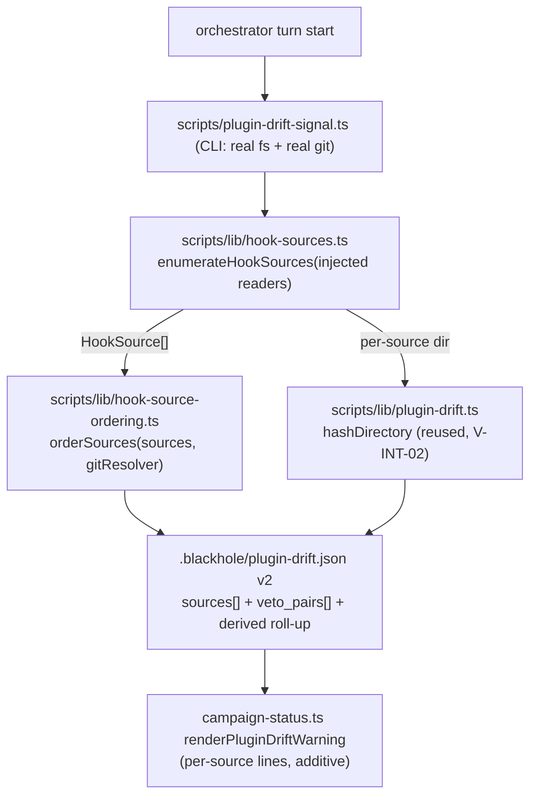

# ADR-044: Hook-source enumeration and provable ordering for the plugin-drift signal

## Status

Accepted — 2026-09-06 (owner ruling on issue #912, `design-aggregate.ts` verdict `blocked`).

**Relationship to ADR-030: amends, does not supersede.** ADR-030 stays `accepted` and binding.
Its mechanism 1 (`V-PLUGIN-01`, the diff-content version-bump BLOCK) is untouched. Its
mechanism 2's *decision* — an advisory, existence-gated, content-hash session signal that never
blocks — is preserved verbatim and is cited *for* this design. Only mechanism 2's **scope** is
widened here. A `## Post-acceptance amendments` entry on ADR-030 citing issue #912 records the
widening for a reader of ADR-030 alone.

## Requirements Framing

`scripts/plugin-drift-signal.ts:53-62` builds exactly one installed-cache path from the *repo's
own* `package.json` version —
`~/.claude/plugins/cache/blackhole-marketplace/blackhole/<projectIdentity.version>/hooks` — and
hands it to `computePluginDrift`, which returns `{installed_present: false, hooks_hash_match:
null}` when that directory does not exist (`scripts/lib/plugin-drift.ts:43-51`). The signal's
`installed_version` field (`scripts/plugin-drift-signal.ts:34`) holds the **repo's** version,
not the installed one: the name asserts a fact the value does not carry.

The wired copy on the reference workstation is user-scope **0.19.0** while the repo is at
0.21.8, so the signal reports "not installed" while that 0.19.0 copy actively vetoes
`git worktree remove` calls the repo's own checked-out hook code explicitly allows. Claude Code
merges PreToolUse hooks from every enabled source and composes them **deny-wins**, with no
override. The correct verdict is computed by the current code and then discarded by a stale one.

Four sources are registered for this repo and compose deny-wins:

| # | Source | Resolves to | Available baseline |
|---|---|---|---|
| 1 | project `.claude/settings.json` → `$CLAUDE_PROJECT_DIR/.claude/hooks/` (matchers `Bash`, `Write\|Edit`) | repo build output at the checked-out commit | commit-graph ancestry vs `origin/main` |
| 2 | `enabledPlugins` user scope (`blackhole@blackhole-marketplace: true`) → `${CLAUDE_PLUGIN_ROOT}` | `installPath` pinned at install time, decoupled from any checkout | `gitCommitSha` per install row |
| 3 | user `~/.claude/settings.json` `PreToolUse` matcher `"*"` → `~/.orca/agent-hooks/claude-hook.sh` | unrelated third-party automation | **none exists** |
| 4 | `.claude/settings.local.json` | absent on the reference workstation | — |

**The bridge that makes ordering tractable.** `~/.claude/plugins/installed_plugins.json` records
a resolvable `gitCommitSha` per install row. Verified read-only: the blackhole user-scope row is
version `0.19.0`, sha `2ed70f4c52718d0dfeea53fe53a4ac7ef72507c2`; `git cat-file -t` resolves it
to a commit; `git merge-base --is-ancestor 2ed70f4c origin/main` is true and the reverse is
false, so the ordering is strict, not merely different; and
`git rev-list --count 2ed70f4c..origin/main -- .claude/hooks/ templates/hooks/` counts **17**
hook-touching commits. "Older" becomes a proven ordering between a version tag and a checkout —
two things that looked incomparable.

### Binding constraints

1. **Assert ordering only where it is provable.** Three outcomes, all rendered distinctly, none
   collapsed into "no drift". `hashDirectory` is the belt-and-braces content check, never the
   ordering mechanism — content hash is the wrong tool for source 1, since a checked-out tree
   trivially hashes to itself.
2. **Prefer false positives, deliberately.** The false-negative direction has an incident
   history: it is #800 (three merged hook fixes silently inert for weeks) and it was reproducing
   at filing time. The worst case is a consumer repo with *only* the plugin-cache copy
   registered — the normal case for every consumer but blackhole itself — where a stale cache
   missing a new deny pattern lets a dangerous operation through while everyone believes the net
   is current. False-positive cost is bounded: an advisory line reading "differs, reason unclear".
3. **The signal stays advisory.** ADR-030 rejected a hard CI gate (its Option B) unanimously on
   both its blind critics' findings, because CI never has a populated plugin cache and this
   repo's `CheckResult{id, ok, detail}` contract has no tri-state. Nothing here reintroduces one:
   no `verify` check, no phase gate, no ledger append.

### Scope boundary with issue #919 (`V-INT-03`)

This ADR governs **config-time** enumeration and reporting. Issue #919 detects foreign denials at
**runtime** and consumes this enumeration. No runtime denial capture is decided here. Also
explicitly out of scope: a hook self-reporting its own path into the event record — it touches
`templates/hooks/**`, and decisively it only helps a copy that *already has* the field, which the
frozen 0.19.0 copy by definition does not.

## Options + Trade-off Matrix

Decision type **`architecture-choice`** (`design-rubric.md`) — the decision creates a new
structural boundary between the settings/plugin surface and the advisory signal. Fixed columns
and weights, not chosen ad hoc: Risk 30, Maintainability 25, Complexity 20, Reversibility 15,
Consistency-with-existing-pattern 10.

- **Option A** — enumerate all four layers plus `installed_plugins.json` into `HookSource[]`;
  compute pairwise ordering through an injected git resolver (`merge-base --is-ancestor` in both
  directions) plus hook-touching commit distance; `.blackhole/plugin-drift.json` becomes schema
  v2 with `sources[]` and `veto_pairs[]`, retaining `installed_present`/`hooks_hash_match` as a
  derived roll-up. Scope-resolution ambiguity is never adjudicated: all candidate install rows
  are reported.
- **Option B** — minimal correction: resolve the installed version from `installed_plugins.json`
  instead of the repo's own, keep the single-source shape.
- **Option C** — the same enumeration as A with every ordering field dropped; report presence,
  version and content hash only, and the veto in aggregate.

| Option | Risk (30) | Maintainability (25) | Complexity (20) | Reversibility (15) | Consistency (10) | Weighted |
|---|---|---|---|---|---|---|
| **A** — enumerate + SHA ordering | 5 | 4 | 3 | 4 | 5 | **4.20** |
| **B** — minimal version correction | 2 | 3 | 5 | 5 | 4 | **3.50** |
| **C** — enumerate, no ordering | 3 | 4 | 4 | 4 | 4 | **3.70** |

**ADR citation check (issue #775)**: `ADR-030-plugin-cache-version-bump-gate.md` was read in full
at the plan's read commit and carried **no** `## Post-acceptance amendments` section, so its
as-accepted text stood unamended when cited here as decisive precedent for "the signal stays
advisory". Amendment ground truth was independently re-resolved from the live ADR tree by
`design-aggregate.ts`'s `resolveAdrAmendmentTruth`, discarding every self-reported value.

## Adversarial Evaluation

Two blind critique-only `planner` sub-invocations, spawned with the Chosen field stripped, each
scoring all three options against the same fixed rubric. Their raw JSON — not prose — was the
deciding input to `scripts/design-aggregate.ts`.

| Scorer | A | B | C | Winner | Margin |
|---|---|---|---|---|---|
| primary | 4.20 | 3.50 | 3.70 | Option A | 11.90% |
| critic_a | 4.20 | 3.50 | 4.00 | Option A | 4.76% |
| critic_b | 3.65 | 3.85 | 4.10 | **Option C** | 6.10% |

**Both critics independently returned `discriminating`/`CRITICAL` against Option B**, and none
against A or C. Same grounding: B is the only option that *adjudicates* the scope-resolution rule
instead of reporting ambiguity, and a wrong row hashes a non-deciding copy, emits
`hooks_hash_match: true`, and renders silent — `renderPluginDriftWarning`
(`scripts/campaign-status.ts:42-49`) warns only on `hooks_hash_match === false`. That is the
forbidden false-negative direction, produced by the fix itself. Critic A supplied the fact that
makes it live rather than hypothetical: `installed_plugins.json` holds 38 blackhole rows, and the
same plugin carries a user-scope row at 0.19.0 alongside project-scope rows at 0.20.0 for
`clauderr` and `invest` — both scopes present for one repo at different versions. Both critics
also found B non-satisfying on AC1 and AC4 rather than merely narrower.

**The finding that decided it — critic_b's own objection to its own pick.** Option C is
structurally blind on source 1 and silent about it: source 1 resolves to the repo's build output
at the checked-out commit, so hashing it *against the repo's build output* trivially yields
`identical`, permanently, by construction. Since C's only per-source verdict is a content hash,
source 1 could never be reported stale even when the checkout is behind `origin/main` — a green
verdict that is an assertion which cannot fail (`V-UNFALSIFIABLE-01`, ADR-035). On the reference
workstation the project-native checkout is 14 commits behind `origin/main`, 4 of them
hook-touching, so the source C leaves permanently unchecked is stale *today*.

**Accepted, not rebutted — critic finding A-1 (both critics, `discriminating`/`NOTABLE`).**
Option A's ordering leg is inert on the majority consumer topology: `merge-base --is-ancestor`
and `git rev-list <sha>..origin/main` require the cited commit in the *local* object store and
require `origin/main` to *be* blackhole's main. A consumer repo that installed blackhole from the
marketplace has neither. A then degrades into its declared outcome (2),
version-differs-ordering-unproven, which is C's behavior at A's higher cost. The design's
response is disclosure: the git resolver is scoped to a verified blackhole clone, its absence
renders `ordering_available: false` **with a reason**, and the ordering claim is scoped to
self-hosting in Consequences below.

**Recorded rather than dismissed — critic_b's steelman for B** (`discriminating`/`MINOR`): on the
stated worst case, a consumer repo with only the cache copy registered, the scope rule *is*
unambiguous, so B resolves the correct row and flips the current false negative to a true
positive at the lowest cost. B's failure is coverage, not correctness within its scope.

**Critic_b's case for C, which is why this was a genuine 2-1 split**: A is a strict superset of C
— same enumeration module, same scan, same `sources[]` schema plus ordering fields — so the
ordering half is purely additive later with **no schema rework**. That argument is correct on its
own terms and does not survive the source-1 finding above: shipping C first ships an
unfalsifiable control for one of four sources, which is a worse posture than reporting nothing
for it.

**Domain-inherent, shared by all three (informational, not a discriminator).** Every option
operates at config time and infers the enforcing copy from *registration*, never from an observed
decision (#919). Any can render fully clean while a source outside its four-layer scan issues the
deny; the signal therefore states its own scan boundary **in its output**, so a clean render
never reads as "the net is current" — the same false-confidence shape #800 produced. Second
shared item: `walkFilesAbs` returns `[]` for an absent directory (`scripts/lib/fs.ts`), so
`hashDirectory` over a missing path returns a well-formed sha256 of nothing and two absent
sources read as identical; source 3 is a single file inside a directory of 14 unrelated hook
scripts. An explicit absent / file-vs-directory state is required rather than letting
`hashDirectory` paper over either — the same first-class-absence discipline `computePluginDrift`
already applies.

## Decision

Adopt **Option A**.

1. **Enumerate every registered PreToolUse source.** A new pure module
   `scripts/lib/hook-sources.ts` (injected fs/paths — the testability idiom `computePluginDrift`
   already uses) reads the four settings layers plus `~/.claude/plugins/installed_plugins.json`
   and emits `HookSource[]`: `{layer, origin_kind: 'repo-build' | 'plugin-cache' | 'foreign',
   resolved_path, present, version | null, commit_sha | null, content_hash | null}`.
2. **Assert an ordering only where a resolvable commit SHA proves one.**
   `scripts/lib/hook-source-ordering.ts` takes `HookSource[]` and an injected git resolver and
   renders exactly three outcomes, none collapsed into "no drift":
   - **strict ordering** — both sides SHA-resolvable: `merge-base --is-ancestor` run in **both**
     directions, yielding `older` / `newer` / `identical` / **`diverged`** (two installs off
     different branches — its own state); staleness is the hook-touching commit distance
     `git rev-list --count <sha>..origin/main -- .claude/hooks/ templates/hooks/`;
   - **version differs, ordering unproven** — a version string but no resolvable SHA: report the
     difference, never an ordering, never a guess from version strings;
   - **no baseline** — a foreign source: presence and deny-wins participation only, rendered as
     its own state in the clean case as well as the drifted one.
3. **Flag the deny-wins veto explicitly.** A `veto_pairs[]` entry is emitted for each pair where
   one registered source is provably older than another, naming it as able to override.
4. **Never adjudicate the scope-resolution rule.** When more than one install row could apply to
   a project, **all** candidates are reported and none is picked (see Assumption Audit A-1).
5. **`.blackhole/plugin-drift.json` becomes schema `version: 2`**, carrying `sources[]` and
   `veto_pairs[]`, with `installed_present` and `hooks_hash_match` retained as a derived roll-up
   so `renderPluginDriftWarning` keeps working. `scripts/lib/plugin-drift.ts` is unchanged and
   its `hashDirectory` is reused per-source (`V-INT-02`).
6. **Advisory throughout.** Dashboard lines only; no `verify` check, no phase gate, no ledger
   append.

## Component Decomposition

Genuinely multi-component: this introduces a boundary between "what is registered" (settings and
plugin surface) and "how do the registered things compare" (git and content), where one guessed
path expression stood before.



| Component | Responsibility | Explicitly not its job |
|---|---|---|
| `scripts/lib/hook-sources.ts` | Parse the four settings layers plus `installed_plugins.json` into `HookSource[]`; classify `origin_kind`; report **all** candidate install rows | Never compares, never orders, never shells to git |
| `scripts/lib/hook-source-ordering.ts` | Pairwise ordering and hook-touching commit distance via an injected git resolver; emit `veto_pairs[]` | Never reads settings; never decides which source is "the" enforcing one |
| `scripts/lib/plugin-drift.ts` | Unchanged; `hashDirectory` reused per-source | — |
| `scripts/plugin-drift-signal.ts` | CLI wiring: real fs, real git, atomic write, one console line | No detection logic of its own |
| `scripts/campaign-status.ts` | Render per-source lines | No detection logic |

## Design Principles Validation

| Axis | Score | Justification |
|---|---|---|
| SRP | `✓` | Enumeration, ordering, hashing and rendering are four modules with disjoint inputs; collapsing enumeration and comparison into one path expression is precisely the defect being fixed. |
| DIP | `✓` | fs, paths and the git resolver are injected — the contract `computePluginDrift` already honors, and what lets the red-before-green fixtures run without touching `~/.claude`. |
| DRY | `✓` | `hashDirectory`/`walkFilesAbs` reused, not reimplemented (`V-INT-02`); the atomic tmp+rename idiom and the existence-gated turn-start shape are inherited from `doc-health-signal.ts`. |
| KISS | `~` | Two new modules plus a git resolver where one path expression stood. Contestable — this is critic_b's dissent. Held because the single expression is what produced a confidently wrong answer. |
| YAGNI | `~` | `veto_pairs[]` and the `diverged` state have no *current* instance on the reference workstation. Held because AC4 names the veto case and `diverged` is the "two installs off different branches" case the issue's corrections explicitly required not be collapsed. |
| Pattern (advisory signal) | `✓` | Follows the established `<name>-signal.ts` + `.blackhole/<name>.json` + `render*Warning` triple exactly; no fourth signal shape is introduced. |

## Refactoring Impact Analysis

Direct `git grep` scan over every consumer of the signal's type, JSON file and prose (build-output
trees excluded — they regenerate from `src/`).

| Consumer | Classification | Note |
|---|---|---|
| `scripts/campaign-status.ts:42` `renderPluginDriftWarning` | TRANSPARENT | Reads `hooks_hash_match`, retained as a derived roll-up over `sources[]`; per-source lines are additive. |
| `scripts/campaign-status.test.ts:576-613` | **BREAKING** | Four `PluginDriftSignal` object literals must gain the new required fields or fail typecheck. |
| `scripts/plugin-drift.test.ts:86-118` | **BREAKING** | `computeSignal` expectation and the `writePluginDriftSignalAtomic` fixture are exact-shape literals. |
| `src/references/blackhole-state.md:310-320` § Plugin-Drift Signal | DEPRECATION | Prose describes the single-cache-path mechanism; cadence and existence gating stay correct. Must be rewritten. |
| `src/references/orchestrator-runtime.md:180` | TRANSPARENT | Turn-start invocation line unchanged. |
| `src/references/phase-loop.md:164` | TRANSPARENT | Cross-reference to the scan only. |
| `templates/hooks/pretooluse/README.md:50` | DEPRECATION — **deliberately not touched** | Editing anything under `templates/hooks/**` trips `V-PLUGIN-01`'s mandatory `package.json` version bump in the same diff. Accepted residual: that line's description goes one release stale. |
| `src/references/audits/29-plugin-cache-version-bump-audit.md:27` | TRANSPARENT | Names the signal as the covering mechanism; still true. |
| `scripts/lib/plugin-drift.ts:43` `computePluginDrift` / `hashDirectory` | TRANSPARENT | Retained and reused per-source. |

Two BREAKING consumers are declared, both in-repo test files updated in the same diff; there is no
external runtime consumer of `.blackhole/plugin-drift.json`. `design-aggregate.ts` treats any
declared BREAKING as an automatic block regardless of scoring margin (ADR-010 D4's
no-confidence-bypass default), which is one of the three reasons in the verdict below.

## Assumption Audit

| # | Assumption | Mark | Note |
|---|---|---|---|
| A-1 | **Scope resolution: project-scope overrides user-scope for a matching `projectPath`, else user-scope applies.** | `~` | **Reconstructed from observed data, never read from a specification.** Corroborated four ways: blackhole's own `.claude/settings.json` has no `enabledPlugins` key; `clauderr` and `invest` both declare one and appear as project-scope rows; no `installed_plugins.json` row carries `projectPath` equal to the blackhole repo, so the user-scope 0.19.0 row is the only candidate; and a cache copy is empirically executing with byte-identical deny text. **Untested: both scopes present for one repo, and a project explicitly disabling a plugin (`enabledPlugins: {"x@y": false}`).** The first of those two is **live data on this machine right now** — `installed_plugins.json` carries a user-scope 0.19.0 row alongside project-scope 0.20.0 rows for `clauderr` and `invest` — so the case is directly observable and testable here; that does **not** make the precedence rule verified, since it still was never read from a specification. The design's response is not to resolve the assumption but to **never rely on it**: when more than one install row could apply, all candidates are reported and none is adjudicated. A signal that encoded this guess as fact would repeat the founding error of the issue it fixes — asserting `installed_present: false` with more confidence than the evidence supported. |
| A-2 | `gitCommitSha` in `installed_plugins.json` resolves in a blackhole clone's object store | `✓` | Verified: `git cat-file -t 2ed70f4c…` → `commit`; ancestor of `origin/main` in one direction only; 17 hook-touching commits behind. |
| A-3 | The same `gitCommitSha` resolves in a **consumer** repo's clone | `✗` | **Incorrect** — critic finding A-1. It does not, and the consumer's `origin/main` is a different project. Ordering degrades to outcome (2) there by design, not by accident. |
| A-4 | Claude Code composes PreToolUse hooks deny-wins with no override | `✓` | Byte-identical deny reproduction in issue #912, corroborated by the live denial received. |
| A-5 | Enumerating the four settings layers finds every registered PreToolUse source | `◐` | **Blind spot, shared by all three options.** An enabled plugin whose own bundled settings register a matcher the scan does not parse stays invisible. Mitigation is disclosure, not detection: the signal states its own scan boundary in its output so a clean render never reads as "the net is current". |
| A-6 | `installed_plugins.json`'s shape is stable | `~` | Platform-owned, unversioned, can change without notice. What is controlled is the degradation direction: report-all-candidates keeps a silent shape change in the false-positive direction. |
| A-7 | The signal stays advisory and blocks nothing | `✓` | ADR-030's as-accepted decision; its Option B (a `verify` check) was rejected unanimously by both its blind critics because CI never has a populated plugin cache. |

## Falsifiability

The control must demonstrate it can fail (`V-UNFALSIFIABLE-01`, ADR-035). Every fixture is path-
and resolver-injected, so none touches `~/.claude` or the main clone.

**Red state — the captured workstation state, as a fixture.** Source 1 a repo-build copy whose
checkout is **14 commits behind `origin/main`, 4 of them hook-touching**; source 2 a plugin-cache
copy at version 0.19.0 whose `gitCommitSha` (`2ed70f4c…`) is a strict ancestor of the repo head
with **17** hook-touching commits between; source 3 a foreign source with no version and no SHA;
source 4 absent. Expected: source 2 rendered `ordering: "older"`, `hook_commits_behind: 17`; a
`veto_pairs[]` entry naming source 2 as able to override source 1; source 1 rendered stale on
**commit distance**; source 3 rendered `baseline: "none"` as its own state. The test fails if any
of those collapse into a clean render.

**Green state — after refresh.** Same fixture with the cache source's SHA equal to the repo head
and its content hash equal to the repo build's. Expected: no `veto_pairs[]`,
`ordering: "identical"`, and — critically — source 3 **still** rendered `baseline: "none"`,
because a source of unverifiable provenance never becomes clean. `diverged` and `no baseline` are
both rendered in the red *and* the green fixture, so neither can be silently folded into "no
drift".

**Four discriminating fixtures the current code passes and a mis-implementation must fail:**

1. *Version-mismatch blindness (the live bug).* Repo at 0.21.8, cache present at 0.19.0. Current
   code returns `installed_present: false`; new code must report the source present. A fixture
   using a *matching* version passes under the current broken code and is worthless.
2. *Diverged, not older.* Two SHA-bearing sources, neither an ancestor of the other. Must render
   `diverged`. A one-direction `--is-ancestor` implementation reports "not older" and reads as
   clean; this fixture catches it.
3. *Version differs, ordering unproven.* A cache source whose `gitCommitSha` does not resolve.
   Must render outcome (2) and must not guess an ordering from version strings.
4. *Source 1 cannot self-certify.* A repo-build source whose content hashes identical to the repo
   build (always true) but whose checkout is behind `origin/main`. Must be reported stale on
   commit distance, not clean on content. This is the fixture Option C fails, and the reason
   Option C was not chosen.

**Environment naming (fail loudly, not silently).** When the repo is not a blackhole clone, or a
cited SHA does not resolve, the signal renders `ordering_available: false` **with the reason** —
never an ordering, never silence.

**Live end-to-end demonstration**, recorded in the implementing PR: invoke the signal before any
plugin refresh and show the `veto_pairs[]` entry naming the 0.19.0 cache copy as able to override
the project-native build; refresh per `blackhole-protocol.md` § Branch & Worktree Hygiene;
re-invoke and show the entry gone while source 3 stays `baseline: "none"`.

## Alternatives Considered

- **Option B — minimal version correction** (resolve the installed version from
  `installed_plugins.json`, keep the single-source shape). Rejected on two independent
  `discriminating`/`CRITICAL` findings, one from each blind critic: it is the only option that
  *adjudicates* the untested scope-resolution rule, and a wrong row yields
  `hooks_hash_match: true`, which `renderPluginDriftWarning` renders as silence — the forbidden
  false-negative direction produced by the fix itself. It also satisfies neither AC1 nor AC4,
  leaving the foreign source permanently invisible. Its steelman is recorded above and stands:
  on a consumer repo with only the cache copy registered it is the cheapest correct answer.
- **Option C — enumerate, assert no ordering** (critic_b's own pick, 4.10 weighted vs. A's 3.65
  on critic_b's scoring). Rejected on critic_b's own finding against it: hashing the repo build
  against the repo build yields `identical` permanently, by construction, so source 1 could never
  be reported stale and its green verdict would be an assertion that cannot fail
  (`V-UNFALSIFIABLE-01`). The source C leaves unchecked is 14 commits — 4 hook-touching — stale
  today. Its enumeration half is not discarded: Option A is a strict superset of it.
- **A hard CI gate on drift** — not re-proposed. ADR-030 rejected it unanimously on both its blind
  critics' findings (CI has no populated plugin cache; the binary `CheckResult` contract has no
  tri-state), and that reasoning is unchanged.

## Consequences

**Positive.** The signal reports what is actually registered rather than one path guessed from
the repo's own version, so the reproducing failure — a stale copy vetoing calls the current code
allows while the signal says "not installed" — becomes visible at turn start. Ordering is a
proven fact where a SHA resolves, not an inference from version strings. Three outcomes are
rendered distinctly, so an unverifiable or foreign source can never be folded into "no drift".
Every degradation path lands in the false-positive direction, which is the deliberate choice
given #800's history.

**Negative / accepted.** The ordering leg is **effectively self-hosting-only**: in a consumer
repo, blackhole's commit history is absent from the local object store and `origin/main` is a
different project, so every plugin-cache source there degrades to
version-differs-ordering-unproven. That is disclosed in the signal's own output
(`ordering_available: false` with a reason), not papered over — but it means consumers get
Option C's behavior for the ordering half while paying Option A's build cost. Two in-repo test
files are BREAKING consumers and change in the same diff. `templates/hooks/pretooluse/README.md`
keeps a one-release-stale description of the signal, deliberately, because editing it would trip
`V-PLUGIN-01`'s version-bump obligation for a documentation-only change. The scope-resolution
rule remains an unverified assumption about platform behavior; the design's answer is to never
rely on it rather than to resolve it, which costs an occasional multi-candidate report.

**Boundary.** Everything here is config-time. Which copy actually decided a live call is only
observable at runtime, and that is issue #919. A clean render therefore means "nothing the
four-layer scan can see is stale", not "the net is current" — the signal says so in its own
output.

**Operational.** New `scripts/lib/hook-sources.ts` and `scripts/lib/hook-source-ordering.ts`
(pure, injected fs/paths/git-resolver) plus `scripts/hook-sources.test.ts`;
`scripts/plugin-drift-signal.ts` emits schema `version: 2`; `scripts/campaign-status.ts` renders
per-source lines; `src/references/blackhole-state.md` § Plugin-Drift Signal rewritten and all
generated dist trees rebuilt per `scripts/lib/build/targets.ts`; a `## Post-acceptance
amendments` entry appended to ADR-030 citing issue #912. `scripts/lib/plugin-drift.ts` and
`templates/hooks/**` are untouched.

## Gate

`autonomy.design_autonomy: true`, so `scripts/design-aggregate.ts` was invoked with the primary's
weighted matrix, both blind critics' raw JSON, the Refactoring Impact rows and every
`adr_citations[]` entry. Its verdict, not the planner's judgment (`V-AUTO-01`):

```json
{
  "status": "blocked",
  "winner": null,
  "reasons": ["dominance", "disagreement", "breaking-consumer"],
  "scorer_results": [
    { "scorer": "primary",  "winner": "Option A", "margin": 11.90 },
    { "scorer": "critic_a", "winner": "Option A", "margin": 4.76 },
    { "scorer": "critic_b", "winner": "Option C", "margin": 6.10 }
  ]
}
```

Blocked on all three counts: no option cleared the 30% dominance bar, the scorers disagreed 2-1,
and two BREAKING consumers were declared. **Resolved by owner ruling for Option A** on issue #912,
turning on critic_b's own `V-UNFALSIFIABLE-01` finding against its own pick — the source Option C
would leave permanently unchecked is stale today. This ADR records that ruling; it is not a
planner self-certification, and the `blocked` verdict above stands as the machine's own reading.

Doc-schema detection (`scripts/detect-doc-schema.sh`) returned `schema=blackhole` at all three
artifact layers — `documentation/INDEX.md`, `documentation/decisions/INDEX.md`, and a sibling
ADR's frontmatter — so this ADR and its INDEX row are rendered in blackhole's own schema and no
`V-INT-01` WARN is emitted.
