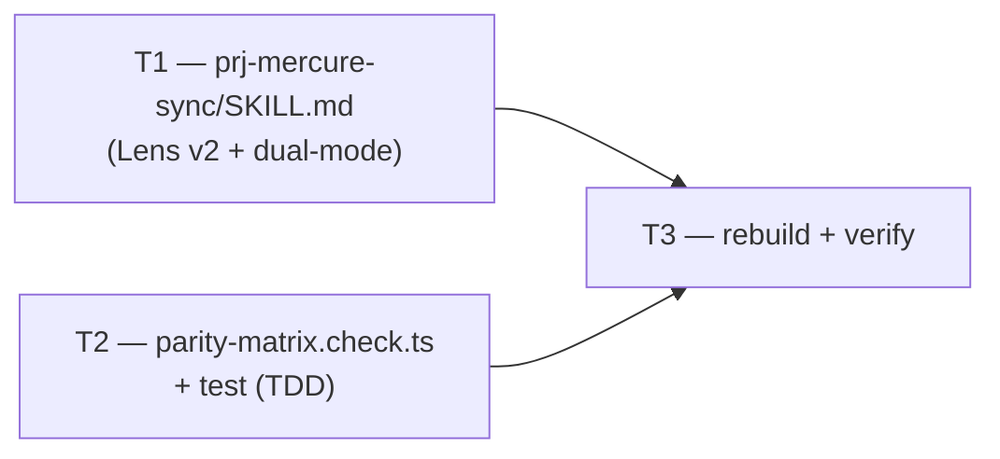

# M1 — Sync v2 + Lens v2 + verify check (ADR-013 D2/D3)

> **Milestone M1** · Wave 1 · Depends on: — · Status: pending
>
> The Adoption Lens must be live before any matrix row is seeded — ADR-013's Migration Plan
> step 2 ships Lens v2 and the verify check in one PR for exactly this reason. M2 (matrix seed,
> ~70 `PM-NNN` rows) depends on this milestone; this milestone depends on nothing.

## Objective

Close ADR-013 D2 (tiered Adoption Lens v2) and D3 (`prj-mercure-sync` dual-mode workflow):
rewrite `.claude/skills/prj-mercure-sync/SKILL.md` in place, replacing the REJECT-biased lens
with the tiered enforcement→ADOPT / workflow→ADAPT-async / runtime-ops→N/A classification, and
replacing the single changelog-skimming workflow with two named entry modes — release mode
(impact-analyze a new mercure release against touched matrix rows) and backlog mode
(matrix-driven top-priority `gap`/unswept sweep). Add one additive verify check,
`scripts/checks/parity-matrix.check.ts`, validating the D1 row schema (row-id uniqueness,
status-enum validity, `in-flight`-requires-ref, `gap`-requires-priority) — it **must SKIP**
(return `ok: true`) when `documentation/audits/mercure-parity-matrix.md` does not exist yet,
since M2 is the milestone that creates and seeds that file. Scope is **M1 only**: no matrix
rows are seeded here, no `src/agents/*` (campaign-runtime) file is touched, and
`src/references/config-template.md` is deliberately **not** extended (see § Strategy).

**Threat Model**: Not required. Internal maintainer-tooling change (one prose skill file, one
new read-only verify check) with no network surface, no auth boundary, no user-data path, and
no campaign-runtime code path — `prj-mercure-sync` never ships to consumer repos.

## Touch-Paths

Exactly four files, all outside `src/agents/` and outside `src/references/config-template.md`:

### T1 — `.claude/skills/prj-mercure-sync/SKILL.md` (rewrite, existing file)

Maintainer-only project skill (`disable-model-invocation: true`), lives outside `src/` by
design (`blackhole-protocol.md` § Campaign state vs. agent handoff dirs exempts `prj-*` from
the `src/`-is-canonical-source rule) — this file is edited **directly**, no `bun run build`
step regenerates it.

**AC (measurable)** — the rewritten `## Adoption Lens` section (renamed `## Adoption Lens v2`):

(a) Contains a 3-row tier table with columns `Tier | Default | Burden of proof`, reproducing
ADR-013 D2 verbatim in substance: Enforcement/quality mechanisms (V-codes, checklists, gates,
verification protocols) → **ADOPT**, burden "rejecting requires showing it structurally cannot
work autonomously"; Workflow/interaction mechanisms (approval gates, chaining, interview) →
**ADAPT** (translate to async seams: `status: blocked`, confidence gates, deterministic
verdicts), burden "adopting verbatim requires showing no sync-HITL dependency"; Domain/runtime-
ops mechanisms (SRE, incident response, deployment) → **N/A**, burden "adopting requires
showing backlog-orchestration relevance".

(b) States the exactly-two surviving hard rejections verbatim: (1) synchronous mid-loop HITL
as a primitive — blackhole's answer remains async `AskQuestion` + `status: blocked`; (2)
non-agent-agnostic campaign-runtime mechanisms — state stays harness-portable under
`.blackhole/` + `documentation/`. The old lens's "almost never a new skill" and "not this
domain" bullets are retained but reframed as the tier-2/tier-3 **defaults** (rebuttable), not
as REJECT clauses — do not delete the extension-seam-reuse discipline (`V-INT-02`) itself, only
its framing as a hard rejection.

(c) States `V-PARETO-02` remains the sole prioritizer and never overrides a tier
classification (verbatim from ADR-013 D2's closing sentence).

(d) The `## Workflow` section is replaced with two named, numbered entry modes:
- **Release mode** (trigger: new mercure release above the watermark) — read release notes +
  plugin cache delta; map each change to touched `PM-NNN` matrix rows (citing rows by id, per
  D1's single-writer/row-id-citation contract); re-verify only the touched rows; on ambiguous
  mapping or a cross-cutting change (e.g. `rules/`), widen the re-check to the affected `kind`
  tier; update rows, file gated issues, bump the watermark, append a run-log entry.
- **Backlog mode** (trigger: maintainer invocation, no new release required) — take the
  top-priority `gap`/unswept rows (ordered by the row's `priority` field, `V-PARETO-02`); deep-
  compare each against the pinned plugin cache; classify via Lens v2; update rows; file gated
  issues.

Both modes explicitly restate, unchanged from today's skill: `V-HUNT-01` verify-before-file;
the filing cap (`mercure_sync.max_issues_per_run`, default 5) and `min_priority` floor
(default 30); dedup against open issues **and** matrix `in-flight` refs (new — today's skill
only dedups against open issues and its own Outcome table); the skill never writes
`queue.json`/`findings-ledger.json`.

(e) The `## Contract` table gains one row: `Parity matrix | documentation/audits/mercure-parity-matrix.md` — path-only citation. Do not add seeding logic, row content, or a coverage-table
migration step in this milestone (M2's scope); the row exists so the rewritten workflow text
in (d) has something concrete to cite when it says "matrix rows."

(f) The lens verdict discipline is stated once, explicitly: "A Lens v2 verdict lands as a
matrix row **status transition** (`gap → in-flight(ref)`, `→ adapted`, `→ covered`, or
`N/A(reason)`), never as prose only" (ADR-013 D1's anti-"asserted, not measured" clause) — add
this as a new bullet under `## Never`, replacing the removed REJECT-framing bullets from (b).

(g) `## Prerequisites` gains one bullet: `documentation/audits/mercure-parity-matrix.md` exists
(created by M2's seed run) — release mode and backlog mode both require it; until M2 ships,
this skill's dual-mode workflow text is written but not yet runnable end-to-end (the verify
check in T2 tolerates this by design, see T2's AC).

**Rollback**: revert this hunk alone. `prj-mercure-sync/SKILL.md` reverts to the REJECT-biased
lens and single changelog-skimming workflow (today's behavior). Nothing else in this milestone
references SKILL.md's prose content, so the revert is clean and isolated.

### T2 — `scripts/checks/parity-matrix.check.ts` + `scripts/verify.parity-matrix.test.ts` (new, TDD)

New verify domain, one check id: `V-PMATRIX-01`. Mirrors the existing
`scripts/checks/{domain}.check.ts` / `scripts/verify.{domain}.test.ts` pairing exactly (see
`single-writer.check.ts` / `verify.single-writer.test.ts`) — pure `runChecks(): CheckResult[]`
export, glob-discovered by `scripts/verify.ts`, no registry file to update.

**Parses**: the first markdown table in `documentation/audits/mercure-parity-matrix.md` whose
header row matches the D1 row schema (`| id | kind | mechanism | blackhole | status | priority
| verified |`, case-insensitive, order-sensitive — same header-detection technique as
`detect-doc-schema.sh`'s `index` mode from the companion-substrate-closure M1 precedent, though
this check is markdown-table validation, not schema detection, so no shared code between them).

**Validates**, per data row:
1. **Row-id uniqueness** — no two rows share the same `id` cell.
2. **Status-enum validity** — `status` cell matches `covered`, `adapted`,
   `in-flight(\S+)`, `gap`, or `N/A(\S+)` (regex-anchored; the D1 schema's five legal values).
3. **`in-flight`-requires-ref** — a `status` cell that is exactly `in-flight` (no parenthetical)
   fails; `in-flight(...)` with a non-empty parenthetical passes. Mirrors D1: "`in-flight` rows
   MUST carry a ref; a bare `in-flight` fails validation."
4. **`gap`-requires-priority** — a row with `status: gap` and an empty/missing `priority` cell
   fails (D1: `priority` is "for `gap` rows only", implying it is mandatory when `status: gap`).

All four validations run in one pass; every failing row's `id`/line is joined into a single
`detail` string on one `CheckResult` (`errors.join('; ')`), matching the aggregate-errors
pattern already used by `V-SCHEMA-01`, `V-GATE-01`, `V-ADADOC-01` in `scripts/checks/core.check.ts` and `companion-docs.check.ts` — not four separate check ids.

**File-absent SKIP (binding requirement)**: if `documentation/audits/mercure-parity-matrix.md`
does not exist, return `{ id: 'V-PMATRIX-01', ok: true }` immediately — no read, no parse.
Exact precedent: `scripts/checks/core.check.ts`'s `V-PLAN-01` (`checkPlanArtifacts`,
`if (!fs.existsSync(queueFile)) return { id: 'V-PLAN-01', ok: true };`). This is the mechanism
that lets this check land in M1 while the matrix file itself is only created in M2 — the check
is inert (always green) until M2 ships, then becomes load-bearing without any further code
change.

**AC (measurable)**: `bun test scripts/verify.parity-matrix.test.ts` starts RED with 12 cases
written first, all GREEN after implementation:
1. Matrix file absent → `ok: true` (skip branch, no parse attempted).
2. Well-formed matrix (unique ids, valid statuses, `in-flight` rows with refs, `gap` rows with
   priority) → `ok: true`.
3. Duplicate `PM-NNN` id across two rows → `ok: false`, detail cites both offending ids.
4. Invalid status value (e.g. `done`, not in the five-value enum) → `ok: false`.
5. Bare `in-flight` (no parenthetical ref) → `ok: false`.
6. `in-flight(#301)` with a ref present → passes (paired positive case for 5, not a separate
   failure).
7. `gap` row with empty/missing `priority` cell → `ok: false`.
8. `gap` row with a numeric `priority` → passes (paired positive case for 7).
9. `N/A(reason)` with a non-empty reason → passes; bare `N/A` (no reason) → `ok: false` (same
   ref/reason-required shape as case 5, applied to the `N/A` branch).
10. A fixture with multiple simultaneous violations (case 3 + case 4 combined) → single
    `ok: false` result whose `detail` contains all offending ids/reasons, not just the first.
11. Malformed table — header row present but no `|---|` separator, or no header row found
    before EOF — → `ok: false` with a parse-error detail, distinct from the file-absent SKIP
    branch (case 1); the check must never silently pass on a present-but-broken file.
12. Contract test: in every branch above, the result's `id` is exactly `V-PMATRIX-01` and the
    function never throws — `bun test` exits 0.

`scripts/build.ts:288` `EXPECTED_CHECK_COUNT` bumps `28 → 29` (one new domain file contributing
exactly one check). `VCODE_TABLE_ROW_COUNT` (`scripts/build.ts:277`, currently 46) stays
unchanged — `V-PMATRIX-01` is verify-machinery, not a `blackhole-vcodes.md` campaign-runtime
V-code row (same non-membership as `V-PLAN-01`, `V-SCHEMA-01`, `V-WRITE-01`, `V-BUILD-01`,
none of which appear in that table either).

**Rollback**: delete both new files, revert `EXPECTED_CHECK_COUNT` to 28. Nothing else
references `V-PMATRIX-01` until M2 seeds the matrix, so the revert is clean and isolated —
identical isolation shape to companion-substrate-closure M1's T1a rollback.

## Strategy

**Ordering**: T1 (skill rewrite) and T2 (verify check) touch disjoint files and have no
data dependency on each other within this milestone — both can run in parallel. Final gate
(T3 below) runs after both merge.

**Decision — `src/references/config-template.md` is deliberately not extended.** The easy path
is to add a `mercure_sync` block to `config-template.md` alongside `docs_governance`/`kaizen`/
`incident_mode`/`autonomy`, for documentation symmetry. Rejected: `config-template.md` is
titled "Campaign Config Template" — it documents `.blackhole/config.json`, the config that
ships to and governs a **consumer repo's campaign runtime**. `prj-mercure-sync` is explicitly
not campaign runtime (ADR-013's own Design Principles Validation table: "Maintainer tooling
(sync/matrix) fully separated from campaign runtime", SRP/SoC = PASS) and never runs against a
consumer repo. Its `mercure_sync` config block (`enabled`, `max_issues_per_run`, `min_priority`)
already has a home — the skill's own `## Contract` table — and stays there. Moving or
duplicating it into `config-template.md` would blur exactly the boundary D3 depends on.
Confidence: High. No new config fields are introduced by dual-mode: release mode's "which
release" input comes from the existing watermark frontmatter field, and backlog mode's "top-N"
selection reuses the row's existing `priority` field — reusing existing config surface, not
adding new fields, is itself the harder-but-correct choice over inventing a `matrix_batch_size`
knob nobody asked for (`V-YAGNI-01`).

**Decision — T1 is not TDD-gated the way T2 is.** `mercure-quality-gates.md`'s TDD mandate
targets executable logic ("write production code before its test"). T1 is a maintainer-facing
prose rewrite of a `disable-model-invocation` skill file with no test harness in this repo for
skill prose (no precedent — `single-writer.check.ts`/`design-track.check.ts` gate *agent*
files' prose via `findMissingGateMarkers` string-presence checks, but no such check exists or
is requested for `prj-*` skills, and inventing one here would be scope creep beyond what ADR-013
or the initiative asks for). T1's rigor instead comes from the AC checklist in its Touch-Paths
section above (7 sub-checks, (a)–(g)), each independently verifiable by reading the diff.
T2, by contrast, is genuine new logic (markdown-table parsing + four validation rules) and
follows the full RED→GREEN TDD cycle per the 12-case spec.

## Issue DAG

Waves: **W1** T1, T2 (parallel — disjoint files, no shared dependency) → **W2** T3.

## Execution Assignments

| Agent | Task(s) | Model | Delegation Contract |
|-------|---------|-------|----------------------|
| blackhole:implementer | T1 | sonnet | **Objective**: rewrite `.claude/skills/prj-mercure-sync/SKILL.md` per T1's 7-point AC ((a)–(g)) — tiered Lens v2 table, two named workflow modes, Contract-table matrix row, restated unchanged disciplines, `## Never` bullet update. **Output format**: edit to `.claude/skills/prj-mercure-sync/SKILL.md` only. **Scope**: this file only, isolated `wt-<issue>` worktree, `blackhole/issue-N` branch; do not touch `src/agents/*` or `src/references/config-template.md`. **Tool guidance**: read ADR-013 D2/D3 verbatim before writing — the AC requires substantive (not paraphrased-into-vagueness) reproduction of the tier table and the two hard rejections. **Stop condition**: all 7 AC sub-points present in the diff; `## Adoption Lens v2` and `## Workflow` (release mode / backlog mode) headings exist. |
| blackhole:implementer | T2 | sonnet | **Objective**: write failing tests then implement `scripts/checks/parity-matrix.check.ts` per T2's 12-case spec, including the file-absent SKIP branch. **Output format**: new `scripts/checks/parity-matrix.check.ts` + new `scripts/verify.parity-matrix.test.ts` (bun:test), plus a one-line edit to `scripts/build.ts:288` (`EXPECTED_CHECK_COUNT: 28 → 29`). **Scope**: these three files only. **Tool guidance**: read `scripts/checks/core.check.ts`'s `checkPlanArtifacts`/`V-PLAN-01` first — it is the exact file-absent-skip precedent this check must follow; read `scripts/checks/single-writer.check.ts` + `scripts/verify.single-writer.test.ts` for the paired-file shape. **Stop condition**: all 12 cases RED before implementation, all GREEN after; `bun test scripts/verify.parity-matrix.test.ts` exits 0; `EXPECTED_CHECK_COUNT` is exactly 29. |
| blackhole:reviewer | Review of every PR (T1, T2) | sonnet | **Objective**: audit each PR against `blackhole-vcodes.md`, this plan's Touch-Paths, and the config-template.md exclusion decision in § Strategy. **Output format**: `review-aggregate.ts`-consumed findings JSON per `worker-schemas.md` § Reviewer. **Scope**: read-only — no Write/Edit. **Tool guidance**: on the T1 PR, spot-check that all two (not more, not fewer) hard-rejection bullets survive verbatim and that the tier table's three burden-of-proof cells are present, not summarized away; on the T2 PR, spot-check that case 11 (malformed-but-present file) is distinct from case 1 (absent file) in the actual test fixtures, not collapsed into one case. **Stop condition**: zero CRITICAL/HIGH findings, or explicit user-approved exception. |
| blackhole:implementer | T3 | sonnet | **Objective**: run the full quality gate — `bun run build`, `bun test`, `bun run verify` — per T3's AC. **Output format**: pass/fail report quoting command output (verification-evidence gate). **Scope**: repo root, no edits expected unless a gate fails, in which case fix forward on T1 or T2. **Tool guidance**: confirm `bun run build` produces a **clean git diff** — this milestone touches zero `src/` files, so build output (`.claude/skills/*` non-`prj-*`, `.cursor/`, `codex-*`) must be byte-identical to before; confirm `EXPECTED_CHECK_COUNT` is 29 and `VCODE_TABLE_ROW_COUNT` is unchanged at 46. **Stop condition**: all three commands exit 0; build diff is empty; both ground-truth counters at their expected values. |

**Parallelization**: W1 (T1, T2) runs as a two-agent parallel batch with no file overlap; T3
starts only after both W1 tasks merge.

## Codebase Conventions

| Touchpoint | Convention | Source | Required by |
|------------|------------|--------|--------------|
| Verify-check shape | Pure `runChecks(): CheckResult[]` export, glob-discovered by `scripts/verify.ts`, no central registry | `scripts/checks/single-writer.check.ts`, `scripts/verify.ts:16-27` | T2 |
| Paired test-file naming | `scripts/verify.{domain}.test.ts` (not `scripts/checks/{domain}.test.ts`) | `scripts/verify.single-writer.test.ts` | T2 |
| File-absent SKIP branch | `if (!fs.existsSync(file)) return { id, ok: true };` before any read/parse | `scripts/checks/core.check.ts` `checkPlanArtifacts` / `V-PLAN-01` | T2 (binding requirement — matrix doesn't exist until M2) |
| Aggregate-errors CheckResult | One check id per domain concern; all row-level failures joined into one `detail` via `errors.join('; ')`, not one id per validation rule | `scripts/checks/core.check.ts` `V-SCHEMA-01`/`V-GATE-01`; `companion-docs.check.ts` `V-ADADOC-01` | T2 |
| `EXPECTED_CHECK_COUNT` bump discipline | Bump alongside any new domain file or any change to an existing domain's `runChecks()` array length; `verify.ts` only warns (never fails) on mismatch | `scripts/build.ts:288` doc comment | T2 |
| Maintainer skill structure (`prj-*`) | Frontmatter (`name`, `description`, `disable-model-invocation`) + Prerequisites + Contract table + Adoption Lens/policy section + numbered Workflow + Never section; lives outside `src/`, no rebuild step | `.claude/skills/prj-mercure-sync/SKILL.md` (current), `prj-create-release/SKILL.md` precedent | T1 |
| Config kill-switch pattern | Nested block with parent `enabled` + explicit "absent block = current behavior preserved" contract note | `src/references/config-template.md` (existing 4 blocks) — cited as the *shape* `mercure_sync`'s existing SKILL.md-local block already follows; not migrated there (see § Strategy Decision) | T1 (no change to this file) |

## Risks

| Risk | Severity | Mitigation |
|------|----------|------------|
| Lens v2 rewrite silently drops a still-load-bearing v1 `## Never` bullet during the rewrite (e.g. "never invent a second Pareto formula") | Medium | T1's AC (b) and (f) enumerate exactly which v1 bullets are retained verbatim vs. reframed vs. superseded; `blackhole:reviewer`'s delegation contract explicitly spot-checks the two hard-rejection bullets survive |
| File-absent SKIP (T2) is implemented too broadly and also swallows a genuinely malformed-but-present matrix once M2 ships it | Medium | 12-case spec case 11 explicitly requires a distinct fixture (header-present-but-no-separator) that must fail, separate from case 1's true-absent fixture — the two branches are structurally different code paths (`fs.existsSync` check vs. parse-then-validate), not a single try/catch that conflates them |
| A future M2 seed uses a column order or header wording that drifts from T2's pinned regex/header match | Low | T2's header-detection is pinned to the exact D1 row schema (`id, kind, mechanism, blackhole, status, priority, verified`); a future format change surfaces as a failing `V-PMATRIX-01` check, not silent drift — same mitigation shape as companion-substrate-closure M1's discriminator-key risk |
| A later PR reintroduces the config-template.md `mercure_sync` block, blurring the maintainer/campaign-runtime boundary this milestone deliberately preserves | Low | § Strategy's Decision Record states the rationale explicitly and is citable; a future PR proposing the block must argue against this record rather than silently drifting past it |
| T1 and T2 land out of order relative to each other | None | No ordering dependency exists between them (disjoint files, no shared read/write) — both are Wave 1, either can merge first |

## References

- **ADR**: `documentation/decisions/ADR-013-mercure-parity-program.md` — Decision D2 (Adoption
  Lens v2 tier table, two hard rejections), Decision D3 (release/backlog dual-mode, unchanged
  disciplines), Decision D1 (row schema, single-writer rule, verify-check requirement),
  Refactoring Impact table (SKILL.md = BREAKING, verify machinery = TRANSPARENT additive)
- **Audit**: `documentation/audits/mercure-parity-surface.md` — evidence base cited by ADR-013
- **Milestone**: `documentation/milestones/_active/mercure-parity-program/milestone-1.md` —
  this plan
- **Precedent** (verify-check TDD spec style, file-absent skip, config kill-switch pattern):
  `documentation/milestones/_active/companion-substrate-closure/milestone-1.md`
