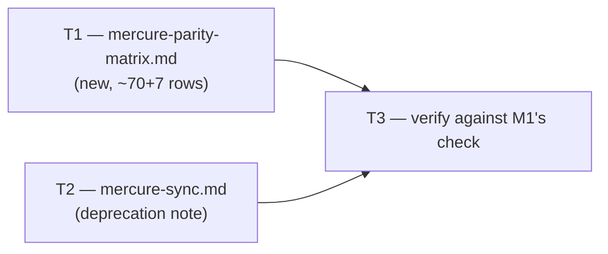

# Plan — M2: Parity Matrix Seed (ADR-013 D1)

> **Milestone M2** · Wave 2 · Depends on: M1 · Status: pending
>
> Binding sequencing (ADR-013 Migration Plan step 3 / Decision, "internal sequencing"):
> Adoption Lens v2 must be live in `prj-mercure-sync` **before** any matrix row is classified.
> This milestone does not re-derive that lens — it consumes M1's already-merged posture to
> classify rows it is seeding for the first time.

## Objective

Create `documentation/audits/mercure-parity-matrix.md`, seeded with the ~70 mechanism-cluster
rows ADR-013 D1 defines (21 audit checklists, ~18 implement-time gates, 13 plan sections, 13
artifact-taxonomy folders, 5 behavioral protocols, plus a small set of fleet-capability rows —
see § Touch-Paths T1 for the exact reconciliation), each row carrying a stable `PM-NNN` id, a
`kind`, a version-pinned mercure citation, a blackhole-equivalent citation (or `—`), a `status`
from the D1 enum, a `priority` for every `gap` row, and a `verified` stamp. ADR-011/ADR-012
ground is seeded as `in-flight(ref)` rows, never re-implemented here (parity-surface.md §2b).
In the same PR, deprecate — without deleting — `mercure-sync.md`'s Coverage table role in favor
of the matrix, per D1's "supersede noted in the run log, not deleted" instruction.

This is a **documentation-only milestone**: no `src/` changes, no new verify check (M1 owns
that), no new V-code. Scope is strictly the two files named in § Touch-Paths.

**Threat Model**: Not required. Maintainer-facing markdown content (a status table + one
deprecation note); no network surface, no auth boundary, no user-data path, no runtime code
change, never shipped to consumer repos (ADR-013 D1: "this repo only").

## Touch-Paths

### T1 — `documentation/audits/mercure-parity-matrix.md` (new)

The crux of the milestone. A living table, one row per mercure enforcement mechanism, seeded
from `documentation/audits/mercure-parity-surface.md` (the verified evidence base — do not
re-derive citations from the mercure plugin cache directly; the audit is the seed source of
record) and from ADR-013 D1's binding row schema.

**Frontmatter** (canonical per `src/references/doc-governance.md`):

```yaml
---
type: reference
status: current
review_trigger: "on release"
created: 2026-07-20
last_updated: 2026-07-20
related:
  - documentation/decisions/ADR-013-mercure-parity-program.md
  - documentation/audits/mercure-parity-surface.md
  - documentation/audits/mercure-sync.md
  - .claude/skills/prj-mercure-sync/SKILL.md
---
```

`type: reference` (not `analysis`) because this is a living lookup table maintained across
runs, not a one-shot investigation — its home in `documentation/audits/` is an ADR-013 D1
placement decision (explicitly flagged "Contestable" in the ADR's Key Assumptions table), not a
`type:` classification choice.

**Row schema** (binding, ADR-013 D1 — reproduce this exact column order and header):

```
| id | kind | mechanism | blackhole | status | priority | verified |
```

- `id`: `PM-NNN`, zero-padded, strictly increasing, no gaps, no reuse.
- `kind`: one of `checklist \| gate \| plan-section \| artifact \| protocol \| fleet`.
- `mechanism`: mercure mechanism name + `file:line` citation, version-pinned
  `(mercure v9.6.1)` — the cache version `mercure-parity-surface.md`'s own header cites
  (`~/.claude/plugins/cache/mercure/mercure/9.6.1/`). Never cite an unpinned or "latest" mercure
  path.
- `blackhole`: equivalent mechanism + `src/` citation, or literal `—` when no equivalent
  exists (i.e. every `gap` and most `N/A` rows).
- `status`: one of `covered \| adapted \| in-flight(ref) \| gap \| N/A(reason)`. Every
  `in-flight` value MUST carry a parenthetical ref (a bare `in-flight` fails M1's verify
  check — see T3). Every `N/A` value MUST carry a parenthetical one-clause reason.
- `priority`: `V-PARETO-02` score (`Gain × (11 − Effort)`) for `gap` rows only; `—` for every
  other status.
- `verified`: `2026-07-20, mercure v9.6.1` for every seed row (this milestone's seed date and
  the audit's pinned mercure version — uniform across the initial seed).

**Row sourcing and count reconciliation (AC, measurable)**:

| Kind | Target count | Source | Reconciliation |
|---|---|---|---|
| `checklist` | 21 (exact) | `mercure-parity-surface.md` §1b | Always-on (9) + plan-section-conditional (6) + diff-conditional (4, not the audit's parenthetical "(3)" — the audit lists 4 named items: Integration Coherence, Information Hierarchy, Extension Tax, Doc Governance; footnote this label/count discrepancy in the matrix's own header comment rather than silently correcting the source doc) + self-check hard gates (2) = 21 |
| `gate` | 18 ± 3 | §1d | Enumerate the named implement-time gates; where §1d bundles sub-items (e.g. "quality gates (lint/type/test/build + V-TEST-09)") a single row covering the bundle is acceptable — do not force artificial 1:1 splitting to hit a round number |
| `plan-section` | 13 (exact) | §1c | The 13 named sections: Objective, Task Breakdown, Critical Files, Codebase Conventions, Threat Model/STRIDE, Dependency Blast-Radius, Performance Budget, Edge Cases, Agent-Asset Ripple, Quick Threat Check, Execution Strategy, Sprint Contract, Stop Conditions |
| `artifact` | 13 (exact) | §1h | The 13-folder taxonomy — group `milestones/_active` and `milestones/_archived` as **one** row (`milestones/`) to match the audit's own "13-folder" count; `claudedocs/` and `_archive/` each get their own row (both exempt from governance, `status: N/A(exempt — ephemeral/frozen)`) |
| `protocol` | 5 (exact) | §1g | Verification Evidence 5-step gate; Hard Choice Protocol; Scout Protocol; Task Tracking naming/cleanup; Workflow Protocol |
| `fleet` | remainder, min 3 | §1i | At minimum: (1) 11-agent roster + mode/model matrix, (2) escalation registry, (3) 5-field delegation contract + read-only enforcement (reviewer/explorer/architect/synthesizer) — one row each; add more only if a distinct fleet-level capability doesn't fit the 3 above |

Final total row count (before the 7 ADR-011/012 in-flight rows below) MUST fall in **[65, 75]**
— the ADR's own "~70" is an approximation, not a hard target; the per-kind counts above are
the actual constraint.

**ADR-011/ADR-012 ground — `in-flight(ref)` rows (exact, 7 rows, AC)**: seed these verbatim
from `mercure-parity-surface.md` §2b; each `blackhole` cell cites the milestone file directly
(not just the ADR) so a reader can jump straight to execution status:

| Mechanism cluster | `blackhole` citation | `status` |
|---|---|---|
| ADR-011 D1–D4 — repo-wide reuse aperture + rule-of-three, Scout/Continuous-Discovery unification | `documentation/milestones/_active/companion-substrate-closure/milestone-0.md` | `in-flight(documentation/milestones/_active/companion-substrate-closure/milestone-0.md)` |
| ADR-012 E1 — repo-convention schema precedence | `documentation/milestones/_active/companion-substrate-closure/milestone-1.md` | `in-flight(...milestone-1.md)` |
| ADR-012 E2 — human-approved design promotion + live resumption fix | `documentation/milestones/_active/companion-substrate-closure/milestone-2.md` | `in-flight(...milestone-2.md)` |
| ADR-012 E3 — Active Constraints write path | `documentation/milestones/_active/companion-substrate-closure/milestone-3.md` | `in-flight(...milestone-3.md)` |
| ADR-012 E4 — decision-log.md, orchestrator single-writer | `documentation/milestones/_active/companion-substrate-closure/milestone-4.md` | `in-flight(...milestone-4.md)` |
| ADR-012 E5 — `autonomy.enabled: true` flip | `documentation/milestones/_active/companion-substrate-closure/milestone-5.md` | `in-flight(...milestone-5.md)` |
| ADR-012 Future Work — read-path context injection | `documentation/decisions/ADR-012-shared-artifact-substrate.md` (Future Work section — no milestone exists yet) | `in-flight(documentation/decisions/ADR-012-shared-artifact-substrate.md#future-work)` |

These 7 rows are **never** re-classified as `gap`/`covered`/`adapted` by this milestone — this
matrix instrument observes companion-substrate-closure's progress, it does not gate or
duplicate it (ADR-013 Risk table: "Collision with in-flight ADR-011/012 milestones — LOW —
their ground enters the matrix as `in-flight(ref)` rows; this ADR builds none of it").

**Gap coverage — no silent drops (AC)**: every one of the 10 numbered gaps (`GAP-1`…`GAP-10`)
and every "Likely N/A" item named in `mercure-parity-surface.md` §3 MUST appear as at least one
matrix row with `status: gap` or `status: N/A(reason)` respectively (a gap spanning multiple
mechanisms may become more than one row — e.g. GAP-1's "no V-THREAT/V-PERF at all" plus "no
plan-time API-contract template" is legitimately 2+ rows). Cross-check: grep the finished matrix
for a citation of each `GAP-N` label or its evidence citation before declaring T1 done.

**Gap priority scoring — auditability (AC)**: append a `## Gap Priority Scoring` section at the
end of the matrix file with columns `PM-id | Gain | Effort | Priority`, one row per `gap`-status
row, mirroring the Gain/Effort/Priority breakdown convention already used in
`mercure-sync.md`'s Run 1/Run 2 Backlog tables (V-PARETO-02, floor 30, moderate band 40–59 per
ADR-006's named bands). A bare numeric `priority` cell in the main table with no corresponding
row in this section fails review (not machine-verified by M1's check, but a stated AC here).

**AC (measurable, full T1)**:
1. File exists at the canonical path with the frontmatter block above.
2. Main table has between 72 and 82 rows total (65–75 mechanism rows + exactly 7 in-flight
   rows), header exactly `| id | kind | mechanism | blackhole | status | priority | verified |`.
3. `id` values are unique, zero-padded, contiguous from `PM-001`.
4. Every `in-flight` status carries a non-empty parenthetical ref; every `N/A` status carries a
   non-empty parenthetical reason; every `gap` status has a non-`—` `priority` cell with a
   matching row in `## Gap Priority Scoring`.
5. Per-kind counts match the reconciliation table (checklist=21, plan-section=13, artifact=13,
   protocol=5, gate=18±3, fleet≥3), and total mechanism-row count (excluding the 7 in-flight
   rows) is in [65, 75].
6. All 10 `GAP-N` items and all "Likely N/A" items from parity-surface.md §3 are represented.
7. Every `mechanism` citation states `(mercure v9.6.1)`; every `blackhole` citation with a
   non-`—` value cites a real `src/` (or, for the 7 in-flight rows, `documentation/`) path —
   spot-check at least 10 citations resolve with `Read`/`Glob` before declaring T1 done.

**Rollback**: delete the file. Nothing depends on it yet — `mercure-sync.md`'s deprecation note
(T2) references it by path only, not by row content, so deleting T1 in isolation leaves T2's
note pointing at a not-yet-existing file, which is a documentation defect but not a build break
(no `src/` or verify-machinery dependency exists on this file before M1's check is wired to it).

### T2 — `documentation/audits/mercure-sync.md` (deprecation note only)

Add a supersede note to the `## Coverage table` section — do not delete the table, do not
change the file's top-level `status:` frontmatter (the file stays `status: current`; only the
Coverage table's *role* is deprecated, its Run 1/Run 2 log entries remain live and are not
being superseded by this milestone).

**AC (measurable)**: immediately below the `## Coverage table` heading, insert:

> **Superseded by `documentation/audits/mercure-parity-matrix.md`** (ADR-013 D1, seeded
> M2 of the mercure-parity-program initiative). This table is preserved for historical
> reference only — do not add new rows here. Coverage status for every mercure mechanism now
> lives in the matrix as `PM-NNN` rows; file gaps there, not here.

No other line in `mercure-sync.md` changes — Run 1/Run 2 sections, the watermark, and the
"Design note for future runs" section are untouched (T2 is a single insertion, not a rewrite).

**Rollback**: revert this hunk alone. `mercure-sync.md` reverts to today's behavior (Coverage
table live, no note) — safe in isolation since T1's matrix file has no read dependency on this
note existing.

### T3 — verify against M1's parity-matrix check

**AC (measurable)**: `bun run verify` exits 0. Specifically confirm the M1-added parity-matrix
schema check (whatever `scripts/checks/*.check.ts` filename M1 lands — this milestone does not
name it, since M1 is a sibling in-flight plan) reports zero findings against T1's matrix on:
row-id uniqueness, status-enum validity, `in-flight`-requires-ref, `gap`-requires-priority (the
four validation rules ADR-013 D1 names explicitly). `EXPECTED_CHECK_COUNT`
(`scripts/build.ts:288`, 28 today, expected 29 once M1 has merged) is **not** touched by this
milestone's own diff — M2 adds zero files under `scripts/`. `VCODE_TABLE_ROW_COUNT`
(`scripts/build.ts:277`, 46) is unchanged — no V-code is introduced. `bun run build` exits 0
with a clean git diff (T1/T2 are `documentation/` files only, so build output is unaffected).

**Rollback**: N/A — verification step. A failing M1 check means fix forward on T1's matrix
content (most likely a missing ref or priority cell); a failing `bun run build`/`verify` for
any other reason means stop and diagnose before merging — do not merge past a red gate.

## Strategy

Two independent, single-writer documentation edits land in parallel (no shared file, no data
dependency — T2's note references T1's file by path, not by content), then verification runs
last, gated on both. The real sequencing risk is external to this DAG: M1 (Lens v2 + the
matrix-schema verify check) must already be merged before T1 starts, per ADR-013's binding
"lens posture must be live before any row is seeded" instruction — `depends_on: [M1]` in this
plan's frontmatter is the enforcement point, not a task inside the DAG below.

## Issue DAG



Waves: **W1** T1, T2 (parallel — independent files, no shared content dependency) → **W2** T3.
The milestone itself does not start until M1 is merged (external gate, not a DAG node).

## Execution Assignments

| Agent | Task(s) | Model | Delegation Contract |
|-------|---------|-------|----------------------|
| blackhole:implementer | T1 | sonnet | **Objective**: create `documentation/audits/mercure-parity-matrix.md` per T1's row schema, sourcing counts and content from `mercure-parity-surface.md` and the 7-row ADR-011/012 in-flight table. **Output format**: new markdown file only, canonical frontmatter, main table + `## Gap Priority Scoring` section. **Scope**: this one new file; do not edit `mercure-parity-surface.md` or any `src/` file. **Tool guidance**: `Read` `mercure-parity-surface.md` in full before drafting rows; `Grep`/`Glob` to verify each `blackhole` citation resolves to a real path before writing it. **Stop condition**: all 7 T1 AC bullets pass; row/kind counts within the stated ranges; no `GAP-N` or "Likely N/A" item missing. |
| blackhole:implementer | T2 | sonnet | **Objective**: insert the single supersede-note blockquote below `## Coverage table` in `documentation/audits/mercure-sync.md`, verbatim as specified in T2. **Output format**: one-hunk edit to `mercure-sync.md`. **Scope**: this insertion only — no other line changes, no frontmatter change. **Tool guidance**: use `Edit`, not `Write`, to guarantee a minimal diff. **Stop condition**: note present immediately after the heading; `git diff --stat` shows exactly one file, one insertion hunk. |
| blackhole:implementer | T3 | sonnet | **Objective**: run `bun run build`, `bun test`, `bun run verify` and confirm M1's parity-matrix check passes against T1's seeded file. **Output format**: pass/fail report quoting command output (verification-evidence gate). **Scope**: repo root, no edits expected unless the M1 check fails on T1's content, in which case fix forward on T1 only. **Tool guidance**: confirm `EXPECTED_CHECK_COUNT` and `VCODE_TABLE_ROW_COUNT` are unchanged by *this milestone's diff* (their post-M1 values are inherited, not introduced here). **Stop condition**: all three commands exit 0; zero findings from the parity-matrix check. |
| blackhole:reviewer | Review of every PR (T1, T2) | sonnet | **Objective**: audit against `blackhole-vcodes.md` (`V-DOC-GOV-01..04`, `V-DRY-01`), this plan's Touch-Paths ACs, and ADR-013 D1's row-schema binding text. **Output format**: `review-aggregate.ts`-consumed findings JSON per `worker-schemas.md` § Reviewer. **Scope**: read-only — no Write/Edit. **Tool guidance**: spot-check at least 10 `mechanism`/`blackhole` citations resolve (per T1 AC 7); confirm the 7 in-flight rows exactly match the §2b source table; confirm T2's note didn't alter Run 1/Run 2 content. **Stop condition**: zero CRITICAL/HIGH findings, or explicit user-approved exception. |

**Parallelization**: W1 (T1, T2) runs as a two-agent parallel batch with no file overlap; W2
(T3) is a single verification pass gated on both W1 tasks merging.

## Codebase Conventions

| Touchpoint | Convention | Source | Required by |
|------------|------------|--------|--------------|
| Parity-matrix row schema | `id \| kind \| mechanism \| blackhole \| status \| priority \| verified`, status enum `covered\|adapted\|in-flight(ref)\|gap\|N/A(reason)`, `in-flight` and `gap` carry mandatory extra fields | `documentation/decisions/ADR-013-mercure-parity-program.md` D1 | V-INT-01 — T1's row schema must match this exactly, not a variant |
| Lifecycle frontmatter | `type`/`status`/`review_trigger`/`created`/`last_updated`/`related` required on every `documentation/` file | `src/references/doc-governance.md` | V-DOC-GOV-02 — T1 (new file), T2 (existing file, frontmatter untouched by this milestone) |
| Search-before-write / canonical naming | Grep target folder + no date-stamp filenames before creating a new `documentation/` file | `src/references/doc-governance.md` § Search-Before-Write | V-DOC-GOV-01/03 — T1's filename is already ADR-mandated (`mercure-parity-matrix.md`), confirmed no existing file covers this concern (only `mercure-sync.md`, a different concern per ADR-013 D1) |
| Supersede-without-delete for partial content deprecation | Mark the superseded section/role, do not delete content, do not flip whole-file `status:` for a partial deprecation | ADR-013 D1 ("supersede noted in the run log, not deleted") | T2 |
| Pareto scoring convention | `Priority = Gain × (11 − Effort)`, floor 30, named bands (moderate 40–59) | `documentation/decisions/ADR-006-kaizen-hunt.md`; precedent in `mercure-sync.md` Run 1/Run 2 Backlog tables | T1's `## Gap Priority Scoring` section |

## Risks

| Risk | Severity | Mitigation |
|------|----------|------------|
| "~70" row-count target is an approximation with no fixed fleet-row count, risking an under- or over-stuffed matrix | Low | § Touch-Paths T1 reconciliation table fixes exact counts for 5 of 6 kinds and a `[65,75]` band for the total, closing the only genuinely open dimension (`fleet`) to a minimum-3 floor |
| A `gap` row ships without a `priority`, or an `in-flight` row ships without a ref, and only M1's verify check (not human review) catches it | Medium | T3 makes the verify-check pass a hard AC before merge; T1 ACs 4–5 make both conditions explicit review checklist items independent of the automated check |
| M1 has not actually merged when this milestone starts (frontmatter `depends_on: [M1]` is advisory unless enforced by the orchestrator) | Medium | `blackhole:implementer` for T3 must confirm via `git log`/`gh pr list` that M1's PR is merged before running verify; a red M1-check result on T3 is the fallback structural catch |
| Citing an unpinned mercure path (`mercure` vs `mercure/9.6.1`) makes a `mechanism` citation silently stale on the next mercure release | Low | T1 AC 7 requires every `mechanism` citation to state `(mercure v9.6.1)` explicitly, matching D1's "version-pinned" requirement |
| GAP-N items get lossy-summarized into fewer matrix rows than the evidence actually supports, quietly narrowing scope already agreed in the ADR | Medium | T1's "Gap coverage — no silent drops" AC requires an explicit grep cross-check of all 10 `GAP-N` labels plus "Likely N/A" items before T1 is declared done |

## References

- **ADR**: `documentation/decisions/ADR-013-mercure-parity-program.md` — D1 (row schema,
  single-writer rule, validation rules); Migration Plan step 3; Risk table ("Collision with
  in-flight ADR-011/012 milestones — LOW")
- **Evidence base**: `documentation/audits/mercure-parity-surface.md` — §1b–§1i (mechanism
  inventory), §2b (ADR-011/012 in-flight ground), §3 (10 confirmed gaps + Likely N/A items)
- **Deprecation target**: `documentation/audits/mercure-sync.md` — `## Coverage table`
- **Milestone**: `documentation/milestones/_active/mercure-parity-program/milestone-1.md` — M1
  (Lens v2 + dual-mode sync + the parity-matrix verify check this milestone's T3 depends on)
