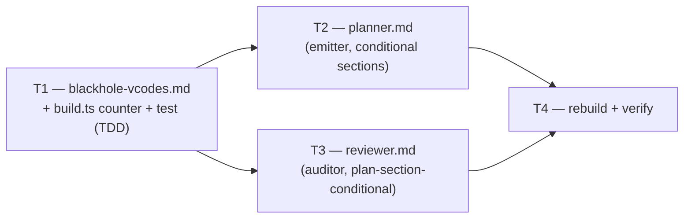

# M3 — GAP-1: Threat-Model and Performance-Budget Machinery

> **Milestone M3** · Wave 3 · Depends on: M2 · Status: pending
>
> Closes the sole HIGH-severity gap in `mercure-parity-surface.md`: blackhole has no
> `V-THREAT`/`V-PERF` V-codes and no planner Threat-Model/Performance-Budget sections at all
> today. mercure's API Contract plan-time template is explicitly **out of scope** (no upstream
> plan-time template exists to adapt — `mercure-parity-surface.md` GAP-1).

## Objective

Adopt mercure's Threat Model and Performance Budget machinery (ADR-029 upstream; enforcement
tier under ADR-013 D2's Lens v2 — quality/enforcement mechanisms default **ADOPT**), adapted to
blackhole's autonomous, no-HITL posture: two new **conditional** Standard-track planner sections
(`## Threat Model`, STRIDE-shaped; `## Performance Budget`, baseline-shaped) and two matching
**plan-section-conditional** reviewer audit sections, gated on section *presence* in the plan
artifact exactly like mercure's own Threat Model Audit / Performance Budget Audit
(`mercure-quality-audit-criteria.md` § Phase 2 — "Runs when the plan includes a `## Threat
Model`/`## Performance Budget` section"), never on a new config block. Four new V-code rows
(`V-THREAT-02`, `V-THREAT-03`, `V-PERF-01`, `V-PERF-02`) formalize the checks in
`blackhole-vcodes.md`, bumping `VCODE_TABLE_ROW_COUNT` (`scripts/build.ts:277`) from 46 to 50 —
the ground-truth counter `V-GROUND-01` (`scripts/checks/core.check.ts`) validates at `bun run
verify` time.

Both sections are **Standard track only** (Quick/Skip/Design/Brainstorm tracks are unaffected —
this is an additive extension within an existing track's conditional-bullet mechanics, not a new
planner track, so the `## Accretion Guard (ADR-004)` in `planner.md` does not apply). Trigger
detection reuses existing signals rather than inventing new ones (`V-INT-02` reuse discipline):
Threat Model reuses the `route.security_review_required` flag already gating reviewer
security-mode (`review-core.md` § Security-mode review); Performance Budget reuses
`investigator`'s `analyze` sub-mode Performance Baselines output (`investigator.md` line 103),
already partially consumed by the Standard Track's Codebase Conventions bullet
(`planner.md:69-76`) — this milestone promotes that data into its own first-class,
reviewer-auditable section instead of folding it only into risk-framing prose.

**Threat Model** (of this milestone's own change, per the Standard Track template this milestone
extends): Not required. Internal agent-prompt/markdown-tooling change — new V-code table rows, a
ground-truth counter bump, and conditional prose sections in `planner.md`/`reviewer.md`. No
network surface, no auth boundary, no user-data path, no new config block.

## Touch-Paths

### T1 — `src/references/blackhole-vcodes.md` + `scripts/build.ts:277` + registration test (TDD)

Add four new V-code rows and bump the ground-truth row-count constant in one atomic change —
mirrors how V-UX-01 (#271/#273) and V-AUTO-01/02 landed: table rows, the constant, and a
registration test together, never split across PRs (a split would fail `V-GROUND-01` on the
intermediate commit).

**Rows to add** (severity mapped from mercure's HIGH→BLOCK / MEDIUM→WARN per the enforcement
contract's binding severity model, `mercure-quality-audit-criteria.md` § Phase 3 — mercure's
`V-THREAT-02` is HIGH, `V-THREAT-03`/`V-PERF-02` are MEDIUM, `V-PERF-01` is HIGH), inserted after
the `V-API-01` row (`blackhole-vcodes.md:49`) and before `V-BRANCH-01` (`blackhole-vcodes.md:50`):

```
| V-THREAT-02 | Threat Model — every HIGH/CRITICAL-severity threat has mitigation status 'Mitigated' | BLOCK |
| V-THREAT-03 | Threat Model — all six STRIDE categories evaluated (Spoofing, Tampering, Repudiation, Info Disclosure, DoS, Elevation of Privilege) | WARN |
| V-PERF-01 | Performance Budget — no N+1 queries, unindexed sorts, sync I/O in hot path, full-table scans, or unbounded pagination for a budgeted component | BLOCK |
| V-PERF-02 | Performance Budget — diff touching a budgeted component does not regress against its documented threshold | WARN |
```

**AC (measurable)**: `VCODE_TABLE_ROW_COUNT` (`scripts/build.ts:277`) changes from `46` to `50`
— exactly `+4`, matching the four rows added, no other row added or removed. A new `describe`
block in `scripts/router-local-analyze.test.ts` (appended after the existing
`V-AUTO-01/V-AUTO-02 registration` block, `scripts/router-local-analyze.test.ts:97-101`),
titled `blackhole-vcodes.md — V-THREAT-02/03 and V-PERF-01/02 registration`, asserts (via
`toMatch`) all four rows exist with their exact severities — written FIRST (RED, rows absent)
per TDD baseline, then GREEN after the rows land. `bun test scripts/router-local-analyze.test.ts`
exits 0.

**Rollback**: revert this hunk alone (both files + the test, same commit). Nothing downstream
(T2/T3) exists yet at this point in the DAG, so reverting T1 in isolation is a complete, clean
revert with zero residual effect.

### T2 — `src/agents/planner.md` (emitter) — conditional Standard Track sections

Add two new conditional bullets to `### 2. Standard Track` (`planner.md:57-79`), inserted after
the existing **Database/API Schema Changes** bullet (`planner.md:77`) and before **Execution
Strategy (Stop Conditions)** (`planner.md:78`) — threat/perf framing informs stop-condition
scoping, so it precedes it in reading order:

*   **Threat Model (`## Threat Model`, conditional)**: Trigger — the issue's resolved
    `route.security_review_required` (post confidence-gate, the same value `review-core.md` §
    Security-mode review already consumes) is `true`; when no `route` object exists (today's
    queue), fall back to a content scan of the Touch-Paths for an auth/credentials/session/
    token/injection-surface/network-boundary touchpoint — same route-first, content-fallback
    pattern already used by Quick Track's Bugfix classification (`planner.md:48-55`) and Design
    Track subsection 1 (`planner.md:113-118`), not a new heuristic shape (`V-INT-03`). When
    triggered, emit a 6-row STRIDE table (Spoofing, Tampering, Repudiation, Information
    Disclosure, Denial of Service, Elevation of Privilege), each row: threat description,
    severity (`Critical`\|`High`\|`Medium`\|`Low`, mercure's four-tier vocabulary — this is the
    only place blackhole authors that vocabulary; the V-code severities in `blackhole-vcodes.md`
    stay two-tier), mitigation status (`Mitigated`\|`Accepted Risk`\|`Open`). When not triggered,
    omit the section entirely — no `## Threat Model` heading, no placeholder — same
    conditional-omission discipline as the Documentation Impact bullet (`planner.md:44-46`).
*   **Performance Budget (`## Performance Budget`, conditional)**: Trigger —
    `plans/issue-N-analysis.md` exists (produced by `investigator`'s `analyze` sub-mode) **and**
    its `Performance Baselines` subsection (`investigator.md` line 103) is non-empty (not the
    "omit entirely when no measurable baseline exists" case, `investigator.md:74`). When
    triggered, emit a table of budgeted components: component/surface, baseline metric + value,
    threshold (the point past which a regression is a `V-PERF-02` finding), source citation
    (carried over from the analysis note). This promotes the existing investigator→planner data
    flow (`planner.md:69-76`, "fold its performance-baseline findings into risk framing") into a
    first-class, reviewer-auditable section instead of leaving it as unstructured prose — it does
    not add a second investigator consumption path (`V-DRY-01`: same data, new presentation).
    When not triggered, omit the section entirely, same discipline as Threat Model above.

Update the **Plan Output File Template** (`planner.md:252-298`) to add both sections, bracket-
tagged like the existing Standard-track sections (`planner.md:281-291`):

```
## [Standard + security-sensitive Only] Threat Model
...

## [Standard + perf-sensitive Only] Performance Budget
...
```

positioned after `## [Standard Only] Database/API Schema Changes` (`planner.md:287-288`) and
before `## [Standard Only] Execution Strategy & Stop Conditions` (`planner.md:290-291`).

**AC (measurable)**: Standard Track's bullet list contains both new bullets with the exact
trigger conditions above; the Plan Output File Template contains both bracket-tagged headings in
the stated position; no new planner track is added (`grep -c '^### [0-9]'` on
`## Plan Complexity Tracks & Sections` stays `5`, unchanged from today); neither bullet
references a new config key (this milestone introduces no config block — reuses
`route.security_review_required` and the existing analysis-note artifact only).

**Rollback**: revert this hunk alone. Planner falls back to never emitting either section (
today's behavior) — safe in isolation; T3's audit sections simply never fire (vacuous gate, see
T3), so no orphaned/dangling behavior results.

### T3 — `src/agents/reviewer.md` (auditor) — plan-section-conditional audit sections

Add two new numbered sections after `### 14. Information-Hierarchy Audit (`V-UX-01`)`
(`reviewer.md:176-203`) and before `## Output Format` (`reviewer.md:207`), following the exact
"runs when the plan includes a `## <Section>` heading" gate mercure uses for both source audits
(`mercure-quality-audit-criteria.md` § Phase 2, Threat Model Audit / Performance Budget Audit).
Detection reads the plan file at `PLAN_ABSOLUTE_PATH` (from `<PLAN_CONTEXT>`, the same field §8's
Docs-Only detection already reads at `reviewer.md:97`) — no new plumbing required, the reviewer
already has this path.

*   **§15. Threat Model Audit (`V-THREAT-02/03`)**: Detection — the plan file at
    `PLAN_ABSOLUTE_PATH` contains a `## Threat Model` heading; absent heading → emit no §15
    findings (vacuous — mirrors mercure's own gate exactly, no false-negative risk if T2's
    emitter hasn't produced the section for a given plan, since there is nothing to audit
    against). Checks: every threat row marked `Critical`/`High` carries mitigation status
    `Mitigated` — else `BLOCK` `V-THREAT-02`, cite the plan file's row (plan-conformance audit,
    same class as §1's Objective Fulfillment check, which already cites plan content rather than
    diff lines). All six STRIDE categories present as rows — else `WARN` `V-THREAT-03`, naming
    the missing categor(ies) in the finding summary.
*   **§16. Performance Budget Audit (`V-PERF-01/02`)**: Detection — the plan file contains a
    `## Performance Budget` heading listing budgeted components; absent heading → emit no §16
    findings. Checks: the diff touching a listed component introduces no N+1 query, unindexed
    sort, sync I/O in a hot path, full-table scan, or unbounded pagination — else `BLOCK`
    `V-PERF-01`, cite `file:line`. The diff touching a listed component does not visibly regress
    against its documented threshold (e.g. an added query inside a loop where the budget states
    "single query") — else `WARN` `V-PERF-02`, cite `file:line`.

**AC (measurable)**: `reviewer.md` contains both new numbered sections in the stated position,
each opening with an explicit "absent heading → no findings" detection sentence (grep-verifiable
via `## Threat Model` / `## Performance Budget` string matches in each section's body); no
existing numbered section (§§1-14) is renumbered or otherwise altered; `## Output Format`'s JSON
example is unchanged (both new V-codes are ordinary findings entries, no schema change needed).

**Rollback**: revert this hunk alone. Reviewer reverts to auditing neither section (today's
behavior) — safe in isolation and independent of T2's state either way, since detection is
gated on plan-file content, not on T2 having landed.

### T4 — rebuild + verify

**AC (measurable)**: `bun run build` exits 0 with a clean git diff (`V-BUILD-01`); `bun test`
exits 0, zero failures, including T1's new registration `describe` block; `bun run verify` exits
0, all checks pass, specifically `V-GROUND-01` (`scripts/checks/core.check.ts`) confirms
`VCODE_TABLE_ROW_COUNT` (50) matches the live table row count in `blackhole-vcodes.md`.
`EXPECTED_CHECK_COUNT` (`scripts/build.ts:288`, currently 28) stays unchanged — this milestone
adds V-code rows and agent-prompt sections, not a new `scripts/checks/*.check.ts` verify domain.

**Rollback**: N/A — verification step, nothing to revert. A `bun run verify` failure means fix
forward on the specific T1/T2/T3 task it points at; do not merge past a red gate.

## Strategy

Foundation-then-consumers, but flatter than M1's rule→emitter→auditor chain: T1 (the V-code
rows) is the sole hard dependency for T2 and T3, because both cite `V-THREAT-02/03`/`V-PERF-01/
02` by name in their finding/summary text. Unlike M1's emitter-before-auditor ordering (unsafe
to swap, because the auditor there loosened an *existing* check that the emitter's old-shape
output could still trip), **T2 and T3 have no ordering hazard between each other**: T3's audit
sections are gated on plan-file *content* (a `## Threat Model`/`## Performance Budget` heading),
not on T2 having shipped — if T2 lands after T3, T3 simply finds no such heading in any plan and
emits nothing, which is the same behavior as today (no false positive, no false negative). T2
and T3 touch disjoint files (`planner.md` vs. `reviewer.md`) and can run as a genuine parallel
batch once T1 merges. T4 runs last, after both merge.

## Issue DAG



Waves: **W1** T1 → **W2** T2, T3 (parallel — disjoint files, no ordering hazard) → **W3** T4.

## Execution Assignments

| Agent | Task(s) | Model | Delegation Contract |
|-------|---------|-------|----------------------|
| blackhole:implementer | T1 | sonnet | **Objective**: write the failing registration test first, then add the four V-code rows and bump `VCODE_TABLE_ROW_COUNT` per T1's spec. **Output format**: edits to `src/references/blackhole-vcodes.md`, `scripts/build.ts`, and `scripts/router-local-analyze.test.ts` (new `describe` block only, appended after the existing `V-AUTO-01/V-AUTO-02 registration` block). **Scope**: these three files only, isolated `wt-<issue>` worktree, `blackhole/issue-N` branch. **Tool guidance**: read `scripts/router-local-analyze.test.ts:66-101` first for the exact registration-test shape to mirror (`V-INT-03` — no new test pattern). **Stop condition**: new `describe` block RED before the rows/counter change, GREEN after; `bun test scripts/router-local-analyze.test.ts` exits 0; `VCODE_TABLE_ROW_COUNT` is exactly `50`. |
| blackhole:implementer | T2 | sonnet | **Objective**: add the two conditional Standard Track sections to `planner.md` per T2's AC. **Output format**: edit to `src/agents/planner.md` only (Standard Track bullet list + Plan Output File Template). **Scope**: this file only; T1 must already be merged (hard DAG dependency — verify via `git log` before starting). **Tool guidance**: reuse the route-first/content-fallback pattern verbatim from `planner.md:48-55`/`113-118` — do not invent a third trigger-detection shape (`V-INT-03`). **Stop condition**: both bullets and both bracket-tagged template headings present; `### 2. Standard Track` remains track #2 of exactly 5 tracks (no Accretion Guard violation). |
| blackhole:implementer | T3 | sonnet | **Objective**: add the two plan-section-conditional audit sections (`§15`, `§16`) to `reviewer.md` per T3's AC. **Output format**: edit to `src/agents/reviewer.md` only, inserted between §14 and `## Output Format`. **Scope**: this file only; T1 must already be merged (cites the new V-codes by name); independent of T2 (no ordering hazard — see Strategy). **Tool guidance**: reuse the `PLAN_ABSOLUTE_PATH`-read detection pattern from §8 (`reviewer.md:97`) verbatim rather than inventing new plan-reading plumbing (`V-INT-02`). **Stop condition**: both sections present with an explicit "absent heading → no findings" sentence each; §§1-14 numbering and `## Output Format` JSON example unchanged. |
| blackhole:reviewer | Review of every PR (T1, T2, T3) | sonnet | **Objective**: audit each PR against `blackhole-vcodes.md`, this plan's Touch-Paths, and the DAG. **Output format**: `review-aggregate.ts`-consumed findings JSON per `worker-schemas.md` § Reviewer. **Scope**: read-only — no Write/Edit. **Tool guidance**: on the T2/T3 PRs, confirm T1 is already merged before approving (DAG-order gate); spot-check that T2's new bullets and T3's new sections cite the exact same STRIDE-category list and budgeted-component row shape (schema-drift check, `V-INT-03`). **Stop condition**: zero CRITICAL/HIGH findings, or explicit user-approved exception. |
| blackhole:implementer | T4 | sonnet | **Objective**: run the full quality gate — `bun run build`, `bun test`, `bun run verify` — per T4's AC. **Output format**: pass/fail report quoting command output (verification-evidence gate). **Scope**: repo root, no edits expected unless a gate fails, in which case fix forward on the specific T1/T2/T3 task. **Tool guidance**: confirm `EXPECTED_CHECK_COUNT` (28) is unchanged and `VCODE_TABLE_ROW_COUNT` reads exactly `50` before declaring done. **Stop condition**: all three commands exit 0; `V-GROUND-01` passes with the new row count. |

**Parallelization**: W2 (T2, T3) runs as a two-agent parallel batch with no file overlap; the
wave boundary (W1 fully merged before W2 starts) is the only binding-order gate, per Strategy.

## Codebase Conventions

| Touchpoint | Convention | Source | Required by |
|------------|------------|--------|--------------|
| V-code registration test shape | One `describe` block per new V-code family, TDD-first, appended to `scripts/router-local-analyze.test.ts` | `scripts/router-local-analyze.test.ts:66-101` (V-SEC-09/10, V-UX-01, V-AUTO-01/02 blocks) | V-INT-03 — T1 |
| Ground-truth counter enforcement | `VCODE_TABLE_ROW_COUNT` (`scripts/build.ts:277`) validated against the live table row count by `V-GROUND-01`, not a hand-maintained doc counter (that role was retired, ADR-007 T3/R1′) | `scripts/checks/core.check.ts:624-651` | T1, T4 |
| Route-first, content-fallback trigger pattern | When a `route` object exists, trust its resolved flag; when absent, fall back to a live content/keyword scan — never invent a third detection shape | `planner.md:48-55` (Quick Track Bugfix classification), `planner.md:113-118` (Design Track subsection 1) | V-INT-03 — T2 |
| Conditional-omission of a Standard-track bullet's output section | Omit the `##` heading entirely (no placeholder) when the trigger condition is false | `planner.md:44-46` (Documentation Impact bullet) | T2 |
| Bracket-tagged Plan Output Template headings | `## [Standard Only] <Section>` / `## [Standard + <condition> Only] <Section>` | `planner.md:281-291` | T2 |
| Plan-section-conditional reviewer audit gate | "Runs when the plan includes a `## <Section>` heading" — absent heading emits no findings for that section | `mercure-quality-audit-criteria.md` § Phase 2 (Threat Model Audit / Performance Budget Audit, upstream source this milestone adapts) | T3 |
| `PLAN_ABSOLUTE_PATH`-read detection plumbing | Reviewer reads the full plan file at the path carried in `<PLAN_CONTEXT>` rather than requiring new orchestrator-injected fields | `reviewer.md:97` (§8 Docs-Only detection), `campaign-prompt.md:41-70` (`PLAN_CONTEXT` template) | V-INT-02 — T3 |
| Investigator Performance Baselines source | `analyze` sub-mode's `Performance Baselines` note subsection — omit when no measurable baseline exists, never fabricate a number | `investigator.md:72-75,103` | T2 |
| Security-sensitivity signal reuse | `route.security_review_required` (post confidence-gate resolved value) — the same flag already gating reviewer security-mode, not a new signal | `review-core.md` § Security-mode review, `queue-dag.md:85` | V-INT-02 — T2 |

## Risks

| Risk | Severity | Mitigation |
|------|----------|------------|
| Emitter (T2) and auditor (T3) drift apart on the STRIDE-category list or budgeted-component row shape over time (schema drift, `V-INT-03`) | Medium | Both cite the same fixed shapes defined in this plan's § Codebase Conventions and Touch-Paths (STRIDE 6-category list, component/metric/threshold/source columns); `blackhole:reviewer`'s delegation contract explicitly spot-checks this on the T2/T3 PRs |
| `route.security_review_required`'s content-fallback keyword scan misses a genuinely sensitive issue when no `route` object exists | Medium | Reuses the same accepted-risk class already carried by the Design Track's route-first/content-fallback pattern (`planner.md:113-118`) — not a new risk this milestone introduces, and the keyword list is fixed/cited rather than invented ad hoc per Touch-Path T2 |
| `VCODE_TABLE_ROW_COUNT` bump lands mismatched against the actual row count added | Low | Caught immediately by `V-GROUND-01` at `bun run verify` time (existing CI gate, not new machinery) — T4's AC explicitly re-confirms the count |
| Threat Model / Performance Budget sections add planner output length for issues that don't need them, diluting the Standard Track | Low | Both sections are strictly conditional and omitted entirely (no placeholder heading) when the trigger is false — same discipline already proven by the Documentation Impact bullet |
| A future contributor treats this milestone's plan-section-conditional gate as license to add a third conditional section without re-checking the Accretion Guard's track-count invariant | Low | T2's AC explicitly pins the Standard Track's section/track count as a regression check; noted here as a forward-looking flag |

## References

- **ADR**: `documentation/decisions/ADR-013-mercure-parity-program.md` — D2 Lens v2 (enforcement/
  quality mechanisms default ADOPT); consumes GAP-1 from the audit below
- **Audit**: `documentation/audits/mercure-parity-surface.md` — GAP-1 (HIGH): "no V-THREAT/
  V-PERF codes or planner Threat-Model/Perf-Budget sections at all"; explicit note that mercure's
  API Contract has no plan-time template upstream (out of scope for this milestone)
- **Upstream source adapted**: `mercure-quality-audit-criteria.md` § Phase 2 — Threat Model
  Audit, Performance Budget Audit (mercure's ADR-029-sourced sections this milestone ports,
  adapted to blackhole's no-HITL autonomous posture)
- **Dependency**: M2 (`documentation/milestones/_active/mercure-parity-program/milestone-2.md`)
  — the parity matrix's `PM-NNN` rows for these mechanisms formalize GAP-1's status transition
  (`gap → in-flight(#<this milestone's tracking issue>)`) once matrix rows exist; this milestone
  does not itself write matrix rows (D1's single-writer rule reserves that to `prj-mercure-sync`)
- **Milestone**: `documentation/milestones/_active/mercure-parity-program/milestone-3.md` —
  T1-T4, Touch-Paths, Risks, Rollback
