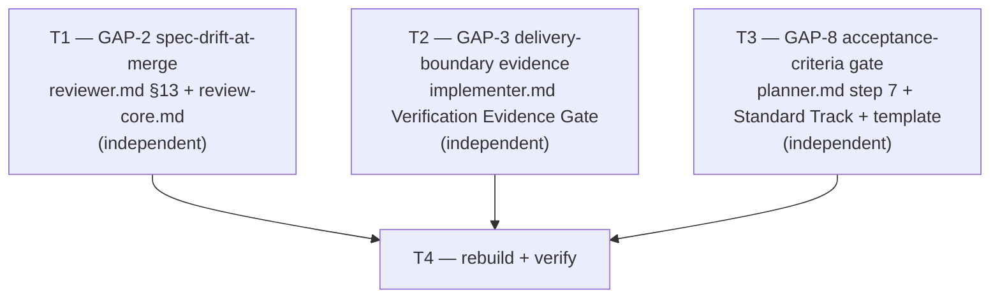

# Plan — M4: merge/delivery hardening (GAP-2, GAP-3, GAP-8)

> **Milestone M4** · Wave 3 · Depends on: M2 · Status: pending
>
> **Sequencing note**: this plan's dependency, M2 (`documentation/audits/mercure-parity-matrix.md`
> seeding per ADR-013 D1/Migration Plan step 3), has not landed on disk at plan time —
> `documentation/audits/mercure-parity-matrix.md` does not exist yet (confirmed by directory
> listing at plan time). Rather than block on matrix rows that don't exist, the mandatory
> verify-before-build task below was performed directly against the live agent contracts
> (`src/agents/reviewer.md`, `implementer.md`, `planner.md`, `src/references/review-core.md`,
> `worker-schemas.md`) — `file:line` citations, not `PM-NNN` row citations. When M2 lands, its
> matrix seed should cite this plan's Strategy section for the GAP-2/GAP-3/GAP-8 rows rather than
> re-deriving them.

## Objective

Close three MEDIUM parity gaps identified in `mercure-parity-surface.md` §3 (GAP-2, GAP-3, GAP-8),
each following the milestone's mandatory verify-before-build discipline (`V-HUNT-01`): confirm
actual current-state coverage against the live source files before writing any implementation
task, since each gap has a plausible partial remedy already in the codebase that could turn out
to already cover it.

1. **GAP-2 — spec-drift-at-merge**: strengthen the reviewer's independent implement-vs-spec drift
   check beyond `review-core.md`'s Recheck mode, which is scoped to re-verifying *named prior
   findings* against fix commits only — not to catching drift in the accumulated final diff.
2. **GAP-3 — delivery-boundary verification**: extend the implementer's Verification Evidence
   Gate (`implementer.md` § Verification Evidence Gate) to require the same RUN/READ/VERIFY
   evidence discipline for "branch pushed", "PR open", and "worktree clean" claims that it already
   requires for tests/build/lint claims.
3. **GAP-8 — sprint-contract / acceptance-criteria gate**: implement a BLOCKING acceptance-criteria
   gate for the Standard track at plan time, closing the gap between `worker-schemas.md`'s
   documented-but-unenforced `ac_mapping` failing-check value and `planner.md`'s actual step 7
   gate logic (which never references it).

All three tasks are independent (different files or different sections of the same file with no
shared editing surface) and can execute in parallel; T4 (rebuild + verify) is the only task with a
dependency on the other three.

## Verify-Before-Build Findings (`V-HUNT-01`)

Performed by direct inspection of the live source files (not the unseeded matrix — see sequencing
note above). **All three gaps are CONFIRMED as real gaps — none is already covered.** No
implementation task is skipped.

| Gap | Claimed partial remedy | Direct-source finding | Verdict |
|---|---|---|---|
| GAP-2 | `reviewer.md` §13 "Recheck-Mode Compliance" / `review-core.md` § Recheck mode | §13/Recheck-mode's own text is explicit: it verifies *named* prior findings against *fix commits only*, and its 5th rule is "**Never re-litigate** ... do not report findings against code outside the fix commits that was already approved in the prior full-review pass" (`review-core.md:153-154`, mirrored `reviewer.md:171-172`). A full-diff Objective Fulfillment check (`reviewer.md:51`, uncoded) *does* run on the initial (non-recheck) pass, but recheck mode explicitly narrows scope away from it. This is precisely the historical rework-wave failure mode (#113-115 per the audit): a later fix round can silently regress a requirement outside the fix commits, invisible to fix-commit-only scoping, and nothing re-checks the accumulated diff against the plan's Objective until the *next* full (non-recheck) pass — which may never happen if all subsequent rounds qualify as recheck. | **CONFIRMED GAP** |
| GAP-3 | `implementer.md` § Verification Evidence Gate | The gate's IDENTIFY step enumerates claim categories verbatim as "(tests, build, lint, requirements)" (`implementer.md:180`) — no mention of delivery facts. `phase-implement.md:39`'s Stop condition *names* "PR opened, local lint/tests green, and branch pushed" as required deliverables, but nowhere requires the same RUN/READ/VERIFY evidence discipline behind that specific claim the way it does for test/build/lint. `reviewer.md` §7 "PR & Git Hygiene" checks the *result* (PR linkage, branch isolation) post-hoc at review time, not the *implementer's own evidence* at completion-claim time — a different actor, different point in the pipeline. | **CONFIRMED GAP** |
| GAP-8 | `planner.md` Standard Track § Sprint Contract bullet | The Sprint Contract bullet is free text: "Clear definition of done (e.g. all tests and linters pass)" (`planner.md:79`) — no per-task structure. Step 7 "Verify Quality Gate" (`planner.md:35`) checks only Touch-Paths (`V-SCOPE-02`) and schema baseline (`V-API-01`) — it does not check acceptance-criteria mapping at all. Critically, `worker-schemas.md:169` **already documents** `ac_mapping` — "acceptance criteria mapped to tasks" — as a valid `failing_checks` value, alongside `touch_paths_declared`, `schema_baseline`, `tdd_tasks`, `clarification_limit`, `base_commit`. A repo-wide grep for `ac_mapping` across `scripts/` and `src/agents/planner.md` returns **zero** hits outside that one documentation line — the check is fully specified in the schema doc and **never implemented**. This is worse than "no gate": it is a live doc/implementation drift (the schema promises a `failing_checks` value the planner never produces). | **CONFIRMED GAP** (plus a bonus doc-drift finding) |

**Design decision — no new V-code.** None of the three remedies below introduce a new
`blackhole-vcodes.md` row. Precedent: 3 of the 6 existing `failing_checks` values
(`ac_mapping`, `clarification_limit`, `base_commit`) already carry no V-code citation in
`worker-schemas.md`, and `reviewer.md:51`'s Objective Fulfillment check is itself uncoded. Adding
a V-code for a MEDIUM-classified gap closure would require bumping `blackhole-vcodes.md` +
`VCODE_TABLE_ROW_COUNT` in `scripts/build.ts` (9 importers) for marginal traceability gain —
disproportionate to the fix (`V-PARETO-01`/KISS). GAP-2's remedy reuses the existing uncoded
Objective Fulfillment convention; GAP-8's remedy implements the already-named `ac_mapping` value.

## Touch-Paths

- `src/agents/reviewer.md` (T1 — GAP-2)
- `src/references/review-core.md` (T1 — GAP-2, discovered touchpoint: the canonical SSOT for
  Recheck mode that `reviewer.md` §13 restates; both must move together or they drift apart,
  `V-INT-01`)
- `src/agents/implementer.md` (T2 — GAP-3)
- `src/agents/planner.md` (T3 — GAP-8)

No other files. `worker-schemas.md` is read-only evidence for T3 (its `ac_mapping` spec is already
correct — T3 implements it, does not change it). No `scripts/checks/*.check.ts` file is touched:
none of the sibling plan-quality-gate checks (`touch_paths_declared`, `schema_baseline`,
`tdd_tasks`, `ac_mapping`, `clarification_limit`, `base_commit`) has a corresponding static
verify.ts validator today — they are planner-self-audited at generation time, and this plan
follows that established pattern rather than introducing the first one (proportionality — see
Risks).

## Critical Files

`src/agents/reviewer.md`, `implementer.md`, and `planner.md` are the campaign's own governing
contracts — they are read by every worker spawn. Two structural literal-marker checks gate their
integrity in `bun run verify`:

- **V-GATE-01** (`scripts/checks/core.check.ts:179-193`): `implementer.md` must retain `5-step
  gate`, `**IDENTIFY**`, `**RUN**`, `**READ**`, `**VERIFY**`, `**CLAIM**`, and both banned-phrase
  substrings verbatim. `reviewer.md` must retain the Suggestion Proportionality Gate markers.
- **V-DESIGN-01/02** (`scripts/checks/design-track.check.ts`): `planner.md` must retain all 8
  Design Track `## `-level headings and the `design-aggregate.ts` / "MUST NOT substitute its own
  judgment" markers.

All three tasks below are additive-only edits (append text inside existing subsections or add new
bullets), by construction outside the marker lines and outside the Design Track section (`planner.md`
§4, ~lines 97-186) — T3 edits only step 7 (line 35), Standard Track §2 (line 79), and the Plan
Output File Template's Task Breakdown/Sprint Contract (lines 293-302).

## Strategy

### T1 — GAP-2: independent spec-drift-at-merge check

Add a 7th point to `review-core.md` § Recheck mode (after the existing "LGTM interaction" point),
and a matching 7th bullet to `reviewer.md` §13 (which currently restates review-core.md's first 6
points 1:1 — this keeps the two files structurally synchronized rather than introducing a new,
same-purpose `##`/`###` section elsewhere, `V-INT-03`):

> **Independent spec-drift check (GAP-2 remedy, every recheck pass)**: in addition to the
> fix-commit-scoped verification above, the reviewer performs one lightweight, full-diff
> comparison of the PR's current cumulative state against the plan's Objective + Task
> Breakdown — the same comparison `reviewer.md:51`'s Objective Fulfillment check performs on a
> fresh full review. This is **not** a re-run of the full §§1-10 checklist, and **not** a
> re-litigation of already-approved code quality/style findings outside the fix commits (rule 3
> above is unchanged — this is a distinct axis: requirement satisfaction, not code quality).
> Any requirement the cumulative diff no longer satisfies — including one a fix commit
> inadvertently broke while resolving a *different* named finding — is reported as a normal
> `findings` entry (no new V-code; reuses the uncoded Objective Fulfillment convention when no
> more specific code applies), subject to the existing severity → action mapping and LGTM gate.
> This is the one place in recheck mode that reads the whole diff, but only for spec/requirement
> satisfaction — never for quality/style re-litigation.

**Why this shape**: fix-commit-only scoping is deliberate and stays unchanged (rules 1-6) — it is
what keeps recheck mode fast and keeps already-approved code from being re-litigated round after
round. The gap is narrower than "recheck mode should audit everything" — it is that *nothing*
currently re-checks whether the plan's stated requirements still hold after N rounds of
fix-commit-scoped patching. A single lightweight requirement-satisfaction pass, layered on top of
(not replacing) the existing mechanism, closes it without reopening the cost problem recheck mode
was built to solve.

### T2 — GAP-3: delivery-boundary evidence in the Verification Evidence Gate

Extend the IDENTIFY step's claim-category list and add one new bullet, staying inside the existing
`### Verification Evidence Gate` subsection (no new heading):

- `implementer.md:180` — `"1. **IDENTIFY** — what needs verification? (tests, build, lint,
  requirements)"` → `"1. **IDENTIFY** — what needs verification? (tests, build, lint,
  requirements, delivery boundary: branch pushed, PR open, worktree clean)"`.
- New bullet after the numbered 1-5 gate steps, before "Steps 1-4 MUST produce artifacts...":
  > **Delivery-boundary evidence** (GAP-3): before any `status: complete` claim that names a
  > delivery fact — "branch pushed", "PR opened", "worktree clean" — the RUN/READ/VERIFY steps
  > above must be backed by the corresponding command, not narrative: `git status --porcelain`
  > (empty output confirms worktree clean), an unpushed-commit check against the upstream branch
  > (zero confirms fully pushed), and the forge PR-state lookup already used elsewhere in this
  > workflow (confirms the PR is open). These three claims belong to the same evidence-gated set
  > as tests/build/lint — never asserted from what was *intended* to run.
- Extend the "Banned red-flag phrases" framing with one clause noting the delivery-boundary claims
  above carry the identical evidentiary bar as the test/build claims already listed — no new
  banned-phrase list entries required (the existing phrases already cover "should work" /
  "probably" / "based on the code" style hedging regardless of claim subject).

**Why this shape**: `phase-implement.md`'s Stop condition already *names* these three facts as
required deliverables — the gap was never "what to verify," it was that the implementer's own
evidence gate (the mechanism that turns a claim into a verified claim) didn't cover them. This
closes that binding without duplicating the Stop condition's list a third time.

### T3 — GAP-8: BLOCKING acceptance-criteria gate for the Standard track

Three additive edits to `planner.md`, none touching the Design Track (§4):

1. **Step 7** (`planner.md:35`) — extend from 2 checks to 3:
   > "7. **Verify Quality Gate**: Ensure all Touch-Paths are declared explicitly (`V-SCOPE-02`)
   > and schema baseline changes are fully specified (`V-API-01`). **Standard track only** —
   > additionally verify every `## Task Breakdown` item carries a machine-verifiable acceptance
   > criterion (`ac_mapping`, `worker-schemas.md` § Plan quality gate checks): if any task lacks
   > one, add `ac_mapping` to `failing_checks` and return `status: blocked` rather than `ready`.
   > This closes a documented-but-unenforced schema value (`worker-schemas.md:169` names
   > `ac_mapping` as a valid `failing_checks` entry with no prior producing step)."
2. **Standard Track §2 Sprint Contract bullet** (`planner.md:79`) — from a single free-text
   sentence to a pointer that the Sprint Contract restates, in one place, the AC already attached
   to each Task Breakdown item (not a substitute for per-task criteria); the "all tests and
   linters pass" example remains valid only as the blanket criterion for tasks with no narrower
   AC.
3. **Plan Output File Template `## Task Breakdown`** (`planner.md:293-298`) — each template line
   gains a trailing `— **AC**: <machine-verifiable condition>` clause, e.g. the existing "Verify
   Integrity" line becomes "... (use the project's test and lint commands). — **AC**: full suite
   green, lint clean, both quoted in the completion evidence." The template convention applies to
   both tracks (shared section, unchanged scoping); the BLOCKING enforcement from step 7 applies
   to Standard track only, matching the milestone's precise scope language and keeping Quick
   track's deliberately lightweight philosophy intact (`V-YAGNI-01` — Quick track issues are
   single-criterion by design, already covered by the blanket Sprint Contract line).

**Why this shape**: the schema value already exists and is already documented as the contract
between planner and its consumers (`worker-schemas.md`) — the fix is implementing the promise, not
inventing a new one. Scoping the BLOCKING behavior to Standard track only (not Quick) matches both
the milestone brief's explicit "Standard-track Sprint Contract" framing and the existing asymmetry
between the two tracks' rigor (Quick track already skips Codebase Conventions, Critical Files, and
schema-change sections).

## Issue DAG

T1, T2, and T3 touch disjoint files (T1's two files are both exclusive to it) and share no
ordering dependency — they may execute in parallel. T4 is gated on all three landing.

## Execution Assignments

| Task | Agent | Model | Notes |
|---|---|---|---|
| T1 — GAP-2 spec-drift check | `general-purpose` subagent | sonnet | 2-file additive diff (`reviewer.md` + `review-core.md`); re-run `bun run verify` locally to confirm V-GATE-01 stays green (marker set unchanged, only appended) |
| T2 — GAP-3 delivery-boundary evidence | `general-purpose` subagent | sonnet | 1-file additive diff inside the existing `### Verification Evidence Gate` subsection; re-run `bun run verify` locally to confirm V-GATE-01 stays green |
| T3 — GAP-8 acceptance-criteria gate | `general-purpose` subagent | sonnet | 1-file, 3-location additive diff (step 7, Standard Track §2, Plan Output Template); re-run `bun run verify` locally to confirm V-DESIGN-01/02 stay green (Design Track §4 untouched — verify by diff review) |
| T4 — rebuild + verify | `general-purpose` subagent | sonnet | `bun run build` then `bun run verify` (full check suite) then `bun test`; report full output, not just exit code |
| Review pass (all tasks) | x-reviewer | sonnet (quality mode) | Focus: V-GATE-01 and V-DESIGN-01/02 marker preservation; that each GAP-2/3/8 remedy matches this plan's Verify-Before-Build Findings table (no scope drift from the confirmed-gap framing) |

## Codebase Conventions

| Touchpoint | Convention | Source |
|---|---|---|
| `V-GATE-01` literal markers | `implementer.md`'s 8 required substrings and `reviewer.md`'s Suggestion Proportionality Gate markers must remain byte-identical; edits are append-only | `scripts/checks/core.check.ts:179-193` |
| `V-DESIGN-01/02` literal markers | All 8 Design Track `## ` headings and the `design-aggregate.ts` / "MUST NOT substitute its own judgment" markers must remain present; T3 edits stay outside `planner.md` §4 | `scripts/checks/design-track.check.ts` |
| `review-core.md` as Recheck-mode SSOT | `reviewer.md` §13 restates `review-core.md` § Recheck mode 1:1 (6 points today, 7 after T1) — both files move together, never one without the other | `src/references/review-core.md` § Recheck mode; `src/agents/reviewer.md` §13 |
| `failing_checks` enum | Free-text string values documented in `worker-schemas.md`, no closed TypeScript enum — additive/newly-enforced values need no schema migration, only the producing step's implementation (T3's `ac_mapping`) | `src/references/worker-schemas.md:166-171` |
| No V-CONTENTGATE-01 exposure | That check parses only `orchestrator.md`; `reviewer.md`/`implementer.md`/`planner.md` have no equivalent grow-never section-budget check in this codebase | `scripts/checks/core.check.ts:807-814` |
| No static verify.ts validator for plan-quality-gate checks | `touch_paths_declared`, `schema_baseline`, `tdd_tasks`, `ac_mapping`, `clarification_limit`, `base_commit` are all planner-self-audited at generation time, not statically checked; T3 follows this established pattern rather than introducing the first static validator | `src/references/worker-schemas.md:166-174`; grep confirms zero `scripts/checks/*.check.ts` hits for any of these six names |

## Risks

| Risk | Impact | Mitigation | Task |
|---|---|---|---|
| Edit accidentally rewrites (not appends to) a V-GATE-01 marker line | High (blocks `bun run verify`) | Both T1 and T2 edits are append/insert-only around, never through, the marker lines; `bun run verify` re-run locally before task handoff (not deferred to T4 alone) | T1, T2 |
| T3's edit strays into Design Track §4, corrupting a V-DESIGN-01/02 marker | High (blocks `bun run verify`) | Edit sites are pinned to specific line ranges outside §4 (step 7 line 35, Standard Track §2 line 79, template lines 293-302); diff review confirms no line inside §4 (~97-186) changed | T3 |
| Spec-drift check (T1) increases recheck-round latency/token cost by reading the full diff every round | Medium | Scoped narrowly to Objective/AC comparison only — explicitly not a re-run of the full §§1-10 checklist; documented as an intentional, bounded addition, not an open-ended re-audit | T1 |
| `ac_mapping` BLOCKING gate (T3) raises the Standard-track blocked-plan rate, increasing clarification round-trips | Medium | Gate requires only a machine-verifiable AC *clause* per task (one line), not an exhaustive spec; mirrors the rigor already implicit in `tdd_tasks`/`schema_baseline`, which are already enforced without prior complaint | T3 |
| `review-core.md` and `reviewer.md` §13 drift apart again after this change (one edited, not the other) | Medium | Both files are in this task's Touch-Paths together (T1), and the Codebase Conventions row above states the 1:1-restatement convention explicitly for future editors | T1 |
| Matrix (M2) not yet seeded — this plan's findings aren't citable as `PM-NNN` rows | Low | Sequencing note documents this; direct `file:line` citations are used instead, and the plan recommends M2 cite this plan's Strategy section when it seeds the GAP-2/3/8 rows | — |

## Acceptance Criteria and Rollback (per task)

**T1 — GAP-2 spec-drift-at-merge check**
- AC: `review-core.md` § Recheck mode gains a 7th point describing the independent, full-diff
  spec-drift check that runs on every recheck pass (not fix-commit-scoped, but requirement-
  satisfaction only, never quality/style re-litigation); `reviewer.md` §13 gains a matching 7th
  bullet; any finding it produces is a normal `findings` entry through the existing severity →
  action mapping and LGTM gate; `bun run verify`'s V-GATE-01 check passes unchanged.
- Rollback: both additions are purely additive (new points appended at the end of existing lists);
  removing both restores today's 6-point Recheck mode definition byte-for-byte.

**T2 — GAP-3 delivery-boundary evidence**
- AC: `implementer.md`'s Verification Evidence Gate IDENTIFY step names delivery-boundary claims
  explicitly; a new bullet enumerates the three required evidence commands/checks (worktree-clean,
  branch-pushed, PR-open); the banned-phrase framing is extended to cover unverified delivery
  claims; `bun run verify`'s V-GATE-01 passes (all 8 required markers remain literal substrings).
- Rollback: additive; reverting restores today's narrower IDENTIFY parenthetical and removes the
  new bullet with no other side effects.

**T3 — GAP-8 acceptance-criteria gate**
- AC: a Standard-track plan whose Task Breakdown has any item lacking a machine-verifiable AC
  clause produces `status: blocked` with `ac_mapping` in `failing_checks` (verified by planner
  step 7's updated text); the Standard Track §2 Sprint Contract bullet and the Plan Output File
  Template's Task Breakdown section both reflect the per-task AC convention; `bun run verify`'s
  V-DESIGN-01/02 checks pass unchanged (confirmed no line inside `planner.md` §4 changed).
- Rollback: additive; reverting restores today's unenforced `ac_mapping` (worker-schemas.md's
  documentation of the value is unaffected either way — it was already correct before this task).

**T4 — rebuild + verify**
- AC: `bun run build` succeeds; `bun run verify` reports all checks green (explicit focus:
  V-GATE-01, V-DESIGN-01, V-DESIGN-02); `bun test` passes in full.
- Rollback: N/A — verification-only task, no source changes.

## References

- **ADR**: `documentation/decisions/ADR-013-mercure-parity-program.md` — chosen approach: single
  ratifying ADR covering matrix contract (D1), Lens v2 (D2), sync v2 (D3), doc-layout extension
  (D4); GAP-2/3/8 closures are named in its Migration Plan step 5 as "subsequent work ...
  proceeds as scored issues / initiative milestones — outside this ADR" — this plan is that
  subsequent work for GAP-2/3/8 specifically.
- `documentation/audits/mercure-parity-surface.md` §3 — GAP-2 (MEDIUM, evidence: parity audit G6),
  GAP-3 (MEDIUM, evidence: parity audit G7/R6), GAP-8 (MEDIUM verify-first, evidence: agent B §1
  vs agent C planner summary) — the three gaps this milestone closes.
- `documentation/milestones/_active/mercure-parity-program/milestone-2.md` — M2 dependency (matrix
  seeding); not yet landed at plan time, see § Sequencing note above.
- `src/references/review-core.md` § Recheck mode — GAP-2 target SSOT.
- `src/agents/implementer.md` § Verification Evidence Gate — GAP-3 target.
- `src/agents/planner.md` step 7 / Standard Track §2 / Plan Output File Template — GAP-8 target.
- `src/references/worker-schemas.md:166-171` — `ac_mapping` pre-existing, unenforced schema value.
- `scripts/checks/core.check.ts:179-193` (V-GATE-01), `scripts/checks/design-track.check.ts`
  (V-DESIGN-01/02) — structural marker checks this plan's edits must not break.
