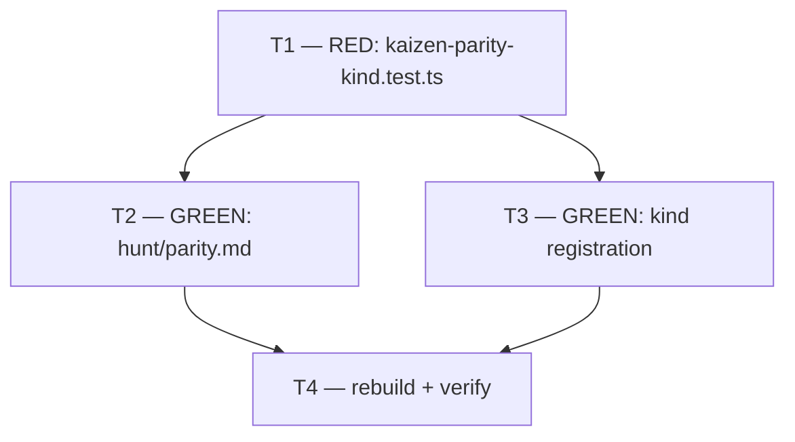

# Plan — M5: Campaign Self-Audit Hunt Kind (`parity`)

> **Milestone M5** · Wave 3 · Depends on: M2 · Status: pending · Track: standard
>
> Adds a 7th kaizen hunt kind, `parity`, that audits a **campaign's own produced output** —
> not the maintainer parity matrix, and not blackhole's own conformance to mercure — against a
> distilled checklist of campaign-output expectations. The checklist is vendored into
> `src/references/hunt/parity.md` at authoring time, citing `PM-NNN` provenance ids read from
> the live matrix; the matrix itself never ships (only `src/` builds to consumer trees —
> `documentation/` never does, so the "consumer repos never see the maintainer matrix"
> constraint is satisfied structurally, not by a new mechanism).

## Objective

Ship the `parity` hunt kind (ADR-013 D1, brainstorm F6) as a pure additive extension to the
existing kaizen hunt seam (ADR-006): a new `src/references/hunt/parity.md` reference file,
kind registration across the (small, precedent-established) set of places a kind name is a
literal enum member rather than an illustrative example, and a regression test file locking
the contract in place. `parity` audits three campaign-output conformance categories — artifact
set per route, doc frontmatter governance, and enforcement evidence in PR bodies — derived
from `documentation/audits/mercure-parity-matrix.md` rows at authoring time (read-only; M5
never writes the matrix — `prj-mercure-sync` remains its sole writer per ADR-013 D1). No new
scoring formula, no new ledger field, no severity floor: `parity` reuses `V-PARETO-02`
(`Priority = Gain × (11 − Effort)`) and the existing `LOW|MEDIUM|HIGH|BLOCK` severity enum
exactly as every other kind does.

## Entry Gate (must verify true before T2 starts)

| # | Condition | Verification method |
|---|---|---|
| 1 | M2 merged — `documentation/audits/mercure-parity-matrix.md` exists, seeded with `PM-NNN` rows | `test -f documentation/audits/mercure-parity-matrix.md`; `milestone-2.md` task checkboxes `[x]` |
| 2 | At least one matrix row's `mechanism` cites the Route → artifact table (`artifact-contract.md`) | `grep -n "artifact-contract" documentation/audits/mercure-parity-matrix.md` — ≥1 match |
| 3 | At least one matrix row's `mechanism` cites doc-governance / lifecycle frontmatter | `grep -in "doc-governance\|frontmatter" documentation/audits/mercure-parity-matrix.md` — ≥1 match |
| 4 | At least one matrix row's `mechanism` cites the review pipeline's PR-body enforcement evidence (Enforcement Hard Gate / readiness report / V-code review output) | `grep -in "enforcement\|readiness report\|review pipeline" documentation/audits/mercure-parity-matrix.md` — ≥1 match |

If rows 2–4 disagree (M2 seeded, but one category has no matching row), T2 documents that
category's checklist item as **derived from the audit evidence base directly**
(`mercure-parity-surface.md`, which is already merged) instead of fabricating a `PM-NNN`
citation that does not exist in the live matrix — never invent an id (mirrors M6's Entry Gate
row 5 discipline: the live artifact, not this plan's prediction, is the source of truth).

## Touch-Paths

- `src/references/hunt/parity.md` — new file
- `src/references/config-template.md` — `kaizen.kinds` default JSON array (line ~23) + the
  `kaizen.kinds` prose row (line ~55)
- `fixtures/config.example.json` — `kaizen.kinds` array (mirrors the template default; drifts
  independently today, so both must be edited)
- `src/agents/hunter.md` — the inline kind-example list (line ~17)
- `scripts/kaizen-parity-kind.test.ts` — new regression test file

No other file is touched. In particular: `documentation/audits/mercure-parity-matrix.md` is
**read-only** for this milestone (single-writer rule, ADR-013 D1); `src/references/hunt/filing.md`,
`src/references/worker-schemas.md`, and `src/references/findings-ledger.md` are **not** edited —
their kind-name mentions are illustrative (`e.g.` / trailing `...`), and the one prior
kind-addition precedent (`retrospective`, already shipped) did not touch any of the three, per
live grep against the current tree (see Strategy below).

## Strategy — resolving the milestone spec's open scope question

The milestone brief flagged "hunt kind registration (`build.ts` ground-truth count if hunts
are counted)" as conditional. Investigation confirms it is **not** conditional — it is
determined: `scripts/build.ts`'s only ground-truth arrays are `RULES_LIST`, `AGENT_NAMES`,
`PHASE_NAMES`, `PHASE_PLAYBOOK_FILES`, `REQUIRED_REFERENCES`, `VCODE_TABLE_ROW_COUNT`, and
`EXPECTED_CHECK_COUNT` (`scripts/build.ts:262-288`) — none enumerate hunt kinds, and
`V-GROUND-01` (`scripts/checks/core.check.ts:599-650`) only diffs those seven facts against an
independent filesystem scan of `src/agents/`. **No `build.ts` change is in scope.** The actual
registration surface was found by grepping every file that spells out the current 6 kind names
together (`quickwins`, `best-practices`, `coverage`, `refactor`, `bug`, `retrospective`) and
cross-checking against the one prior kind addition (`retrospective`, already merged): it
touched exactly `config-template.md` and `hunter.md`, and it also should have touched
`fixtures/config.example.json` but did not — that file's `kaizen.kinds` array
(`fixtures/config.example.json:23`) still lists only the original 5 kinds, one line off from
`config-template.md`'s 6. T3 below fixes both the `parity` addition and this pre-existing drift
in the same touch (both lines are already in T3's Touch-Path; leaving the drift while adding a
7th kind would compound the inconsistency, and it is a one-line fix directly adjacent to the
line T3 is already editing — not new scope, not a second concern).

**Default-inclusion decision** (Hard Choice Protocol Decision Record): `parity` is added to
the **default** `kaizen.kinds` array, consistent with every kind shipped so far (all 6,
including the later-added `retrospective`, are unconditionally in the default array — kaizen
itself, not the per-kind array, is the opt-in gate via `kaizen.enabled: false`). Alternative
considered: opt-in-only (omit from the default array, require an explicit `kaizen.kinds` edit
to enable). Rejected because it would be the first kind to break the "kaizen enabled ⇒ all
shipped kinds active" invariant every existing consumer and the `coordinator.md` config-preview
flow already assumes, for no offsetting safety benefit — `parity`'s findings are gated by the
same `V-PARETO-02` floor and `max_issues_per_wave` cap as every other kind, so it carries no
special blast-radius risk that would justify special-casing it. Confidence: High.

## Issue DAG

T2 and T3 are independent edits (a new reference file vs. four existing enum-list edits) that
both make T1's RED assertions pass; T4 is the single integration point that proves both are
correct together.

## Task Breakdown

### T1 — RED: `parity` kind contract tests

**File**: `scripts/kaizen-parity-kind.test.ts` (new — mirrors the structural-regression style
of `scripts/autonomy-config.test.ts`, one file per concern per doc-governance's "1 file per
concern" convention rather than appending to an unrelated existing test file).

Write these cases, all failing against the current tree (none of T2/T3's content exists yet):

1. `fixtures/config.example.json` — `kaizen.kinds` is an array containing `"parity"`.
2. `config-template.md` — the default JSON example (the fenced code block containing
   `"kaizen":`) contains `"parity"`, and the `kaizen.kinds` prose row documents it (content
   assertion: `.toContain('parity')` scoped to the block between `| \`kaizen.kinds\`` and the
   next `|` `` ` `` table row).
3. `src/agents/hunter.md` — the inline kind-example list contains `` `parity` ``.
4. `src/references/hunt/parity.md` — file exists.
5. `hunt/parity.md` content-shape: contains a `## Scan heuristics` section, a
   `## Calibration table` section, a `## Scoring — V-PARETO-02 SSOT` section identical in
   substance to `bug.md`'s/`retrospective.md`'s (assert it contains the exact formula string
   `Priority = Gain * (11 - Effort)`), and at least one `PM-` citation (regex
   `/PM-\d{3}/`) — proves the checklist is provenance-linked, not free-invented.
6. `hunt/parity.md` never assigns `severity: BLOCK` in its calibration table's Severity range
   column (design constraint from Strategy: this kind self-limits to `LOW..HIGH`) — regex
   assertion the calibration table's severity ranges never contain the literal `BLOCK`.

**AC**: `bun test scripts/kaizen-parity-kind.test.ts` shows all 6 cases (or their `test.each`
expansion) **failing** — `fixtures/config.example.json`/`config-template.md`/`hunter.md` don't
yet contain `parity`, and `hunt/parity.md` doesn't exist. Commit this task's diff separately
before T2/T3 begin.

**Rollback**: delete the new test file; zero production-code impact.

---

### T2 — GREEN: author `src/references/hunt/parity.md`

*(depends on T1)*

**File**: `src/references/hunt/parity.md` (new).

Follow the `bug.md`/`retrospective.md` skeleton (intro citing `kaizen.kinds`/
`config-template.md` and its ADR-013 D1 origin; Territory bands; Scan heuristics; Finding
file/line convention; Severity-term reconciliation note; Calibration table; Scoring —
V-PARETO-02 SSOT). Content:

- **Territory bands**: the first *mixed-territory* kind — heuristics 1–2 (artifact set,
  frontmatter) band by `documentation/<folder>` directory globs (the existing codebase-band
  mechanic, `coverage.md`-style); heuristic 3 (PR enforcement evidence) bands by PR-number
  windows (`retrospective.md`-style, e.g. `"PRs 1-100"`). Both fit the existing
  `territory.bands_scanned` string-array field unmodified (no new field, no prefix syntax —
  `findings-ledger.md`'s "no consumer parses `hunt_state` band content structurally" note
  already establishes this is safe).
- **Scan heuristic 1 — Artifact set per route**: for a merged issue whose route (per
  `queue.json`'s `route` object, ADR-004) required a `documentation/` artifact per
  `artifact-contract.md`'s Route → artifact table, confirm the artifact exists at the
  documented path **and** landed in that issue's own merged PR (not added later, not missing).
  **Gated**: only runs when `docs_governance.enabled && docs_governance.write_governance`
  (absent block/false ⇒ heuristic is inapplicable this wave, not a finding — matches every
  other `docs_governance`-gated consumer's contract).
- **Scan heuristic 2 — Frontmatter governance**: for any `documentation/` file created/touched
  in a merged PR, confirm required lifecycle frontmatter (`type`, `status` at minimum, per
  `doc-governance.md`) is present and well-formed. **Gated**: only runs when
  `docs_governance.enabled && docs_governance.companion_files` (mirrors `reviewer.md` §10's
  own gating for the same underlying obligation).
- **Scan heuristic 3 — Enforcement evidence in PR bodies**: for a merged PR whose issue passed
  through the `review` phase (`queue.json` `phase` history), confirm the PR body or its linked
  review artifact shows the review pipeline actually ran — `Closes #N`/`Fixes #N` linkage
  (`V-GIT-01`), and either a reviewer verdict/V-code mention or a documented deferral with a
  matching ledger `deferred_to_issue`. **Not** `docs_governance`-gated (the review pipeline
  itself is unconditional).
- **Finding file/line convention** (table, `retrospective.md`-style, since heuristics 1 and 3
  are not naturally single-file/single-line): heuristic 1 → the expected artifact path,
  `line: 0` (whole-file existence, not a line defect); heuristic 2 → the actual file missing/
  malformed frontmatter, `line: 1` (frontmatter block convention); heuristic 3 → sentinel
  `pr:<number>` (verbatim reuse of `retrospective.md`'s own sentinel convention), `line: 0`.
- **Severity-term reconciliation note**: reuses the existing `LOW|MEDIUM|HIGH|BLOCK` enum
  as-is (no new tier, no severity floor — precedent: `retrospective.md` also introduces neither).
  Explicitly states this kind never assigns `BLOCK`: these are process/governance-conformance
  gaps surfaced *after* the review pipeline already ran, not code-breaking defects — the review
  pipeline itself, not this hunt kind, is the primary enforcement mechanism (`Priority >= 30`
  gate applies uniformly, same as every kind other than `bug`'s severity-floor exception).
- **Provenance**: each of the three heuristics cites the `PM-NNN` id(s) selected per the Entry
  Gate above, as an inline citation (e.g., "per `PM-042`") next to the heuristic's opening
  sentence — never the matrix row's full prose, only the stable id (this is what keeps the
  maintainer matrix un-shipped in substance even though `parity.md` itself ships to consumers:
  `src/` builds to every distributable tree, `documentation/` never does — ARCHITECTURE.md's
  Active Constraints already guarantee this separation structurally, no new mechanism needed).
- **Calibration table**: 3 rows (one per heuristic), `gain`/`effort` 1–10 ranges, severity range
  capped at `HIGH` (never `BLOCK`, per above), one worked (illustrative, invented) example per
  row computing `Priority = Gain × (11 − Effort)`, matching `bug.md`'s worked-example format.
- **Scoring — V-PARETO-02 SSOT**: identical closing section to every other kind, verbatim
  formula citation, "no alternate or per-kind formula" framing.

**AC**: T1 cases 4–6 pass. `bun test scripts/kaizen-parity-kind.test.ts` shows those 3 (or
their expansion) green.

**Rollback**: delete the file; T1's cases 4–6 revert to failing (acceptable mid-flight state,
not merged).

---

### T3 — GREEN: register the `parity` kind

*(depends on T1)*

**Files**: `src/references/config-template.md`, `fixtures/config.example.json`,
`src/agents/hunter.md`.

- `config-template.md:23` — append `"parity"` to the default `kaizen.kinds` JSON array.
- `config-template.md:55` — append `parity` to the prose default list; extend the existing
  sentence pattern ("`retrospective` is included by default whenever `kaizen.enabled: true`")
  to also cover `parity`, or state both together — do not introduce a second sentence pattern.
- `fixtures/config.example.json:23` — append `"parity"` **and** `"retrospective"` (the
  pre-existing one-kind drift identified in Strategy) to bring the fixture's array to parity
  with `config-template.md`'s 7-entry default.
- `hunter.md:17` — append `` `parity` `` to the inline kind-example list.

**AC**: T1 cases 1–3 pass. `bun test scripts/kaizen-parity-kind.test.ts` shows those 3 (or
their expansion) green. `git diff fixtures/config.example.json` shows exactly the `kinds` array
line changed (no unrelated field touched).

**Rollback**: revert the four line-edits; `parity`/`retrospective`-in-fixture reverts to being
silently absent, which is exactly today's behavior (no consumer currently reads the fixture's
`kinds` array for anything but `V-SCHEMA-01`'s structural JSON-parses check, which does not
enumerate kind values).

---

### T4 — Rebuild + verify

*(depends on T2, T3)*

Run `bun run build` (regenerates `.agents/build/*`, `codex-*`, `plugins/*` from the `src/`
edits above — `src/references/hunt/parity.md` is a new file under a built tree, per
`tree-shape.test.ts`'s regression #226 precedent for `src/references/hunt/` subdirectory
handling), then `bun run verify` (28 checks — expect **zero net change** to
`EXPECTED_CHECK_COUNT`, since no `scripts/checks/*.check.ts` file is added or modified by this
milestone) and the full `bun test` suite, including `V-LINK-01`'s dead-markdown-link check
(`scripts/verify.ts` `findDeadMarkdownLinks`) against every cross-reference `parity.md` makes
(`config-template.md`, `blackhole-vcodes.md`, `filing.md`, `worker-schemas.md`).

**AC**: `bun run verify` exits 0, `EXPECTED_CHECK_COUNT` unchanged at 28 and all 28 pass
(explicit pass on `V-LINK-01` and `V-SCHEMA-01`). `bun test` exits 0 with `scripts/kaizen-parity-kind.test.ts`'s
6 cases all green and zero regressions in the existing suite (`autonomy-config.test.ts`,
`tree-shape.test.ts`, `verify.test.ts` unaffected).

**Rollback**: N/A — this task only runs build/verify tooling; a failure here means T2 or T3
needs its own rollback.

## Documentation Impact

- `src/references/hunt/parity.md` is new documentation-as-source (ships to consumer repos via
  `bun run build`), not `documentation/`-tree content — doc-governance frontmatter lifecycle
  rules do not apply to it (it is under `src/`, per the file-organization exemption for
  auto-generated/source-tree content).
- `documentation/audits/mercure-parity-matrix.md` is **read**, never written, by this
  milestone — no row-status transition, no `verified` bump. The matrix's own maintenance
  stays exclusively `prj-mercure-sync`'s (ADR-013 D1 single-writer rule); this milestone must
  not be mistaken for a sync run.
- No `ARCHITECTURE.md`/`DESIGN.md` impact (no architectural redesign, no UI surface).
- No ADR produced — `documentation/decisions/INDEX.md` is untouched (V-ADA-02 N/A).
- ADR-013's own Migration Plan step 5 ("self-audit F6 hunt kind... proceeds as scored
  issues/initiative milestones — outside this ADR") is satisfied by this milestone landing;
  no ADR-013 text edit is needed to reflect that (the ADR already frames F6 as future work,
  not a commitment this milestone must go back and check off inside the ADR body).

## Codebase Conventions

| Touchpoint | Convention | Source |
|---|---|---|
| Hunt kind reference skeleton | `src/references/hunt/{kind}.md` — intro / Territory bands (if non-codebase) / Scan heuristics / Finding file/line convention (if non-single-file) / Severity-term reconciliation note / Calibration table / `## Scoring — V-PARETO-02 SSOT` closing section, formula cited verbatim | `bug.md`, `retrospective.md` |
| Kind registration surface | Only files spelling the kind list as a literal, authoritative enum (`config-template.md` default array + prose, `fixtures/config.example.json`) or as a non-`e.g.` inline list (`hunter.md`) get a new kind name; illustrative `e.g.`/`...`-suffixed lists (`filing.md`, `worker-schemas.md`, `findings-ledger.md`) do not, per the `retrospective` precedent | Live grep of the current 6-kind enumeration across `src/` + `retrospective`'s own (already-merged) diff shape |
| Single-writer rule | `documentation/audits/mercure-parity-matrix.md` has exactly one writer (`prj-mercure-sync`); all other readers, including this milestone's hunt kind, cite row ids read-only | ADR-013 D1; `blackhole-state.md` § Single-writer invariant |
| `V-PARETO-02` scoring | `Priority = Gain × (11 − Effort)`, `>= 30` to file, no per-kind alternate formula, no new ledger field | `blackhole-vcodes.md`; ADR-006 § Scoring model |
| `docs_governance` kill-switch | Nested block, parent `enabled` + sub-flags; absent/`false` ⇒ dependent feature is a no-op, never a finding | `config-template.md` §`docs_governance` contract note |
| Structural regression tests | One test file per shipped contract, content-presence assertions via `fs.readFileSync` + `.toContain()`/regex, `describe` blocks per artifact | `scripts/autonomy-config.test.ts` |
| `src/` build-output discipline | `src/` is the only editable source; `.agents/build/*`, `codex-*`, `plugins/*` are `bun run build` output, never hand-edited | `ARCHITECTURE.md` Active Constraints |

## Risks

| ID | Risk | Impact | Mitigation |
|---|---|---|---|
| R1 | M2 not yet merged when this milestone is picked up (parallel planning, not parallel merging) | Medium | Entry Gate is a hard blocking precondition on T2; escalate rather than fabricate `PM-NNN` citations |
| R2 | A category (artifact/frontmatter/enforcement-evidence) has no matching matrix row even after M2 seeds ~70 rows | Low | Strategy/Entry Gate fallback: cite `mercure-parity-surface.md` directly for that heuristic instead of inventing an id |
| R3 | Adding `parity` to the default `kaizen.kinds` array surprises an existing consumer who enabled `kaizen` expecting only the prior 6 kinds | Low | Documented Decision Record in Strategy; no functional risk — findings still gated by `V-PARETO-02`/`max_issues_per_wave`, same as every kind |
| R4 | `fixtures/config.example.json`'s pre-existing `retrospective` drift fix (T3) reads as scope creep beyond "add `parity`" | Low | One-line, directly adjacent to the edit T3 already makes on the same array; documented explicitly in Strategy rather than silently bundled |
| R5 | A hunter wave for `parity` produces a false-positive "missing artifact" finding when `docs_governance.write_governance` is `false` | Low → mitigated | Heuristic 1/2 explicitly gated on the relevant `docs_governance` sub-flags in T2; inapplicable, not a finding, when the flag is off |

## Execution Assignments

| Task | Agent | Model | Notes |
|---|---|---|---|
| T1 — RED contract tests | `mercure:x-tester` | sonnet (full mode) | Owns test authorship/execution; writes failing cases first, confirms RED |
| T2 — `hunt/parity.md` authoring | `general-purpose` | sonnet | Reads the live matrix (Entry Gate) for `PM-NNN` provenance; read-only against the matrix |
| T3 — kind registration | `general-purpose` | sonnet | Four small line-level edits across config template, fixture, and hunter agent |
| T4 — rebuild + verify | `mercure:x-tester` | sonnet (full mode) | Runs `bun run build`, `bun run verify`, full `bun test`; reports evidence per Verification Evidence Gate |

## Acceptance Criteria (milestone-level)

1. `src/references/hunt/parity.md` exists, follows the established hunt-kind skeleton, and
   every scan heuristic cites at least one live `PM-NNN` id (or an explicit documented fallback
   per R2) — never a fabricated id.
2. `kaizen.kinds` default array is `parity`-inclusive in both `config-template.md` and
   `fixtures/config.example.json` (with the latter's pre-existing `retrospective` drift also
   closed); `hunter.md`'s inline kind list includes `parity`.
3. `documentation/audits/mercure-parity-matrix.md` shows **zero** diff (read-only compliance
   with the single-writer rule).
4. `scripts/kaizen-parity-kind.test.ts` exists, was RED before T2/T3 and is GREEN after —
   commit history shows the RED commit preceding the GREEN commits (TDD ordering evidence).
5. `bun run verify` exits 0 (28/28 checks, `EXPECTED_CHECK_COUNT` unchanged) and full `bun test`
   exits 0.
6. `git diff` for this milestone's PR touches only the 5 files in Touch-Paths — no `src/agents`
   file other than `hunter.md`, no `scripts/checks/*.check.ts` file, no `build.ts` change.

## References

- ADR-013 — Mercure Parity Program (D1 matrix contract, single-writer rule; Migration Plan
  step 5 names the F6 self-audit hunt kind as future scored work)
- `documentation/audits/mercure-parity-surface.md` — evidence base; fallback citation source
  per R2
- ADR-006 — Kaizen Hunt (hunt-kind extension seam; `V-PARETO-02` scoring SSOT)
- `src/references/hunt/bug.md`, `src/references/hunt/retrospective.md` — skeleton + prior
  kind-addition precedent
- `src/references/artifact-contract.md`, `.claude/rules/doc-governance.md` — heuristic 1/2
  source contracts
- `documentation/milestones/_active/mercure-parity-program/milestone-6.md` — sibling milestone
  in the same initiative; frontmatter/Entry-Gate style precedent
