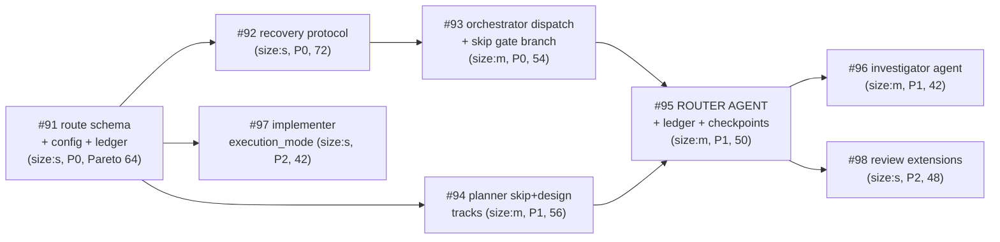

# ADR-004 Adaptive Routing — Campaign Implementation Plan

## Strategy

**Dogfood**: blackhole's own campaign implements ADR-004. The 8 implementation steps are filed
as forge issues #91–#98 with dependency links; the campaign (`/goal run blackhole until empty`)
processes them through the *current* rigid pipeline — its last full run before the adaptive
router it is building replaces that pipeline. One PR per issue; `bun run build && bun run
verify` green is an acceptance criterion on every issue.

## Issue DAG

Parallelizable waves (respecting `parallel_max`): **W1** #91 → **W2** #92, #94, #97 →
**W3** #93 → **W4** #95 → **W5** #96, #98.

## Execution Assignments

Per blackhole protocol: `planner` (sonnet) plans each issue, `implementer` (sonnet) builds in
an isolated `wt-<issue>` worktree on `blackhole/issue-N` branches, `reviewer` (sonnet) audits
each PR with V-codes, orchestrator merges on LGTM. No session-model inheritance — worker tiers
are pinned by the agent definitions.

## Codebase Conventions (integration touchpoints)

| Touchpoint | Convention | Source |
|------------|------------|--------|
| Edit surface | `src/` only; every platform tree is a build output of `bun run build` | `documentation/architecture.md` |
| Agent registration | `scripts/build.ts` `AGENT_NAMES` / `AGENT_MD_FILES` / `AGENT_YAML_FILES`; propagates to 5 targets | `scripts/build.ts` |
| Worker handoff | worker-JSON `{status, plan_path, track}` shape per `src/references/worker-schemas.md` | `worker-schemas.md` |
| Plan artifacts | `plans/issue-N.md` existence contract (V-PLAN-01 is existence-only — verified) | `scripts/verify.ts` `checkPlanArtifacts` |
| State mutations | `.tmp` + `mv` atomic writes, `refreshed_at` bump, ledger dedup key | `blackhole-state.md` |
| Orchestrator sandbox | `disallowedTools: [Write, Edit, Delete]` — inviolable; planner skip track writes the rationale record | `src/agents/orchestrator.md:5` |

## Risks

| Risk | Mitigation |
|------|------------|
| Campaign workers drift from ADR-004's verified design decisions (e.g. reintroduce orchestrator-side writes) | Every issue body cites the ADR; reviewer audits plan-conformance; ADR trade-off table names the rejected alternatives |
| #95 (router) proves too large for one PR | Blackhole's own split gate applies — expected outcome is a split into contract + checkpoints PRs, which is the protocol working |
| Cross-issue schema drift (#91's contract vs later consumers) | #91 lands first (hard dependency for all); consumers cite its merged shape |
| Ambiguity blocks the campaign on clarify gates | ACs written machine-verifiable per issue; ADR-004 answers the product-level questions in advance |

## Success Criteria

- [ ] All 8 issues merged, each via its own reviewed PR with `Closes #N` linkage
- [ ] `bun run build && bun run verify` green at every merge (V-PLAN-01 included)
- [ ] Agent roster = 7 (coordinator, orchestrator, planner, implementer, reviewer, router, investigator) across all 5 build targets
- [ ] A `plan_mode: skip` issue routes end-to-end: router → planner skip track → rationale record → implement → review (no-API-surface check) → merge
- [ ] Routing decisions visible in `findings-ledger.json`
