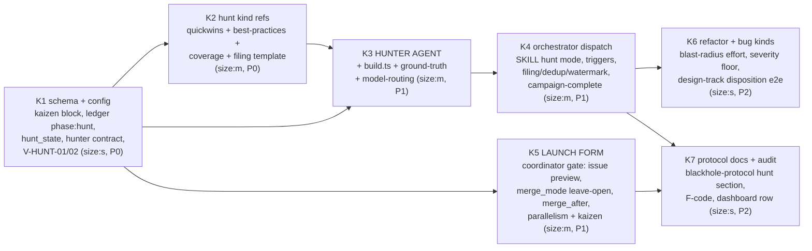

# ADR-006 Kaizen Hunt — Campaign Implementation Plan

## Strategy

**Dogfood** (same pattern as the ADR-004 campaign): blackhole's own campaign implements
ADR-006. The 7 implementation steps are filed as forge issues with dependency links; the
campaign processes them through the adaptive pipeline. One PR per issue; `bun run build &&
bun run verify` green is an acceptance criterion on every issue. Issue numbers are assigned
at filing time (campaign launch); the DAG below uses step IDs.

## Issue DAG

Parallelizable waves (respecting `parallel_max`): **W1** K1 → **W2** K2, K5 → **W3** K3 →
**W4** K4 → **W5** K6, K7.

K5 depends only on K1 (the `kaizen` config fields it asks about) and touches
`coordinator.md` + `config-template.md` + `phase-loop.md`'s merge protocol — it
parallelizes with the hunter-side work.

## Execution Assignments

Per blackhole protocol: `planner` (sonnet) plans each issue, `implementer` (sonnet) builds
in an isolated `wt-<issue>` worktree on `blackhole/issue-N` branches, `reviewer` (sonnet)
audits each PR with V-codes, orchestrator merges on LGTM. Worker tiers pinned by agent
definitions — no session-model inheritance.

## Codebase Conventions (integration touchpoints)

| Touchpoint | Convention | Source |
|------------|------------|--------|
| Edit surface | `src/` only; every platform tree is a build output of `bun run build` | `ARCHITECTURE.md` |
| Agent registration | `scripts/build.ts` agent lists + `ground-truth.md` counts (agent_count 7 → 8, skill_mode_count 7 → 8, vcode_table_rows 41 → 43) | `scripts/build.ts`, `src/references/ground-truth.md` |
| Worker handoff | Hunter output contract added to `src/references/worker-schemas.md`, consistent with existing worker-JSON shapes | `worker-schemas.md` |
| Config gating | `kaizen` block copies the `docs_governance` contract note verbatim: absent block or `enabled: false` = current behavior preserved exactly | `src/references/config-template.md` |
| State mutations | `.tmp` + `mv` atomic writes, `jq empty` validate, `refreshed_at` bump, ledger dedup key; `hunt_state` follows the `routing_decisions[]` sibling-block precedent | `blackhole-state.md`, `findings-ledger.md` |
| Issue filing | `gh issue create … $(bun scripts/forge-scope.ts create-args)` + `deferred_to_issue` linkage — the existing discovery-filing path, no new filing code | `forge-sync.md`, `phase-loop.md` |
| Agent sandbox | `hunter` is read-only (`disallowedTools: [Write, Edit, Delete]` except own wave note), mirroring `investigator.md` | `src/agents/investigator.md` |

## Risks

| Risk | Mitigation |
|------|------------|
| Ledger `phase` enum extension breaks existing consumers | K1 includes a consumer sweep for `phase` switch/match sites as an acceptance criterion; lands before anything produces `phase: hunt` rows |
| K4 (dispatch) proves too large for one PR | Blackhole's own split gate applies — expected split: trigger plumbing vs filing protocol |
| Hunter gain/effort miscalibration floods or starves filings | Calibration tables in K2/K5 carry worked examples per band; `min_priority` tunable upward; first activated campaign runs with `max_issues_per_wave: 10` and human spot-audit of ledger scores |
| Drift from ADR-006's verified decisions (e.g. a second scoring formula sneaks into a kind ref) | Every issue body cites the ADR §; reviewer audits plan-conformance; the SSOT rule is stated in each kind reference |
| `every-n-loops` trigger interacts badly with `merge_mode: gated-batch` | K4 acceptance criterion: wave dispatch is a no-op while a gated batch is mid-merge (merge-gate § 4 sequence is never interleaved with filings) |

## Success Criteria

- [ ] All 7 issues merged, each via its own reviewed PR with `Closes #N` linkage
- [ ] `bun run build && bun run verify` green at every merge; ground-truth counts updated in the same PRs that change them
- [ ] Agent roster = 8 across all build targets; `hunt` mode present in SKILL.md modes table
- [ ] With `kaizen.enabled: true, trigger: on-empty` on a test repo: draining the queue triggers a hunt wave, files ≥1 `[Kaizen]` issue with `deferred_to_issue` ledger linkage, auto-sync ingests it, and it flows handle → merge unmodified
- [ ] A hunted `size:l` refactor finding routes into the design track (`needs_design`) end-to-end
- [ ] A `CRITICAL` bug finding files regardless of Priority score (severity floor observed)
- [ ] Launch form: a fresh bootstrap walks scope (with live issue-count preview), merge policy (all three modes offered, `leave-open` selectable), `merge_after` confirmation on gated-batch, parallelism, and kaizen — and persists the confirmed config before the orchestrator spawns
- [ ] `merge_mode: leave-open`: campaign completes with all PRs LGTM'd and open, `merged_by: blackhole` never set
- [ ] Campaign completes: territory exhausted / `max_waves` reached ends the loop; `enabled: false` reproduces pre-ADR-006 behavior exactly
