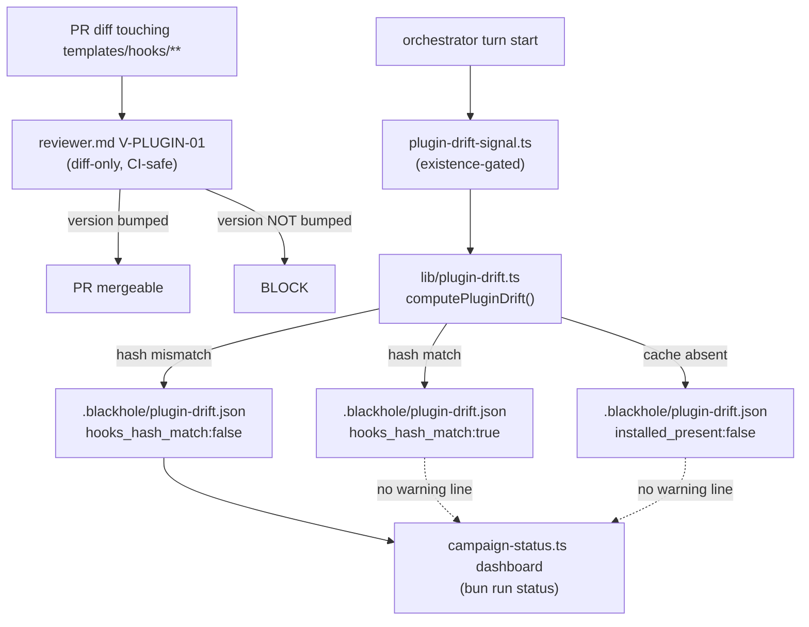

# Design Note - Issue #800

**The enforcing PreToolUse guard is the installed plugin copy, which lacks #761 and #774 while
reporting the same version — merged guard fixes are inert.**

Research consumed as read-input, not re-derived: `.blackhole/plans/issue-800-research.md`
(investigator-800, confidence 85). Its findings are cited by section below rather than restated.

## Requirements Framing

Five acceptance criteria, three already answered by the research note and by the issue's own
follow-up measurement (`gh issue view 800`, owner comment 2026-09-03T12:54:37Z), leaving one
genuine open design decision:

- **AC1** (document the refresh mechanism) — answered by research: republish (bump `package.json`
  → `bun run build` regenerates the 5 version-carrying manifests, `.claude-plugin/plugin.json`
  included) + `/plugin marketplace update <name>` + reinstall, or the documented
  `rm -rf ~/.claude/plugins/cache` fallback. Not yet **written down** anywhere in this repo —
  that gap is Task 1 below.
- **AC2** (make the divergence detectable, no CI no-op trap) — the one genuine open decision.
  See § Options + Trade-off Matrix and the Gate below.
- **AC3** (require a version bump for `templates/hooks/**` changes) — research answers "yes,
  structurally" (the cache is version-keyed, so a bump is the only signal any refresh path
  checks); this note additionally verifies **how** that requirement should be implemented,
  since it is not free of its own design questions (§ Refactoring Impact Analysis below).
- **AC4** (are #761/#774's fixes live for any consumer) — closed empirically and negatively by
  the issue owner's follow-up comment: three merged fixes (`#761`, `#774`, `#777`) are all
  absent from the installed copy (0/5, 0/3, 0/3 named-symbol occurrences), installed mtime
  `2026-08-31` predates all three merge commits. No further action needed for AC4 itself.
- **AC5** (re-run #774's 8-case probe through the hook boundary) — correctly deferred: it
  requires a refreshed installed copy, which requires a human-run republish+reinstall this plan
  explicitly must not perform (spawn-time constraint). Specified as Task 6 below, for a later
  phase, with the exact mechanism that avoids the earlier verified-the-module-not-the-system
  mistake.

## Options + Trade-off Matrix

Decision type: **architecture-choice** (`design-rubric.md`) — this introduces a new detection
boundary, not a library pick or a pure refactor. Fixed columns/weights for this type: Risk 30,
Maintainability 25, Complexity 20, Reversibility 15, Consistency-with-existing-pattern 10.

**Option A — Session-start content-hash signal only (detection, no gate).** Mirror
`scripts/doc-health-signal.ts` exactly: an existence-gated script that, when
`~/.claude/plugins/cache/blackhole-marketplace/blackhole/<version>/` exists, hashes the
installed `hooks/` tree and compares it against the repo's own native build target
(`.claude/hooks/`) at the matching resolved version, writing `.blackhole/plugin-drift.json`.
Advisory only — never glob-discovered by `verify.ts`, no merge gate anywhere.

**Option B — `verify` check, fails when no cache is present or content differs.** A new
`scripts/checks/*.check.ts` module, glob-discovered by `verify.ts`, using the existing binary
`CheckResult { id, ok, detail? }` contract (`check-utils.ts`) — there is no third "skip" state
in this repo's check aggregation (`results.some(r => !r.ok) ? 1 : 0`, `scripts/verify.ts:30`).
Returns `ok: false` whenever the cache is absent, or present with a hash mismatch.

**Option C — Reviewer-time version-bump gate + session-start advisory signal (composite,
CHOSEN by this primary scoring).**
1. New `reviewer.md` diff audit (new V-code `V-PLUGIN-01`, BLOCK): a PR whose diff touches
   `templates/hooks/**` without also changing `package.json`'s `version` field in the same diff
   is blocked. Purely diff-content — never reads installed/local state, so it is CI-safe by
   construction, using the same pattern as reviewer.md's existing Touch-Paths/Threat-Model/API-
   contract-drift audits (§§1, 16, and the API Contract Audit).
2. The same session-start hash signal as Option A, kept specifically for the residual gap
   mechanism 1 cannot see: a PR correctly bumps the version, but nobody ever runs the manual
   republish+reinstall step afterward.

### Scoring (design-rubric.md 1-5 scale; primary + 2 blind critics, ADR-010 D4)

| Option | Risk (30) | Maintainability (25) | Complexity (20) | Reversibility (15) | Consistency (10) | Weighted total |
|---|---|---|---|---|---|---|
| A (primary) | 2 | 4 | 4 | 5 | 5 | 3.65 |
| B (primary) | 1 | 2 | 2 | 3 | 2 | 1.85 |
| C (primary) | 5 | 4 | 4 | 4 | 5 | **4.40** |
| A (critic_a) | 3 | 4 | 4 | 5 | 5 | 3.95 |
| B (critic_a) | 1 | 1 | 2 | 3 | 1 | 1.50 |
| C (critic_a) | 5 | 4 | 3 | 4 | 5 | **4.20** |
| A (critic_b) | 3 | 4 | 5 | 5 | 5 | **4.15** |
| B (critic_b) | 1 | 1 | 3 | 4 | 1 | 1.85 |
| C (critic_b) | 5 | 3 | 2 | 4 | 5 | 3.75 |

Primary and critic_a agree C wins (margins 17.0% and 6.0%); critic_b's own scoring puts A ahead
of C (margin 9.6%) — driven entirely by critic_b scoring C's Complexity lower (2, vs primary's 4
and critic_a's 3), reasoning that mechanism 1's protection is only as good as the
`templates/hooks/**` glob's ongoing accuracy against future file moves. That is a real,
non-frivolous objection (addressed directly under § Assumption Audit below), not scoring noise.

## Adversarial Evaluation

Two blind critique-only `planner` sub-invocations scored the same three options (primary's
provisional Chosen field stripped before spawn), against the fixed architecture-choice rubric.
Full scores in the table above; both independently converged on the same structural verdict
about Option B and largely agreed on Option C's case, disagreeing only on its Complexity column.

**Both critics independently flagged Option B as CRITICAL and discriminating**, for the same
underlying mechanical reason stated two different ways:

- critic_a: *"Because CI never has a populated plugin cache, this check's `ok` field is false
  unconditionally on every CI run, and `verify.ts`'s `results.some(r => !r.ok)` aggregation
  means this single check permanently reds the entire verify gate for every PR regardless of
  content."* Also: *"The binary `CheckResult{id, ok, detail}` contract has no skip/unknown
  state, so Option B is structurally incompatible with the repo's own check contract as
  written."*
- critic_b: *"This is the exact 'environment-dependent gate is worse than none' trap the problem
  statement warns against, inverted: instead of silently no-op'ing locally, it unconditionally
  fails in the one environment (CI) that structurally cannot ever satisfy it, which is arguably
  worse since it cannot be fixed by any PR content change."*

This is the steelman for rejecting Option B stated at its strongest, independently reproduced
twice: Option B is not merely "imperfect" — given this repo's actual `CheckResult` contract
(binary, no tri-state), it is a **permanently-red CI gate**, worse than the silent-no-op trap it
was proposed to avoid, because a silent pass can at least be investigated by a human who notices
something is off; a permanently-failing check trains operators to ignore `verify` failures
entirely (the "crying wolf" failure mode), which is a structurally worse instance of the same
"control that reports without observing" pattern this very issue is about.

**Both critics also independently found Option A insufficient alone** (NOTABLE, discriminating):
advisory-only with no gate anywhere does not prevent the root-cause recurrence pattern (a hooks
PR merging without a version bump) — it only surfaces drift *after* it has already happened, to
a human who happens to be running the campaign with a populated cache and reading the per-turn
report. That is close to the exact failure mode that let three fixes go undetected in the
original incident (nobody was watching for it).

**Domain-inherent findings** (apply to all three options equally, not decision-changing):
neither critic found any option able to force the actual manual reinstall step to happen, and
neither found any option able to fix the underlying Claude Code platform behavior (version-keyed,
not content-addressed cache) — both are properties of the platform this repo does not control,
consistent with the research note's own framing.

**ADR citations**: neither critic's findings cited a specific ADR as decisive evidence for an
option, so no `adr_citations[]` entries were returned by either invocation, and no ADR-staleness
check applies to this decision.

## Component Decomposition

Genuinely multi-component: this design introduces five independent responsibility boundaries,
none of which subsumes another.



Five boundaries: (a) reviewer diff-audit (V-PLUGIN-01, markdown behavioral rule), (b) a pure
drift-computation library function (`computePluginDrift`, independently testable with fixture
directories), (c) a thin CLI wrapper mirroring `doc-health-signal.ts`'s `main()`, (d) a dashboard
surfacing addition to an existing CLI (`campaign-status.ts`), (e) protocol wiring making (c) an
actual numbered turn-start step rather than prose-only (see § Refactoring Impact Analysis,
consumer 5). None of (a)-(e) depends on another's internals — (a) and (b)-(d) are fully
independent detection paths that happen to compose, which is the point of Option C.

## Design Principles Validation

| Axis | Score | Justification |
|---|---|---|
| SRP | ✓ | Each of the 5 components (§ Component Decomposition) owns exactly one responsibility: diff audit, drift computation, signal writing, dashboard surfacing, protocol wiring. No component reaches into another's internals. |
| OCP/DIP | N/A | No existing class/module hierarchy is being extended or inverted here — these are new, additive artifacts, not a modification of an existing dispatch mechanism. |
| DRY | ✓ | The signal-writer CLI mirrors `doc-health-signal.ts`'s existence-gated/atomic-write idiom by structural imitation, not by extracting a shared abstraction across a single consumer (`V-YAGNI-03` — a two-consumer shared helper is deferred until a third signal script exists, not built preemptively). The reviewer audit reuses the existing numbered-section/V-code-table pattern verbatim. |
| KISS | ✓ | Mechanism 1 (reviewer gate) is a single diff-content boolean; mechanism 2 (signal) is a single hash comparison. Neither introduces an abstraction layer, a new CLI subcommand, or a config flag — the earlier alternative considered (a new `bun run release bump-patch` subcommand) was rejected specifically on KISS/YAGNI grounds once `bun run build` was confirmed to already regenerate all 5 manifests from `package.json`'s version with no separate tooling needed (§ Refactoring Impact Analysis). |
| YAGNI | ✓ | No speculative generalization: the drift signal targets exactly the `hooks/` subtree that caused the incident, not an arbitrary "compare any installed vs repo path" framework. |
| Pattern check | ✓ | Reuses two already-established repo patterns (advisory session-signal, diff-content reviewer BLOCK) rather than inventing a third detection shape. |

## Refactoring Impact Analysis

Interfaces/consumers this design changes, and the classification of each (direct grep-based
scan, not an LLM estimate):

| Consumer | Classification | Note |
|---|---|---|
| `scripts/verify.ts` glob-discovered check set | TRANSPARENT | No new `scripts/checks/*.check.ts` module is registered — confirmed by grepping `scripts/checks/` (45 existing modules, none named for this concern); Option B (rejected) would have been the only option touching this consumer. |
| Every future PR touching `templates/hooks/**` | **BREAKING** | New mandatory requirement: must also bump `package.json`'s `version` field (and rerun `bun run build`) in the same diff, enforced by new reviewer BLOCK `V-PLUGIN-01`. Verified empirically that this is a genuinely new constraint, not already satisfied: `git log --oneline -- .claude-plugin/plugin.json` shows version changes occur **only** at release-boundary commits (e.g. `9274fbcf docs: add v0.21.0 release notes`) — none of #761/#774/#777's merge commits touched any version manifest. |
| `.blackhole/config.json` `wave_scheduling.hot_files_max_one_per_wave` | DEPRECATION (recommended, not required) | `package.json` becomes a slightly hotter file once hooks-touching PRs must bump it. Collision risk is low relative to the precedent this list already exists for (`scripts/lib/build/facts.ts`'s `EXPECTED_CHECK_COUNT` line, which needed coordinated hand-arithmetic) — a version-string patch bump is a single self-contained line, not a counted total two PRs both increment blindly. Not adding this file to the list is left as an explicit human call in Task 5, not auto-applied by this plan (config.json is orchestrator-owned state, outside this plan's Touch-Paths). |
| `scripts/campaign-status.ts` dashboard | TRANSPARENT | Additive summary line only, gated on `.blackhole/plugin-drift.json` existing with `hooks_hash_match: false`; existing dashboard sections and `renderConfigSummary` output are unchanged. |
| `src/references/orchestrator-runtime.md` § Session resume & recovery (turn-start list, line ~152) | TRANSPARENT | New parallel existence-gated step added alongside the turn-start sequence; that section's existing numbered steps (drift heal, staleness cross-link, worktree inspection) are unchanged. **Residual finding, not fixed here (V-SCOPE-01 — stays out of this plan's Touch-Paths):** grepping this file and `src/agents/orchestrator.md` for `doc-health-signal` returns zero matches — the Doc-Health Signal's own turn-start invocation is documented only in `blackhole-state.md`'s rule text, never as an actual numbered step here. This plan's Task 5 adds an explicit numbered step for the *new* plugin-drift signal rather than inheriting that same "documented but not concretely wired" gap; the pre-existing doc-health gap is flagged for a follow-up issue, not silently fixed inside this Touch-Paths. |

**On critic_b's Complexity objection** (glob accuracy over time, § Adversarial Evaluation): the
trigger glob is scoped to `templates/hooks/**` (the whole hooks source tree, not narrowed to the
`pretooluse/` subdirectory) specifically so a future reorganization within that tree (e.g. a new
`templates/hooks/sessionstart/` subdirectory) stays covered without a glob edit — mitigating,
not eliminating, the objection. A hook source ever added *outside* `templates/hooks/` entirely
would still evade the gate; noted under § Assumption Audit rather than solved speculatively
(`V-YAGNI-01` — no such location exists today).

## Assumption Audit

| Assumption | Mark | Note |
|---|---|---|
| Marketplace/plugin names (`blackhole-marketplace`/`blackhole`) used to construct the cache path stay stable | ✓ Validated | Confirmed against both the issue's own evidence table (`~/.claude/plugins/cache/blackhole-marketplace/blackhole/0.21.0/...`) and `CLAUDE.md`'s documented install command. |
| Same-version reinstall forces a fresh fetch vs. no-ops against the existing cache dir | ◐ Blind spot | Explicitly flagged by the investigator as inferred, not documented (`.blackhole/plans/issue-800-research.md` §Q2, final paragraph). Task 1's documentation deliberately routes around this uncertainty by recommending the one **documented** unconditional path (`rm -rf ~/.claude/plugins/cache` + restart + reinstall) rather than relying on same-version reinstall semantics. |
| `bun run build` deterministically re-syncs all 5 version-carrying manifests from `package.json`'s version with no separate manual step | ✓ Validated | `scripts/release.ts`'s `prepareRelease` calls `build()` immediately after `pkg.version = version`; `scripts/lib/build/targets.ts:47` reads `const version = projectIdentity.version` (sourced from `package.json`). This is what let § Design Principles Validation reject a separate `bun run release bump-patch` subcommand as unnecessary. |
| `templates/hooks/**` is the complete, stable edit-surface glob for hook source code | ~ Contestable | See § Refactoring Impact Analysis's response to critic_b above — mitigated by scoping to the whole subtree, not eliminated for a hypothetically relocated hook source. |
| `campaign-status.ts`'s dashboard (`bun run status`) is actually read by a human on a cadence that would catch drift before it compounds | ~ Contestable | Assumed, not independently verified in this session — reasonable given it is the repo's own `bun run status` CLI entrypoint (`package.json`'s `"status"` script), but operator reading habits were not observed. |

## Gate

```json
{
  "status": "blocked",
  "winner": null,
  "reasons": ["dominance", "disagreement", "breaking-consumer"],
  "scorer_results": [
    { "scorer": "primary", "winner": "Option C", "margin": 17.05 },
    { "scorer": "critic_a", "winner": "Option C", "margin": 5.95 },
    { "scorer": "critic_b", "winner": "Option A", "margin": 9.64 }
  ]
}
```

Computed by `scripts/design-aggregate.ts` from the primary matrix, both blind critics' raw JSON,
and the Refactoring Impact Analysis rows above (invocation: `bun run scripts/design-aggregate.ts
--input-file <input> --repo-root <repo>`). Per `planner.md` §4.8, this status is read verbatim,
never substituted with the primary's own judgment: `autonomy.design_dominance_delta` (30%) is
not cleared by any scorer (17.05% / 5.95% / -9.64% margins for the primary's picked option
across the three scorers — `critic_b`'s own winner is a different option entirely), and the
design's own Refactoring Impact Analysis independently declares a `BREAKING` consumer
(every future `templates/hooks/**` PR gains a new mandatory obligation), which
`design-aggregate.ts` treats as an automatic block regardless of dominance — matching this
Design Track's "no confidence bypass, human always decides" default (`planner.md` §4).

**This blocked verdict does not indicate Option C is wrong** — both critics independently
converged on the same CRITICAL rejection of Option B and the same NOTABLE insufficiency finding
against Option A alone; the disagreement is narrower than it first appears (which of A vs C is
*better*, not whether B is viable — no scorer picked B). It indicates the decision needs a human
sign-off before it is autonomously actionable, which is exactly what a genuine `BREAKING`
consumer classification is supposed to force.

### What the owner needs to decide (R-003 executive summary)

- **What**: whether to adopt Option C — a new reviewer BLOCK gate (`V-PLUGIN-01`) requiring
  every `templates/hooks/**`-touching PR to also bump `package.json`'s version, plus an
  independent, advisory-only session-start content-hash signal (`.blackhole/plugin-drift.json`,
  surfaced on `bun run status`) — as the mechanism for AC2/AC3, versus Option A (signal only, no
  gate) or Option B (rejected by both blind critics as a permanently-red CI check given this
  repo's binary `CheckResult` contract).
- **Why**: `scripts/design-aggregate.ts` returned `status: blocked` — not because the analysis
  is weak, but because (1) the three scorers disagree on which of A/C is better (margins of
  17.05%/5.95% for C, and -9.64%, i.e. critic_b's own winner is A) and neither clears the 30%
  dominance bar, and (2) this design's own Refactoring Impact Analysis declares a genuine
  `BREAKING` consumer (every future hooks-touching PR gains a new mandatory obligation) —
  `design-aggregate.ts` treats any `BREAKING` classification as an automatic block, independent
  of scoring, by design (ADR-010 D4's "no confidence bypass" default).
- **Evidence**: `.blackhole/plans/issue-800-research.md` (cache is version-keyed, confirmed from
  Claude Code's own reference docs); issue #800's owner follow-up comment (three fixes
  empirically inert, `2026-09-03T12:54:37Z`); `git log --oneline -- .claude-plugin/plugin.json`
  (version bumps historically occur only at release boundaries, never in feature/bugfix PR merge
  commits — the concrete evidence behind the `BREAKING` classification above); both blind
  critics' independent CRITICAL findings against Option B (§ Adversarial Evaluation).
- **Per-option consequence**: **Option A** (signal only) costs nothing to future PR authors (no
  new gate) but, per both critics, does not prevent recurrence — a 4th/5th/6th hooks fix could
  still merge without a version bump, caught only after the fact by whoever next reads `bun run
  status`. Its strongest case: it is the lower-Complexity, easier-to-approve-immediately choice,
  and *is* a real improvement over the status quo (today there is no signal at all). **Option B**
  (verify-fails-loud) costs a permanently-red CI gate — rejected by both critics as
  structurally worse than the trap it was meant to avoid, given this repo's binary check
  contract; no steelman for adopting it as designed survives that mechanical fact, though the
  underlying instinct (fail loud rather than silent) is sound and is exactly what Option C's
  mechanism 1 does instead, safely. **Option C** (chosen by this primary's and critic_a's
  scoring) costs every future hooks-touching PR one extra, mechanical step (bump `package.json`,
  rerun `bun run build`) enforced as a BLOCK — real but small friction, on a self-contained
  single-line change — in exchange for closing the recurrence path that let three fixes go
  inert in a single campaign turn.

## Codebase Conventions

Grounding for whoever implements this design, gathered from live repository inspection
(`V-INT-04`):

| Concern | Convention | Evidence |
|---|---|---|
| `verify.ts`-discovered check module | Pure `runChecks(): CheckResult[]` export, `CheckResult = { id, ok, detail? }` (binary, no tri-state), glob-discovered, paired `verify.<name>.test.ts` | `scripts/checks/check-utils.ts`, `scripts/checks/hooks.check.ts`, `scripts/checks/config-registration.check.ts` |
| Advisory per-turn signal (not CI-enforced) | Existence-gated script; atomic `<target>.tmp` write + `fs.renameSync`; `.blackhole/<name>.json` with `version: 1`, `refreshed_at` ISO8601; `console.log` summary on direct run via `if (import.meta.main)` | `scripts/doc-health-signal.ts` (`writeDocHealthSignalAtomic`) |
| Reviewer numbered-section audit | `### N. <Name> (\`V-CODE\`)` heading; Gate/Detection/Finding/Non-goal subheadings when the audit has a conditional trigger | `src/agents/reviewer.md` §§16, 28 |
| V-code registration | One row per code in `src/references/blackhole-vcodes.md`'s `| Code | Rule | Severity | Primary enforcement site |` table; structurally verified by `scripts/checks/vcode-citation.check.ts` (row's citation must resolve to a real file+section containing the code string) | `src/references/blackhole-vcodes.md`, `scripts/checks/vcode-citation.check.ts` |
| Version SSOT | `package.json` is the sole hand-edited version; `scripts/release.ts`'s `MANIFEST_PATHS` + `bun run build` regenerate the 5 derived manifests (`.claude-plugin/plugin.json` included) from it; individual feature/bugfix PRs have never historically touched any version field | `scripts/release.ts:71-79`, `git log --oneline -- .claude-plugin/plugin.json` |
| Dashboard CLI | `scripts/campaign-status.ts`'s `main()` composes `render*` helper functions into one printed dashboard | `scripts/campaign-status.ts:33-61` |

## Decision Record (Hard Choice Protocol)

- **Context**: how to make installed-plugin-vs-repo-build divergence detectable (AC2) without
  building a check that is structurally worse than having none (the CI-no-op trap named in the
  issue and independently confirmed twice by blind critics for Option B).
- **Alternatives**: **Easy path** — Option A alone (copy the Doc-Health Signal pattern verbatim,
  advisory only, ship today, zero new gate). **Hard path** — Option C (add a genuinely new,
  BLOCK-severity PR gate with a real behavioral cost to every future hooks-touching PR, plus the
  same advisory signal as a second, independent layer for the gap the gate alone cannot see).
- **Choice**: Option C, pending human Gate approval (§ Gate above — `design-aggregate.ts`
  returned `blocked`, so this is a recommendation, not an authorization).
- **Rationale**: the easy path (A alone) optimizes for shipping something today with zero
  friction to future PR authors, but both blind critics independently concluded it does not
  address the root-cause recurrence pattern — only after-the-fact detection. The hard path (C)
  costs every future `templates/hooks/**` PR one mechanical extra step, forever, but is the only
  option among the three that closes the actual mechanism (an unbumped version merging
  unnoticed) rather than just reporting on its consequence. Given this campaign has already lost
  three merged security fixes to exactly this gap in a single turn, and three more guard changes
  are queued behind this issue, the small recurring friction is judged to be worth the
  structural fix — but this is precisely the kind of judgment call ADR-010 D4 reserves for a
  human when a `BREAKING` consumer is in play, which is why the Gate above returns `blocked`
  rather than auto-approving this rationale.
- **Confidence**: Medium. High confidence that B is wrong (two independent blind critics, same
  mechanical reasoning). Medium confidence that C dominates A specifically — the three scorers
  did not agree on this point (§ Adversarial Evaluation), and critic_b's dissent (glob-accuracy
  risk on mechanism 1) is a real, not frivolous, consideration addressed but not eliminated
  above.

## Threat Model

Trigger: `route.security_review_required: true` (`.blackhole/queue.json` issue 800 entry).

| STRIDE category | Threat | Severity | Mitigation status |
|---|---|---|---|
| Spoofing | A malicious diff crafts a `templates/hooks/**` path that superficially looks like it bumps `package.json`'s version (e.g. touching an unrelated version-like string elsewhere) to spoof `V-PLUGIN-01`'s pass condition | Low | Mitigated — the check reads the actual `package.json` `version` field via JSON parse, not a text-pattern match on the diff; a crafted decoy string elsewhere in the diff does not satisfy it. |
| Tampering | An attacker with write access tampers with the installed `~/.claude/plugins/cache/` directory directly (outside any PR) to reintroduce a stale/weakened guard | Medium | Accepted Risk — outside this design's boundary; the installed cache is per-operator local filesystem state, protected only by normal OS file permissions. The content-hash signal (mechanism 2) would surface this as `hooks_hash_match: false` on the next campaign turn, which is the mitigation this design contributes, but it cannot prevent the tampering itself. |
| Repudiation | A hooks-touching PR merges with a version bump that is later reverted by a separate PR without re-triggering `V-PLUGIN-01` (since the revert PR may not itself touch `templates/hooks/**`) | Low | Mitigated — `V-PLUGIN-01`'s trigger is "diff touches `templates/hooks/**`", not "diff touches `package.json`"; a version-only revert PR that leaves hooks content unchanged does not reintroduce the original incident's failure mode (hooks content changing under a frozen version string) even if it does revert the version number itself. |
| Information Disclosure | The content-hash signal (`.blackhole/plugin-drift.json`) or dashboard line leaks installed-plugin filesystem paths or hook source content to an unintended audience | Low | Mitigated — `.blackhole/` is already gitignored campaign-local state (`blackhole-state.md` § Protocol SSOT); the signal file and dashboard line report only a boolean match/mismatch and version strings, never file content. |
| Denial of Service | `V-PLUGIN-01` false-positives on a legitimate PR that touches `templates/hooks/**` for a non-functional reason (e.g. a comment-only or whitespace-only change), blocking merge unnecessarily | Medium | Mitigated — the gate's cost is bounded and self-resolving: the fix is a one-line `package.json` patch bump plus `bun run build`, not a design change; this is the accepted, deliberate friction discussed in § Decision Record, not an unbounded DoS. |
| Elevation of Privilege | None identified — this design adds a review-time content check and a read-only local signal; it grants no new runtime capability, credential, or execution path to any component. | N/A | N/A — no attack surface introduced. |

All non-N/A threats resolve to `Mitigated` or a deliberately `Accepted Risk` with a stated
compensating control, per `V-THREAT-02`. All six STRIDE categories evaluated per `V-THREAT-03`.

## Task Breakdown (pending Gate approval — not yet authorized; see § Gate)

Drafted so the human sign-off this Gate requires has a concrete plan to approve or amend, per
the stop condition for this design note. None of these tasks are to be executed by this design
pass itself.

1. **AC1 — document the refresh mechanism.**
   Touch-paths: `src/references/blackhole-protocol.md` § Branch & Worktree Hygiene (new bullet),
   new file `templates/hooks/pretooluse/README.md`.
   AC: both files state, in prose citing `.blackhole/plans/issue-800-research.md`, that (a) the
   plugin cache is version-keyed not content-addressed, and (b) the refresh path is
   bump-`package.json`-version + `bun run build` + `/plugin marketplace update <name>` +
   reinstall, or the documented `rm -rf ~/.claude/plugins/cache` fallback when in doubt (routing
   around the same-version-reinstall blind spot, § Assumption Audit).
   Test (red before, green after): a new assertion in `scripts/checks/content-gates.check.ts`
   (existing module, reused per `V-INT-02`) that both files contain the literal phrase
   `version-keyed` — fails today (phrase appears nowhere in either file), passes once Task 1
   lands.

2. **AC2/AC3 mechanism 1 — reviewer BLOCK gate `V-PLUGIN-01`.**
   Touch-paths: `src/agents/reviewer.md` (new `### 29. Plugin Cache Version-Bump Audit
   (\`V-PLUGIN-01\`)`), `src/references/blackhole-vcodes.md` (new table row, BLOCK severity,
   citing `reviewer.md §29`).
   AC: the new reviewer section states the exact trigger (diff touches `templates/hooks/**`)
   and exact pass condition (`package.json`'s `version` field differs between PR base and head).
   Test (red before, green after): `scripts/checks/vcode-citation.check.ts`'s existing
   structural check — fails today (no `V-PLUGIN-01` row exists to resolve), passes once both
   files are updated together in the same diff.

3. **AC2 mechanism 2 — drift computation library + signal CLI.**
   Touch-paths: new `scripts/lib/plugin-drift.ts` (pure `computePluginDrift(...)`, injected
   fs/paths for testability), new `scripts/plugin-drift-signal.ts` (thin CLI wrapper mirroring
   `scripts/doc-health-signal.ts`'s `main()`/atomic-write idiom), new
   `scripts/plugin-drift.test.ts`.
   AC / TDD (each written first, each stating what it would catch if the bug/gap were present):
   - *Test A*: given a fixture with no installed-cache directory, `computePluginDrift` returns
     `{ installed_present: false, hooks_hash_match: null }`. If the function instead defaulted
     `hooks_hash_match` to `true` on absence, this test fails — that is the exact false-
     confidence failure mode this signal exists to prevent.
   - *Test B*: given fixture directories with an **identical version string but different file
     content** (the actual shape of this issue's incident), `computePluginDrift` returns
     `hooks_hash_match: false`. If the function only compared version strings — the pre-existing
     broken behavior every documented refresh path exhibits — this test fails.
   - *Test C*: given byte-identical installed and repo-build fixture directories,
     `computePluginDrift` returns `hooks_hash_match: true`. Guards against a hash function that
     always reports mismatch (fail-loud overcorrection masking a real green state).
   - *Test D (the meta-point, explicit)*: `plugin-drift.test.ts` must include Test B's
     matching-version/diverging-content fixture as a first-class case, not only same-content and
     both-absent cases. A reviewer of this task must confirm that fixture exists before marking
     it done — a test suite that only ever constructed matching fixtures would itself be an
     instance of this issue's exact pattern (a check that cannot observe the failure it claims
     to detect).

4. **AC2 surfacing — dashboard warning.**
   Touch-paths: `scripts/campaign-status.ts` (new `renderPluginDriftWarning` composed into
   `main()`), `scripts/campaign-status.test.ts`.
   AC / test: three-case test asserting the dashboard output matches `/plugin.drift/i` only when
   a `.blackhole/plugin-drift.json` fixture has `hooks_hash_match: false`, and is **absent** for
   both an `installed_present: false` fixture and a `hooks_hash_match: true` fixture — proving
   the surfacing itself does not silently claim drift where none was observed, nor silently omit
   a real mismatch.

5. **Protocol wiring.**
   Touch-paths: `src/references/blackhole-state.md` (new `## Plugin-Drift Signal` subsection
   mirroring § Doc-Health Signal's existence-gating/cadence prose),
   `src/references/orchestrator-runtime.md` § Session resume & recovery (new explicit numbered
   step invoking `bun run scripts/plugin-drift-signal.ts`, existence-gated, alongside the
   existing turn-start sequence at line ~152 — a genuinely new numbered step, not inherited
   prose-only wiring; see § Refactoring Impact Analysis's residual finding about the doc-health
   precedent's own gap, which this task does not also fix).
   AC: `orchestrator-runtime.md`'s turn-start list contains a step whose text includes the
   literal command `bun run scripts/plugin-drift-signal.ts`.

6. **AC5 — re-run #774's 8-case probe through the hook boundary (deferred, later phase, human
   republish+reinstall required first; NOT executed by this plan).**
   Mechanism specified now to avoid repeating the earlier verified-the-module-not-the-system
   mistake: invoke `bun run .claude/hooks/validate-bash-command.js` (or the then-current
   installed copy's equivalent path) as a **subprocess**, piping each of the 8 cases' crafted
   `{ tool_name: "Bash", tool_input: { command: "git worktree remove ..." }, cwd: "..." }` JSON
   payload to its **stdin** (the actual hook I/O contract, `readHookInput()` /
   `.claude/hooks/validate-bash-command.js:27`) and asserting against its stdout/exit code —
   never by `require`-ing `evaluateWorktreeRemoval` and calling it in-process, which is precisely
   what made the earlier "verified live on main" claim true about the module and false about the
   system.

## Sprint Contract

Every task above (1-5; 6 is explicitly deferred, not part of this plan's delivered scope) has a
stated, machine-verifiable AC repeated from its own entry — no task relies on the blanket
"tests and linters pass" fallback. Deferred: 6 (AC5), by explicit spawn-time constraint (no
reinstall/republish in this plan) and by its own logical dependency on 1-5 having shipped and a
human having run the documented refresh path.
