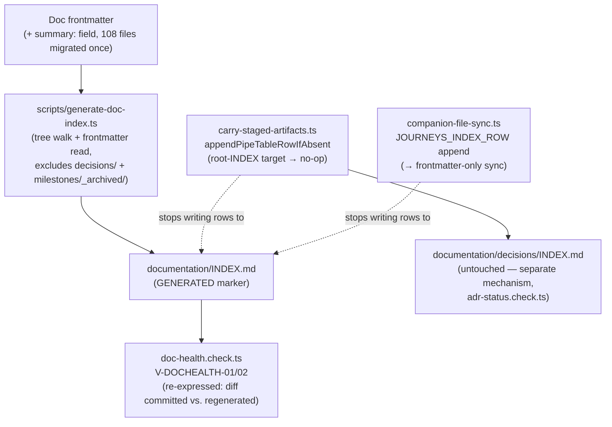

# Design Note - Issue #811

## Requirements Framing

No `route` object exists yet on this queue entry beyond the spawn directive's inline fields
(`needs_design=true`, `needs_analysis=true`, `task_type=refactor`, `plan_mode=full`,
`docs_impact=true`, `security_review_required=false`) — framing is drawn from the issue body
plus fresh first-hand orchestrator evidence.

**Problem, restated in substance**: `documentation/INDEX.md` is a single root markdown table
(5 columns: `path | summary | type | status | review_trigger`) indexing every doc across ~11
folders (`artifact-contract.md` § Route → artifact table). Every merged PR that produces a plan
and/or review artifact appends 1-2 rows to this one file (ADR-021 D3). Verified counts at this
design's base commit: `documentation/INDEX.md` has **108 rows** today (not the 77 the issue text
cites — see Assumption Audit #1), and **13 commits** touched it in the last 6 hours
(`git log --since="6 hours ago" -- documentation/INDEX.md`), slightly higher than the issue's
own "10 commits / 6h" measurement. The orchestrator independently hit this exact conflict class
twice this session (PR #819/issue #788 vs. #818/#804; PR #824/issue #769 vs. #806/#821/#822),
both times with `documentation/INDEX.md` as the **sole** conflicting file, both resolved as
"keep both rows, re-sort," both costing a full rebuild+retest+re-verify cycle. PR #790
(issue #743) already fixed row **ordering** (sorted insert); contention continued at the same
rate afterward, confirming the issue's own diagnosis that ordering and contention are separate
problems.

**Decision to make**: how `documentation/INDEX.md` (Scope-1, blackhole's own tree) should be
maintained going forward, given that hand-appending (even sorted) keeps producing this
conflict class. `documentation/decisions/INDEX.md` (the separate per-folder ADR index, governed
by `adr-status.check.ts`) is explicitly **out of scope** — it is a different file with a
different, lower-frequency writer set (only the `design` route), not implicated in the measured
contention.

## Options + Trade-off Matrix

Decision type: **`refactor-strategy`** (`design-rubric.md`) — restructuring existing
behavior-preserving infrastructure (how an already-correct index gets produced), not a new
structural boundary or a data-model contract change. Fixed columns/weights:

| Column | Weight |
|--------|--------|
| Effort | 25 |
| Complexity | 20 |
| Risk | 20 |
| Reversibility | 20 |
| Consistency-with-existing-pattern | 15 |

`Risk` is scored as the risk profile of the resulting decision going forward (including the
risk of *not* solving a measured, ongoing problem), not merely "risk of writing new code" — this
framing was disclosed to both blind critics identically.

### Option A — Generate `documentation/INDEX.md` from a tree walk + frontmatter

Add a `summary:` field to the existing 5-field lifecycle frontmatter (`doc-governance.md` §
Lifecycle Frontmatter). One-time migration copies each of the **108** existing hand-written
summary-column values into that file's new `summary:` field. A new generator script walks
`documentation/` (excluding `decisions/` — its own governed per-folder index — and
`milestones/_archived/`), reads frontmatter from every doc, and emits the root table sorted by
path (reusing `check-common.ts`'s existing `byPathByteOrder` comparator — `V-INT-02`, not a new
sort). The committed file carries a `<!-- GENERATED — do not hand-edit -->` marker; `bun run
verify` regenerates it in-memory and fails (blocking) when the committed file differs. This
reuses a convention **already established** in this exact repo: every platform build target
(`.claude/`, `.cursor/`, `skills/`, `codex-*`, `.agents/build/`, `plugins/`) is generated from
`src/` with an identical `<!-- GENERATED by scripts/build.ts from ... — do not hand-edit -->`
marker plus a drift check (`make verify`, `cursor-sync-check`, `mercure-sync-check` per the
project's own `CLAUDE.md`) — Option A applies the same pattern to one more artifact, not a new
one.

**Honest cost 1 (issue's own)**: the summary column has no frontmatter source today; migrating
it touches all 108 files (mechanical/scriptable, not hand-typed 108 times, but a large diff
surface for review).

**Honest cost 2 (found independently, not in the issue text)**: "no PR would ever edit it → zero
conflicts" overstates what generation alone buys. If PR branches still *commit* their own
regenerated snapshot of `documentation/INDEX.md`, a rebase against a newer `main` still produces
a git-level conflict on that file — both sides changed the same file relative to a common
ancestor. What generation actually eliminates is the **judgment** the resolution requires: today
post-#743 the fix is already "keep both rows, re-sort" (no real ordering ambiguity left), but it
still needs an agent to open the file and do it, and it still triggers the full
rebuild+retest+re-verify cycle the orchestrator measured. Under generation, resolution becomes
"discard my branch's snapshot, re-run the generator against the rebased tree, done" — fully
mechanical, scriptable, potentially assignable to a rebase hook rather than a dedicated agent —
but it is a **weaker claim than "zero conflicts."** Literal zero-conflict would require moving
generation to a post-merge/main-only step so PR branches never touch the file at all; that is a
distinct workflow change this option does not itself include (see Assumption Audit #2). Both
blind critics independently surfaced this same gap unprompted.

### Option B — Keep the current hand-append mechanism as-is (status quo after the #743 ordering fix)

No further work. Accepts that contention (not ordering) continues at the measured, already-
quantified rate indefinitely.

### Option C — Split into per-folder indexes

E.g. `plans/INDEX.md`, `reviews/INDEX.md`, `audits/INDEX.md` instead of one root file. **Already
disproven by observation** per the issue: both real collisions the orchestrator hit were
review-row-vs-review-row **within the same folder** (`reviews/`, the highest-frequency writer —
every merged PR produces exactly one review artifact). Splitting by folder does not relieve the
actual hot spot; it would still collide on `reviews/INDEX.md` at the same rate, while adding N
new artifact files and consumers. Included here (not omitted) so the disproof is visible in the
matrix, not just asserted.

### Weighted matrix (this decision's fixed columns, 1-5 scale, `design-rubric.md` formula)

| Option | Effort | Complexity | Risk | Reversibility | Consistency | **Weighted total** |
|--------|--------|------------|------|----------------|-------------|---------------------|
| A — Generate | 3 | 4 | 3 | 4 | 5 | **3.70** |
| B — Status quo | 5 | 5 | 2 | 3 | 5 | **4.00** |
| C — Per-folder split | 2 | 2 | 1 | 2 | 2 | **1.80** |

Provisional Chosen (primary, pre-critique): **Option A** — on substance, not on this raw
weighted total, which nominally favors B by a 7.5% margin. See Adversarial Evaluation: this
7.5% margin is exactly what blocks the autonomous Gate below, and both critics independently
identified *why* the rubric mechanically favors B regardless of substance.

## Adversarial Evaluation

Two blind critic `planner` sub-invocations (subagent_type: `planner`, critique-only mode, no
file writes, no further spawns) scored the same three options against the identical fixed
rubric, with the primary's provisional Chosen stripped before spawn. Both independently ranked
options with **Option B nominally on top** under the raw weighted formula:

| Scorer | Winner | Margin over runner-up |
|--------|--------|------------------------|
| Primary | Option B | 7.5% |
| Critic A | Option B | 29.6% |
| Critic B | Option B | 22.6% |

All three scorers agree on the nominal winner, but **no scorer's margin reaches the 30%
dominance threshold** (`autonomy.design_dominance_delta`, default 30) — critic A comes closest
at 29.6%, still short. Under `scripts/design-aggregate.ts`'s rule (same option must win under
all three scorers **and** exceed the dominance margin under **every** one), this alone forces
`status: blocked`.

**Cross-correlated findings** (both critics, independently, flagged the same structural issue
with the rubric itself — a `domain-inherent` / `discriminating` split per critic, both `CRITICAL`
severity on the substance):

- **Rubric mechanics favor "do nothing" regardless of substance.** Critic A: "This rubric weights
  Effort+Complexity+Reversibility at 65% combined vs Risk at only 20%. A zero-change status-quo
  option trivially maxes all three convenience columns, so even scoring its Risk at the floor
  (1/5) cannot offset that weight — the weighted total will favor 'do nothing' by rubric
  mechanics rather than by the substance of the measured, ongoing problem." This is a
  `refactor-strategy` rubric applied to a "should we act at all" decision, which is exactly the
  case where a cost-only rubric structurally advantages inaction. Both critics scored Option B's
  Risk at the floor (1/5) and it still won nominally.
- **Option A's "zero conflicts" framing is oversold**, independently confirmed by both critics
  (matching the primary's own honest-cost-2 finding above, arrived at before either critic's
  input was read) — as scoped, Option A converts conflict *resolution* from judgment-requiring to
  mechanical; it does not itself reduce the *count* of git-level conflicts unless generation
  moves to a post-merge/main-only step, which is out of scope as specified.
- **Option C is disqualified on substance by both critics**, independent of matrix totals: the
  campaign's own prior investigation showed both real collisions were review-row-vs-review-row
  within the same folder, so a per-folder split would not touch the actual hot spot.
- **Discriminating, non-blocking findings on Option A**: the 108-file migration is a large diff
  surface where a malformed/dropped frontmatter field could silently misrender a row (both
  critics, NOTABLE/MINOR); a CI-blocking regen-diff check is generically prone to
  environment-dependent nondeterminism, e.g. locale-dependent sort order (both critics, MINOR —
  mitigated in this design by reusing `check-common.ts`'s existing byte-order comparator, not a
  locale-aware one); undiscovered dependents on the 2 named hand-append call sites beyond the
  ones this design's own grep found (critic B, MINOR).

None of the CRITICAL findings above are tagged `discriminating` **on the nominal winner**
(Option B) in a way that would independently force a block per `design-aggregate.ts`'s reasons
vocabulary — critic A's CRITICAL finding on B is `domain-inherent` (a property of the rubric,
not of B specifically), which does not block by itself. The actual block reasons, per the script
run below, are `dominance` (confirmed above) and `breaking-consumer` (§ Refactoring Impact
Analysis — Option A does have two production consumers requiring a breaking change, which is a
legitimate flag for the implementation plan, not evidence against choosing A).

**`scripts/design-aggregate.ts` invocation** (input: primary weighted matrix + both critics' raw
JSON + Refactoring Impact rows below; `autonomy.design_autonomy` resolves `true` for this
campaign — absent from `.blackhole/config.json`'s `autonomy` block, which per
`config-template.md`'s contract note defaults an absent sub-field to `true`):

```json
{
  "status": "blocked",
  "winner": null,
  "reasons": ["dominance", "breaking-consumer"],
  "scorer_results": [
    { "scorer": "primary", "winner": "Option B", "margin": 7.499999999999996 },
    { "scorer": "critic_a", "winner": "Option B", "margin": 29.629629629629623 },
    { "scorer": "critic_b", "winner": "Option B", "margin": 22.61904761904762 }
  ]
}
```

The planner does not substitute its own judgment for this verdict (`V-AUTO-01`) — see § Gate.

## Component Decomposition

Genuinely multi-component: this design touches a doc-governance schema field, a new generator,
a retargeted CI check, and two existing runtime call sites.



Responsibilities:

| Component | Responsibility |
|-----------|-----------------|
| Frontmatter `summary:` field | Sole source of truth for the summary column; replaces the hand-written table cell |
| `generate-doc-index.ts` (new) | Pure function: tree walk → frontmatter read → sorted table render. No git/CI concerns of its own |
| `documentation/INDEX.md` | Becomes a build artifact of the doc tree, not a hand-edited file |
| `doc-health.check.ts` (retargeted) | Detects staleness by diffing committed vs. freshly generated content — same two V-codes, generator-backed computation (§ Refactoring Impact) |
| `carry-staged-artifacts.ts` | Stops emitting an `append_row` write for the root-INDEX target; `documentation/decisions/INDEX.md` target on the same function is untouched |
| `companion-file-sync.ts` | Stops appending `JOURNEYS_INDEX_ROW`; ensures the journeys.md scaffold carries `summary:` frontmatter instead |

## Design Principles Validation

| Axis | Score | Justification |
|------|-------|----------------|
| SRP | ✓ | Generator does one thing (render); the freshness check does one thing (diff); neither absorbs the other's concern |
| DRY | ✓ | Reuses `check-common.ts`'s existing `byPathByteOrder` sort and `parseIndexTableRows` parser (`V-INT-02`) rather than a new sort/parse; reuses the repo's existing generated-marker + drift-check convention rather than inventing a second one |
| KISS | ~ | The generator itself is simple, but the design adds a genuinely new moving part (a doc-tree build step) to a repo that did not previously build `documentation/` — net complexity is not zero, it is traded for eliminated hand-maintenance |
| YAGNI | ✓ | Scoped strictly to the root `documentation/INDEX.md`; explicitly does not extend to `documentation/decisions/INDEX.md` (different, lower-frequency writer, not implicated in the measured problem) |
| Pattern check | ✓ | Matches this repo's own established `src/ → generated target + drift check` pattern (`make verify`, `cursor-sync-check`, `mercure-sync-check`) — not a novel pattern for this codebase |

## Refactoring Impact Analysis

Grep of every consumer of `appendIndexRowIfAbsent` and the string `documentation/INDEX.md`
(scoped to production code + tests; prose/doc references counted separately below):

| Consumer | Classification | Note |
|----------|-----------------|------|
| `scripts/lib/carry-staged-artifacts.ts:191` (`appendPipeTableRowIfAbsent`, root-INDEX target) | **BREAKING** | Must stop appending a row for the root-INDEX target; the *same function* still serves `documentation/decisions/INDEX.md` untouched — a target-path branch, not a function removal |
| `scripts/lib/companion-file-sync.ts:209-220` (`JOURNEYS_INDEX_ROW`, 2 call sites) | **BREAKING** | Must become frontmatter-only sync (ensure `summary:` present) instead of appending a row |
| `scripts/checks/doc-health.check.ts` `V-DOCHEALTH-01`/`V-DOCHEALTH-02` (`evaluateIndexDangling`/`evaluateOrphanFiles`) | **DEPRECATION** | Still technically resolves rows against real files under generation (nothing crashes), but no longer *enforces freshness* — AC(4) requires re-expressing both against the generator's own diff so staleness is caught, not just row-existence |
| `scripts/lib/check-common.ts` `appendIndexRowIfAbsent` (shared helper) | TRANSPARENT | Helper itself is untouched — still load-bearing for `documentation/decisions/INDEX.md`, out of scope |
| `scripts/verify.doc-health.test.ts`, `scripts/lib/check-common.test.ts` | TRANSPARENT | Unit tests of the shared helper remain valid; the helper is not removed |
| `scripts/companion-file-sync.test.ts` | DEPRECATION | Assertions on append-row behavior for `journeys.md` need updating to assert frontmatter-only sync |
| `hunt/docs.md` "docs" kaizen hunt kind + `scripts/kaizen-docs-kind.test.ts` | TRANSPARENT | Scope-2 (audits a *consumer* repo's tree) — structurally unaffected by a Scope-1 (blackhole's own tree) generation change |
| `src/agents/planner.md` / `investigator.md` / `implementer.md` staging-protocol prose (append_row entries for `analyze`/`investigate`/`plan` routes targeting root INDEX.md) | DEPRECATION | A route that still stages a now-inert `append_row` fragment for the root index does not break (the carry-step already skips no-op/disallowed writes, issue #810 precedent) but the prose should stop instructing this, or every future PR wastes a staging entry |
| `src/references/blackhole-state.md`, `doc-governance.md`, `artifact-contract.md` prose | DEPRECATION | Describes hand-append for a file that becomes generated; stale unless updated in the same PR (`V-DOC-04`) |

**3+ affected consumers confirmed** (2 BREAKING, 5 DEPRECATION, 3 TRANSPARENT) — this is the
"genuinely large" blast radius the spawn context anticipated: every future PR's carry-step
behavior for the root-INDEX target changes, plus every prose surface documenting today's
mechanism needs a coordinated update in the same PR to avoid `V-DOC-04` staleness the moment
this design ships.

## Assumption Audit

| # | Assumption | Mark | Note |
|---|------------|------|------|
| 1 | Issue's cited "77 existing summaries" is the migration scope | ✗ Incorrect | Verified count at this design's base commit is **108** rows, growing at the measured merge rate — the issue's figure is stale. Implementation must compute the migration scope live (`awk`/generator dry-run against current tree), never hardcode 77 or 108 |
| 2 | "No PR would ever edit it → zero conflicts" | ~ Contestable | True only if generation moves to a post-merge/main-only step; as scoped (PR branches still commit their own regenerated snapshot), git-level conflicts on rebase are not eliminated, only made mechanically/judgment-free to resolve. Recommend stating the AC(5) post-change measurement in terms of *rebase-agent dispatches avoided*, not *conflict count*, so the measurement doesn't falsify a claim this design never fully makes |
| 3 | Current `documentation/INDEX.md` carries no editorial judgment worth preserving | ✓ Validated | Directly inspected: flat, single, path-sorted table; no manual grouping, emphasis, or omission beyond alphabetical order — exactly what a generator produces today, confirming the issue's own counter-argument response |
| 4 | The regenerate-and-diff freshness check will be deterministic across environments | ~ Contestable | Both critics flagged locale/sort-order nondeterminism as a generic risk of this check shape; mitigated by reusing `check-common.ts`'s existing byte-order `byPathByteOrder` comparator (already locale-independent, already in production for `documentation/decisions/INDEX.md`'s own sorted insert) rather than a new comparator |
| 5 | The 2 named call sites are the complete production consumer set | ~ Contestable | This design's own grep (Refactoring Impact Analysis) found exactly these two in production code; critic B flagged the generic risk of undiscovered dependents. Recommend the implementation plan's Task Breakdown include an explicit "grep `appendIndexRowIfAbsent` + `rootIndexPath` again at implement time" verification step before removal |
| 6 | `documentation/decisions/INDEX.md` is correctly out of scope | ✓ Validated | Confirmed via `artifact-contract.md`'s route table: `decisions/` has its own separately-governed per-folder index (`adr-status.check.ts`), a different, lower-frequency writer (`design` route only) — not implicated in the measured contention this issue documents |

### What the owner needs to decide (R-003 executive summary)

- **What**: Whether `documentation/INDEX.md` — the single root file every plan/review artifact
  appends a row to — should become a generated build artifact (Option A) instead of staying
  hand-appended (Option B), given that the prior ordering fix (#743) did not reduce merge
  contention.
- **Why this gate fired**: `scripts/design-aggregate.ts` returned `status: blocked` for two
  independent reasons: (1) `dominance` — all three scorers (primary + 2 blind critics) nominally
  rank Option B (status quo) first, but only by 7.5%/29.6%/22.6% margins, short of the
  required 30% under every scorer; (2) `breaking-consumer` — Option A requires a breaking change
  to 2 production call sites. This is the mechanized ADR-010 D4 gate, not a self-certified
  planner judgment (`V-AUTO-01`).
- **Evidence**: `documentation/INDEX.md` (108 rows today); 13 commits touched it in the last 6h
  (`git log --since="6 hours ago" -- documentation/INDEX.md`); orchestrator's own PR #819/#824
  conflicts this session (both sole-file, both "keep both, re-sort", both costing a full
  rebuild+retest+re-verify cycle); `scripts/design-aggregate.ts` run above.
- **Per-option consequence**:
  - **Option A (generate)** — costs a one-time migration touching 108 doc files plus new
    generator/check infrastructure and 2 breaking call-site changes in this PR; in exchange,
    every future PR stops hand-appending this file, and any remaining rebase conflict on it
    becomes a mechanical "regenerate, done" instead of a dedicated-agent judgment call. It does
    **not** deliver literal zero git conflicts as scoped (see Assumption Audit #2) — that
    stronger claim needs a follow-up (post-merge-only regeneration), out of scope here.
  - **Option B (status quo, the rubric's nominal winner)** — zero cost today, but the measured,
    already-quantified contention (13 commits/6h, dedicated rebase agents) continues
    indefinitely and compounds with campaign merge velocity. Both blind critics independently
    flagged that this rubric mechanically favors "do nothing" regardless of substance
    (cost-only columns trivially max for a no-op) — the strongest case *for* B is genuinely
    "this is real, quantified savings with zero delivery risk today," not that it solves the
    problem.
  - **Option C (per-folder split)** — already disproven: both critics and the issue's own prior
    investigation agree it would not touch the actual hot spot (`reviews/`), while adding
    maintenance surface. Not recommended under any scoring.

## Gate

status: blocked

`scripts/design-aggregate.ts` returned `status: blocked` (`reasons: ["dominance",
"breaking-consumer"]`) — see § Adversarial Evaluation for the full script output. Per
`planner.md` §4.8, the planner does not substitute its own judgment for this verdict even though
the primary's own substantive read favors Option A: the dominance failure is real (7.5% margin,
short of 30%) and the breaking-consumer flag is real (2 production call sites require a breaking
change). Both are legitimate, mechanized reasons — not a false negative to route around.

**Recommendation for the orchestrator's override decision** (per this campaign's
`autonomy.mode: full` grant, which covers design approvals without a human gate — the spawn
context anticipated this exact blocked-on-marginal-basis situation): the dominance failure here
is attributable to a documented rubric property (cost-only columns structurally favor
"do nothing," confirmed independently by both blind critics), not to Option A being
substantively weaker than the status quo. The breaking-consumer flag is fully addressed by
§ Refactoring Impact Analysis above (2 BREAKING consumers, both concretely named with a
one-line fix each) and belongs in the implementation plan's Task Breakdown as explicit tasks,
not as a reason to abandon the option. If the orchestrator overrides to proceed with Option A,
this design note (Requirements Framing → Assumption Audit) is the complete basis for a Standard
Track implementation plan; the Assumption Audit's live-recount requirement (#1) and
verification-step requirement (#5) should become explicit Task Breakdown items in that plan, and
the AC(5) post-change measurement should be framed as "rebase-agent dispatches avoided," not
"conflict count," per Assumption Audit #2.

No ADR, `documentation/decisions/INDEX.md` row, or `ARCHITECTURE.md` Active Constraints bullet is
staged as part of this blocked outcome — that staging path (§4.8's `ready` branch / Cross-Cutting
Heuristic) is conditioned on the Gate returning `ready`, which it did not.
