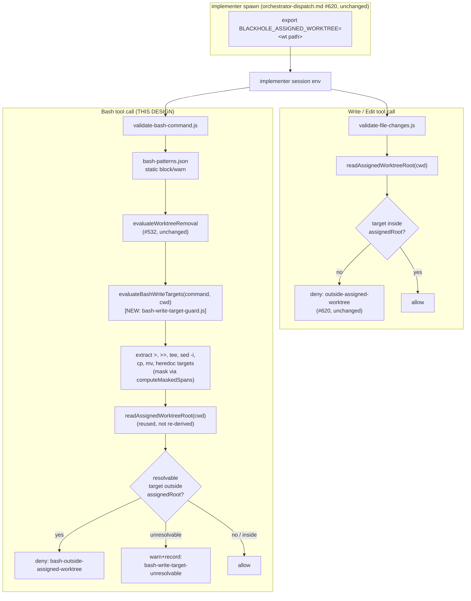

# Design Note - Issue #804

Implementation workers default to the shared checkout, not their worktree — a near-miss
data-loss path.

## Requirements Framing

Issue #804: a worker dispatched with an assigned worktree began editing files in the **shared
root checkout** instead — the human's own working directory, at the time carrying 29 dirty
files, 5 in `AD` state (staged-added content that exists only in the git index; a routine `git
checkout .` / `git reset --hard` / stash-and-drop destroys it unrecoverably with no reflog
entry). The worker caught itself before committing. Nothing structural would have.

Router-supplied classification: `task_type: feature` (this closes a genuine mechanism gap, not
a regression of previously-correct behavior), `security_review_required: false` (a
data-loss/correctness concern with its own lane in `V-BRANCH`/`V-WORKTREE`, not
attacker-adjacent — an external attacker gains nothing from this path; the harm is a worker
destroying the campaign owner's own uncommitted work).

**The premise this design starts from does not hold as stated.** The routing brief frames this
as "no location-assertion step exists anywhere in the worker spawn contract" and asks this note
to weigh three fresh remedy levels against that gap. Reading the actual hook source (below)
shows that framing is incomplete: a location-assertion mechanism **already ships and was already
live** in the campaign version where #804 was observed. The real question is not "which new
mechanism to build" — it is "why did an existing, deployed mechanism not catch this specific
write, and what closes *that* gap."

### What already exists (verified by reading source, not re-derived)

Issue #620 (`970fcf80`, merged before `v0.19.0`, an ancestor of `v0.20.0` — the exact version
#804 was observed on) shipped `BLACKHOLE_ASSIGNED_WORKTREE`:

- Set as the **first** shell command at every `implementer` spawn
  (`src/references/orchestrator-dispatch.md` § "Implementer assigned-write-root env (issue
  #620)").
- Read by `readAssignedWorktreeRoot(cwd)` in
  `templates/hooks/pretooluse/utils/hook-event-log.js:205-225`.
- Consumed by `templates/hooks/pretooluse/validate-file-changes.js:100-101` — the PreToolUse
  hook gating the **`Write`/`Edit`** tools — to narrow write containment to `[assignedRoot]`
  only. A target outside it is denied (`outside-assigned-worktree`, block tier,
  `src/references/hook-schemas.md:141`).

If the worker in #804 had used the `Write` or `Edit` tool to touch a file in the shared
checkout, this mechanism should have refused it outright. It did not fire, because the worker
did not use `Write`/`Edit` — its own report says it "began editing" via the shared checkout,
consistent with the ordinary implementer pattern of using `Bash` (`sed -i`, heredocs, `cat >`)
for file changes, a pattern this very campaign's own harness instructions elsewhere actively
recommend ("Do your work through the Bash tool wherever it can accomplish the job... make file
changes with sed, heredocs, or short scripts, rather than using the dedicated Read, Edit, or
Write tools").

`templates/hooks/pretooluse/validate-bash-command.js` — the separate PreToolUse hook gating the
**`Bash`** tool — has **no worktree-containment check of any kind**. Reading it in full: it runs
`bash-patterns.json`'s static block/warn regex list (destructive commands — `rm -rf /`, disk
device writes, `mkfs`, etc.) plus one dynamic check, `evaluateWorktreeRemoval` (whether a `git
worktree remove` target is safe to delete). Neither inspects a Bash command's **file-write
target** against `BLACKHOLE_ASSIGNED_WORKTREE` at all. A `sed -i` or `cat > file` or heredoc
redirect into the shared checkout sails through both checks unexamined.

**This is the confirmed root cause of #804**: not the absence of a location-assertion
mechanism, but a real, live, mechanical gap in an existing one — the assigned-worktree
containment #620 built covers two of the three tool surfaces a worker can write through
(`Write`, `Edit`) and misses the third (`Bash`), which is also the surface workers are steered
toward by default.

### Bearing on the three remedies the routing brief raised

1. **Spawn with the worktree as cwd** — routing already confirmed no harness parameter exists
   for this (`Agent` tool's `isolation: "worktree"` has no branch/base-ref control and no
   re-targeting across spawns; `EnterWorktree`/`ExitWorktree` are scoped to the current session
   or a launch-pinned subagent, not an arbitrary later spawn). Unchanged by this finding — still
   not implementable today, out of scope for this decision.
2. **Worker self-assertion before first write** — routing's own caution is decisive here and is
   *sharpened*, not softened, by this finding: #620 already **is** a mechanical form of exactly
   this remedy for two of three write surfaces, and it still didn't prevent #804, because the
   surface that actually failed (`Bash`) has no mechanical form at all — only ever a prose
   instruction (the Explicit Git Targeting Gate, `implementer.md`, scoped to *git* commands
   specifically, not general file writes). Extending prose coverage to "and also assert before
   any Bash write" repeats the exact shape #782 already proved insufficient. What closes the gap
   is extending the **mechanical** form #620 already established to the surface it does not yet
   cover.
3. **Refuse to dispatch when the shared checkout is dirty (Phase 0)** — remains a real,
   independently-useful idea, addressed below as a secondary, WARN-only layer. It does not
   itself close the confirmed root cause (a worker can still write into the shared checkout
   between one turn's dirty-check and the next), so it cannot be the primary remedy; both blind
   critics independently converged on the same conclusion (§ Adversarial Evaluation).

### #792 boundary (settled)

#792 ("orchestrator resolves repo facts from the working checkout") is a **read**-staleness
problem: the orchestrator's own session reads files from cwd, which can be stale relative to the
campaign base ref. #804 is a **write**-safety problem: a worker's own writes land in the wrong
checkout. They share exactly one candidate remedy — "orchestrator runs from its own base-ref
worktree" — which would fix #792 outright (nothing stale to read) and would also remove the
*orchestrator's* checkout as a fallback cwd a worker could inherit, but does **not** guarantee a
worker lands in *its own* assigned worktree (that is a property of how the worker's process is
spawned and what it writes through, unaffected by where the orchestrator itself happens to sit).
**This design does not adopt that shared remedy.** #804 is closed without it, by extending the
Bash-hook containment (below); #792 owns evaluating "orchestrator's own base-ref worktree" on
its own merits, independent of this decision.

## Codebase Conventions

| Touchpoint | Convention | Citation |
|---|---|---|
| Dynamic, non-regex PreToolUse Bash checks | A JS function exported from a sibling `utils/*.js` module, called from `validate-bash-command.js` alongside (not instead of) the static `bash-patterns.json` checks — used because the check needs runtime state (a resolved worktree path, a git-derived unpushed-commit state) a static regex cannot express | `templates/hooks/pretooluse/utils/worktree-removal-guard.js`, wired at `templates/hooks/pretooluse/validate-bash-command.js:64-72` |
| Worktree-family resolution | Never re-derive; import `readAssignedWorktreeRoot`/`allWorktreeRoots`/`isUnderRoot` from `hook-event-log.js` | `templates/hooks/pretooluse/validate-file-changes.js:18-26,100-101` (`V-INT-02`) |
| Shell-syntax-aware false-positive avoidance | Reuse `computeMaskedSpans`/`matchFirstIgnoringNonExecutingText` from `bash-context.js` to skip comments, `echo`/`printf` string literals, and heredoc bodies rather than writing a second ad hoc masking pass | `templates/hooks/pretooluse/utils/bash-context.js:445-469`, consumed today by `worktree-removal-guard.js:48` |
| Two-tier hook policy (no third tier) | `deny`+`block` for a resolvable, in-scope violation; `warn`+record for an ambiguous/unresolvable case — never a silent allow for something write-shaped but unparseable | `validate-bash-command.js` module docstring: "either a refusal... or a recorded allow" |
| `pattern_id` naming | `outside-<surface>` for a worktree-containment refusal (`outside-worktree`, `outside-assigned-worktree`, `outside-cwd-fallback`) | `hook-schemas.md:134` |
| Hook source location (build SSOT) | `templates/hooks/pretooluse/` is the source, verbatim-copied by `scripts/lib/build/trees.ts`'s `copyHooksDir` into every dist tree (`.claude/hooks/`, `.agents/build/hooks/`, `plugins/*/hooks/`); never hand-edit a copy | `scripts/lib/build/trees.ts:22-30`, `scripts/verify.claude-native-settings.test.ts:37` |
| Hook test harness | `runPreToolUseHook(script, payload, cwd, hooksDir, eventDir, assignedWorktree)` already threads `assignedWorktree` as `BLACKHOLE_ASSIGNED_WORKTREE` — no new test-fixture plumbing needed | `scripts/lib/test-fixtures.ts:96-124` |

No absent-convention gaps found at the touchpoints this design uses (`V-INT-04` — every row
above has a live citation, none is "no convention exists yet").

## Options + Trade-off Matrix

Decision type: **`architecture-choice`** (new structural check in the hook layer). Fixed columns
and weights (`design-rubric.md`, unmodified):

| Column | Weight |
|---|---|
| Risk | 30 |
| Maintainability | 25 |
| Complexity | 20 |
| Reversibility | 15 |
| Consistency-with-existing-pattern | 10 |

**Option A — Bash-hook containment extension only.** Add
`templates/hooks/pretooluse/utils/bash-write-target-guard.js`, mirroring
`worktree-removal-guard.js`'s shape exactly: a pure function
`evaluateBashWriteTargets(command, cwd)` called from `validate-bash-command.js` alongside the
existing static/dynamic checks. It extracts common file-write-target shapes from the command
string (`>`, `>>`, `&>`, `tee [-a]`, `sed -i[.suffix]`, `cp`, `mv`, and heredoc-redirect targets
— see § Component Decomposition), reusing `readAssignedWorktreeRoot`/`isUnderRoot` (never
re-deriving worktree resolution, `V-INT-02`) and `computeMaskedSpans` (skip comment/print-sink/
heredoc-body false positives). A resolvable target outside the assigned root → `block`
(`bash-outside-assigned-worktree`). A write-shaped-but-unresolvable command (variable
expansion, command substitution in the target, an unrecognized write idiom) → `warn` and record
(`bash-write-target-unresolvable`), never a silent allow. `BLACKHOLE_ASSIGNED_WORKTREE`
unset/invalid → no-op, byte-identical to today (same fail-open degradation #620 already
documents).

**Option B — Option A + Phase 0 dirty-shared-checkout surfacing.** Everything in Option A, plus:
at orchestrator turn-start (same cadence as the existing `git worktree prune`/`git fetch
--prune` step, `src/agents/orchestrator.md` § Role & Responsibilities), run `git status
--porcelain` on the main clone (`.blackhole/` already excluded by `.gitignore:1`, confirmed
during routing) and surface a WARN with the dirty-file count on the dashboard when non-empty —
visibility only, never blocks dispatch.

**Option C — Prompt-only worker self-assertion.** No hook-layer change. Mandate, in the
implementer's 5-Field Delegation Contract Tool Guidance and restated at every spawn, that the
worker run `git rev-parse --show-toplevel` and compare it against its assigned worktree before
its first write, refusing on mismatch — the same shape as the existing git-specific Explicit Git
Targeting Gate (`implementer.md`, issue #516), generalized by analogy to all file writes.

### Primary weighted matrix

| Option | Risk | Maintainability | Complexity | Reversibility | Consistency | Weighted total |
|---|---|---|---|---|---|---|
| A | 4 | 4 | 3 | 5 | 5 | **4.05** |
| B | 4 | 3 | 2 | 4 | 5 | 3.45 |
| C | 1 | 3 | 5 | 5 | 3 | 3.10 |

Provisional Chosen (pre-critique): Option A, margin over runner-up B ≈ 14.8% — a clear win, not
a dominant one.

## Adversarial Evaluation

Two blind `planner` critics (subagent_type `planner`, critique-only mode, no file writes, no
further spawns), given the Options list above with the Chosen field stripped, scoring
independently against the same fixed rubric.

**Convergence — both critics, unprompted, reached the same three conclusions:**

1. **Option C is disqualified**, both tagging it `discriminating`/`CRITICAL`: it repeats the
   exact prompt-only failure shape #782 already demonstrated does not generalize, against a root
   cause this investigation confirmed is mechanically closable. Critic A: "This isn't a generic
   'prompts are weaker than hooks' complaint; it's the same repo's own prior incident recurring
   in a new location." Critic B: "Relies on the worker itself asserting cwd before every write,
   which is exactly the prompt-only shape #782 already showed fails to generalize."
2. **Option A dominates the weighted score** (critic A: 405/365/295 on a ×100 scale for
   A/B/C; critic B computed the same ordering) and is the smallest, most targeted fix that
   closes the *specific, confirmed* mechanism gap.
3. **Option B's second half is real but should not be scored as competing with A** — both
   critics flagged it `discriminating` at NOTABLE/MINOR: it is WARN-only visibility, does not
   itself prevent #804's failure mode (a worker can still write before a human reads the
   dashboard), and overlaps #792's territory. Bundling it into the same trade-off as A/C dilutes
   the analysis rather than sharpening it.

**One domain-inherent finding shared by A and B** (both critics, NOTABLE/MINOR): command-string
parsing of Bash write targets is inherently unable to enumerate every write idiom (`python3 -c`,
`perl -i`, `awk '{print > f}'`, `dd`, `rsync`, arbitrary scripting). Both critics judged the
two-tier BLOCK/WARN-unresolvable policy the right mitigation, not a claim of completeness — see
§ Assumption Audit.

No critic returned an `adr_citations` entry (no ADR precedent was cited as decisive evidence by
any scorer, so the `V-ADR-06`/issue #775 amendment check is vacuous here).

### `scripts/design-aggregate.ts` verdict (ADR-010 D4, mandatory — not self-certified)

`.blackhole/config.json` `autonomy.design_autonomy` is **absent** from the `autonomy` block, and
`config-template.md`'s contract default for an absent-but-present-block field is `true` — so the
autonomous design tier is active for this campaign and the script MUST be invoked (skipping it
is a `V-AUTO-01` finding). Invoked with the primary matrix above, both critics' raw JSON, and the
refactoring-impact rows (§ Refactoring Impact Analysis, all `TRANSPARENT`, so `breaking-consumer`
cannot fire):

```
$ bun run scripts/design-aggregate.ts --input-file <input> --repo-root <repo>
{
  "status": "blocked",
  "winner": null,
  "reasons": ["dominance"],
  "scorer_results": [
    { "scorer": "primary",  "winner": "Option A", "margin": 14.814814814814806 },
    { "scorer": "critic_a", "winner": "Option A", "margin": 14.814814814814806 },
    { "scorer": "critic_b", "winner": "Option A", "margin": 9.87654320987654 }
  ]
}
```

All three scorers independently pick **Option A** — no `disagreement`, no `critical-finding` on
the winner, no `breaking-consumer`, no `unverified-adr-citation` — but the margin (9.9%-14.8%)
does not clear `autonomy.design_dominance_delta` (default 30). Per ADR-010 D4 this is a genuine
`blocked` verdict, not a formality: the planner does not override it. See § Gate.

## Component Decomposition

Multi-component: a new util module, one existing-file wiring edit, and doc updates spanning two
consumers.



Components:

1. **`templates/hooks/pretooluse/utils/bash-write-target-guard.js` (new)** — pure evaluator,
   isolated unit-testable like `worktree-removal-guard.js`.
2. **`templates/hooks/pretooluse/validate-bash-command.js` (edit)** — one new `require` and one
   new early-return branch, same shape as the existing `worktreeRemoval` branch.
3. **`src/references/hook-schemas.md` (doc)** — extend the `pattern_id` enum and add the
   prose paragraph for the two new values, mirroring the existing `outside-assigned-worktree`
   paragraph.
4. **`src/references/orchestrator-dispatch.md` (doc)** — one clarifying sentence in the existing
   "Implementer assigned-write-root env (issue #620)" section: the same env var now also gates
   Bash writes; no contract/scope change (still implementer-only, still first-command export).
5. **`src/agents/orchestrator.md` (doc, secondary layer only — see § Gate)** — one bullet in Role
   & Responsibilities' Git & Worktree Hygiene list for the Phase 0 dirty-checkout WARN.

## Design Principles Validation

| Axis | Score | Justification |
|---|---|---|
| SRP | ✓ | `bash-write-target-guard.js` does one thing (extract + check write targets); parsing, resolution, and policy-tier decision stay in the same narrow module, same shape as `worktree-removal-guard.js` |
| DIP (worktree resolution) | ✓ | Depends on `hook-event-log.js`'s exported resolution functions, never re-implements git-worktree-family logic |
| DRY | ✓ | Reuses `readAssignedWorktreeRoot`/`isUnderRoot`/`computeMaskedSpans`; zero re-derivation of existing logic (`V-INT-02`) |
| KISS | ✓ | Covers the ~5 command shapes that account for the overwhelming majority of file-writing Bash usage (confirmed by this campaign's own harness guidance recommending exactly `cat`/`sed`/heredocs for file writes); does not attempt a general shell-write oracle |
| YAGNI | ✓ | No attempt to parse `python3 -c`/`perl -i`/`awk` writes — explicitly out of scope, degrades to WARN rather than false completeness |
| Pattern consistency | ✓ | Matches the existing two-tier (block/warn), dynamic-check-alongside-static-patterns shape `validate-bash-command.js` already uses for `worktreeRemoval` |

## Refactoring Impact Analysis

No existing export's signature changes — this is a pure addition. Grep-confirmed consumers of
the three reused functions:

| Consumer | Classification | Note |
|---|---|---|
| `templates/hooks/pretooluse/validate-file-changes.js:18-26,100-101` (+ `.claude/hooks/` mirror) | TRANSPARENT | Imports `allWorktreeRoots`/`readAssignedWorktreeRoot`; signatures unchanged |
| `templates/hooks/pretooluse/utils/worktree-removal-guard.js:48` (+ mirror) | TRANSPARENT | Imports `computeMaskedSpans`; new second consumer added alongside, existing export untouched |
| `scripts/hooks-validate-file.test.ts` | TRANSPARENT | Exercises `allWorktreeRoots`/`readAssignedWorktreeRoot`; unaffected |
| `scripts/hooks-validate-bash.test.ts` | TRANSPARENT | Existing block/warn-pattern and `worktreeRemoval` assertions unaffected; new containment check is additive, own describe block |
| `scripts/verify.claude-native-settings.test.ts:37` | TRANSPARENT | Asserts `.claude/hooks/` mirrors every `templates/hooks/pretooluse/` file — the new module must ship through `bun run build` like every other hook file; no assertion logic changes |

Zero `BREAKING` rows — confirmed by `design-aggregate.ts`'s `breaking-consumer` reason not
firing (§ Adversarial Evaluation verdict above).

## Touch-Paths

- `templates/hooks/pretooluse/utils/bash-write-target-guard.js` (new)
- `templates/hooks/pretooluse/validate-bash-command.js`
- `src/references/hook-schemas.md`
- `src/references/orchestrator-dispatch.md`
- `src/agents/orchestrator.md` (secondary layer only, see § Gate)
- `scripts/hooks-validate-bash.test.ts`
- plus all generated dist trees per `scripts/lib/build/targets.ts`

## Assumption Audit

| Assumption | Mark | Note |
|---|---|---|
| `BLACKHOLE_ASSIGNED_WORKTREE` is reliably exported as the first shell command at every `implementer` spawn (#620's own contract) | ~ | This design *depends on* #620's existing contract being honored; it does not re-verify that compliance. If the export itself is ever skipped, both the Write/Edit and the new Bash check silently fall back to today's broader `allWorktreeRoots` containment — not a regression this design introduces, but a pre-existing dependency worth flagging |
| The ~5 covered Bash write shapes (`>`, `>>`, `tee`, `sed -i`, `cp`/`mv`, heredoc) account for the overwhelming majority of implementer file-writes | ✓ | Directly supported by this campaign's own harness guidance steering agents toward exactly these idioms (`cat`, `head`, `sed -n`/`sed -i`, heredocs) over the dedicated Write/Edit tools |
| Unresolvable write-shaped commands (`python3 -c`, `perl -i`, `awk`, `dd`, `rsync`) are rare enough in implementer usage that a WARN-and-record (not a BLOCK) is proportionate | ◐ | Blind spot — no measurement exists of how often implementers actually reach for these; if a future audit of `.blackhole/hook-events/` shows frequent `bash-write-target-unresolvable` WARNs concentrated on write-shaped commands, that is the trigger to widen coverage, not a sign the WARN tier was wrong at design time |
| A WARN-only Phase 0 dirty-checkout signal (Option B's second half) has value independent of whether Option A ships | ✓ | Confirmed by both blind critics: it covers write vectors outside Bash/Write/Edit (a future MCP tool, for instance) and gives the human visibility — but it is explicitly *not* load-bearing for closing #804's own root cause (§ Gate settles it as a separate, optional line item) |
| Consumer-repo installs (not blackhole self-hosting) receive this fix at their next `bun run build`-driven hook refresh, not automatically | ✓ | Matches existing behavior for every prior hook change (#620, #532, #497) — no new distribution mechanism assumed |

## Gate

`docs_governance.enabled` and `docs_governance.write_governance` both resolve `true`
(`.blackhole/config.json`). `autonomy.design_autonomy` resolves `true` (absent field within a
present `autonomy` block defaults `true`, `config-template.md`), so `scripts/design-aggregate.ts`
was invoked (§ Adversarial Evaluation) — never self-certified.

Verdict: **`status: "blocked"`**, reason `dominance`. All three scorers (primary + both blind
critics) independently pick **Option A** with zero disagreement, zero critical finding on the
winner, and zero breaking consumer — but the dominance margin (9.9%-14.8%) does not clear
`autonomy.design_dominance_delta` (30, unmodified default). Per ADR-010 D4 this blocks
autonomous promotion; it does not mean the direction is unclear.

**Secondary layer disposition (settled, per the routing brief's explicit ask)**: Option B's
Phase 0 dirty-checkout surfacing is **not** folded into the Option A/B/C decision above — both
blind critics independently flagged that bundling it dilutes the trade-off, since it is WARN-only
visibility that does not itself prevent #804's failure mode. It is instead recommended as a
small, separately-justified, low-effort addition (Task 5 below): **surface-with-a-count**, never
a hard refuse. A hard refuse was rejected at the routing stage on proportionality grounds (halts
the whole campaign on ordinary human WIP) and this design does not revisit that call — surfacing
a WARN with the dirty-file count is cheap, non-blocking, and gives the human the visibility #804
showed was previously absent.

### What the owner needs to decide (R-003 executive summary)

- **What**: Extend the existing #620 assigned-worktree containment (today: `Write`/`Edit` only)
  to also cover `Bash` file-write commands, closing the confirmed mechanism gap that let #804
  happen despite #620 already being deployed. Add a cheap, non-blocking Phase 0 WARN when the
  shared checkout is dirty, as an independent second layer.
- **Why**: #620 already does exactly this for two of three write surfaces; the third (`Bash`) is
  also the surface implementers are steered toward by default. This is closing a real,
  demonstrated gap in a mechanism already trusted for the other two surfaces, not adding new
  process.
- **Evidence**: `970fcf80` (issue #620) confirmed live in `v0.20.0` (the version #804 was
  observed on) via `git merge-base --is-ancestor`; `validate-bash-command.js` read in full,
  confirmed zero worktree-containment logic; both blind critics independently converged on
  Option A and independently disqualified the prompt-only alternative by citing #782.
- **Open ambiguity**: the dominance margin (9.9%-14.8%) is real but modest — not a landslide.
  The owner may reasonably ask whether to widen `bash-write-target-guard.js`'s covered command
  shapes (raising Complexity, lowering the residual-gap concern both critics raised) before
  approving, rather than shipping the minimal 5-shape version. This design recommends shipping
  the minimal version first (per the Assumption Audit's `◐` row: widen only if
  `.blackhole/hook-events/` evidence shows it's warranted) but flags the alternative explicitly
  rather than deciding it silently.

## Decision Record (Hard Choice Protocol)

- **Context**: An implementer worker wrote into the shared root checkout instead of its assigned
  worktree; the existing #620 mechanism should have prevented this but only covers `Write`/`Edit`,
  not `Bash`.
- **Alternatives**: Easy path — restate the git-targeting-gate-style prose instruction for all
  file writes (Option C). Hard path — extend the mechanical hook containment to the surface
  where it is actually missing (Option A), verified by an independent adversarial pass rather
  than self-certified.
- **Choice**: Option A (primary, mechanical) + a small, independently-justified WARN-only Phase
  0 surfacing (secondary, not bundled into the scored decision).
- **Rationale**: Short-term cost is one new ~100-150 line util module, one wiring edit, and a
  test suite addition — comparable in size to `worktree-removal-guard.js`. Long-term benefit:
  closes the actual demonstrated mechanism gap rather than adding a fourth prose instruction to a
  campaign that has already shown (twice: #516's git-specific gate, #782's manifest-write gate)
  that prose-only obligations erode under restatement discipline. Both critics independently
  reached the same conclusion without seeing each other's reasoning or the Chosen field.
- **Confidence**: High on direction (unanimous across primary + 2 blind critics + root-cause
  verification against live source); Medium on scope (the exact set of covered write shapes is a
  reasonable first cut, not a proven-sufficient one — see Assumption Audit).

## Proposed Implementation (informative — Gate is `blocked`; prepared so owner approval loses no time)

**TDD, test-first — each test states what happens if the bug (gap) is still present:**

1. `echo x > <mainClone>/foo.txt` with `assignedWorktree: <wtPath>`, cwd inside main clone →
   expect `exitCode: 2`, `pattern_id: bash-outside-assigned-worktree`. **If the gap is present**
   (today, unmodified): exits `0`, command allowed, file silently written outside the assigned
   worktree — this is the literal shape of #804.
2. `echo x > <wtPath>/foo.txt` (target inside the assigned root) → expect `exitCode: 0`, no
   deny. **If the check were mis-implemented as too broad**: would wrongly deny an in-scope
   write.
3. `sed -i 's/a/b/' <mainClone>/config.json` outside assigned root → expect deny
   (`bash-outside-assigned-worktree`).
4. `cp <wtPath>/src.txt <mainClone>/dest.txt` → expect deny (destination outside root);
   `cp <mainClone>/src.txt dest.txt` (relative dest inside `cwd`=`<wtPath>`) → expect allow — a
   read-only source outside the root must never itself trigger a deny.
5. `tee -a <mainClone>/log.txt <<< "x"` → expect deny.
6. Heredoc: `cat <<'EOF' > <mainClone>/file.txt`\n`fake target: > /somewhere/else`\n`EOF` →
   expect deny on the real `>` target; the heredoc body's literal text (a decoy `>` inside the
   quoted-delimiter body) must **not** itself be treated as a second target — proves
   `computeMaskedSpans` reuse actually suppresses heredoc-body false positives.
7. `echo "docs say: cmd > /somewhere/outside"` (print-only sink argument) → expect allow, no
   deny — proves the existing echo/printf masking convention is reused, not bypassed.
8. `python3 -c "open('/tmp/x','w').write('y')"` → expect `exitCode: 0` **and** a recorded
   `tier: warn`, `pattern_id: bash-write-target-unresolvable` event — proves the documented
   residual gap degrades to visible WARN, never a silent, unrecorded allow.
9. No `assignedWorktree` passed (env unset) → expect byte-identical behavior to the unmodified
   hook (no new deny, no new record) — proves the fail-open degradation matches #620's own
   documented contract.
10. Regression: every existing `scripts/hooks-validate-bash.test.ts` block/warn-pattern and
    `worktreeRemoval` assertion still passes unmodified.

**Task Breakdown:**

1. **RED** — add tests 1-10 above to `scripts/hooks-validate-bash.test.ts` (new describe block),
   using the existing `runPreToolUseHook(..., assignedWorktree)` helper
   (`scripts/lib/test-fixtures.ts:96-124`, no fixture-plumbing changes needed). — **AC**: all new
   tests fail against the unmodified `validate-bash-command.js` (confirms the gap is real and the
   tests would have caught #804's exact shape).
2. **GREEN** — implement `templates/hooks/pretooluse/utils/bash-write-target-guard.js`
   (`evaluateBashWriteTargets(command, cwd)`) and wire it into `validate-bash-command.js`. —
   **AC**: all 10 tests pass; every pre-existing test in the same suite still passes unmodified.
3. **Docs** — extend `src/references/hook-schemas.md`'s `pattern_id` enum (add
   `bash-outside-assigned-worktree`, `bash-write-target-unresolvable`) and prose paragraph;
   extend `src/references/orchestrator-dispatch.md`'s #620 section with one sentence noting Bash
   coverage. — **AC**: `bun run scripts/verify.ts` passes (doc-adjacent checks, if any, are
   satisfied); no scope/contract sentence in the #620 section is contradicted.
4. **Build parity** — `bun run build` then `bun test scripts/verify.claude-native-settings.test.ts`.
   — **AC**: `.claude/hooks/`, `.agents/build/hooks/`, and both `plugins/*/hooks/` trees carry the
   new file byte-identical to `templates/hooks/pretooluse/`.
5. **Secondary layer (small, separate)** — add one bullet to `src/agents/orchestrator.md`'s Git &
   Worktree Hygiene list: run `git status --porcelain` on the main clone at turn start
   (`.blackhole/` already excluded); non-empty → surface a WARN with the file count on the
   dashboard; never block dispatch. Protocol-doc only, no new script. — **AC**: bullet present,
   explicitly marked non-blocking, cites the existing prune-step cadence rather than inventing a
   new one.

**Execution Strategy & Stop Conditions**: if `computeMaskedSpans` cannot be reused as-is for
heredoc-target detection (i.e. the `>` immediately after a heredoc terminator is itself inside a
masked span), stop and re-scope test 6 before proceeding to GREEN — do not hand-roll a second
masking pass (`V-INT-02`). If `bun run build` (Task 4) shows the new file is not mirrored to all
four dist trees, stop and fix `copyHooksDir`'s glob before merging — do not hand-copy the file
into the dist trees.

**Sprint Contract**: every task above carries its own AC; "all tests and linters pass" is the
definition of done only for build-parity (Task 4), which has no narrower AC.

### Resource constraints (binding on whoever executes)

MemAvailable ≥ 3500 MB and load1÷nproc < 1.0 before any test run; every test/build/lint command
through `with-test-lock` (this repo's testlock carveout in `.blackhole/config.json` still applies
its own conditions — self-gate at MemAvailable < 2000 MB, strictly serial, no repo-wide scans);
wait before acquiring, never while holding; never background a `sleep` inside its scope.
