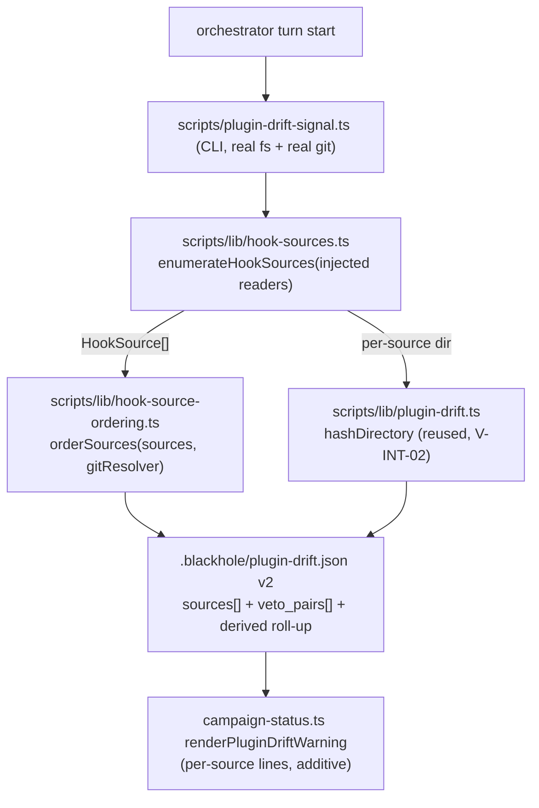

# Design — issue #912: the drift signal enumerates one guessed cache path

> **Read against `origin/main` (`3e463c82`)**, not the main clone's working tree (`c8350578`,
> 10+ commits stale). `plan_base_commit` stamps HEAD per `planner.md` Step 1; every source
> citation below resolves at `plan_read_commit`.

## Requirements Framing

Route: `needs_design: true`, `needs_analysis: true` (complete), `plan_mode: full`,
`security_review_required: true`, `docs_impact: true`. Size `size:m`. `V-PLUGIN-01` does **not**
apply — every touch-path is `scripts/`- and `src/references/`-level; `templates/hooks/**` is
deliberately excluded (see § Refactoring Impact Analysis, row 7).

`scripts/plugin-drift-signal.ts:53-62` builds exactly one installed-cache path from the *repo's
own* `package.json` version:

```
~/.claude/plugins/cache/blackhole-marketplace/blackhole/<projectIdentity.version>/hooks
```

and hands it to `computePluginDrift`, which returns `{installed_present: false,
hooks_hash_match: null}` when that directory does not exist
(`scripts/lib/plugin-drift.ts:43-51`). The signal's `installed_version` field
(`scripts/plugin-drift-signal.ts:34`) holds the **repo's** version, not the installed one — the
name asserts a fact the value does not carry.

On this workstation the wired copy is user-scope **0.19.0** while the repo is at 0.21.8, so the
signal reports "not installed" while that 0.19.0 copy actively vetoes `git worktree remove`
calls the repo's own checked-out hook code explicitly allows. Claude Code merges PreToolUse
hooks from every enabled source and composes them **deny-wins**, with no override. The correct
verdict is computed by the current code and then discarded by a stale one.

Four PreToolUse sources are registered for this repo and compose deny-wins:

| # | Source | Resolves to | Available baseline |
|---|---|---|---|
| 1 | project `.claude/settings.json` → `$CLAUDE_PROJECT_DIR/.claude/hooks/` (verified: `PreToolUse` matchers `Bash` and `Write\|Edit`) | repo build output at the checked-out commit | commit-graph ancestry vs `origin/main` |
| 2 | `enabledPlugins` user scope (`blackhole@blackhole-marketplace: true`, verified in `~/.claude/settings.json`) → `${CLAUDE_PLUGIN_ROOT}` | `installPath` pinned at install time, decoupled from any checkout | `gitCommitSha` per install row |
| 3 | user `~/.claude/settings.json` `PreToolUse` matcher `"*"` → `~/.orca/agent-hooks/claude-hook.sh` | unrelated third-party automation | **none exists** |
| 4 | `.claude/settings.local.json` | absent on this machine | — |

**The bridge that makes ordering tractable.** `~/.claude/plugins/installed_plugins.json` records
a resolvable `gitCommitSha` per install row. Verified read-only on this workstation: the
blackhole user-scope row is version `0.19.0`, sha `2ed70f4c52718d0dfeea53fe53a4ac7ef72507c2`;
`git cat-file -t` resolves it to a commit, `git merge-base --is-ancestor 2ed70f4c origin/main`
returns true, and `git log --oneline 2ed70f4c..origin/main -- .claude/hooks/ templates/hooks/`
counts **17** hook-touching commits. "Older" therefore becomes a proven ordering between a
version tag and a checkout — two things that looked incomparable — rather than a guess.

### Binding constraints (non-negotiable, carried from the issue's third correction)

1. **Assert ordering only where it is provable.** Three outcomes, all rendered distinctly, none
   collapsed into "no drift": strict ordering (both sides SHA-resolvable — `merge-base
   --is-ancestor` run in *both* directions so *diverged* is its own state);
   version-differs-ordering-unproven; no-baseline (foreign source). `hashDirectory` is the
   belt-and-braces content check, not the ordering mechanism — content hash is the wrong tool
   for source 1, since a checked-out tree trivially hashes to itself.
2. **Prefer false positives, deliberately.** The false-negative direction has an incident
   history: it is #800 (three merged hook fixes silently inert for weeks) and it is reproducing
   now. The worst case is a consumer repo with *only* the plugin-cache copy registered — the
   normal case for every consumer but blackhole itself — where a stale cache missing a new deny
   pattern lets a dangerous operation through while everyone believes the net is current.
   False-positive cost is bounded: an advisory line reading "differs, reason unclear". **The
   signal stays advisory** — ADR-030 already rejected a hard CI gate (its Option B, rejected
   unanimously by both its blind critics as permanently-red-in-CI) and this must not
   reintroduce one.
3. **The scope-resolution rule is a stated assumption, not fact.** See § Assumption Audit A-1.

### Scope boundary with #919 (`V-INT-03`)

#912 enumerates and reports sources at **config time**. #919 detects foreign denials at
**runtime** and consumes #912's enumeration. No runtime denial capture is designed here. Also
out of scope and already decided: a hook self-reporting its own path into the event record — it
touches `templates/hooks/**`, and decisively it only helps a copy that *already has* the field,
which the frozen 0.19.0 copy by definition does not. That belongs to #919.

## Options + Trade-off Matrix

Decision type: **`architecture-choice`** (`design-rubric.md`) — the decision creates a new
structural boundary (a settings-source enumeration layer) between the settings/plugin surface
and the advisory signal. Fixed columns and weights, not chosen ad hoc: Risk 30, Maintainability
25, Complexity 20, Reversibility 15, Consistency-with-existing-pattern 10.

### Option A — Source enumeration with SHA-bridged git-ancestry ordering

New pure module `scripts/lib/hook-sources.ts` (injected fs/paths/git-resolver — the same
testability idiom `computePluginDrift` already uses). Reads the four settings layers plus
`~/.claude/plugins/installed_plugins.json` and emits `HookSource[]`, each carrying `{layer,
origin_kind: 'repo-build' | 'plugin-cache' | 'foreign', resolved_path, version | null,
commit_sha | null, content_hash | null, present: boolean}`. A second pure module computes
pairwise ordering through an injected git resolver: for every pair of SHA-bearing sources, run
`merge-base --is-ancestor` in **both** directions → `older` / `newer` / `identical` /
`diverged`; hook-touching commit distance vs `origin/main` from `git log <sha>..origin/main --
.claude/hooks/ templates/hooks/`. Three rendered outcomes, none collapsed into "no drift".
`.blackhole/plugin-drift.json` becomes schema v2 carrying `sources[]` and `veto_pairs[]`, with
`installed_present`/`hooks_hash_match` retained as a derived roll-up so
`renderPluginDriftWarning` keeps working. Scope-resolution ambiguity is never adjudicated: when
more than one install row could apply, **all** candidates are reported.

### Option B — Minimal correction: resolve the installed version from `installed_plugins.json`

`plugin-drift-signal.ts` stops assuming the repo's own version names the installed directory.
It applies the scope-resolution rule to pick the applicable install row and resolves the cache
path from that row's `installPath`. Gains a `repo_version` field alongside a now-correct
`installed_version`. No enumeration, no ordering, no `sources[]`. Schema stays v1-shaped plus
one field; `renderPluginDriftWarning` unchanged.

### Option C — Enumerate sources; report presence + version + content hash only, assert no ordering

Same enumeration module and four-layer scan as A, same `sources[]` schema minus every ordering
field. Any source whose content differs is reported as `differs`; no `older`/`newer`/`diverged`
claim is ever made and `merge-base` is never invoked. The veto is reported in aggregate — "N
registered, M differ; any of them can veto" — without naming which is stale. `gitCommitSha` is
read for provenance display only. Drops the git-resolver module and its fixture-repo test
surface entirely.

### Trade-off matrix (primary scorer, 1-5 scale)

| Option | Risk (30) | Maintainability (25) | Complexity (20) | Reversibility (15) | Consistency (10) | Weighted |
|---|---|---|---|---|---|---|
| **A** — enumerate + SHA ordering | 5 | 4 | 3 | 4 | 5 | **4.20** |
| **B** — minimal version correction | 2 | 3 | 5 | 5 | 4 | **3.50** |
| **C** — enumerate, no ordering | 3 | 4 | 4 | 4 | 4 | **3.70** |

Primary rationale per column, briefly: **A** scores Risk 5 because every degradation path it
has lands in the false-positive direction and it is the only option that names the reproducing
incident rather than describing its symptom; Complexity 3 because the git-resolver and
fixture-repo surface are genuinely new work, discounted by the existing `git`-shelling precedent
in `worktree-removal-guard.js` and the real-git fixtures in `hooks-validate-bash.test.ts`.
**B** scores Risk 2 because its central new logic *adjudicates* the untested scope-resolution
rule and a wrong choice renders silent. **C** scores Risk 3 — better than B, worse than A —
because it is structurally blind on source 1 (§ Adversarial Evaluation, finding C-2).

### ADR citation check (issue #775)

`ADR-030-plugin-cache-version-bump-gate.md` read in full at `plan_read_commit`; it carries **no**
`## Post-acceptance amendments` section, so its as-accepted text stands unamended and is cited
here as decisive precedent for "the signal stays advisory". Recorded as
`{adr: "ADR-030", option: "Option A", amendment_acknowledged: true}` in the aggregate input.
Amendment ground truth was independently re-resolved from the live ADR tree by
`design-aggregate.ts`'s `resolveAdrAmendmentTruth`, discarding every self-reported value.

## Adversarial Evaluation

Two blind critique-only `planner` sub-invocations, spawned with the Chosen field stripped, each
scoring all three options against the same fixed rubric. Their raw JSON — not this prose — is
the deciding input to `design-aggregate.ts`; this section is display-only.

| Scorer | A | B | C | Winner | Margin |
|---|---|---|---|---|---|
| primary | 4.20 | 3.50 | 3.70 | Option A | 11.90% |
| critic_a | 4.20 | 3.50 | 4.00 | Option A | 4.76% |
| critic_b | 3.65 | 3.85 | 4.10 | **Option C** | 6.10% |

**Where the critics converged.** Both independently returned `discriminating`/`CRITICAL`
findings against Option B, and no CRITICAL against A or C. Both grounded the same objection:
B is the only option that *adjudicates* the scope-resolution rule instead of reporting
ambiguity, and a wrong row hashes a non-deciding copy, emits `hooks_hash_match: true`, and
renders silent — `renderPluginDriftWarning` (`scripts/campaign-status.ts:42-49`) warns only on
`hooks_hash_match === false`. That is the forbidden false-negative direction, produced by the
fix itself. Critic A supplied the fact that makes this live rather than hypothetical: verified
read-only, `installed_plugins.json` holds 38 blackhole rows, and the same plugin carries a
user-scope row at 0.19.0 alongside project-scope rows at 0.20.0 for `clauderr` and `invest` —
both scopes present for one repo at different versions, precisely the case the constraints flag
as untested. Both also independently found B non-satisfying on AC1 and AC4 rather than merely
narrower in scope.

**Finding A-1 (both critics, `discriminating`/`NOTABLE`) — A's ordering leg is inert on the
majority consumer topology.** `merge-base --is-ancestor` and `git log <sha>..origin/main`
require the cited commit in the *local* object store and require `origin/main` to *be*
blackhole's main. A consumer repo that installed blackhole from the marketplace has neither: the
cache row's `gitCommitSha` comes from blackhole's history the consumer does not have, and its
own `origin/main` is a different project, making the commit-distance query meaningless rather
than merely unavailable. A then degrades into its declared outcome (2),
version-differs-ordering-unproven — which is exactly C's behavior, at A's higher cost. **Accepted
and folded into the design, not rebutted**: the git resolver is scoped to a verified blackhole
clone and its absence is a first-class rendered state, never an error and never a silent skip.
The ordering claim is scoped honestly to self-hosting in the ADR's Consequences.

**Finding C-2 (critic_b, `discriminating`/`NOTABLE`) — C is structurally blind on source 1 and
silent about it.** Source 1 resolves to the repo's own build output at the checked-out commit,
so hashing it *against the repo's build output* trivially yields `identical` — permanently, by
construction. Since C's only per-source verdict is a content hash, source 1 can never be
reported as anything but clean, even when the checkout is behind `origin/main`. AC2 explicitly
requires commit distance from `origin/main` for a repo-build-output copy, which C drops with
the ordering fields. Worse for AC5: source 1's `identical` verdict is an assertion that cannot
fail, so red-before-green cannot be demonstrated for it — the check reports a green it did not
earn. This is the `V-UNFALSIFIABLE-01` shape, and it is the primary's decisive reason for
scoring C's Risk at 3.

**Finding C-1 (critic_a, `discriminating`/`NOTABLE`)** — C satisfies only the weaker half of
AC4: it reports the *ability* to override but never establishes "strictly older", and forbids
itself from doing so. On this machine that line fires every turn with M≥1 and no way to separate
the 0.19.0 veto source from benign divergence — the dismissal dynamic ADR-030 itself named when
rejecting its own Option B.

**Critic_b's steelman for B, recorded rather than dismissed** (`discriminating`/`MINOR`): on
the constraints' own stated worst case — a consumer repo with only the cache copy registered —
the scope rule *is* unambiguous, so B resolves the correct row and flips the current false
negative to a true positive at the lowest possible cost. B's failure is coverage, not
correctness within its scope.

**Critic_b's case for C, which is why this is a genuine 2-1 split and not a formality**: A is a
strict superset of C (same enumeration module, same scan, same `sources[]` schema plus ordering
fields), so the ordering half is purely additive later with **no schema rework**. That
sequencing availability weakens the case for buying A's largest cost centre now — injected git
resolver, bidirectional pairwise `merge-base`, commit distance, `veto_pairs[]`, three rendered
outcomes, a fixture-repo test surface — none of which the existing 40-line pure hash comparator
has any precedent for. This argument is correct on its own terms and is the reason
`design-aggregate.ts` returns `disagreement`. The primary's counter is finding C-2: shipping C
first means shipping a source-1 verdict that cannot fail, which is a worse falsifiability
posture than shipping nothing for source 1.

**Domain-inherent, shared by all three (both critics, informational — not a discriminator).**
Every option operates at config time and infers the enforcing copy from *registration*, never
from an observed decision (#919, out of scope). Any of the three can therefore render fully
clean while a source outside its four-layer scan issues the deny. Whatever ships must state that
boundary **in its own output**, or a clean render reads as "the net is current" — the same
false-confidence shape #800 produced. Second shared item: `walkFilesAbs` returns `[]` for an
absent directory (`scripts/lib/fs.ts`), so `hashDirectory` over a missing path returns a
well-formed sha256 of nothing and two absent sources read as identical; source 3 is a single
file inside a directory of 14 unrelated hook scripts. Both A and C need an explicit
absent / file-vs-directory state rather than letting `hashDirectory` paper over either — the
same first-class-absence discipline `computePluginDrift` already applies.

## Component Decomposition

Genuinely multi-component: this introduces a boundary between "what is registered" (settings/
plugin surface) and "how do the registered things compare" (git/content), where one
guessed-path expression stood before.



| Component | Responsibility | Explicitly not its job |
|---|---|---|
| `scripts/lib/hook-sources.ts` | Parse the four settings layers + `installed_plugins.json` into `HookSource[]`; classify `origin_kind`; report **all** candidate install rows when more than one could apply | Never compares, never orders, never shells to git |
| `scripts/lib/hook-source-ordering.ts` | Given `HookSource[]` and an injected git resolver, compute pairwise ordering and hook-touching commit distance; emit `veto_pairs[]` | Never reads settings; never decides which source is "the" enforcing one |
| `scripts/lib/plugin-drift.ts` | Unchanged. `hashDirectory` reused per-source; `computePluginDrift` retained | — |
| `scripts/plugin-drift-signal.ts` | CLI wiring: real fs, real git, atomic write, one console line | No detection logic of its own |
| `scripts/campaign-status.ts` | Render per-source lines | No detection logic |

## Design Principles Validation

| Axis | Score | Justification |
|---|---|---|
| SRP | `✓` | Enumeration, ordering, hashing, and rendering are four modules with disjoint inputs; the current design collapses enumeration and comparison into one path expression, which is the defect. |
| DIP | `✓` | fs, paths, and the git resolver are injected — the same contract `computePluginDrift` already honors, and what lets the red-before-green fixtures run without touching `~/.claude`. |
| DRY | `✓` | `hashDirectory`/`walkFilesAbs` reused, not reimplemented (`V-INT-02`); the atomic tmp+rename idiom and the existence-gated turn-start shape are both inherited from `doc-health-signal.ts`. |
| KISS | `~` | Two new modules plus a git resolver where one path expression stood. Contestable — this is exactly critic_b's dissent. Held because the single expression is what produced a confidently wrong answer. |
| YAGNI | `~` | `veto_pairs[]` and the `diverged` state have no *current* instance on this machine (one cache row + one repo build). Held because AC4 names the veto case and `diverged` is the "two installs off different branches" case the corrections explicitly required not be collapsed. |
| Pattern (advisory signal) | `✓` | Follows the established `<name>-signal.ts` + `.blackhole/<name>.json` + `render*Warning` triple exactly; introduces no fourth signal shape. |

## Refactoring Impact Analysis

Direct `git grep` scan at `plan_read_commit` over every consumer of the signal's type, JSON
file, and prose (build-output trees excluded — they regenerate from `src/`).

| Consumer | Classification | Note |
|---|---|---|
| `scripts/campaign-status.ts:42` `renderPluginDriftWarning` | TRANSPARENT | Reads `hooks_hash_match`, retained as a derived roll-up over `sources[]`; per-source lines are additive. |
| `scripts/campaign-status.test.ts:576-613` | **BREAKING** | Four `PluginDriftSignal` object literals must gain the new required fields or fail typecheck. |
| `scripts/plugin-drift.test.ts:86-118` | **BREAKING** | `computeSignal` expectation and the `writePluginDriftSignalAtomic` fixture are exact-shape literals. |
| `src/references/blackhole-state.md:310-320` § Plugin-Drift Signal | DEPRECATION | Prose describes the single-cache-path mechanism; cadence and existence gating stay correct. Must be rewritten. |
| `src/references/orchestrator-runtime.md:180` | TRANSPARENT | Turn-start invocation line unchanged. |
| `src/references/phase-loop.md:164` | TRANSPARENT | Cross-reference to the scan only. |
| `templates/hooks/pretooluse/README.md:50` | DEPRECATION — **deliberately not touched** | Editing anything under `templates/hooks/**` trips `V-PLUGIN-01`'s mandatory `package.json` version bump in the same diff. Accepted residual: that line's description of the signal goes one release stale. |
| `src/references/audits/29-plugin-cache-version-bump-audit.md:27` | TRANSPARENT | Names the signal as the covering mechanism; still true. |
| `scripts/lib/plugin-drift.ts:43` `computePluginDrift` / `hashDirectory` | TRANSPARENT | Retained and reused per-source. |

Two BREAKING consumers are declared. `design-aggregate.ts` treats any declared BREAKING as an
automatic block regardless of scoring margin (ADR-010 D4's no-confidence-bypass default), which
is one of the three reasons in the verdict below. Both are test files in this repo, updated in
the same diff; there is no external runtime consumer of `.blackhole/plugin-drift.json`.

## Assumption Audit

| # | Assumption | Mark | Note |
|---|---|---|---|
| A-1 | **Scope resolution: project-scope overrides user-scope for a matching `projectPath`, else user-scope applies.** | `~` | **Reconstructed from observed data, never read from a specification.** Corroborated four ways: blackhole's own `.claude/settings.json` has no `enabledPlugins` key; `clauderr` and `invest` both declare one and appear as project-scope rows; no `installed_plugins.json` row carries `projectPath` = the blackhole repo, so the user-scope 0.19.0 row is the only candidate; and a cache copy is empirically executing here with byte-identical deny text. **Untested: both scopes present for one repo, and a project explicitly disabling a plugin (`enabledPlugins: {"x@y": false}`).** The first of those two is **live data on this machine right now** — `installed_plugins.json` carries a user-scope 0.19.0 row alongside project-scope 0.20.0 rows for `clauderr` and `invest` — so the case is directly observable and testable here; that does **not** make the precedence rule verified, since it still was never read from a specification. The design's response is not to resolve the assumption but to *never rely on it*: when more than one install row could apply, all candidates are reported and none is adjudicated. A signal that encoded this guess as fact would repeat this issue's own founding error — asserting `installed_present: false` with more confidence than the evidence supported. |
| A-2 | `gitCommitSha` in `installed_plugins.json` resolves in a blackhole clone's object store | `✓` | Verified: `git cat-file -t 2ed70f4c…` → `commit`; `merge-base --is-ancestor` → true; 17 hook-touching commits behind `origin/main`. |
| A-3 | The same `gitCommitSha` resolves in a **consumer** repo's clone | `✗` | **Incorrect** — critic finding A-1. It does not, and the consumer's `origin/main` is a different project. Ordering degrades to outcome (2) there by design, not by accident. |
| A-4 | Claude Code composes PreToolUse hooks deny-wins with no override | `✓` | Byte-identical deny reproduction in the issue body, corroborated by the live denial received. |
| A-5 | Enumerating the four settings layers finds every registered PreToolUse source | `◐` | **Blind spot, shared by all three options.** An enabled plugin whose own bundled settings register a matcher the scan does not parse stays invisible. Mitigation is disclosure, not detection: the signal states its own scan boundary in its output so a clean render never reads as "the net is current". |
| A-6 | `installed_plugins.json`'s shape is stable | `~` | Platform-owned, unversioned, can change without notice. Degradation direction is what is controlled: report-all-candidates keeps a silent shape change in the false-positive direction. |
| A-7 | The signal stays advisory and blocks nothing | `✓` | ADR-030's as-accepted decision, no `## Post-acceptance amendments` section. Its Option B (a `verify` check) was rejected unanimously by both its blind critics because CI never has a populated plugin cache. |
| A-8 | `ADR-044` is the next free number | `✓` | **Resolved live at promotion** against `origin/main` (`3e463c82`): highest tracked is ADR-042, no ADR-043/044 file exists, and the only in-flight claim is issue #907's staged plan on ADR-043. ADR-044 is free. |

## Falsifiability specification (AC5, `V-UNFALSIFIABLE-01`)

The control must demonstrate it can fail. Every fixture below is path- and resolver-injected,
so none touches `~/.claude` or the main clone.

**Red state — the state captured on this workstation, as a fixture.** Sources: (1) a
repo-build-output source whose checkout is **14 commits behind `origin/main`, 4 of them
hook-touching** (measured at promotion, `git rev-list --count`); (2) a plugin-cache
source at version 0.19.0 whose `gitCommitSha` is a strict ancestor of the repo HEAD with 17
hook-touching commits between; (3) a foreign source with no version and no SHA; (4) an absent
`settings.local.json`. Expected: `sources[]` length 3 present + 1 absent; source 2 rendered
`ordering: "older"`, `hook_commits_behind: 17`; a `veto_pairs[]` entry naming source 2 as able
to override source 1; source 3 rendered `baseline: "none"` as its **own** state, never folded
into "no drift". **The test fails if any of those collapse to a clean render.**

**Green state — after refresh.** Same fixture with the cache source's SHA equal to the repo
HEAD and its content hash equal to the repo build's. Expected: no `veto_pairs[]`,
`ordering: "identical"`, and — critically — source 3 **still** rendered as `baseline: "none"`,
because a foreign source of unverifiable provenance never becomes clean.

**Four discriminating fixtures the current code passes and the new code must fail on if
mis-implemented:**

1. *Version-mismatch blindness (the exact live bug).* Repo at 0.21.8, cache present at 0.19.0.
   Current code returns `installed_present: false`. New code must return the source as present.
   A test asserting only `installed_present: true` for a *matching* version passes under the
   current broken code and is worthless — the fixture must use mismatched versions.
2. *Diverged, not older.* Two SHA-bearing sources, neither an ancestor of the other. Must render
   `diverged`. An implementation running `--is-ancestor` in one direction only reports "not
   older" and silently reads as clean; this fixture catches it.
3. *Version differs, ordering unproven.* A cache source whose `gitCommitSha` does not resolve in
   the object store. Must render outcome (2) and must **not** guess an ordering from the version
   strings.
4. *Source 1 cannot self-certify.* A repo-build source whose content hashes identical to the
   repo build (always true) but whose checkout is behind `origin/main`. Must be reported stale
   on **commit distance**, not clean on content. This is the fixture that would fail under
   Option C and is the reason C was not chosen.

**Environment naming (fail loudly, not silently).** The git resolver names its environment: when
the repo is not a blackhole clone, or a cited SHA does not resolve, the signal renders
`ordering_available: false` with the reason, never an ordering and never silence.

**Live end-to-end demonstration** (run by the implementer, recorded in the PR): invoke the
signal on this workstation before any plugin refresh and show the `veto_pairs[]` entry naming
the 0.19.0 cache copy as able to override the project-native build; refresh the plugin per
`blackhole-protocol.md` § Branch & Worktree Hygiene; re-invoke and show the entry gone while
source 3 stays `baseline: "none"`.

## Gate

`.blackhole/config.json` has `autonomy.design_autonomy: true`, so `scripts/design-aggregate.ts`
was invoked with the primary's weighted matrix, both critics' raw JSON, the Refactoring Impact
rows, and all `adr_citations[]`. **Its verdict is the sole source of this gate's outcome; the
planner does not substitute its own judgment (`V-AUTO-01`).**

```json
{
  "status": "blocked",
  "winner": null,
  "reasons": ["dominance", "disagreement", "breaking-consumer"],
  "scorer_results": [
    { "scorer": "primary",  "winner": "Option A", "margin": 11.90 },
    { "scorer": "critic_a", "winner": "Option A", "margin": 4.76 },
    { "scorer": "critic_b", "winner": "Option C", "margin": 6.10 }
  ]
}
```

`blocked` on all three counts. **Resolved by owner ruling for Option A** (issue #912), turning on
critic_b's own `V-UNFALSIFIABLE-01` finding against its own pick: the project-native source Option
C would leave permanently unchecked is 14 commits — 4 of them hook-touching — behind `origin/main`
today. This spawn resumes under `resume_context: design_approved` and promotes the drafted ADR
verbatim; the `blocked` verdict above stands unaltered as the machine's own reading and is
recorded in the ADR's own `## Gate` section.

**`V-ADR-07` staleness guard (run first, before promotion).** Every `ADR-\d+` reference in this
note was extracted and checked with `git diff --name-only <plan_base_commit>..origin/main --
documentation/decisions/ADR-{N}-*.md`. ADR-010, ADR-021, ADR-030, ADR-035 and ADR-043: no change.
**ADR-042: changed in that window** — it was *added*, not amended, and this note cites it only as
a numbering fact ("`origin/main` holds up to ADR-042"), never as decisive evidence for an option.
Emitted as an advisory `V-ADR-07` WARN; it does not block promotion and triggers no re-scoring
(§4.8: advisory only, never re-invokes `design-aggregate.ts` or a critic re-spawn). Doc-schema detection already ran and returned `schema=blackhole` at all
three artifact layers (`documentation/INDEX.md`, `documentation/decisions/INDEX.md`, and a
sibling ADR's frontmatter, all read at `plan_read_commit`) — **no `V-INT-01` WARN**.

### What the owner needs to decide (R-003 executive summary)

**The decision.** Adopt **Option A** — enumerate every registered PreToolUse source and assert
an ordering only where a resolvable commit SHA proves one — or **Option C**, the same
enumeration with every ordering claim dropped. Option B (minimal version correction) is off the
table: both blind critics independently returned CRITICAL against it.

**Why it is not automatic.** Two of three scorers pick A; critic_b picks C on a real argument —
A is a strict superset of C, so the ordering half can be added later with no schema rework,
which makes buying its git-resolver and fixture-repo cost now a genuine question rather than a
formality. No option clears the 30% dominance bar, and the design declares two BREAKING
consumers (both in-repo test files), each an independent automatic block.

**The evidence for A over C.** C is structurally blind on the project-native source: hashing the
repo's build output against the repo's build output yields `identical` permanently, by
construction, so that source can never be reported stale and its green verdict is an assertion
that cannot fail. Shipping C first means shipping an unfalsifiable control for one of the four
sources — worse than reporting nothing for it. Against A: its ordering leg is inert in a
consumer repo, where blackhole's commit history is absent; the design already scopes that claim
to self-hosting and renders the unavailability as its own state.

**What is at stake if this waits.** The 0.19.0 cache copy keeps vetoing worktree removals that
the repo's own current code allows — ~40 detached-HEAD worktrees unremovable through the
sanctioned path — and nothing reports which copy decided. In a consumer repo, where only the
cache copy is registered, the same gap runs the other way: a stale cache missing a new deny
pattern lets a dangerous operation through while everyone believes the net is current.

**What approval does not decide.** The signal stays advisory either way — no CI gate, no phase
gate (ADR-030's already-rejected Option B). `V-PLUGIN-01` and ADR-030's version-bump rule are
untouched. Runtime denial capture stays with #919.

### Amend vs supersede ADR-030 — decided: **amend**

Recorded as `amends_adr: ADR-030`, `supersedes_adr: null`.

ADR-030's decision is a composite of two mechanisms. Mechanism 1 (`V-PLUGIN-01`, the diff-content
version-bump BLOCK) is untouched and correct as written. Mechanism 2's *decision* — an advisory,
existence-gated, content-hash session signal that never blocks — is also correct and is
preserved verbatim; what is wrong is its *scope*, a single guessed cache path where four sources
compose deny-wins. Supersession would require marking ADR-030 `superseded` and retiring its rule,
which is false on both counts: the version-bump obligation stays live and the advisory-not-gate
posture is load-bearing precedent this design cites *for* itself. The correct relationship is a
new ADR that widens mechanism 2's scope, plus a `## Post-acceptance amendments` entry on ADR-030
citing #912 so a future reader of ADR-030 alone learns that its mechanism-2 scope was widened.
That entry is a task in the Task Breakdown (a direct edit to
`documentation/decisions/ADR-030-plugin-cache-version-bump-gate.md` inside the PR), not a staged
`append_row` — the carry-step's `append_row` dedup discriminators cover pipe-table INDEX rows and
`ARCHITECTURE.md` bullets only, and inventing a third discriminator for one edit would be
`V-INT-04`.

Because `supersedes_adr` is null, `V-ADR-06` leg 1 does not fire. Leg 2 is satisfied by the same
amendment entry, and no prose in this design asserts a reversal.

### Cross-Cutting Heuristic (§4.8 Trigger A) — pre-computed, to execute on promotion

Candidate constraint: *A drift or provenance signal must enumerate every registered enforcement
source and assert an ordering only where a commit-graph ancestry proves one — an unverifiable or
foreign source is rendered as its own state, never collapsed into "no drift" (ADR-{NNN}).*

1. **Breadth** — YES. Governs the whole advisory-signal family (`plugin-drift`, `doc-health`,
   `hook-event`, `plugin` provenance), not one file or one feature.
2. **Enforcement stakes** — YES. Violating it produces false confidence in the PreToolUse deny
   net; that is the #800 incident class, not a style preference.
3. **Foreclosure** — YES. Rules out the entire category of single-guessed-path + boolean signal
   designs for any enforcement surface, rather than prescribing today's implementation.

3/3 → promote. Near-duplicate check against the live `ARCHITECTURE.md` `## Active Constraints`:
the closest existing bullet is ADR-030's *"Any PR touching `templates/hooks/**` must also bump
`package.json`'s version…"*, which governs the version-bump obligation, not signal reporting
shape — under 80% overlap, no duplicate. Stage as
`.blackhole/staged/912/architecture-active-constraint.md` **on promotion only**.

### Staged artifact set to produce on `resume_context: design_approved`

| Staged path | Target | `target_kind` |
|---|---|---|
| `ADR-{NNN}-hook-source-enumeration-and-provable-ordering.md` | `documentation/decisions/ADR-{NNN}-…md` | `new_file` |
| `decisions-index-row.md` | `documentation/decisions/INDEX.md` | `append_row` |
| `architecture-active-constraint.md` | `ARCHITECTURE.md` | `append_row` |

`{NNN}` must be re-resolved at promotion (assumption A-8): `origin/main` holds up to ADR-042 and
issue #907's staged plan claims ADR-043, so ADR-044 is the current expectation.

## Task Breakdown (for the implement phase, once approved)

1. **`scripts/lib/hook-sources.ts` — enumeration.** — **AC**: `bun test` passes a new
   `scripts/hook-sources.test.ts` in which a fixture with all four layers returns 4 entries with
   correct `origin_kind` classification, and a fixture with two candidate install rows for one
   project returns **both** with no adjudication.
2. **`scripts/lib/hook-source-ordering.ts` — provable ordering.** — **AC**: fixtures 2, 3 and 4
   of § Falsifiability specification each produce their declared distinct outcome, and a
   one-direction-only `--is-ancestor` implementation fails fixture 2.
3. **`scripts/plugin-drift-signal.ts` — v2 schema + CLI wiring.** — **AC**: `.blackhole/plugin-drift.json`
   validates as `version: 2` with `sources[]` and `veto_pairs[]`, and `installed_present` /
   `hooks_hash_match` are still present as a derived roll-up.
4. **`scripts/campaign-status.ts` — per-source render.** — **AC**: a red-state fixture renders one
   line per non-clean source including the foreign source's `baseline: "none"`; a green-state
   fixture renders only the foreign-source line; `renderPluginDriftWarning(null)` still returns `''`.
5. **Update the two BREAKING test consumers.** — **AC**: `bun run verify` and `bun test` green.
6. **`src/references/blackhole-state.md` § Plugin-Drift Signal — rewrite; rebuild all dist trees.** —
   **AC**: the section describes enumeration and the three ordering outcomes; `bun run build` leaves
   no drift; `templates/hooks/**` is untouched (`git diff --name-only` shows zero paths under it).
7. **Append a `## Post-acceptance amendments` entry to ADR-030 citing #912.** — **AC**:
   `bun run scripts/checks/adr-supersession.check.ts` (or `bun run verify`) passes and the entry
   names issue #912 and the widened mechanism-2 scope.
8. **Live end-to-end demonstration recorded in the PR.** — **AC**: PR body contains the
   before-refresh output showing the `veto_pairs[]` entry and the after-refresh output showing it gone.

## Touch-Paths

- `scripts/lib/hook-sources.ts` (new), `scripts/lib/hook-source-ordering.ts` (new)
- `scripts/hook-sources.test.ts` (new)
- `scripts/plugin-drift-signal.ts`, `scripts/plugin-drift.test.ts`
- `scripts/campaign-status.ts`, `scripts/campaign-status.test.ts`
- `src/references/blackhole-state.md`, plus all generated dist trees per `scripts/lib/build/targets.ts`
- `documentation/decisions/ADR-030-plugin-cache-version-bump-gate.md` (amendments entry only)
- **Excluded by design**: `templates/hooks/**` (`V-PLUGIN-01`), `scripts/lib/plugin-drift.ts` (reused unchanged)

## Documentation Impact

`src/references/blackhole-state.md` § Plugin-Drift Signal (rewrite — existing doc, no
search-before-write needed); `documentation/decisions/ADR-030-…md` (amendment entry);
a new `documentation/decisions/ADR-{NNN}-…md` on promotion. Search-before-write for that new
ADR: `documentation/decisions/` grepped for `hook source`, `enumerat`, `provenance` — ADR-030 is
the only doc covering this concern and it is amended rather than duplicated.
`templates/hooks/pretooluse/README.md:50` is a known-stale consumer left untouched on purpose.

## References

- **ADR**: `documentation/decisions/ADR-030-plugin-cache-version-bump-gate.md` — chosen approach:
  composite BLOCK gate + advisory content-hash signal; rejected: advisory-only (its Option A),
  `verify`-check hard gate (its Option B). No `## Post-acceptance amendments` section at
  `plan_read_commit`.
- `documentation/decisions/ADR-021-durable-artifact-staging.md` (D1/D2/D3 — staging and carry)
- `documentation/reference/product-principles.md` @ `rulings_revision: 5` — R-001..R-004 all
  `active`; no conflict with this design (`ruling_conflicts: []`)
- Issue #919 — runtime denial capture, consumes this enumeration
- Issue #907 — claims ADR-043
