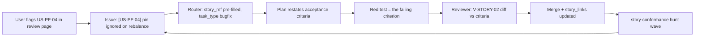

# Story-driven conformance in blackhole

Proposal for teaching blackhole about **intent** — what a project is supposed to do for its user —
so that "this feature is not what I wanted" becomes a first-class, discoverable finding class
rather than something only a human can notice.

Motivating case: `invest-portfolio`, which now carries a 132-story catalog at
`documentation/user-stories/` (one file per epic, acceptance criteria and impl/test/e2e
traceability per story, stable `US-<EPIC>-<NN>` ids).

## 1. The gap this closes

Blackhole's entire enforcement surface is **implementation-quality**: `V-SOLID`, `V-DRY`,
`V-KISS`, `V-SEC`, `V-TEST`, `V-INT`, `V-PARETO`. Every one of them answers *"is this code well
built?"* Not one answers *"is this the right behaviour?"*

The consequence is structural, not incidental:

- The `bug` hunt kind requires **read/trace-verified reproduction** — a traced path to a *wrong
  output or a crash*. A feature that works exactly as coded but does the wrong thing produces
  neither. It is invisible to every hunt kind blackhole has.
- The reviewer audits a diff against a **plan**, and the plan was derived from an **issue**. If the
  issue itself encoded the wrong intent, the whole chain validates a faithful implementation of the
  wrong thing.
- `V-FIX-01` demands the *root cause*, documented. But "root cause" for an intent defect is a
  mismatch against a specification blackhole has no representation of.

A story catalog supplies the missing referent. With one, "does the app do what the user wants?"
stops being a judgement call and becomes a **diff against a written acceptance criterion** — which
is exactly the kind of mechanical check blackhole's read-verify-file loop is already built to run.

## 2. Where it plugs in

Five integration points, ordered by value-per-unit-effort. A and E are the minimum viable slice.

### A. New hunt kind: `story-conformance` (highest value, lowest risk)

Purely additive to an extension point ADR-006 already generalised. A new
`src/references/hunt/story-conformance.md` plus one entry in `kaizen.kinds` — no agent changes, no
schema changes, no new gates. The hunter is already read-only, already verifies every finding
before returning, and already emits `gain`/`effort` for the orchestrator to Pareto-gate.

**Territory bands** are epic files (`documentation/user-stories/*.md`) — a natural, pre-existing
banding, matching the `bands_scanned`/`exhausted` mechanic every other kind uses.

**Scan heuristics.** For each story in the band, the hunter reads the cited `impl:` targets and
answers, per acceptance criterion, one of:

| Heuristic | Trigger | Gain | Effort |
|-----------|---------|------|--------|
| Unimplemented criterion | A `**Given** … **then** …` criterion has no corresponding branch or handling at any cited `impl:` target | 7–9 | 3–7 |
| Contradicted criterion | Code at a cited target does the **opposite** of the criterion (inverted condition, wrong default, wrong rounding direction) | 8–10 | 2–5 |
| Drifted criterion | Code implements the capability but with different observable behaviour than stated (different threshold, different fallback, different empty state) | 5–8 | 2–5 |
| Dangling reference | An `impl:`/`test:` path no longer exists, or a cited line anchor no longer contains the named symbol | 4–6 | 1–2 |
| Untested story | Story has `test: —`, or its cited tests assert nothing about the stated criteria | 5–7 | 3–6 |
| Uncatalogued capability | A user-facing surface (route, action, dialog) that no story in the catalog claims | 6–8 | 2–4 |

`Priority = Gain * (11 - Effort)` — the `V-PARETO-02` SSOT, unchanged. `evidence_snippet` carries
the verbatim code excerpt that proves the mismatch; `summary` names the story id and the specific
criterion. Filed issues inherit the `[US-XX-NN]` title convention.

Note what "verified" means here and why it is *stricter* than it looks: the hunter must quote both
the criterion and the contradicting code. A finding that cannot produce that pair is not
`CONFIRMED` and is dropped — which correctly suppresses the "the code looks vaguely different from
the prose" false-positive class that would otherwise flood this kind.

### B. Router: `route.story_ref` and the `needs_story` flag

Extend the single-pass `route{}` object (ADR-004) with:

```json
{
  "route": {
    "story_ref": ["US-PF-04"],
    "needs_story": false,
    "confidence": { "story": 85 }
  }
}
```

- `story_ref` — story ids this issue serves. Parsed free from a `[US-XX-NN]` title prefix; inferred
  from issue body + catalog otherwise.
- `needs_story` — true when the issue describes user-facing work that **no** story covers. Below
  `router_confidence_thresholds.story`, the cautious default is `needs_story: true`, which routes an
  extra "author the story first" step ahead of Plan.

This makes the catalog self-maintaining under campaign load: work that has no story either finds
one or creates one, which is the only way a catalog survives contact with an autonomous backlog
solver.

### C. New V-codes and a reviewer gate

| Code | Severity | Trigger |
|------|----------|---------|
| `V-STORY-01` | BLOCK | PR delivers user-facing behaviour with no `Story:` trailer and no `story_ref` on the issue's route |
| `V-STORY-02` | BLOCK | Diff contradicts an acceptance criterion of a story it claims to serve |
| `V-STORY-03` | WARN | Diff ships a new user-facing capability without adding its story to the catalog |
| `V-STORY-04` | WARN | Story's criteria changed in this diff without a corresponding test change |

`V-STORY-02` is the load-bearing one: it is the first blackhole gate that can block a merge for
being *wrong* rather than for being *badly built*. It reuses the reviewer's existing
plan-conformance machinery, pointed at the story's criteria instead of the plan's Touch-Paths.

### D. Planner: a `## Story` section

The plan template gains a `## Story` section restating each served story and its acceptance
criteria verbatim (same shape as the existing `## Codebase Conventions` section, and carried into
fan-out subagent prompts the same way). The implementer's TDD red phase then has a written target:
**the failing test encodes the acceptance criterion**. This is the cheapest of the five changes and
the one that most improves implement-phase quality, because it removes the "infer intent from
surrounding code" step entirely.

### E. `story_driven` config block

```json
"story_driven": {
  "enabled": false,
  "catalog_dir": "documentation/user-stories",
  "id_pattern": "US-[A-Z]+-\\d+",
  "require_trailer": true,
  "severity_overrides": {}
}
```

Same contract discipline as `kaizen`, `docs_governance` and `incident_mode`: **absent block or
`enabled: false` ⇒ every dependent feature is a no-op and current behaviour is preserved exactly.**
Default `false` — most repos have no catalog, and a story gate on a repo without stories would
block every PR. `severity_overrides` may only escalate WARN→BLOCK, never de-escalate.

## 3. Where the catalog lives — and where it must not

**The catalog belongs in the project's git tree, never in `.blackhole/`.**

`.blackhole/` is gitignored campaign runtime state (`queue.json`, `findings-ledger.json`,
`hunt_state`, `plans/`). It is machine-owned, disposable, and invisible to code review. A story
catalog is the opposite of all three: human-authored, durable, and the thing PRs are reviewed
*against*. Putting it there would make the specification disposable — the exact inversion this
proposal exists to prevent.

The ledger holds **linkage only**:

```json
"story_links": { "US-PF-04": { "issues": [1841], "prs": [1856], "last_verified_wave": 3 } }
```

This split also preserves the agent-agnostic property: the catalog is plain markdown any agent (or
human) can read without blackhole installed; only the linkage is blackhole-specific state.

## 4. The feedback loop this creates

The user's own framing — *"a feedback is a flag of a user story not properly implemented"* — maps
onto the existing lifecycle with no new phases:



Two intake paths, one pipeline: the human notices what the machine cannot, the hunt finds what the
human has not looked at yet, and both converge on the same story id.

## 5. Risks and what was rejected

| Risk | Mitigation |
|------|-----------|
| **False-positive flood** — prose-vs-code comparison is fuzzy and could file dozens of low-value issues | Evidence pair mandatory (criterion + contradicting code) for `CONFIRMED`; `min_priority` and `max_issues_per_wave` already cap filing; start the kind at a raised `min_priority` |
| **Catalog rot** — stories drift from code and the gate starts enforcing a stale spec | `V-STORY-04` + the `Dangling reference` heuristic make rot itself a finding; the catalog is the *first* thing the hunt audits |
| **Gate blocks routine work** — a BLOCK on every PR would stall a campaign | `enabled: false` default; `V-STORY-01` scoped to user-facing diffs only; infra PRs declare `Story: none` |
| **Model over-confidence** — an LLM asserting "this contradicts the criterion" from a shallow read | Same adversarial posture as `V-SEC-07`: a `V-STORY-02` BLOCK requires independent re-verification before it can stop a merge |

**Rejected — story catalog as ledger state.** Would make the spec disposable and invisible to
review (§3).

**Rejected — deriving stories automatically from code.** A catalog generated from the
implementation can only ever say what the code already does, so it can never disagree with it. The
entire value is that a human wrote down the intent *independently*. Generation is appropriate for
the initial bootstrap draft (as was done for `invest-portfolio`) but the artifact must then be
human-reviewed and human-owned.

**Rejected — a sixth phase.** Story conformance is a property checked at existing phases, not a
stage of its own. Adding a phase would violate the ADR-004 "derive the chain from classification"
principle and cost every issue a step most issues do not need.

## 6. Phasing

| Phase | Deliverable | Depends on |
|-------|-------------|-----------|
| P1 | `story_driven` config block + contract note (no-op when disabled) | — |
| P2 | `src/references/hunt/story-conformance.md` + `kaizen.kinds` entry | P1 |
| P3 | `route.story_ref` / `needs_story` + `confidence.story` | P1 |
| P4 | `V-STORY-01..04` + reviewer gate + `story_links` ledger field | P2, P3 |
| P5 | Planner `## Story` section + fan-out preamble | P3 |

P1+P2 alone deliver most of the value: proactive discovery of intent defects, with zero risk to
existing campaigns because nothing blocks yet. P4 is the point at which blackhole can refuse to
merge something that is *wrong*, and should not land before the false-positive rate from P2 is
known.

## 7. Prerequisite for the host project

A project opting in must carry:

- a catalog directory of epic markdown files in the documented story format;
- stable, never-reused story ids;
- a working rule that PRs name their story and that new capabilities add theirs.

`invest-portfolio` now satisfies all three (`documentation/user-stories/`, `AGENTS.md` §
Story-driven development, `.github/pull_request_template.md`), and is the natural pilot.
